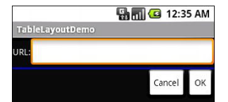
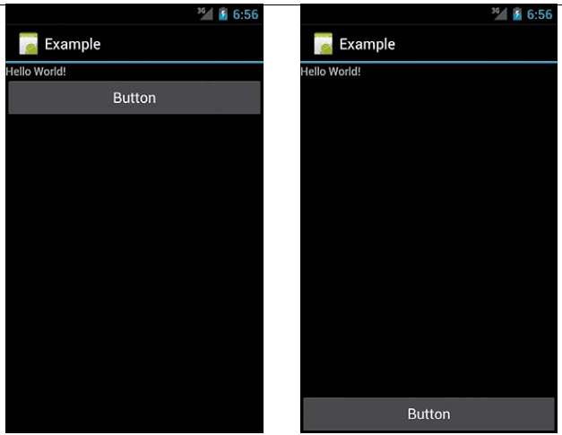

## 布局、容器

[toc]

### 通过代码定义布局

```java
LinearLayout ll = new LinearLayout(this);
ll.setOrientation(LinearLayout.VERTICAL);
TextView myTextView = new TextView(this);
EditText myEditText = new EditText(this);
myTextView.setText(“Enter Text Below");
myEditText.setText(“Text Goes Here!");
int lHeight = LinearLayout.LayoutParams.MATCH_PARENT;
int lWidth = LinearLayout.LayoutParams.WRAP_CONTENT;
ll.addView(myTextView, new LinearLayout.LayoutParams(lHeight, lWidth));
ll.addView(myEditText, new LinearLayout.LayoutParams(lHeight, lWidth));
setContentView(ll);
```

### FrameLayout

最简单的比较容器是FrameLayout。该容器根本不会排列孩子。他只是将一个孩子堆在另一个上面。定义在后面的在视图上面。FrameLayout常用于创建自定义的可触摸元素。

默认位置在左上角。可以通过`gravity`特性改变位置。

可以使用FrameLayout组合一个按钮和一个ImageView。将按钮背景设为透明。这种方式与设置背景相比，**能对按钮图像的padding和缩放做更好的控制**。

### LinearLayout

5个方面的控制：朝向（Orientation）、大小、weight、gravity和padding。

- 朝向：`android:orientation`决定LinearLayout是行还是列。可以在运行时通过setOrientation()改变朝向。
- 大小：LinearLayout中的所有小部件都要提供`android:layout_width`和`android:layout_height`属性。取值有三种类型：
	- 特定的尺寸，如125dip。
	- `wrap_content`，让控件填满自然的空间。当控件太大时，Android会使用`word-wrap`。
	- `fill_parent`，在考虑完其他控件后，充满容器所有可用空间。注意：API level 8 (Android 2.2)，将`fill_parent`重命名为`match_parent`。
- Weight：例如，我们在一列中有两个多行控件，我们想，在列中其他控件被分配空间后，将剩余空间分配给这两个控件。  
为了达到上述目的，需要`android:layout_weight`。如果为一对小控件设置相同的非零的权重，多出的空间将在它们之间平分。如果一个控件设置1另一个设置2，则第二个占据2/3空间，第一个占据1/3。weight的默认值是0。  
如果让一个容器内的所有控件按百分比分配空间，则：
	- 设置所有小部件的`android:layout_width`为0。
	- 按比例设置`android:layout_weight`，且让所有的weight加起来为100。
- Gravity：默认LinearLayout中元素是左对齐、上对齐的。若想改变对齐方式，设置`android:layout_gravity`（或调用`setGravity()`）。  
对于一列控件，gravity值可以是`left`, `center_horizontal`, `right`。对于一行控件，默认按文本基线对象（baseline）。也可以设为`center_vertical`。
- Margins：只有非透明背景的小部件，padding和margins才有区别。可以设置对立边`android:layout_marginTop`或所有边`android:layout_margin`。

例子

	<?xml version="1.0" encoding="utf-8"?> 
	<LinearLayout 
		xmlns:android="http://schemas.android.com/apk/res/android" 
		android:orientation="vertical" 
		android:layout_width="fill_parent" 
		android:layout_height="fill_parent" > 
		<RadioGroup android:id="@+id/orientation" 
			android:orientation="horizontal" 
			android:layout_width="wrap_content" 
			android:layout_height="wrap_content" 
			android:padding="5dip"> 
			<RadioButton android:id="@+id/horizontal" android:text="horizontal" /> 
			<RadioButton android:id="@+id/vertical" android:text="vertical" /> 
		</RadioGroup> 
			<RadioGroup android:id="@+id/gravity" 
				android:orientation="vertical" 
				android:layout_width="fill_parent" 
				android:layout_height="wrap_content" 
				android:padding="5dip"> 
			<RadioButton 
				android:id="@+id/left" 
				android:text="left" /> 
			<RadioButton 
				android:id="@+id/center" 
				android:text="center" /> 
			<RadioButton 
				android:id="@+id/right" 
				android:text="right" /> 
		</RadioGroup> 
	</LinearLayout>

例子2

	public class LinearLayoutDemo extends Activity 
		implements RadioGroup.OnCheckedChangeListener { 
		RadioGroup orientation; 
		RadioGroup gravity; 
		@Override 
		public void onCreate(Bundle icicle) { 
			super.onCreate(icicle); 
			setContentView(R.layout.main); 
			orientation=(RadioGroup) findViewById(R.id.orientation); 
			orientation.setOnCheckedChangeListener(this); 
			gravity=(RadioGroup) findViewById(R.id.gravity); 
			gravity.setOnCheckedChangeListener(this); 
		} 
		public void onCheckedChanged(RadioGroup group, int checkedId) { 
			switch (checkedId) { 
			case R.id.horizontal: 
				orientation.setOrientation(LinearLayout.HORIZONTAL); 
				break; 
			case R.id.vertical: 
				orientation.setOrientation(LinearLayout.VERTICAL); 
				break;
			case R.id.left: 
				gravity.setGravity(Gravity.LEFT); 
				break; 
			case R.id.center: 
				gravity.setGravity(Gravity.CENTER_HORIZONTAL); 
				break; 
			case R.id.right: 
				gravity.setGravity(Gravity.RIGHT); 
				break; 
			} 
		} 
	}

### RelativeLayout

相对于容器或兄弟组件定位。

相对父容器定位：

- android:layout_alignParentTop：让组件的上边对齐容器的上边
- android:layout_alignParentBottom：
- android:layout_alignParentLeft：
- android:layout_alignParentRight：
- android:layout_centerHorizontal：让组件位于容器水平中心
- android:layout_centerVertical：
- android:layout_centerInParent：垂直和水平居中

这些属性的取值是true或false。

对齐时考虑padding，是小部件的padding外对齐容器。

相对其他小部件定位和对齐：

下面这些属性的值为某个小部件的id，如`@id/widget_a`。

下面四个属性控制小部件相对于其他小部件的位置：

- android:layout_above: 指定上面的控件
- android:layout_below: 指定下面的控件
- android:layout_toLeftOf: 指定右边的控件
- android:layout_toRightOf: 指定左边的控件

下面五个属性控制小部件相对于其他的对齐：

- android:layout_alignTop：小部件的顶部对齐参考控件的顶部
- android:layout_alignBottom：
- android:layout_alignLeft：
- android:layout_alignRight：
- android:layout_alignBaseline：两个控件的基线对齐

例子：`android:layout_toRightOf = "@id/widget_a"`

> **Order of Evaluation**  早期不能引用尚未定义的小部件。从Android 1.6开始，可以向后引用尚未定义的。

例子

	<?xml version="1.0" encoding="utf-8"?> 
	<RelativeLayout 
		xmlns:android="http://schemas.android.com/apk/res/android" 
		android:layout_width="fill_parent" 
		android:layout_height="wrap_content"> 
		<TextView android:id="@+id/label" 
			android:layout_width="wrap_content" 
			android:layout_height="wrap_content" 
			android:text="URL:" 
			android:layout_alignBaseline="@+id/entry" 
			android:layout_alignParentLeft="true"/> 
		<EditText 
			android:id="@id/entry" 
			android:layout_width="fill_parent" 
			android:layout_height="wrap_content" 
			android:layout_toRightOf="@id/label" 
			android:layout_alignParentTop="true"/> 
		<Button 
			android:id="@+id/ok"
			android:layout_width="wrap_content" 
			android:layout_height="wrap_content" 
			android:layout_below="@id/entry" 
			android:layout_alignRight="@id/entry" 
			android:text="OK" /> 
		<Button 
			android:id="@+id/cancel" 
			android:layout_width="wrap_content" 
			android:layout_height="wrap_content" 
			android:layout_toLeftOf="@id/ok" 
			android:layout_alignTop="@id/ok" 
			android:text="Cancel" /> 
	</RelativeLayout>

#### 重叠

相对布局中如果两个小部件占据相同位置，后定义的覆盖在先定义的之上。

	<?xml version="1.0" encoding="utf-8"?> 
	<RelativeLayout 
		xmlns:android="http://schemas.android.com/apk/res/android" 
		android:layout_width="fill_parent" 
		android:layout_height="fill_parent" > 
		<Button 
			android:text="I AM BIG" 
			android:textSize="120dip" 
			android:textStyle="bold" 
			android:layout_width="fill_parent" 
			android:layout_height="fill_parent" /> 
		<Button 
			android:text="I am small" 
			android:layout_width="wrap_content" 
			android:layout_height="wrap_content" 
			android:layout_centerInParent="true" /> 
	</RelativeLayout>
 
点击下面的按钮仍然有效。点击小按钮不会引发大按钮也被点击。

### TableLayout

TableLayout搭配TableRow使用。组件放入TableRow中。TableRow决定行数。
列数由最长的行的列数决定。小部件可以占据多列，由`android:layout_span`控制。例如：
	
	<TableRow> 
		<TextView android:text="URL:" /> 
		<EditText android:id="@+id/entry" android:layout_span="3"/> 
	</TableRow>

TableLayout的孩子不能指定`layout_width`｛｛不能指定列宽｝｝。TableLayout会帮你设置。

小部件一般放入第一个可放的列。通过`android:layout_column`可以显式指定小部件放入哪一列。值从0开始：

	<TableRow> 
		<Button android:id="@+id/cancel" android:layout_column="2" android:text="Cancel" /> 
		<Button android:id="@+id/ok" android:text="OK" /> 
	</TableRow>

TableLayout内除了可以直接放TableRow，还可以放其他小部件。此时TableLayout就像一个垂直的LinearLayout。小部件自动的宽度自动填满容器。利用此方式可以实现分割线。例如：

	<View android:layout_height="2dip" android:background="#0000FF" />

#### 拉伸、收缩、收起（Stretch, Shrink, and Collapse）

默认，列的宽度为此列最宽的小部件的自然大小（会考虑跨多列）。

可以设置TableLayout的`android:stretchColumns`属性。属性值是某个列的编号（0开始）或逗号分隔的列编号。Those columns will be stretched to take up any available space on the row.

还可以设置TableLayout的`android:shrinkColumns`属性。属性值是某个列的编号（0开始）或逗号分隔的列编号。The columns listed in this property will try to word-wrap their contents to reduce the effective width of the column—by default, widgets are not word-wrapped. This helps if you have columns with potentially wordy content that might cause some columns to be pushed off the right side of the screen. 

还可以设置TableLayout的`android:collapseColumns`属性。属性值是某个列的编号（0开始）或逗号分隔的列编号。这些列开始处于收起状态，不可见。可以通过`TableLayout.setColumnCollapsed()`控制列的开合。

在运行时可以通过`setColumnStretchable()`和`setColumnShrinkable()`控制拉伸和收缩。

例子

	<?xml version="1.0" encoding="utf-8"?> 
	<TableLayout 
		xmlns:android="http://schemas.android.com/apk/res/android" 
		android:layout_width="fill_parent" 
		android:layout_height="fill_parent" 
		android:stretchColumns="1"> 
		<TableRow> 
			<TextView android:text="URL:" /> 
			<EditText android:id="@+id/entry" android:layout_span="3"/> 
		</TableRow> 
		<View android:layout_height="2dip" android:background="#0000FF" /> 
		<TableRow> 
			<Button android:id="@+id/cancel" android:layout_column="2" android:text="Cancel" /> 
			<Button android:id="@+id/ok" android:text="OK" /> 
		</TableRow> 
	</TableLayout>



### GridLayout
GridLayout是Android 4新引入的。GridLayout is a layout that places its children onto a grid of infinitely detailed lines that separate the area into cells. The key to GridLayout’s fine control is that the number of cells or, more accurately, grid lines used to describe the cells has no limit or threshold— you specify how many or how few grid lines your GridLayout should have, using `rowSpec` and `columnSpec` properties. This means you could create a layout that mimics a simple table with a few cells (that is, rows and columns) or, for those demanding situations where you need fantastically fine precision, 可以指定成千上万的网格。｛｛这些网格是用于布局的！｝｝

> 一般使用Layout Editor构建你的Grid Layout，而不是手工写XML。

NOTE: To complement GridLayout’s different view of the UI world, it uses `android:layout_gravity` in place of `android:layout_weight`.

As an example, here is a GridLayout used in an XML layout file (from the Containers/Griddemo): 

	<?xml version="1.0" encoding="utf-8"?> 
	<GridLayout 
		xmlns:android="http://schemas.android.com/apk/res/android" 
		android:orientation="vertical" 
		android:layout_width="fill_parent" 
		android:layout_height="fill_parent"> 
		<Button android:text="Defying gravity!" android:layout_gravity="top" /> 
		<Button android:text="Falling like an apple" android:layout_gravity="bottom" /> 
	</GridLayout>

Our buttons have followed their various gravity directions to place themselves on the GridLayout, using the defaults for rowSpec and columnSpec counts. We can observe the utility of the GridLayout not needing the somewhat tedious static layout directives of the TableLayout by adding another button to our declarations in main.xml

	... 
	<Button android:text="Defying gravity!" android:layout_gravity="top" /> 
	<Button android:text="Floating middle right" android:layout_gravity="right|center_vertical" /> 
	<Button android:text="Falling like an apple" android:layout_gravity="bottom" /> 
	...

### ScrollView

ScrollView为内容提供滚动功能。**仅支持上下滚动**。

ScrollView实际是FrameLayout的一个子类**。一般要在ScrollView内放置另一个布局容器**。

例子：
```xml
<ScrollView
	xmlns:android="http://schemas.android.com/apk/res/android"
	android:layout_width="fill_parent"
	android:layout_height="wrap_content">
	<TableLayout
		android:layout_width="fill_parent"
		android:layout_height="fill_parent"
		android:stretchColumns="0">
		...
	</TableLayout>
</ScrollView>
```

注意在右边留点padding，因为滚动条会遮住部分内容。

Android 1.5引入了`HorizontalScrollView`，水平滚动。注意Android不支持左右和上下同时滚动，ScrollView和HorizontalScrollView都是单向的。

注意不要把**可滚动内容**放入ScrollView。例如ListView自身已能滚动，把ListView放入ScrollView，反而会不能正常工作。如果你发现你想要用二者，重新设计你的App。

#### `android:fillViewport`

将`LinearLayout`包裹进`ScrollView`：
```xml
<ScrollView xmlns:android="http://schemas.android.com/apk/res/android"
	 android:layout_width="match_parent"
	 android:layout_height="match_parent"
	 android:fillViewport="true">
	<LinearLayout>
	<!-- Rest of code here -->
	</LinearLayout>
</ScrollView>
```

如果内容比`ScrollView`大没有问题，会滚动。但如果内容比显示区小，`ScrollView`默认会将自己收缩为内容的大小。如果想要`ScrollView`展开到显示区的大小，设置`fillViewPort`为true。

```xml
<ScrollView xmlns:android="http://schemas.android.com/apk/res/android"
	android:layout_width="fill_parent"
	android:layout_height="fill_parent"
	android:fillViewport="true">

```

文字过小时默认的效果和设置`fillViewport`后的效果：



