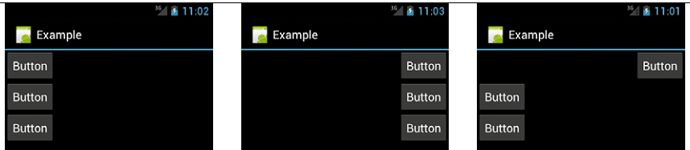

[toc]

## View

### View通用Attribute

#### 高度和宽度

每个View都需要有高度和宽度。使用`layout_height`和`layout_width`特性指定。有两个特殊取值`wrap_content`和`match_parent`。Android API 8将`fill_parent`重命名为`match_parent`。

#### Margin和Padding

两个特性：`layout_margin`和`padding`。可以对四个边设置，也可以对单边设置。

#### Gravity

Android默认将View放在屏幕的左边。`gravity`特性控制View中的孩子的默认位置。例如，如果设置线性布局的gravity特性，让所有的孩子位于屏幕右边。布局容器的gravity默认是left。其他View默认一般是center。

`layout_gravity`设置View相对于父母的位置。例如，`LinearLayout`的`gravity`默认将所有View放在屏幕左边。如果你把**一个孩子的** `layout_gravity` 特性设为`right`，这个孩子将位于屏幕右边。

｛｛`gravity`对容器设置，`layout_gravity`对孩子设置｝｝

