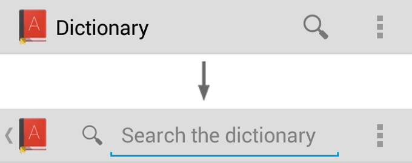

Action bar有三大功能：提示用户当前在哪，提供用户功能入口，提供导航、视图切换功能（Tab或下拉列表）。

Figure 1. An action bar that includes the [1] app icon, [2] two action items, and [3] action overflow.

Action Bar提供以下功能：

参见[Action Bar设计指导](http://developer.android.com/design/patterns/actionbar.html)。

ActionBar APIs是Android 3.0 (API level 11)添加的，可以通过支持库可以兼容到Android 2.1 (API level 7)。本文档使用支持库做介绍。

## 添加Action Bar

创建活动，继承 [ActionBarActivity](http://developer.android.com/reference/android/support/v7/app/ActionBarActivity.html)。

使用（或扩展）某个 [Theme.AppCompat](http://developer.android.com/reference/android/support/v7/appcompat/R.style.html#Theme_AppCompat) 主题。例如：

	<activity android:theme="@style/Theme.AppCompat.Light" ... >

> **On API level 11 or higher**  任何使用 [Theme.Holo](http://developer.android.com/reference/android/R.style.html#Theme_Holo) 主题的Activity都带Action Bar。如果`targetSdkVersion`或`minSdkVersion`大于11，Theme.Holo是默认主题。如果不想要Action Bar，设置主题为 [Theme.Holo.NoActionBar](http://developer.android.com/reference/android/R.style.html#Theme_Holo_NoActionBar)。

### 移除Action Bar

在运行时可以调用`hide()`隐藏Action Bar。

	ActionBar actionBar = getSupportActionBar();
	actionBar.hide();

> **On API level 11 or higher** Get the ActionBar with the [getActionBar()](http://developer.android.com/reference/android/app/Activity.html#getActionBar()) method.

When the action bar hides, the system adjusts your layout to fill the screen space now available. 调用`show()`可以再让Action Bar回来。

隐藏或移除Action Bar将导致活动重新布局。如果活动能够需要经常显示、隐藏Action Bar，考虑使用遮盖（overlay）模式。遮盖模式下，Action Bar在Activity布局之上，占据顶部空。于是隐藏显示Action Bar不影响活动布局。要启用遮盖模式，为活动自定义一个主题，设置` windowActionBarOverlay`为true。

### 不使用icon，使用logo

模式在Action Bar上使用应用图标（`<application>`或`<activity>`元素的`icon`特性）。但如果指定了`logo`格形，Action Bar将使用logo。

## 添加Action项

The action bar provides users access to the most important action items **relating to the app's current context**. 直接显示在action bar上的图标或位子称为action按钮。不重要的或放不下的隐藏在action overflow。按下overflow按钮可以显示overflow。

Figure 2. Action bar with three action buttons and the overflow button.

启动活动时，系统调用活动的`onCreateOptionsMenu()`，重启Menu，定义action items。

res/menu/main_activity_actions.xml

	<menu xmlns:android="http://schemas.android.com/apk/res/android" >
	    <item android:id="@+id/action_search"
	          android:icon="@drawable/ic_action_search"
	          android:title="@string/action_search"/>
	    <item android:id="@+id/action_compose"
	          android:icon="@drawable/ic_action_compose"
	          android:title="@string/action_compose" />
	</menu>

	@Override
	public boolean onCreateOptionsMenu(Menu menu) {
	    // Inflate the menu items for use in the action bar
	    MenuInflater inflater = getMenuInflater();
	    inflater.inflate(R.menu.main_activity_actions, menu);
	    return super.onCreateOptionsMenu(menu);
	}

要菜单项直接显示在Action Bar上，设置特性`showAsAction="ifRoom"`：

	<menu xmlns:android="http://schemas.android.com/apk/res/android"
	      xmlns:yourapp="http://schemas.android.com/apk/res-auto" >
	    <item android:id="@+id/action_search"
	          android:icon="@drawable/ic_action_search"
	          android:title="@string/action_search"
	          yourapp:showAsAction="ifRoom"  />
	    ...
	</menu>

If there's not enough room for the item in the action bar, it will appear in the action overflow.

> **使用支持库中的XML特性** 注意到`showAsAction`特性使用的命名空间。当XML特性来自支持库时，需要使用自定义命名空间。因为老设备的Android框架没有该特性。

若同时定义了`title`和`icon`特性，默认，Action项只会显示图标。如果要显示标题文本：

	<item yourapp:showAsAction="ifRoom|withText" ... />

> Note: The "withText" value is a hint to the action bar that the text title should appear. The action bar will show the title when possible, but might not if an icon is available and the action bar is constrained for space.

即使多数时候不显示，还是要定义title。如果Action Item隐藏到了Overflow中，则只会显示文本。If the action item appears with only the icon, a user can long-press the item to reveal a tool-tip that displays the action title.

The icon is optional, but recommended. For icon design recommendations, see the [Iconography](http://developer.android.com/design/style/iconography.html#action-bar) design guide. You can also download a set of standard action bar icons (such as for Search or Discard) from the [Downloads](http://developer.android.com/design/downloads/index.html) page.

You can also use "always" to declare that an item always appear as an action button. However, you should not force an item to appear in the action bar this way. Doing so can create layout problems on devices with a narrow screen. It's best to instead use "ifRoom" to request that an item appear in the action bar, but allow the system to move it into the overflow when there's not enough room. However, it might be necessary to use this value if the item includes an action view that cannot be collapsed and must always be visible to provide access to a critical feature.

### 处理点击

按下一个Action，系统调用活动的`onOptionsItemSelected()`方法。传入选中的`MenuItem`。识别此项可以调用`getItemId()`，返回菜单项的`android:id`。

	@Override
	public boolean onOptionsItemSelected(MenuItem item) {
	    // Handle presses on the action bar items
	    switch (item.getItemId()) {
	        case R.id.action_search:
	            openSearch();
	            return true;
	        case R.id.action_compose:
	            composeMessage();
	            return true;
	        default:
	            return super.onOptionsItemSelected(item);
	    }
	}

> Note: 如果从Fragment充气菜单项（通过Fragment的`onCreateOptionsMenu()`，系统调用Fragment的`onOptionsItemSelected()`。However, the activity gets a chance to handle the event first, so the system first calls onOptionsItemSelected() on the activity, before calling the same callback for the fragment. To ensure that any fragments in the activity also have a chance to handle the callback, always pass the call to the superclass as the default behavior instead of returning false when you do not handle the item.

### Using split action bar

当活动运行在窄屏上时，Split action bar在屏幕底部显示一个独立的Bar，显示所有的Action Item。

To enable split action bar when using the support library, you must do two things:

1. 在每个`<activity>`或`<application>`上添加`uiOptions="splitActionBarWhenNarrow"`。This attribute is understood only by API level 14 and higher (it is ignored by older versions).
1. To support older versions, add a <meta-data> element as a child of each <activity> element that declares the same value for `android.support.UI_OPTIONS`.

例子：

	<manifest ...>
	    <activity uiOptions="splitActionBarWhenNarrow" ... >
	        <meta-data android:name="android.support.UI_OPTIONS"
	                   android:value="splitActionBarWhenNarrow" />
	    </activity>
	</manifest>

Using split action bar also allows [navigation tabs](http://developer.android.com/guide/topics/ui/actionbar.html#Tabs) to collapse into the main action bar if you remove the icon and title (as shown on the right in figure 3). To create this effect, disable the action bar icon and title with setDisplayShowHomeEnabled(false) and setDisplayShowTitleEnabled(false).

Figure 3. Mock-ups showing an action bar with tabs (left), then with split action bar (middle); and with the app icon and title disabled (right).

## Navigating Up with the App Icon

让App图标作为向上按钮，允许用户在屏幕层级关系之间导航。例如，屏A显示列表，屏B显示列表项。则屏B的向上按钮应返回屏A。

> Note: 向上导航与向后不同。向后是按屏幕历史，屏幕之间的关系是临时建立的。

要启动App图标做向上按钮，使用`setDisplayHomeAsUpEnabled()`。例如：

	@Override
	protected void onCreate(Bundle savedInstanceState) {
	    super.onCreate(savedInstanceState);
	    setContentView(R.layout.activity_details);
	
	    ActionBar actionBar = getSupportActionBar();
	    actionBar.setDisplayHomeAsUpEnabled(true);
	    ...
	}

还需要指定上级Activity是哪个。可以有两种方式：

1、在manifest中指定父Activity。如果父Activity是固定的，这是最好的方式。从Android 4.1 (API level 16)，利用`<activity>`的`parentActivityName`特性声明父Activity。要使用支持库，利用`<meta-data>`：

	<application ... >
	    ...
	    <!-- The main/home activity (has no parent activity) -->
	    <activity
	        android:name="com.example.myfirstapp.MainActivity" ...>
	        ...
	    </activity>
	    <!-- A child of the main activity -->
	    <activity
	        android:name="com.example.myfirstapp.DisplayMessageActivity"
	        android:label="@string/title_activity_display_message"
	        android:parentActivityName="com.example.myfirstapp.MainActivity" >
	        <!-- Parent activity meta-data to support API level 7+ -->
	        <meta-data
	            android:name="android.support.PARENT_ACTIVITY"
	            android:value="com.example.myfirstapp.MainActivity" />
	    </activity>
	</application>

2、覆盖活动的`getSupportParentActivityIntent()`和`onCreateSupportNavigateUpTaskStack()`方法。当父活动是动态的。The system calls `getSupportParentActivityIntent()` when the user presses the Up button while navigating your app (within your app's own task). If the activity that should open upon up navigation differs depending on how the user arrived at the current location, then you should override this method to 返回一个启动父活动的Intent。  
The system calls `onCreateSupportNavigateUpTaskStack()` for your activity when the user presses the Up button while your activity is running in a task that does not belong to your app. Thus, you must use the TaskStackBuilder passed to this method to construct the appropriate back stack that should be synthesized when the user navigates up.  
Even if you override `getSupportParentActivityIntent()` to specify up navigation as the user navigates your app, you can avoid the need to implement `onCreateSupportNavigateUpTaskStack()` by declaring "**default**" parent activities in the manifest file as shown above. Then the default implementation of `onCreateSupportNavigateUpTaskStack()` will synthesize a back stack based on the parent activities declared in the manifest.

> Note: If you've built your app hierarchy using a series of fragments instead of multiple activities, then neither of the above options will work. Instead, to navigate up through your fragments, override `onSupportNavigateUp()` to perform the appropriate fragment transaction—usually by popping the current fragment from the back stack by calling `popBackStack()`.

For more information about implementing Up navigation, read [Providing Up Navigation](http://developer.android.com/training/implementing-navigation/ancestral.html).

## Adding an Action View

An action view is a widget that appears in the action bar as a substitute for an action button. An action view provides fast access to rich actions without changing activities or fragments, and without replacing the action bar. For example, if you have an action for Search, you can add an action view to embeds a `SearchView` widget in the action bar, as shown in figure 5.

声明Action View，可以通过`actionLayout`（指定一个布局资源）或`actionViewClass`（指定一个Widget类）特性。例如，指定一个`SearchView`Widget类：

	<?xml version="1.0" encoding="utf-8"?>
	<menu xmlns:android="http://schemas.android.com/apk/res/android"
	      xmlns:yourapp="http://schemas.android.com/apk/res-auto" >
	    <item android:id="@+id/action_search"
	          android:title="@string/action_search"
	          android:icon="@drawable/ic_action_search"
	          yourapp:showAsAction="ifRoom|collapseActionView"
	          yourapp:actionViewClass="android.support.v7.widget.SearchView" />
	</menu>

Notice that the `showAsAction` attribute also includes the "`collapseActionView`" value. 它是可选的，表示action view应该收起到一个按钮中。(This behavior is explained further in the following section about Handling collapsible action views.)	

If you need to configure the action view (such as to add event listeners), you can do so during the `onCreateOptionsMenu()` callback. You can acquire the action view object by calling the static method `MenuItemCompat.getActionView()` and passing it the corresponding `MenuItem`. For example, the search widget from the above sample is acquired like this:

	@Override
	public boolean onCreateOptionsMenu(Menu menu) {
	    getMenuInflater().inflate(R.menu.main_activity_actions, menu);
	    MenuItem searchItem = menu.findItem(R.id.action_search);
	    SearchView searchView = (SearchView) MenuItemCompat.getActionView(searchItem);
	    // Configure the search info and add any event listeners
	    ...
	    return super.onCreateOptionsMenu(menu);
	}

> On API level 11 or higher  
Get the action view by calling getActionView() on the corresponding MenuItem:  
`menu.findItem(R.id.action_search).getActionView()`

For more information about using the search widget, see Creating a [Search Interface](http://developer.android.com/guide/topics/search/search-dialog.html).

### Handling collapsible action views

To preserve the action bar space, you can collapse your action view into an action button. When collapsed, the system might place the action into the action overflow, but the action view still appears in the action bar when the user selects it. You can make your action view collapsible by adding "`collapseActionView`" to the `showAsAction` attribute, as shown in the XML above.

Because the system expands the action view when the user selects the action, you do not need to respond to the item in the `onOptionsItemSelected()` callback. The system still calls `onOptionsItemSelected()`, but if you return `true` (indicating you've handled the event instead), then the action view will not expand.

The system also collapses your action view when the user presses the Up button or Back button.

If you need to update your activity based on the visibility of your action view, you can receive callbacks when the action is expanded and collapsed by defining an `OnActionExpandListener` and passing it to `setOnActionExpandListener()`. For example:

	@Override	
	public boolean onCreateOptionsMenu(Menu menu) {
	    getMenuInflater().inflate(R.menu.options, menu);
	    MenuItem menuItem = menu.findItem(R.id.actionItem);
	    ...
	
	    // When using the support library, the setOnActionExpandListener() method is
	    // static and accepts the MenuItem object as an argument
	    MenuItemCompat.setOnActionExpandListener(menuItem, new OnActionExpandListener() {
	        @Override
	        public boolean onMenuItemActionCollapse(MenuItem item) {
	            // Do something when collapsed
	            return true;  // Return true to collapse action view
	        }
	
	        @Override
	        public boolean onMenuItemActionExpand(MenuItem item) {
	            // Do something when expanded
	            return true;  // Return true to expand action view
	        }
	    });
	}

## Adding an Action Provider

一个action provider将一个action按钮替换成默认的布局。However, unlike an action view, an action provider takes control of all the action's behaviors and an action provider can display a submenu when pressed.

To declare an action provider, supply the `actionViewClass` attribute in the menu `<item>` tag with a fully-qualified class name for an ActionProvider.

You can build your own action provider by extending the `ActionProvider` class, but Android provides some pre-built action providers such as `ShareActionProvider`, which facilitates a "share" action by showing a list of possible apps for sharing directly in the action bar (as shown in figure 6).

Because each ActionProvider class defines its own action behaviors, you don't need to listen for the action in the `onOptionsItemSelected()` method. If necessary though, you can still listen for the click event in the `onOptionsItemSelected()` method in case you need to simultaneously perform another action. But be sure to return false so that the the action provider still receives the `onPerformDefaultAction()` callback to perform its intended action.

However, if the action provider provides a **submenu** of actions, then your activity does not receive a call to `onOptionsItemSelected()` when the user opens the list or selects one of the submenu items.

### Using the ShareActionProvider

To add a "share" action with `ShareActionProvider`, define the `actionProviderClass` for an `<item>` tag with the `ShareActionProvider` class. For example:

	<?xml version="1.0" encoding="utf-8"?>
	<menu xmlns:android="http://schemas.android.com/apk/res/android"
	      xmlns:yourapp="http://schemas.android.com/apk/res-auto" >
	    <item android:id="@+id/action_share"
	          android:title="@string/share"
	          yourapp:showAsAction="ifRoom"
	          yourapp:actionProviderClass="android.support.v7.widget.ShareActionProvider"
	          />
	    ...
	</menu>

Now the action provider takes control of the action item and handles both its appearance and behavior. But you must still provide a title for the item to be used when it appears in the action overflow.

The only thing left to do is define the Intent you want to use for sharing. To do so, edit your `onCreateOptionsMenu()` method to call `MenuItemCompat.getActionProvider()` and pass it the `MenuItem` holding the action provider. Then call `setShareIntent()` on the returned `ShareActionProvider` and pass it an `ACTION_SEND` intent with the appropriate content attached.

You should call setShareIntent() once during onCreateOptionsMenu() to initialize the share action, but because the user context might change, you must update the intent any time the shareable content changes by again calling setShareIntent().

For example:

	private ShareActionProvider mShareActionProvider;
	
	@Override
	public boolean onCreateOptionsMenu(Menu menu) {
	    getMenuInflater().inflate(R.menu.main_activity_actions, menu);
	
	    // Set up ShareActionProvider's default share intent
	    MenuItem shareItem = menu.findItem(R.id.action_share);
	    mShareActionProvider = (ShareActionProvider)
	            MenuItemCompat.getActionProvider(shareItem);
	    mShareActionProvider.setShareIntent(getDefaultIntent());
	
	    return super.onCreateOptionsMenu(menu);
	}
	
	/** Defines a default (dummy) share intent to initialize the action provider.
	  * However, as soon as the actual content to be used in the intent
	  * is known or changes, you must update the share intent by again calling
	  * mShareActionProvider.setShareIntent()
	  */
	private Intent getDefaultIntent() {
	    Intent intent = new Intent(Intent.ACTION_SEND);
	    intent.setType("image/*");
	    return intent;
	}

The ShareActionProvider now handles all user interaction with the item and you do not need to handle click events from the onOptionsItemSelected() callback method.

By default, the ShareActionProvider retains a ranking for each share target based on how often the user selects each one. The share targets used more frequently appear at the top of the drop-down list and the target used most often appears directly in the action bar as the default share target. By default, the ranking information is saved in a private file with a name specified by `DEFAULT_SHARE_HISTORY_FILE_NAME`. If you use the ShareActionProvider or an extension of it for only one type of action, then you should continue to use this default history file and there's nothing you need to do. However, if you use ShareActionProvider or an extension of it for multiple actions with semantically different meanings, then each ShareActionProvider should specify its own history file in order to maintain its own history. To specify a different history file for the ShareActionProvider, call setShareHistoryFileName() and provide an XML file name (for example, "`custom_share_history.xml`").

### Creating a custom action provider

Creating your own action provider allows you to re-use and manage dynamic action item behaviors in a self-contained module, rather than handle action item transformations and behaviors in your fragment or activity code. As shown in the previous section, Android already provides an implementation of ActionProvider for share actions: the ShareActionProvider.

To create your own action provider for a different action, simply extend the ActionProvider class and implement its callback methods as appropriate. Most importantly, you should implement the following:

**`ActionProvider()`**
	
This constructor passes you the application Context, which you should save in a member field to use in the other callback methods.

**`onCreateActionView(MenuItem)`**

This is where you define the action view for the item. Use the Context acquired from the constructor to instantiate a LayoutInflater and inflate your action view layout from an XML resource, then hook up event listeners. For example:

	public View onCreateActionView(MenuItem forItem) {
	    // Inflate the action view to be shown on the action bar.
	    LayoutInflater layoutInflater = LayoutInflater.from(mContext);
	    View view = layoutInflater.inflate(R.layout.action_provider, null);
	    ImageButton button = (ImageButton) view.findViewById(R.id.button);
	    button.setOnClickListener(new View.OnClickListener() {
	        @Override
	        public void onClick(View v) {
	            // Do something...
	        }
	    });
	    return view;
	}

**`onPerformDefaultAction()`**

The system calls this when the menu item is selected from the action overflow and the action provider should perform a default action for the menu item.
However, if your action provider provides a submenu, through the `onPrepareSubMenu()` callback, then the submenu appears even when the action provider is placed in the action overflow. Thus, `onPerformDefaultAction()` is never called when there is a submenu.

> Note: An activity or a fragment that implements onOptionsItemSelected() can override the action provider's default behavior (unless it uses a submenu) by handling the item-selected event (and returning true), in which case, the system does not call onPerformDefaultAction().

For an example extension of ActionProvider, see [ActionBarSettingsActionProviderActivity](http://developer.android.com/resources/samples/ApiDemos/src/com/example/android/apis/app/ActionBarSettingsActionProviderActivity.html).

## 导航Tabs

Figure 7. Action bar tabs on a wide screen.

Figure 8. Tabs on a narrow screen.

