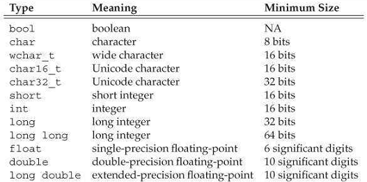
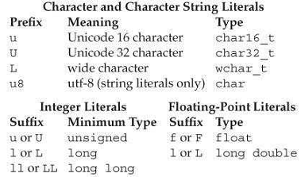
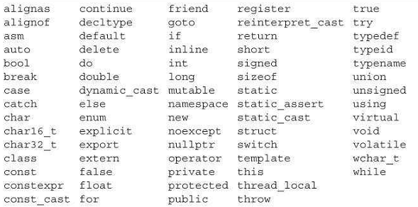
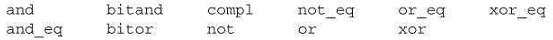
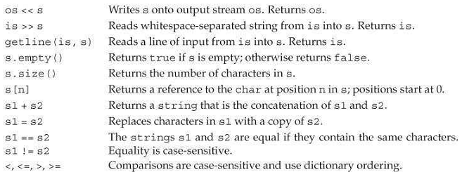
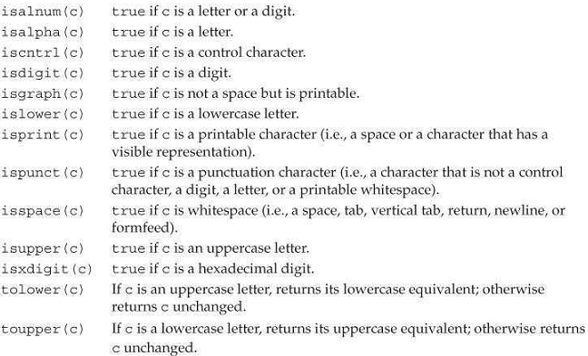
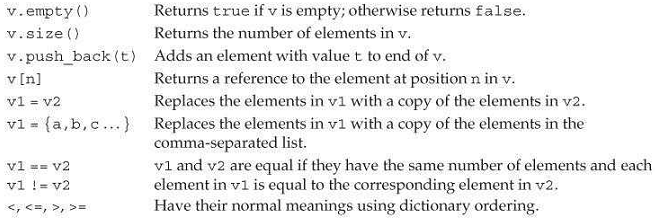

[toc]

## 前言 ##

2011新标准的目标：

- Make the language more uniform and easier to teach and to learn
- Make the standard libraries easier, safer, and more efficient to use
- Make it easier to write efficient abstractions and libraries

GNU compiler, version 4.7.0. There are only a few features used in this book that this compiler does not yet implement: inheriting constructors, reference qualifiers for member functions, and the regular-expression library.

## 1. 入门  ##

### 1.1. 编写一个简单的C++程序

```cpp
int main()
{
    return 0;
}
```

On most systems, the value returned from main is a status indicator. 返回0表示成功。A nonzero return has a meaning that is defined by the system.

编译：

```
$ g++ -o prog1 prog1.cc
```

If the `-o prog1` is omitted, the compiler generates an executable named `a.out` on UNIX systems and `a.exe` on Windows. (Note: Depending on the release of the GNU compiler you are using, you may need to specify `-std=c++0x` to turn on C++ 11 support.) 

### 1.2. 输入输出初探

C++没有输入输出语句。使用标准库处理IO。这里使用`iostream`库。库中有两个类`istream`和`ostream`。

库定义了4个IO对象。

|  |  | 类型 |
|--|--|-----|
| cin | 标准输入 | istream |
| cout | 标准输出 | ostream |
| cerr | 标准错误 | ostream |
| clog | | ostream |

例子：

```cpp
    #include <iostream>
    int main()
    {
        std::cout << "Enter two numbers:" << std::endl;
        int v1 = 0, v2 = 0;
        std::cin >> v1 >> v2;
        std::cout << "The sum of " << v1 << " and " << v2
        <<" is " << v1 + v2 << std::endl;
        return 0;
    }
```

`#include <iostream>`中，`<>`之间的是头。

输出运算符：`<<`。

```cpp
std::cout << "Enter two numbers:" << std::endl;
```

左值必须是`ostream`对象。返回值是左值。

`endl`是manipulator。它的作用是结束当前行，刷出缓存。

> 命名空间。注意到使用了`std::cout`和`std::endl`，而非`cout`和`endl`。`std::`前缀表示`cout`和`endl`定义在命名空间`std`中。

读取：

```cpp
std::cin >> v1 >> v2;
```

`>>`是输入运算符。左值必须是`istream`。返回值是**左**值。

### 1.3 注释

`//`和`/* */`。

### 1.4 流控制

#### 1.4.1 while

```cpp
    while(val <= 10)  {
        sum += val;
        ++val;
    }
```

#### 1.4.2. for

```cpp
    for(int val = 1; val <= 10; ++val)
        sum += val;
```

#### 1.4.3. 读取数量不定的输入

```cpp
    #include <iostream>
    int main()
    {
        int sum = 0, value = 0;
        // 读取到文件结尾
        while(std::cin >> value)
        	sum += value;
        std::cout << "Sum is: " << sum << std::endl;
        return0;
    }
```

`>>`返回左值，这里是`std:cin`。即while测试的是`std:cin`。在条件中使用`istream`，效果是测试流的状态。如果流是有效的（未发生错误），测试通过。当遇到文件结尾，或遇到无效输入时（如读到的不是整数），流无效。`istream`处于错误状态时条件为false。

### 1.5 类

假设我们已经在头文件`Sales_item.h`中定义了一个类`Sales_item`。

头文件的后缀一般是`.h`，但也有人用`.H`, `.hpp`, or `.hxx`。标注库的头一般没有任何后缀。编译器不在于头文件名的格式。

#### 1.5.1. `Sales_item`类

定义一个类的变量：

```cpp
	Sales_item item;
    #include <iostream>
    #include"Sales_item.h"
    int main()
    {
        Sales_item book;
        std::cin >> book;
        std::cout << book << std::endl;
        return 0;
    }
```

来自标准库的头用尖括号包围。库之外的头又双引号包围。

```cpp
    #include <iostream>
    #include"Sales_item.h"
    int main()
    {
        Sales_item item1, item2;
        std::cin >> item1 >> item2;  // read a pair of transactions
        std::cout << item1 + item2 << std::endl; // print their sum
        return 0;
    }
```

#### 1.5.2 成员函数（方法）初探

```cpp
    #include <iostream>
    #include "Sales_item.h"
    int main()
    {
        Sales_item item1, item2;
        std::cin >> item1 >> item2;
        // 先检查item1和item2是同一本书
        if (item1.isbn() == item2.isbn()) {
            std::cout << item1 + item2 << std::endl;
            return 0;  // indicate success
        } else {
            std::cerr << "Data must refer to same ISBN" << std::endl;
            return -1;  // indicate failure
        }
    }
```

## I. ------- 基础 ------

## 2. 变量和基本类型

### 2.1 基本（Primitive）内建类型

基本类型包括算术（arithmetic）类型和`void`。算术类型包括字符、整数、布尔、浮点数。

#### 2.1.1 算术类型

分两类：整数（包括字符、布尔）和浮点。


The size of—that is, the number of bits in—the arithmetic types varies across machines. The standard guarantees minimum sizes as listed in Table 2.1. However, compilers are allowed to use larger sizes for these types.



有几种字符类型，多数用于国际化。最基本的是`char`。A char is guaranteed to be big enough to hold numeric values corresponding to the characters in the machine’s basic character set. That is, a char is the same size as a single machine **byte**.

The remaining character types — `wchar_t`, `char16_t`, and `char32_t` —a re used for extended character sets. The w`char_t `type is guaranteed to be large enough to hold any character in the machine’s largest extended character set. The types `char16_t` and `char32_t` are intended for Unicode characters.

The remaining integral types represent integer values of (potentially) different sizes. The language guarantees that an `int` will be at least as large as `short`, a `long` at least as large as an `int`, and `long long` at least as large as `long`. The type` long long` was introduced by the new standard.


##### 有符号与无符号类型

除了bool和扩展字符集类型，整数类型可以是有符号的或无符号的。

与其他整数类型不同的是，有三种不同的基本字符累心难过：`char`, `signed char`, and `unsigned char`。注意`char`与`signed char`不是一种类型。Although there are three character types, there are only two representations: signed and unsigned. The (plain) `char` type{{不加任何限定的char}} uses one of these representations. Which of the other two character representations is equivalent to char depends on the compiler.

The standard does not define how signed types are represented, but does specify that the range should be evenly divided between positive and negative values.

不要在算术表达式中使用普通char或bool。Use them only to hold characters or truth values. 计算中涉及char将会带来问题，因为有些机器上char是有符号的但有些机器上是无符号的。如果需要一个小整数，显式指定是否有符号：`signed char`或`unsigned char`。

#### 2.1.2 类型转换

这里讨论一种变量向另一种变量赋值。4.11节还会继续讨论转换问题。

把非布尔型的算术类型赋给bool变量，值为0是结果为false，其他情况为true。把bool赋给其他算术类型，如果bool是true则结果是1，false则结果是0。

把浮点值赋给整数类型，值会被截断。整数赋给浮点，小数部分是0。Precision may be lost if the integer has more bits than the floating-point object can accommodate.

If we assign an out-of-range value to an object of unsigned type, the result is the remainder of the value modulo the number of values the target type can hold. For example, an 8-bit unsigned char can hold values from 0 through 255, inclusive. If we assign a value outside this range, the compiler assigns the remainder of that value modulo 256. Therefore, assigning –1 to an 8-bit unsigned char gives that object the value 255.

将超出范围的值赋给**有符号**类型结果是不确定的。The program might appear to work, it might crash, or it might produce garbage values.

当在期望一种类型的地方使用另一种类型的只，编辑器将进行上述的类型转换。例如：

```cpp
int i= 42;
if (i) // condition will evaluate as true
	i = 0;
```

涉及无符号类型的表达式，例如表达式中有`unsigned`和`int`，int值被转换为无符号的。将`int`转换为`unsigned`就相当于我们将一个`int`赋值给`unsigned`。

从一个无符号数减去一个值（不管是否有符号），要确保结果不为负：

```cpp
unsigned u1 = 42, u2 = 10;
std::cout << u1 - u2 << std::endl; // ok: result is 32
std::cout << u2 - u1 << std::endl; // ok: but the result will wrap around
```

> Caution: 不要混用有符号数和无符号数。Expressions that mix signed and unsigned values can yield surprising results when the signed value is negative. 记住**有符号数会自动转换为无符号数**。

#### 2.1.3. 字面量

字面量有类型。

##### 整型和浮点字面量

0开头是八进制。`0x`或`0X`开头是十六进制。

The type of an integer literal depends on its value and notation. By default, decimal literals are signed whereas octal and hexadecimal literals can be either signed or unsigned types. A decimal literal has the smallest type of int, long, or long long (i.e., the first type in this list) in which the literal’s value fits. Octal and hexadecimal literals have the smallest type of int, unsigned int, long, unsigned long, long long, or unsigned long longin which the literal’s value fits. 如果响应的最大类型都无法容纳此字面量是个错误。没`short`类型的字面量。We’ll see in Table 2.2(p. 40) that we can override these defaults by using a suffix.

Table 2.2.Specifying the Type of a Literal



技术上说，十进制字面量不会是复数。例如`-42`, 减号不是字面量的一部分。减号是负操作符。

浮点数字面量默认类型是`double`。We can override the default using a suffix from Table 2.2(overleaf).

##### 字符和字符串

单引号包裹单个字符的字面量是char。双引号包括零个或多个字符是string字面量：

```cpp
    'a'  // character literal
    "Hello World!"  // string literal
```

string字面量的类型是常量char的数组。The compiler appends a null character (‘\0’) to every string literal. Thus, the actual size of a string literal is one more than its apparent size.

Two string literals that appear adjacent to one another and that are separated only by spaces, tabs, or newlines are concatenated into a single literal.

##### 转义

```
    newline    \n    horizontal tab    \t    alert (bell)    \a
    vertical tab    \v    backspace    \b    double quote  \"
    backslash    \\    question mark    \?   single quote    \'
    carriage return   \r    formfeed    \f
```

We can also write a generalized escape sequence, which is \x followed by one or more hexadecimal digits or a \ followed by one, two, or three octal digits. The value represents the numerical value of the character.

Note that if a \ is followed by more than three octal digits, only the first three are associated with the \ . For example, "\1234" represents two characters: the character represented by the octal value 123 and the character 4. In contrast, \x uses up all the hex digits following it; "\x1234" represents a single, 16-bit character composed from the bits corresponding to these four hexadecimal digits. Because most machines have 8-bit chars, such values are unlikely to be useful. Ordinarily, hexadecimal characters with more than 8 bits are used with extended characters sets using one of the prefixes from Table 2.2.

##### 指定字面量的类型

We can override the default type of an integer, floating- point, or character literal by supplying a suffix or prefix as listed in Table 2.2.

```cpp
    L'a'  // wchar_t
    u8"hi!"  // utf-8 string literal (utf-8 encodes a Unicode character in 8 bits)
    42ULL  // unsigned integer literal, type is unsigned long long
    1E-3F  // single-precision floating-point literal, type is float
    3.14159L // long double
```

We can independently specify the signedness and size of an integral literal. If the suffix contains a U, then the literal has an unsigned type, so a decimal, octal, or hexadecimal literal with a U suffix has the smallest type of unsigned int, unsigned long, or unsigned long long in which the literal’s value fits. If the suffix contains an L, then the literal’s type will be at least long; if the suffix contains LL, then the literal’s type will be either long long or unsigned long long. We can combine U with either L or LL. For example, a literal with a suffix of UL will be either unsigned longor unsigned long long, depending on whether its value fits in unsigned long.

##### 布尔和指针字面量

`true`和`false`是bool类型的字面量。

```cpp
    bool test= false;
```

The word `nullptr` is a pointer literal. We’ll have more to say about pointers and `nullptr` in § 2.3.2(p. 52).

### 2.2 变量

#### 2.2.1 变量定义

简单的变量定义包含一个类型限定符，接着是一个或多个变量名（逗号分隔），最后是分号。Each name in the list has the type defined by the type specifier. 变量后可以跟初始值：

```cpp
    int sum = 0, value, units_sold= 0;
    Sales_item item;  // item has type Sales_item(see § 1.5.1(p. 20))
    std::string book("0-201-78345-X"); // book是变量，括号内是初始值
```

##### Initializers

在C++中，**初始化和赋值是两种不同的操作**。Initialization happens when a variable is given a value when it is created. Assignment obliterates an object’s current value and replaces that value with a new one.

##### List Initialization

有几种不同的初始化方式。例如下面四种方式都是将`units_sold`初始化为0：

```cpp
int units_sold = 0;
int units_sold = {0};
int units_sold{0};
int units_sold(0);
```

`{}`用于通用的初始化是新标准引入的。This form of initialization previously had been allowed only in more restricted ways. For reasons we’ll learn about in § 3.3.1, 这种形式的初始化称为**list initialization**。Braced lists of initializers can now be used whenever we **initialize** an object and in some cases when we **assign** a new value to an object.

若变量是内建类型，使用list initialize时，若可能丢失信息，则编译器将不允许：

```cpp
long double ld = 3.1415926536;
int a{ld}, b = {ld}; // error: narrowing conversion required
int c(ld), d = ld;  // ok: but value will be truncated
```

上面的例子中，`long double`类型的ld，即使去掉小数部分，整数部分也可能无法被`int`容纳。

As presented here, the distinction might seem trivial—after all, we’d be unlikely to directly initialize an int from a long double. However, as we’ll see in Chapter 16, such initializations might happen unintentionally. We’ll say more about these forms of initialization in § 3.2.1(p. 84) and § 3.3.1(p. 98).

##### Default Initialization

定义变量时若不指定初始化器，则变量将被默认初始化。默认值取决于变量类型和变量定义的位置。

内建类型的默认值取决于定义位置。函数之外定义初始化为0（一个例外，见§ 6.1.1）。函数内定义的内建类型值是未初始化的。未初始化的值是不定的（§ 2.1.2）。It is an **error** to copy or otherwise try to access the value of a variable whose value is undefined.

类控制如何初始化类的实例。由类决定对象是否可以不被初始化。如果不被初始化，也是由类决定默认值是什么。
多数类允许不显式初始化。例如库类`string`，如果不初始化，则默认是空串：

```cpp
	std::string empty;  // empty implicitly initialized to the empty string
```

Some classes require that every object be explicitly initialized. The compiler will complain if we try to create an object of such a class with no initializer.

#### 2.2.2. 变量声明（Declarations）与定义（Definitions）

To allow programs to be written in logical parts, C++ supports what is commonly known as separate compilation. Separate compilation lets us split our programs into several files, each of which can be compiled independently.

当程序被分解成多个文件，我们需要能够在文件之间共享代码。例如，一段代码需要用到在另一个文件中定义的变量。例如`std::cout`和`std::cin`。

为支持separate compilation，C++区分了声明（declarations）和定义（definitions）。声明让一个名字对程序可知。文件中若使用了定义在其他文件中的名字，需要在文件中声明此名字。定义创建相应的实体。

变量声明指定变量的类型和名称。变量定义也是声明。除了指定名字和类型，定义也会分配空间，还可能初始化值。

声明利用`extern`关键字。不要初始化。

```cpp
extern int i;  // declares but does not define i
int j;  // declares and defines j
```

任何包含显式初始化的声明都是定义。初始化可以跟`extern`一起存在，但初始化会覆盖`extern`，及此时声明变成了定义：

```cpp
extern doublepi = 3.1416; // definition
```

如果在函数内，连用初始化跟`extern`是错误的。

变量只能被定义一次，但可以被声明多次。

如果在多个文件中使用一个变量，变量需要被定义一次，声明多次。

We’ll have more to say about how C++ supports separate compilation in § 2.6.3 and § 6.1.3.

#### 2.2.3. Identifiers

Identifiers in C++ can be composed of letters, digits, and the underscore character. The language imposes no limit on name length. Identifiers must begin with either a letter or an underscore.

保留字



Table 2.4.C++ Alternative Operator Names



标准还保留了一些名字用于标准库。The identifiers we define in our own programs may not contain two consecutive underscores, nor can an identifier begin with an underscore followed immediately by an uppercase letter. In addition, identifiers defined outside a function may not begin with an underscore.

#### 2.2.4. 一个名字的作用域

Most names defined outside a function has global scope.

### 2.3. 复合（Compound）类型

一个compound类型是根据另一个类型定义的类型。C++中有多种复合类型，其中两种是*引用*与*指针*。

声明是一个基础（base）类型，接着一组说明符（declarators）。**一个说明符命名一个变量**，同时给这个变量一个**相对于基础类型**的类型。

之前看到的声明，说明符只有变量名。这类变量的类型就是基础类型。

#### 2.3.1. 引用（reference）

> 新标准引入了一种新的引用：an “rvalue reference,” which we’ll cover in § 13.6.1(p. 532). These references are primarily intended for use inside classes. Technically speaking, when we use the term reference, we mean “lvalue reference.”

引用定义了对象的另一个名称。一个引用类型指向另一个类型。引用类型的说明符是`&d`，其中d是变量名：

```cpp
int ival = 1024;
int &refVal = ival;  // refVal指向ival，或者说是ival的另一个名字
int &refVal2;  // 错误：引用必须被初始化
```

一旦初始化，引用一直绑定到初始化的对象。**无法将引用重新绑定到另一个对象**。因此引用必须初始化。

##### 引用即别名

对引用的操作实际是操作引用绑定的对象：

```cpp
refVal = 2;  // 将2赋给refVal指向的对象，即ival
int ii = refVal; // same as ii = ival

int &refVal3 = refVal; // refVal3现在也指向ival了
int i = refVal; // i现在具有与ival相同的值
```

因为引用不是对象，因此不能定义a reference to a reference。

##### 引用定义

在单个定义中可以定义多个引用。注意**每个**变量名前都要加`&`：

```cpp
    int i = 1024, i2 = 2048;  // i and i2 are both ints
    int &r = i, r2 = i2;  // r是引用类型，但r2是int
    int i3 = 1024, &ri = i3;  // i3 is an int; ri is a reference bound to i3
    int &r3 = i3, &r4 = i2;  // both r3 and r4 are references
```

引用的类型与对象类型必须一直（两个例外：§ 2.4.1、§ 15.2.3(p. 601)）。

```cpp
double dval = 3.14;
int &refVal5 = dval; // error: initializer must be an int object
```

引用只能绑定到对象，不能绑定到字面量。原因在§ 2.4.1解释。

```cpp
int &refVal4 = 10;  // error: initializer must be an object
```

#### 2.3.2. 指针

指针本身也是对象。可以改变指针指向的对象。不一定要在定义时初始化。
在块级作用域上，未初始化的指针的值是未定义的。

指针类型的说明符是`*d`，d是变量名。

```cpp
    int *ip1, *ip2;  // both ip1 and ip2 are pointers to int
    double dp, *dp2; // dp2是指针，但dp是double
```

##### 取对象地址

指针持有对象的地址。使用`&`获取对象地址：

```cpp
int ival= 42;
int *p = &ival; // p holds the address of ival; p is a pointer to ival
```

指针与对象必须类型一致（两个例外：2.4.2、15.2.3(p. 601)）。

##### 指针值

指针存放的值（即地址）可以有四种状态：

- 它可以指向一个对象
- It can point to the location just immediately past the end of an object.
- 它可以是空指针，表示不绑定到任何对象
- 可能是无效值。上述三者之外都是无效值

访问无效指针的结果是不定的。Therefore, we must always know whether a given pointer is valid. 尽管第2第3种指针是有效的，但使用受限。因为这些指针不指向任何对象，因此不用于访问指向的对象。如果访问了，结果是不定的。

##### 使用指针访问对象

When a pointer points to an object, we can use the dereference operator (the `*` operator) to access that object:

```cpp
int ival= 42;
int *p = &ival;
cout << *p;  // * yields the object to which p points; prints 42
```

##### 空指针

空指针不指向任何对象。代码在使用指针前要检查是否为空。有几种方式获得一个空指针：

```cpp
    int *p1= nullptr; // 等价于int *p1 = 0;
    int *p2 = 0;  // directly initializes p2 from the literal constant 0
    // must #include cstdlib
    int *p3 = NULL;  // 等价于int *p3 = 0;
```

`nullptr`是新标准引入的。`nullptr`是一个字面量，有**特殊类型**，可以被转换为任何指针类型。

老的程序一般会用预处理器变量**NULL**，**cstdlib**头将其定义为0。**预处理器变量**不是命名空间的一部分。因此引用它们是不用加**std::**前缀。
现代C++程序尽量避免使用NULL，使用`nullptr`吧。

为指针赋一个整数变量是无效的，即便是0。

```cpp
    int zero = 0;
    pi = zero;  // error: cannot assign an int to a pointer
```

##### 赋值（Assignment）

Assignment可以让指针指向不同的对象：

```cpp
    int i= 42;
    int *pi = 0;  // pi is initialized but addresses no object
    int *pi2 = &i; // pi2 initialized to hold the address of i
    int *pi3;  // if pi3 is defined inside a block, pi3 is uninitialized
    pi3 = pi2;  // pi3 and pi2 address the same object, e.g., i
    pi2 = 0;  // pi2 now addresses no object
```

##### 其他指针运算

只要指针的值有效，可以参与条件。0值为false，其他为true。

**相同类型**的有效指针可以使用`==`和`!=`运算符。运算符的结果是`bool`。持有相同地址的指针相等。两个null指针相等。Note that it is possible for a pointer to an object and a pointer one past the end of a different object to hold the same address. Such pointers will compare equal.

比较无效的指针的结果是未定的。

3.5.3 (p. 117) will cover additional pointer operations.

##### void*指针

`void*`是一个特殊的指针类型，可以持有任何对象的地址。对象的类型是不知的。

```cpp
double obj= 3.14, *pd = &obj;
// ok: void* can hold the address value of any data pointer type
void *pv = &obj;  // obj can be an object of any type
pv = pd;  // pv can hold a pointer to any type
```

可以与其他指针比较。｛｛相同类型的？｝｝**但不能用于操作地址上的对象**——我们不知道对象的类型。

#### 2.3.3. 理解复合类型声明

每个说明符定义一个变量，其类型与基础类型的关系可以不同。因此，单个定义可以定义多种不同类型的变量：

```cpp
// i is an int; p is a pointer to int; r is a reference to int
int i = 1024, *p = &i, &r = i;
```

##### 定义多个变量

误解：type modifier(`*`, `&`)对语句中所有变量起作用。误解原因之一是，type modifier和变量名之间可以有空白符：
```cpp
int* p;  // legal but might be misleading
```

注意即使如此，基础类型仍是`int`，不是`int*`。`*`只作用于p。
```cpp
int* p1, p2; // p1 is a pointer to int; p2 is an int
```

最好还是让type modifier靠近标识符：
```cpp
int *p1, *p2; // both p1 and p2 are pointers to int
```

##### 指向指针的指针

一般来说，向说明符应用多少个type modifiers是没有限制的。

`**`是指向指针的指针。

```cpp
int ival = 1024;
int *pi = &ival;  // pi points to an int
int **ppi = &pi;  // ppi points to a pointer to an int
```

要访问指向的对象，需要解指向两次：

```cpp
    cout << "The value of ival\n"
        << "direct value: " << ival << "\n"
        << "indirect value: " << *pi << "\n"
        << "doubly indirect value: " << **ppi
        << endl;
```

##### 指针的引用

```cpp
    int i= 42;
    int *p; // p is a pointer to int
    int *&r = p; // r是一个引用，指向指针p
    r = &i; // r指向一个指针（是一个指针的别名——就是一个指针）; 将i的地址给r
    *r = 0; // *r即i
```

为理解`r`，**从右向左读**。**最靠近r的符号决定变量类型**。这里`r`是一个引用。

### 2.4. const限定符

We can make a variable unchangeable by defining the variable’s type as `const`:

```cpp
	const int bufSize = 512;  // input buffer size
```

因为const对象创建后不能改变，因此必须初始化。初始化器可以使用任意复杂的表达式：

```cpp
    const inti = get_size();  // 运行时初始化是可以的
    const int j = 42;  // ok: initialized at compile time
    const int k;
```

##### const对象局限于单个文件

如果常量是被一个编译时常量初始化的，如：
```cpp
`const intbufSize = 512;
```

编译器一般会在编译时将变量的使用替换为变量的值。

To substitute the value for the variable, the compiler has to see the variable’s initializer. When we split a program into multiple files, every file that uses the const must have access to its initializer. 为了看到初始化器，变量必须在每个文件中的定义。为支持这种用法，同时避免多次的定义同一个变量，const变量局限于文件。When we define a const with the same name in multiple files, it is as if we had written definitions for separate variables in each file.

有时，想要在多个文件共享的const变量的初始化器不是一个常量表达式。此时，我们不想让编译器在每个文件中产生一个变量。我们想在一个文件中定义const，在其他文件中声明。要定义一个const变量的单个实例，我们需要在定义和声明时都加`extern`关键字。

```cpp
// file_1.cc defines and initializes a const that is accessible to other files
extern const int bufSize = fcn();
// file_1.h
extern const int bufSize; // same bufSize as defined in file_1.cc
```

#### 2.4.1. 到const的引用

可以绑定到const类型的引用。到常量的引用与常量本身一样，不能用于改变绑定的对象：

```cpp
    const int ci = 1024;
    const int &r1 = ci;  // ok: ci和r1都是常量
    r1 = 42;  // error: r1 is a reference to const
    int &r2 = ci;  // error: non const reference to a const object
```

> 术语：常量引用（const Reference）是一个到常量的引用。C++程序员一般称“reference to const”为“const reference”。这是个缩略语。技术上讲，并没有const references。引用不是对象，因此不能令引用本身是常量。但另一方面，因为不能让引用引用其他对象，引用就像一个常量。引用指向的是常量影响我们能对引用做什么。而不是是否能改变引用的绑定。

##### 初始化到const的引用

之前我们提到，引用的类型必须匹配被应用对象的类型。但有两个例外。第一是，到常量的引用，可以使用任意可以转换为匹配类型的表达式初始化。特别的，可以将到常量的引用绑定到**非常量**对象：

```cpp
    int i= 42;
    const int &r1 = i;  // 可以将const int &绑定到非常量int
    const int &r2 = 42;  // ok: r1 is a reference to const
    const int &r3 = r1 * 2; // ok: r3 is a reference to const
    int &r4 = r * 2;  // error: r4 is a plain, non const reference
```

例子：绑定不同类型：
```cpp
    double dval= 3.14;
    const int &ri = dval;
```

以上代码，编译器实际会出下面的变换：
```cpp
    const int temp = dval;  // create a temporary const int from the double
    const int &ri = temp;  // 将ri绑定到一个临时变量
```

即`ri`绑定到了一个临时对象。

为什么不同类型的绑定，引用必须是常量的？如下面是错误的：
```cpp
    double dval= 3.14;
    int &ri = dval; // 不允许
```

因为如果不是常量，程序员可能向通过为引用赋值改变引用绑定的原对象。但引用此时绑定的实际是一个临时对象，不会影响原对象。于是在C++中，不同类型的绑定，引用必须是const的。

##### 到常量的引用可以引用一个不是常量的对象

到常量的引用只会限制我们可以对引用做什么，但限制不了对底层变量的直接操作。因为底层的对象不是常量，它可能通过其他方式改变：

```cpp
    int i= 42;
    int &r1 = i;  // r1 bound to i
    const int &r2 = i;  // r2 also bound to i; but cannot be used to change i
    r1 = 0;  // r1 is not const; i is now 0
    r2 = 0;  // error: r2 is a reference to const
```

#### 2.4.2. 指针与const

指针可以指向常量或非常量类型。*到常量的指针* 不能用于修改指向的对象。常量对象的地址只能放在到常量的指针里。

```cpp
const double pi = 3.14;
double *ptr = &pi;  // 错误，ptr只是普通指针
const double *cptr = &pi; // ok: cptr may point to a double that is const
*cptr = 42;  // 错误，不能赋值给*cptr
```

指针与指向的对象类型必须匹配。但有两个例外。第一个是，到常量的指针可以指向非常量对象。
```cpp
double dval= 3.14;  // dval is a double; its value can be changed
cptr = &dval;  // 可以。但不同通过cptr改变dval
```

注意，如果底层对象不是常量，它可能被其他方式改变。

指向常量的指针，指针本身是变量，指针指向的是对象是常量。但下面的常量指针，指针本身是常量，指针指向的对象可能是常量或变量。

##### const指针

指针本身是对象，于是指针本身可以是常量。与其他常量对象一样，常量指针必须被初始化；一旦初始化，不能改变。要表示指针是常量，需要在`*`后加`const`。

```cpp
int errNumb= 0;
int *const curErr = &errNumb;  // curErr总是指向errNumb
const double pi = 3.14159;
const double *const pip = &pi; // pip是一个长阿兰指针指向一个常量对象
```

为方便理解，从右向左读。curErr标识符最近的是const，表示**curErr自己是常量**。

指针本身是常量，不影响是否可以利用指针改变底层对象。是否允许只取决于指针指向什么
```cpp
    *pip = 2.72;  // 错误：pip指向的是常量
    // if the object to which curErr points (i.e., errNumb) is nonzero
    if (*curErr) {
    	errorHandler();
    	*curErr= 0; // ok: reset the value of the object to which curErr is bound
    }
```

#### 2.4.3. Top-Level const

指针本身是常量称为top-level const。如果指针指向常量对象，这种常量称为low-level const。

更一般的说，顶级常量表示对象自己是常量。任何类型都可以是顶级常量。底层常量表示复合类型的**基础类型**是常量。而指针，可以同时为顶级或底层常量：

```cpp
int i= 0;
int *const p1 = &i;  // 顶级常量。不能改变p1的值
const int ci = 42;  // 顶级常量。不能改变ci
const int *p2 = &ci; // 常量是低级常量。可以改变p2
const int *const p3 = p2; // right-most const is top-level, left-most is not
const int &r = ci;  // const in reference types is always low-level
```

The distinction between top-level and low-level matters when we copy an object. When we copy an object, top-level consts are ignored:

```cpp
i = ci;  // ok: copying the value of ci; top-level const in ci is ignored
p2 = p3; // ok: pointed-to type matches; top-level const in p3 is ignored
```

拷贝对象｛｛注意，不是赋值！！！｝｝不改变被拷贝对象。因此，拷贝或被拷贝对象是否是常量都不重要。

与此相反，低级常量永不会被忽略。When we copy an object, both objects must have the same low-level const qualification or there must be a conversion between the types of the two objects. 一般来说，可以将非常量转换为常量，但反之不行：

```cpp
int *p = p3; // error: p3 has a low-level const but p doesn't
p2 = p3;  // ok: p2 has the same low-level const qualification as p3
p2 = &i;  // ok: we can convert int* to const int*
int &r = ci; // error: can't bind an ordinary int& to a const int object
const int &r2 = i; // ok: can bind const int& to plain int
```

p3 has both a top-level and low-level const. When we copy p3, we can ignore its top-level const but not the fact that it points to a const type. Hence, we cannot use p3 to initialize p, which points to a plain (nonconst) int. On the other hand, we can assign p3 to p2. Both pointers have the same (low-level const) type. The fact that p3 is a const pointer (i.e., that it has a top-level const) doesn’t matter.

#### 2.4.4. `constexpr`和常量表达式

常量表达式是一个值不会改变的表达式。于是可以在编译期求值。字面量是常量表达式。A const object that is initialized from a constant expression is also a constant expression. 语言中有一些上下文需要常量表达式。

一个对象（或表达式）是否为常量表达式取决于类型和初始化器。例子：

```cpp
    const int max_files = 20;  // max_files is a constant expression
    const int limit = max_files + 1; // limit is a constant expression
    int staff_size = 27;  // staff_size is not a constant expression
    const int sz = get_size(); // sz不是一个常量表达式，因为get_size()在运行时才知道
```

##### `constexpr`变量

在大型系统中，有时很难知道一个初始化器是否是常量表达式。可能仅当把一个常量放在一个需要常量表达式的地方时才发现其实它不是。经常，对象的定义和使用它的上下文不在一起。

新标准下，我们可以令编译器验证一个变量是否是常量表达式：将变量声明为`constexpr`。`constexpr`变量是隐式的常量，因此必须初始化：

```cpp
constexpr int mf = 20;  // 20 is a constant expression
constexpr int limit = mf + 1; // mf + 1 is a constant expression
constexpr int sz = size();  // 仅当size是constexpr函数时
```

Although we cannot use an ordinary function as an initializer for a constexpr variable, we’ll see in § 6.5.2(p. 239) that the new standard lets us define certain functions as `constexpr`. Such functions must be simple enough that the compiler can evaluate them at compile time. We can use `constexpr` functions in the initializer of a constexpr variable.

Generally, it is a good idea to use `constexpr` for variables that you intend to use as constant expressions.

##### Literal Types

因为常量表达式在编译期求值，于是可以在`constexpr`声明中使用的类型受限。The types we can use in a constexprare known as “literal types” because they are simple enough to have literal values.

之前用的所有类型中，算术、引用和指针是字面类型。`Sales_item`、IO库、string等不是。因为不能定义这些类型的变量是constexprs。We’ll see other kinds of literal types in § 7.5.6(p. 299) and § 19.3(p. 832).

Although we can define both pointers and reference as constexprs, the objects we use to initialize them are strictly limited. We can initialize a constexpr pointer from the `nullptr` literal or the literal (i.e., constant expression) 0. We can also point to (or bind to) an object that remains at a fixed address.

For reasons we’ll cover in § 6.1.1(p. 204), variables defined inside a function ordinarily are not stored at a fixed address. Hence, we cannot use a constexpr pointer to point to such variables. On the other hand, the address of an object defined outside of any function is a constant expression, and so may be used to initialize a constexpr pointer. We’ll see in § 6.1.1(p. 205), that functions may define variables that exist across calls to that function. Like an object defined outside any function, these special local objects also have fixed addresses. Therefore, a constexpr reference may be bound to, and a constexprpointer may address, such variables.

##### 指针和constexpr

It is important to understand that when we define a pointer in a constexpr declaration, the constexpr specifier applies to the pointer, not the type to which the pointer points:

```cpp
    const int*p = nullptr;  // p is a pointer to a const int
    constexpr int *q = nullptr; // q is a const pointer to int
```

Despite appearances, the types of pand qare quite different; pis a pointer to const, whereas qis a constant pointer. The difference is a consequence of the fact that constexprimposes a top-level const(§ 2.4.3, p. 63) on the objects it defines.

Like any other constant pointer, a constexprpointer may point to a constor a nonconsttype:

```cpp
    constexpr int*np = nullptr; // np is a constant pointer to int that is null
    int j = 0;
    constexpr int i = 42;  // type of i is const int
    // i and j must be defined outside any function
    constexpr const int *p = &i; // p is a constant pointer to the const int i
    constexpr int *p1 = &j;  // p1 is a constant pointer to the int j
```

### 2.5. 处理类型

#### 2.5.1. 类型别名

两种方式定义类型别名。传统方式是`typedef`：

```cpp
typedef double wages;  // wages is a synonym for double
typedef wages base, *p; // base is a synonym for double, p for double*
```

`typedef`出现在声明的基础类型部分。与其他声明一样，说明符可以包含type modifiers。

新标准引入了alias声明：

```cpp
	using SI = Sales_item;  // SI is a synonym for Sales_item
```

类型别名可以出现在任何需要出现类型的地方。

```cpp
    wages hourly,weekly;  // same as double hourly, weekly;
    SI item;
```

##### 指针、const和类型别名

类型别名如果是复合类型和常量，使用这些类型别名可能会有问题。如：

```cpp
    typedef char *pstring;
    const pstring cstr = 0; // cstr is a constant pointer to char
    const pstring *ps;  // ps is a pointer to a constant pointer to char
```

基础类型部分的const修改给定类型，这里是pstring——pointer to char。因此const pstring是一个到char的常量指针｛｛指针是常量｝｝，不是到常量char的指针。

直接把别名替换为真实类型再翻译会导致错误解释：
```cpp
const char *cstr = 0; // const pstring cstr的错误解释
```

`const pstring *ps`中，基础类型是指针。而`const char *cstr = 0`中基础类型是char。

#### 2.5.2. auto类型Specifier

auto让编译器根据初始化器推断变量类型。（于是，使用auto时必须使用初始化器。）

```cpp
// the type of item is deduced from the type of the result of adding val1 and val2
auto item = val1 + val2; // item initialized to the result of val1 + val2
```

如果auto声明多个变量，初始化器产生的结果的类型要一致：

```cpp
auto i = 0, *p = &i;  // ok: i is int and p is a pointer to int
auto sz = 0, pi = 3.14;  // error: inconsistent types for sz and pi
```

##### 复合类型、常量和auto

编译器推断的auto不总是与初始化器的类型完全一致。Instead, the compiler adjusts the type to conform to normal initialization rules.

如果使用引用做初始化器，初始化器实际是对应对象。推断出的类型是对象的类型，不是一个引用：
```cpp
    int i= 0, &r = i;
    auto a = r;  // a is an int (r is an alias for i, which has type int)
```

auto一般会忽略顶级常量。但底层常量（如初始化器为到常量的指针）会保留：
```cpp
const int ci = i, &cr = ci;
auto b = ci;  // b is an int (top-level const in ci is dropped)
auto c = cr;  // c is an int (cr is an alias for ci whose const is top-level)
auto d = &i;  // d is an int *(& of an int object is int*)
auto e = &ci; // e is const int *(& of a const object is low-level const)
```

如果想要推断的类型带顶级常量，必须显式声明：
```cpp
const auto f = ci; // deduced type of ci is int; f has type const int
```

We can also specify that we want a reference to the auto-deduced type. Normal initialization rules still apply:
```cpp
auto &g= ci;  // g is a const int& that is bound to ci
auto &h = 42;  // error: we can't bind a plain reference to a literal
const auto &j = 42; // ok: we can bind a const reference to a literal
```

When we ask for a reference to an auto-deduced type, top-level consts in the initializer are not ignored. As usual, consts are not top-level when we bind a reference to an initializer.

When we define several variables in the same statement, it is important to remember that a reference or pointer is part of a particular declarator and not part of the base type for the declaration. As usual, the initializers must provide consistent auto-deduced types:
```cpp
auto k= ci, &l = i;  // k is int; l is int&
auto &m = ci, *p = &ci; // m is a const int&;p is a pointer to const int
// error: type deduced from i is int; type deduced from &ci is const int
auto &n = i, *p2 = &ci;
```

#### 2.5.3. decltype类型Specifier

我们向让编译器根据表达式推断一个类型，但不想用此表达式初始化变量。新标准引入了第二个type specifier：decltype。
```cpp
decltype(f()) sum = x; // sum has whatever type f returns
```

编译器**不会调用f**，但会推断f的返回值类型。

The way decltype handles top-level const and references differs subtly from the way auto does. When the expression to which we apply decltype is a variable, decltype returns the type of that variable, including top-level const and references:

```cpp
const intci = 0, &cj = ci;
decltype(ci) x = 0; // x has type const int
decltype(cj) y = x; // y has type const int& and is bound to x
decltype(cj) z;  // error: z is a reference and must be initialized
```

Because cj is a reference, decltype(cj) is a reference type. Like any other reference, z must be initialized.

It is worth noting that decltype is the only context in which a variable defined as a reference is not treated as a synonym for the object to which it refers.

##### decltype和引用

When we apply decltype to an expression that is not a variable, we get the type that that expression yields. As we’ll see in § 4.1.1(p. 135), some expressions will cause decltypeto yield a reference type. Generally speaking, decltypereturns a reference type for expressions that yield objects that can stand on the left-hand side of the assignment:

```cpp
// decltype ofan expression can be a reference type
int i = 42, *p = &i, &r = i;
decltype(r + 0) b;  // ok: addition yields an int; b is an (uninitialized) int
decltype(*p) c;  // error: c is int& and must be initialized
```

Here r is a reference, so decltype(r) is a reference type. If we want the type to which rrefers, we can use r in an expression, such as `r + 0`, which is an expression that yields a value that has a nonreference type.

On the other hand, the dereference operator is an example of an expression for which decltype returns a reference. As we’ve seen, when we dereference a pointer, we get the object to which the pointer points. Moreover, we can assign to that object. Thus, the type deduced by decltype(*p) is int&, not plain int.

Another important difference between decltype and auto is that the deduction done by decltype depends on the form of its given expression. What can be confusing is that enclosing the name of a variable in parentheses affects the type returned by decltype. When we apply decltypeto a variable without any parentheses, we get the type of that variable. If we wrap the variable’s name in one or more sets of parentheses, the compiler will evaluate the operand as an expression. A variable is an expression that can be the left-hand side of an assignment. As a result, decltype on such an expression yields a reference:

```cpp
// decltype ofa parenthesized variable is always a reference
decltype((i)) d;  // error: d is int& and must be initialized
decltype(i) e;  // ok: e is an (uninitialized) int
```

> **Warning** Remember that decltype((variable))(note, double parentheses) is always a reference type, but decltype(variable) is a reference type only if variable is a reference.

### 2.6 定义我们自己的数据结构

C++中通过**类**定义数据类型。库类型string、istream和ostream都是类。

#### 2.6.1. 定义`Sales_data`类

```cpp
    struct Sales_data{
        std::string bookNo;
        unsigned units_sold = 0;
        double revenue = 0.0;
    };
```

大括号后必须有一个分号。使用分号的原因是，可以在类后面跟随变量定义：

```cpp
struct Sales_data{ /* ... */ } accum, trans, *salesptr;

// equivalent, but better way to define these objects
struct Sales_data { /* ... */ };
Sales_data accum, trans, *salesptr;
```

##### 类数据成员

新标准允许我们为数据成员提供类内初始化（in-class initializer）。创建对象时，类内初始化将用于初始化数据成员。Members without an initializer are default initialized(§ 2.2.1). Thus, when we define `Sales_data` objects, `units_sold` and `revenue` will be initialized to 0, and `bookNo` will be initialized to the empty string.

In-class initializers are restricted as to the form (§ 2.2.1, p. 43) we can use: They must either be enclosed inside **curly braces** or follow an `=` sign. We may not specify an in-class initializer inside parentheses.

§ 7.2将引入另一个关键字`class`。在此之前我们将使用`struct`。第七章会讲二者的区别。

#### 2.6.2. 使用`Sales_data`类

We’ll assume that our `Sales_data` class is defined inside `Sales_data.h`. We’ll see how to define this header in § 2.6.3.

程序结构：

```cpp
    #include <iostream>
    #include <string>
    #include "Sales_data.h"
    int main()
    {
        Sales_data data1, data2;
        // code to read into data1 and data2
        // code to check whether data1 and data2 have the same ISBN
        //  andif so print the sum of data1 and data2
    }
```

```cpp
    double price= 0;  // price per book, used to calculate total revenue
    // read the first transactions: ISBN, number of books sold, price per book
    std::cin >> data1.bookNo >> data1.units_sold >> price;
    // calculate total revenue from price and units_sold
    data1.revenue = data1.units_sold * price;

    if (data1.bookNo== data2.bookNo) {
    	unsigned totalCnt = data1.units_sold + data2.units_sold;
    	double totalRevenue = data1.revenue + data2.revenue;
    	// print: ISBN, total sold, total revenue, average price per book
    	std::cout << data1.bookNo << " " << totalCnt <<" " << totalRevenue << " ";
        if (totalCnt != 0)
        	std::cout << totalRevenue/totalCnt << std::endl;
        else
        	std::cout << "(no sales)" << std::endl;
        return 0; // indicate success
    } else {  // transactions weren't for the same ISBN
        std::cerr << "Data must refer to the same ISBN" <<std::endl;
        return -1; // indicate failure
    }
```

#### 2.6.3. 编写我们自己的头文件

为确保所有文件中类定义相同，**类一般定义在头文件中**。

头（一般）包含只能被定义一次的实体（类定义、常量、constexpr变量）。头一般也要用到其他头。如`Sales_data`类有一个string成员，于是`Sales_data.h`必须`#include string`头。使用`Sales_data`的程序也必须包含`strin`头。于是使用Sales_data的程序将包含string头两次。**我们的头的写法需要在多次包含时仍保证安全**。

头更改时，依赖的源文件必须被重新编译。

##### 预处理器简要介绍

安全的包含头多次的技术依赖**预处理器**。`#include`是预处理器的设施。当预处理其遇到一个`#include`时，它将`#include`替换为指定的头。

C++ programs also use the preprocessor to define **header guards**. Header guards rely on **preprocessor variables** (§ 2.3.2, p. 53). 预处理器变量有两种可能的状态：定义或未定义。`#define`指令将一个名字定义为一个预处理器变量。有两个指令测试给定的预处理变量是否被定义： `#ifdef`和`#ifndef`。只有在测试为true时，`#ifdef`或`#ifndef`内部的东西才会被处理。

```cpp
    #ifndef SALES_DATA_H
        #define SALES_DATA_H
        #include <string>
        struct Sales_data {
            std::string bookNo;
            unsigned units_sold = 0;
            double revenue = 0.0;
        };
    #endif
```

注意：Preprocessor variable names do not respect C++ scoping rules.

Preprocessor variables, including names of header guards, must be unique throughout the program. Typically we ensure uniqueness by basing the guard’s name on the name of a class in the header. To avoid name clashes with other entities in our programs, 预处理变量一般全大写。

## 3. 字符串、向量、数组

`string`是变长字符串。`vector`是变长集合。Associated with string and vector are companion types known as iterators, which are used to access the characters in a string or the elements in a vector.

### 3.1. 命名空间`using`声明

之前使用cin时显式列出了库名，如std::cin。using可以让使用cin时不加限定。18.2.2给出了使用命名空间中名字的另一种方式。

`using`声明的形式：
```cpp
	using namespace::name;
```

例子：
```cpp
    #include <iostream>
    using std::cin;
    int main()
    {
        int i;
        cin >> i;  // ok: cin is a synonym for std::cin
        cout << i;  // error: no using declaration; we must use the full name
        std::cout << i; // ok: explicitly use cout from namepsace std
        return 0;
    }
```

每个名字都需要一个`using`声明：

```cpp
    using std::cin;
    using std::cout;
    using std::endl;
```

头文件不要使用using声明！在头中使用using声明，任何包含头的程序都将得到相同的using声明。可能引起冲突。

### 3.2. 库string类型

string是变长字符序列。要使用string类型，必须包含string头。string定义在std命名空间。
```cpp
    #include <string>
    using std::string;
```

本节介绍基本的string操作。§ 9.5将介绍更多。

#### 3.2.1. 定义和初始化string

实例化string的常见方式：

```cpp
    string s1; // 默认初始化，s1是空串
    string s2(s1); // s2是s1的拷贝
    string s2 = s1; // 等价于s2(s1)
    string s3("value"); // s3是字符串字面量的拷贝，不包括null
    string s2 = "value"; // 等价于s3("value")
    string s4(n, 'c'); // 重复c字符n次
```

##### 直接初始化和拷贝初始化

使用`=`是拷贝初始化，by copying the initializer on the right-hand side into the object being created. 如果省略`=`，使用直接初始化。

```cpp
    string s5= "hiya";  // 拷贝初始化
    string s6("hiya");  // 直接初始化
    string s7(10, 'c');  // 直接初始化; s7 is cccccccccc
```

#### 3.2.2. string运算

Table 3.2(overleaf) lists the most common string operations.



##### 读写string

```cpp
    // Note: #include and using declarations mustbe added to compile this code
    int main()
    {
        string s;  // empty string
        cin >> s;  // read a whitespace-separated string into s
        cout << s << endl; // write s to the output
        return 0;
    }
```

The string input operator reads and discards any leading whitespace (e.g., spaces, newlines, tabs). It then reads characters until the next whitespace character is encountered.

Thus, we can chain together multiple reads or writes:

```cpp
    string s1,s2;
    cin >> s1 >> s2; // read first input into s1, second into s2
    cout << s1 << s2 << endl; // write both strings
```

##### 读取数量不定的string

```cpp
    int main()
    {
        string word;
        while(cin >> word)  // read until end-of-file
            cout << word << endl; // write each word followed by a new line
        return 0;
    }
```

##### 使用getline读入整行

Sometimes we do not want to ignore the whitespace in our input. In such cases, we can use the `getline` function instead of the `>>` operator. The `getline` function takes an input stream and a string. This function reads the given stream up to and including the first newline and stores what it read—not including the newline—in its string argument. After getline sees a newline, even if it is the first character in the input, it stops reading and returns. If the first character in the input is a newline, then the resulting stringis the empty string.

与输入运算符一样，`getline`返回`istream`。As a result, we can use `getline` as a condition just as we can use the input operator as a condition (§ 1.4.3, p. 14). For example, we can rewrite the previous program that wrote one word per line to write a line at a time instead:

```cpp
    int main()
    {
        string line;
        // read input a line at a time until end-of-file
        while(getline(cin, line))
            cout << line << endl;
        return 0;
    }
```

##### empty和size

`empty`是string的成员函数，返回bool。

```cpp
// readinput a line at a time and discard blank lines
while (getline(cin, line))
	if(! line.empty())
		cout << line << endl;
```

`size`成员函数返回string长度。
```cpp
string line;
// read input a line at a time and print lines that are longer than 80 characters
while (getline(cin, line))
	if( line.size() > 80)
		cout << line << endl;
```

##### `string::size_type`类型

`size` returns a `string::size_type` value.

string类（和其他库类）定义了一些companion类。这些companion类使得库可以独立于机器。

Although we don’t know the precise type of `string::size_type`, 但可以确定它是一个无符号整数，达到可以容纳任何字符串的长度。用以存储字符串长度的变量的类型应该是`string::size_type`。新标准下，可以用`auto`或`decltype`：
```cpp
auto len= line.size(); // len has type string::size_type
```

因为size返回无符号数，混合有符号和无符号数的表达式可能产生意外结果(§ 2.1.2)。For example, if n is an int that holds a negative value, then `s.size() < n` will almost surely evaluate as true. It yields true because the negative value in nwill convert to a large unsigned value.

##### 比较字符串

The equality operators (`==`and `!=`) test whether two strings are equal or unequal, respectively. Two strings are equal if they are the same length and contain the same characters. The relational operators `<`, `<=`, `>`, `>=` test whether one string is less than, less than or equal to, greater than, or greater than or equal to another.

##### Assignment for strings

To this end, most of the library types support **assignment**. In the case of strings, we can assign one string object to another:

```cpp
    string st1(10,'c'), st2; // st1 is cccccccccc; st2 is an empty string
    st1 = st2; // assignment: replace contents of st1 with a copy of st2
    // both st1 and st2 are now the empty string
```

##### 两个字符串加

连接两个字符串，产生新字符串：
```cpp
string s1 = "hello, ", s2 = "world\n";
string s3 = s1 + s2;  // s3 is hello, world\n
s1 += s2;  // equivalent to s1 = s1 + s2
```

##### 字符串和字面量加

```cpp
string s1= "hello", s2 = "world"; // no punctuation in s1 or s2
string s3 = s1 + ", " + s2 + '\n';
```

`+`的操作数至少有一个需要是string：

```cpp
string s4= s1 + ", ";  // ok: adding a string and a literal
string s5 = "hello" + ", ";  // error: no string operand
string s6 = s1 + ", " + "world"; // ok: each + has a string operand
string s7 = "hello" + ", " + s2; // error: can't add string literals
```

{{字符串字面量没有+运算符？}}

记住，字符串字面量与string不是一回事。

#### 3.2.3. 处理string中的字符

下列函数定义在`cctype`头：

Table 3.3. cctype Functions


> `C++`版本的C库头
 `C++` 库使用了C库。C库以`.h`结尾。`C++`版本的这些头没有`.h`，并增加了c前缀。c表示头是C库的一部分。
因此cctype与ctype.h的内容相同。c开头的头定义在std命名空间。但.h版没有。
一般来说，`C++`程序应该使用没有.h版本的头。

##### 用Range-Based for处理每一个字符

If we want to do something to every character in a string, by far the best approach is to use a statement introduced by the new standard: the **range for** statement. This statement iterates through the elements in a given sequence and performs some operation on each value in that sequence. The syntactic form is

```cpp
    for (declaration: expression)
        statement
```

例子：
```cpp
    string str("somestring");
    // print the characters in str one character to a line
    for (auto c : str)  // for every char in str
    	cout << c << endl;  // print the current character followed by a newline
```

##### Using a Range for to Change the Characters in a string

如果向改变string中的字符，需要将循环变量做成引用类型：

```cpp
    string s("HelloWorld!!!");
    // convert s to uppercase
    for (auto &c : s)
    	c= toupper(c);
    cout << s << endl;
```

##### 只处理部分字符

有两种方式访问string中的单个字符：可以使用下标或迭代器。We’ll have more to say about iterators in § 3.4 and in Chapter 9.

下标运算符（`[]`运算符）取`string::size_type`值。The operator returns a reference to the character at the given position. `s[0]` is the first character, and the last character is in `s[s.size() - 1]`.

The result of using an index outside this range is undefined. By implication, subscripting an empty string is undefined.

如果下标是一个**有符号类型**，值会先被转换为`string::size_type`表示的无符号类型。

So long as the string is not const, we can assign a new value to the character that the subscript operator returns. For example, we can capitalize the first letter as follows:
```cpp
    string s("somestring");
    if (!s.empty()) // make sure there's a character in s[0]
        s[0] = toupper(s[0]);
```

##### 使用下标迭代

```cpp
for (decltype(s.size()) index = 0; index != s.size() && !isspace(s[index]); ++index)
	s[index]= toupper(s[index]); // capitalize the current character
```

### 3.3 库vector类型

A vector is a collection of objects, all of which have the same type. Every object in the collection has an associated index, which gives access to that object.

需要包含vector头：

```cpp
    #include <vector>
    using std::vector;
```

vector是类模板。C++中有类模板和方法模板。

模板自身不是函数或类。可以将它们看做生成类或函数的编译器指令。编译器从模块创建类或函数的过程称为instantiation。When we use a template, we specify what kind of class or function we want the compiler to instantiate.

For a class template, we specify which class to instantiate by supplying additional information, the nature of which depends on the template. How we specify the information is always the same: We supply it inside a pair of angle brackets following the template’s name. In the case of vector, the additional information we supply is the type of the objects the vector will hold:

```cpp
    vector<int> ivec;  // ivec holds objects of type int
    vector<Sales_item> Sales_vec; // holds Sales_items
    vector<vector<string>> file;  // vector whose elements are vectors
```

上面的例子中，编译器会从vector模板产生三种类型：`vector<int>`, `vector<Sales_item>`和`vector<vector<string>>`。

We can define vectors to hold objects of most any type. 因为引用不是对象，因此不能有引用类型的向量。向量的元素可以也是向量。

> 注意早期C++，定义vector的vector有不同的语法。In the past, we had to supply a space between the closing angle bracket of the outer vectorand its element type—`vector<vector<int> >` rather than `vector<vector<int>>`.

#### 3.3.1. 定义和初始化vector

```cpp
	vector<T> v1; // 默认初始化，v1是空的
	vector<T> v2(v1); // v2是v1的拷贝。必须具有相同类型。
    vector<T> v3(n, val);
    vector<T> v4(n);
    vector<T> v5{a,b,c,...};
    vector<T> v5 = {a,b,c,...}; // 等价于v5{a,b,c,...}
```
We can default initialize a vector(§ 2.2.1, p. 44), 创建一个空向量：

可以在运行时向向量添加元素。

##### 列表初始化一个向量

新标准引入列表初始化：

```cpp
	vector<string> articles = {"a", "an", "the"};
```

使用拷贝初始化，只能提供一个值。When we supply an in-class initializer, we must either use copy initialization or use curly braces. 用列表值事只能用大括号不能用中括号。

```cpp
    vector<string> v1{"a","an", "the"};  // list initialization
    vector<string> v2("a", "an", "the");  // error
```

##### 创建特定数量的元素

初始化指定数量的元素：

```cpp
    vector<int> ivec(10,-1);  // ten int elements, each initialized to -1
    vector<string> svec(10, "hi!"); // ten strings; each element is "hi!"
```

##### Value Initialization

可以省略值，值提供大小。In this case the library creates a value-initialized element initializer for us. This library-generated value is used to initialize each element in the container. The value of the element initializer depends on the type of the elements stored in the vector.

如果元素是内建类型，如`int`，则元素初始化器是0。If the elements are of a class type, such as string, then the element initializer is itself default initialized:

```cpp
    vector<int> ivec(10);  // ten elements, each initialized to 0
    vector<string> svec(10); // ten elements, each an empty string
```

There are two restrictions on this form of initialization: 第一个限制是，一些类要求我们必须提供一个显式的初始化器。If our vector holds objects of a type that we cannot default initialize, then we must supply an initial element value; it is not possible to create vectors of such types by supplying only a size.

The second restriction is that when we supply an element count without also supplying an initial value, we must use the direct form of initialization:

```cpp
	vector<int> vi = 10;  // error: must use direct initialization to supply a size
```

##### List Initializer or Element Count?

In a few cases, what initialization means depends upon whether we use curly braces or parentheses to pass the initializer(s). For example, when we initialize a `vector<int>` from a single int value, that value might represent the vector’s size or it might be an element value. Similarly, if we supply exactly two int values, those values could be a size and an initial value, or they could be values for a two-element vector. We specify which meaning we intend by whether we use curly braces or parentheses:

```cpp
    vector<int> v1(10);  // v1 has ten elements with value 0
    vector<int> v2{10};  // v2 has one element with value 10
    vector<int> v3(10, 1); // v3 has ten elements with value 1
    vector<int> v4{10, 1}; // v4 has two elements with values 10 and 1
```

When we use parentheses, we are saying that the values we supply are to be used to construct the object. Thus, v1 and v3 use their initializers to determine the vector’s size, and its size and element values, respectively. 

When we use curly braces, {...}, we’re saying that, if possible, we want to list initialize the object. That is, if there is a way to use the values inside the curly braces as a list of element initializers, the class will do so. Only if it is not possible to list initialize the object will the other ways to initialize the object be considered. The values we supply when we initialize v2 and v4 can be used as element values. These objects are list initialized; the resulting vectors have one and two elements, respectively.

On the other hand, if we use braces and there is no way to use the initializers to list initialize the object, then those values will be used to construct the object. For example, to list initialize a vector of strings, we must supply values that can be used as strings. In this case, there is no confusion about whether to list initialize the elements or construct a vectorof the given size:

```cpp
    vector<string> v5{"hi"};// list initialization: v5 has one element
    vector<string> v6("hi"); // error: can't construct a vector from a string literal
    vector<string> v7{10};  // v7 has ten default-initialized elements
    vector<string> v8{10, "hi"}; // v8 has ten elements with value "hi"
```

Although we used braces on all but one of these definitions, only v5 is list initialized. In order to list initialize the vector, the values inside braces must match the element type. We cannot use an `int` to initialize a string, so the initializers for v7 and v8 can’t be element initializers. If list initialization isn’t possible, the compiler looks for other ways to initialize the object from the given values.

#### 3.3.2. 向向量添加元素

用vector成员方法`push_back`添加元素。

```cpp
    vector<int> v2;  // 空向量
    for (int i = 0; i != 100; ++i)
    	v2.push_back(i);  // append sequential integers to v2
```

因为向量的增长是高效的，一般不需要指定向量为特定大小，**指定了反而有性能问题**。

如果在循环中给向量添加内容，循环就不能用range for。

#### 3.3.3.向量其他操作



```cpp
    vector<int> v{1,2,3,4,5,6,7,8,9};
    for(auto &i : v)  // for each element in v (note: i is a reference)
    	i*= i;  // square the element value
    for (auto i : v)  // for each element in v
    	cout << i << " "; // print the element
    cout << endl;
```

size()返回值是`size_type`。

```cpp
    vector<int>::size_type // ok
    vector::size_type // error
```

下标的类型也是`size_type`。注意其无符号性。

下标不会增加元素。下面的写法是错误的：

```cpp
    vector<int> ivec;  // empty vector
    for (decltype(ivec.size()) ix = 0; ix != 10; ++ix)
    	ivec[ix]= ix;  // disaster: ivec has no elements
```

要用push_back：

```cpp
    for (decltype(ivec.size())ix = 0; ix != 10; ++ix)
        ivec.push_back(ix);  // ok: adds a new element with value ix
```

即，只能用下标访问存在的元素！

### 3.4 介绍Iterators

**不是所有容器元素都支持下标范围**，但基本都支持迭代器。

As with pointers, an iterator may be valid or invalid. A valid iterator either denotes an element or denotes a position one past the last element in a container. All other iterator values are invalid.

#### 3.4.1. 使用迭代器

```cpp
	// b表示第一个元素，e表示最后一个元素
	auto b = v.begin(), e = v.end(); // b and e have the same type
```

The iterator returned by end is often referred to as the off-the-end iterator or abbreviated as “the end iterator.” If the container is empty, begin returns the same iterator as the one returned by end.

可以使用`==`或`!=`比较迭代器。如果迭代器指向相同或**都指向end**则相等。

解引用无效指针的结果是不定的。

不能在range for过程中更改向量长度。改变向量长度也会使向量所有迭代器失效。更多分析见§ 9.3.6。

##### 移动迭代器

使用`++`移到下一个元素。

```cpp
    // 遍历s直到结尾或空白符
    for (auto it = s.begin(); it != s.end() && !isspace(*it); ++it)
    	*it= toupper(*it); // capitalize the current character
```

##### 迭代器类型

`iterator`和`const_iterator`表示迭代器的实际类型：

```cpp
    vector<int>::iterator it;
    string::iterator it2;
    vector<int>::const_iterator it3;
    string::const_iterator it4;
```

`const_iterator`类似于const指针，只能读元素，不能写元素。`iterator`类型的对象可以读写。如果向量或string是**常量**，可能值只能用`const_iteratort`。With a nonconst vectoror string, we can use either `iterator` or `const_iterator`.

##### begin和end运算符

begin和end的返回值取决于它们操纵的对象是否是const。If the object is const, then begin and end return a `const_iterator`; if the object is not const, they return `iterator`:

```cpp
    vector<int> v;
    const vector<int> cv;
    auto it1 = v.begin();  // it1的类型是vector<int>::iterator
    auto it2 = cv.begin(); // it2的类型是vector<int>::const_iterator
```

新标准引入两个新方法`cbegin`和`cend`，它们总是返回`const_iterator`：

```cpp
	auto it3= v.cbegin(); // it3的类型是vector<int>::const_iterator
```

##### 组合解引用和成员访问

解引用一个迭代器，得到迭代器指向的对象。接着我们可能会访问成员：

```cpp
	(*it).empty()
```

`*it`外的括号是必需的。

`->`可以简化上面的表达式。`it->mem`等价于`(* it).mem`。

```cpp
    // print each line in text up to the first blank line
    for (auto it = text.cbegin(); it!= text.cend() && !it->empty(); ++it)
        cout<< *it << endl;
```

#### 3.4.2. 迭代器算术

##### 迭代器的算术

string和向量的迭代器还支持`<`, `<=`, `>`, `>=`。

迭代器可以做减法。结果是有符号整数，其类型是`difference_type`。向量和string都定义了`difference_type`。有符号，因为减法可能产生负数。


##### 使用迭代器算术

例子：二分查找。

```cpp
    // text mustbe sorted
    // beg and end will denote the range we're searching
    auto beg = text.begin(), end = text.end();
    auto mid = text.begin() + (end - beg)/2; // original midpoint
    // while there are still elements to look at and we haven't yet found sought
    while (mid != end && *mid != sought) {
        if(sought < *mid)  // is the element we want in the first half?
        	end = mid;  // if so, adjust the range to ignore the second half
        else  // the element we want is in the second half
        	beg = mid + 1;  // start looking with the element just after mid
        mid= beg + (end - beg)/2;  // new midpoint
    }
```

### 3.5 数组

数组是固定大小的。

#### 3.5.1 定义和初始化内建数组

数组是复合类型。数组的说明符形如`a[d]`，其中a是变量名，d是维数。维数必须大于0。维数必须在编译期可知，即维数必须是**常量表达式**（§ 2.4.4）：

```cpp
    unsigned cnt = 42;  // not a constant expression
    constexpr unsigned sz = 42; // constant expression
    int arr[10];  // array of ten ints
    int *parr[sz];  // array of 42 pointers to int
    string bad[cnt];  // 错误: cnt is not a constant expression
    string strs[get_size()]; // ok if get_size is constexpr, error otherwise
```

默认，数组中的元素会被默认初始化

> 警告：As with variables of built-in type, a default-initialized array of built-in type that is defined inside a function will have undefined values.

数组存放对象。因此没有引用的数组。

##### 显式初始化数组元素

可以列表初始化数组。此时可以省略维数。如果指定了维数，初始化器的长度不能大于维数。如果维数大于初始化器长度，剩余的值将value initialized (§ 3.3.1)：

```cpp
    const unsigned sz = 3;
    int ia1[sz] = {0, 1, 2};  // array of three ints with values 0, 1, 2
    int a2[] = {0, 1, 2};  // an array of dimension 3
    int a3[5] = {0, 1, 2};  // equivalent to a3[] = {0, 1, 2, 0, 0}
    string a4[3] = {"hi", "bye"}; // same as a4[] = {"hi","bye", ""}
    int a5[2] = {0,1,2};  // error: too many initializers
```

##### 字符数组的特殊性

字符数组有一种额外的初始化方式：可以用字符串字面量初始化。注意字符串字面量尾部有一个空字符，该字符也会拷贝进数组：

```cpp
    char a1[]= {'C', '+', '+'};  // list initialization, no null
    char a2[] = {'C', '+', '+', '\0'}; // list initialization, explicit null
    char a3[] = "C++";    // nullterminator added automatically
    const char a4[6] = "Daniel";  // error: no space for the null!
```

##### 没有拷贝或赋值（Assignment）

不能将数组初始化为另一个数组的拷贝。也不能将一个数组赋给另一个数组。

```app
    int a[]= {0, 1, 2}; // array of three ints
    int a2[] = a;  // error: cannot initialize one array with another
    a2 = a;  // error: cannot assign one array to another
```

> 警告：Some compilers allow array assignment as a compiler extension. It is usually a good idea to avoid using nonstandard features. Programs that use such features, will not work with a different compiler.

##### 理解复杂的数组声明

指针的数组。数组的指针或引用。

```cpp
int *ptrs[10]; // ptrs是一个数组，元素是指向int的指针
int &refs[10] = /* ? */; // 错误！引用没有数组
int (*Parray)[10] = &arr; // Parray指向一个数组
int (&arrRef)[10] = arr; // arrRef指向一个数组
```

**type modifiers默认从右向左绑定**。但Parray，更容易的方式是从内向外读，再从右向左。We start by observing that the parentheses around `*Parray` mean that Parray is a pointer.

可以同时使用多个type modifiers：
```cpp
int *(&arry)[10] = ptrs; // arry是一个引用，指向一个函数是个指针的数组
```

Reading this declaration from the inside out, we see that arry is a reference. Looking right, we see that the object to which arry refers is an array of size 10. Looking left, we see that the element type is pointer to int. Thus, arry is a reference to an array of ten pointers.


#### 3.5.2. 访问数组中的元素

可以通过range for或下标访问数组元素。

下标类型是`size_t`。`size_t` is a machine-specific unsigned type that is guaranteed to be large enough to hold the size of any object in memory. `size_t`定义在`cstddef`头，它是`stddef.h`头的C++版。

```cpp
    // count the number of grades by clusters of ten: 0--9, 10--19, ... 90--99, 100
    unsigned scores[11] = {}; // 11 buckets, all value initialized to 0
    unsigned grade;
    while (cin >> grade) {
    	if(grade <= 100)
    		++scores[grade/10]; // increment the counter for the current cluster
    }

    for (auto i : scores)  // for each counter in scores
    	cout << i << " ";  // print the value of that counter
    cout << endl;
```

由编程者负责检查下标范围。

#### 3.5.3. 指针和数组

C++中指针和数组关系紧密。特别的，当我们使用数组时，**编译器一般会将数组转换为指针**。

数组有一个特殊的地方，当使用数组时，编译器自动将数组替换为指向第一个元素的指针：

```cpp
	string *p2 = nums;  // equivalent to p2 = &nums[0]
```

对数组的操作实际是在操作指针。例如，如果将数组作为一个变量的初始化器。推理出的类型是指针，不是数组：

```cpp
	int ia[] = {0,1,2,3,4,5,6,7,8,9}; // ia is an array of ten ints
	auto ia2(ia); // ia2 is an int* that points to the first element in ia
	ia2 = 42;  // error: ia2 is a pointer, and we can't assign an int to a pointer
```

编译器实际认为：

```cpp
	auto ia2(&ia[0]);  // now it's clear that ia2 has type int*
```

It is worth noting that this conversion does not happen when we use decltype. The type returned by `decltype(ia)` is array of ten ints:


```cpp
    // ia3 isan array of ten ints
    decltype(ia) ia3 = {0,1,2,3,4,5,6,7,8,9};
    ia3 = p;  // error: can't assign an int* to an array
    ia3[4] = i; // ok: assigns the value of i to an element in ia3
```

##### 指针是迭代器

指向数组的指针与向量的迭代器具有相同操作。

```cpp
    int arr[] = {0,1,2,3,4,5,6,7,8,9};
    int *p = arr; // p points to the first element in arr
    ++p;  // p points to arr[1]
```

获取off-the-end指针。如果数组有10个元素：
```cpp
	int *e= &arr[10]; // pointer just past the last element in arr
    for (int*b = arr; b != e; ++b)
		cout<< *b << endl; // print the elements in arr
```

##### begin和end库函数

新标准引入新的库函数：

```cpp
    int ia[]= {0,1,2,3,4,5,6,7,8,9}; // ia is an array of ten ints
    int *beg = begin(ia); // pointer to the first element in ia
    int *last = end(ia);  // pointer one past the last element in ia
```

这两个函数定义在`iterator`头。

##### 指针算术

数组的指针，像迭代器一样，支持增加、比较、加一个整数、两指针相减。

```cpp
    constexpr size_t sz = 5;
    int arr[sz] = {1,2,3,4,5};
    int *ip = arr; // equivalent to int *ip = &arr[0]
    int *ip2 = ip + 4; // ip2 points to arr[4], the last element in arr

    auto n = end(arr) - begin(arr); // n is 5, the number of elements in arr
```

两指针相减的结果是`ptrdiff_t`。Like `size_t`, the `ptrdiff_t` type is a machine-specific type and is defined in the `cstddef` header. 因为指针相减可能为负数，`ptrdiff_t`是有符号整数。

不能对两个不相关对象的指针使用关系运算符：

```cpp
    int i= 0, sz = 42;
    int *p = &i, *e = &sz;
    // undefined: p and e are unrelated; comparison is meaningless!
    while (p < e)
```

Although the utility may be obscure at this point, it is worth noting that pointer arithmetic is also valid for null pointers and for pointers that point to an object that is not an array. In the latter case, the pointers must point to the same object, or one past that object. If p is a null pointer, we can add or subtract an integral constant expression (§ 2.4.4, p. 65) whose value is 0 to p. We can also subtract two null pointers from one another, in which case the result is 0.

##### 指针和下标

之前说过，使用数组名时，实际用的是指向数组第一个元素的指针。

```cpp
int i= ia[2];  // ia is converted to a pointer to the first element in ia
// ia[2] fetches the element to which (ia +2) points
int *p = ia;  // p points to the first element in ia
i = *(p + 2);  // equivalent to i = ia[2]
```

可以对指针使用下标，只要它指向数组元素：

```cpp
    int *p= &ia[2];  // p points to the element indexed by 2
    int j = p[1];  // p[1] is equivalent to *(p + 1),
    // p[1] is the same element as ia[3]
    int k = p[-2];  // p[-2] is the same element as ia[0]
```

> Unlike subscripts for vector and string, the index of the built-in subscript operator is not an unsigned type.

#### 3.5.4. C风格的字符字符串

尽管支持，但不应该使用。C风格的字符串导致了很多问题。

Character string literals are an instance of a more general construct that C++ inherits from C: C-style character strings. C风格的字符串不是一种类型。它们只是字符字符串的一种便利表示。这种风格的字符串存放在字符数组中，以空串结尾。我们一般用指针操纵字符串。

C的字符串库定义在cstring头。传给这些方法的指针必须以null结尾。

##### 比较字符串

比较C风格的字符串与比较库string不同。比较string用普通关系运算符：

```cpp
    string s1= "A string example";
    string s2 = "A different string";
    if (s1 < s2)  // false: s2 is less than s1
```

但不能用于比较C风格字符串：

```cpp
    const char ca1[] = "A string example";
    const char ca2[] = "A different string";
    if (ca1 < ca2)  // undefined: compares two unrelated addresses
```

因此上面实际比较的是两个`const char*`值。由于这两个值是两个不同对象的地址，因此结果是不确定的。

比较C风格字符串用strcmp函数：

```cpp
	if (strcmp(ca1,ca2) < 0) // same effect as string comparison s1 < s2
```

##### 调用者负责最终字符串的大小

如果ca1和ca2是两个字符数组。`ca1 + ca2`是在让两个指针相加，是错误的。即，+不是C风格字符串的拼接运算符。

Instead we can use `strcat` and `strcpy`. However, to use these functions, we must pass an array to hold the resulting string. 传入的数组必须大到能容纳产生的字符串，包括结尾的null。

```cpp
// disastrous if we miscalculated the size of largeStr
strcpy(largeStr, ca1);  // copies ca1 into largeStr
strcat(largeStr, " ");  // adds a space at the end of largeStr
strcat(largeStr, ca2);  // concatenates ca2 onto largeStr
```

#### 3.5.5 与旧代码交互

C++ may have to interface to code that uses arrays and/or C-style character strings. The C++ library offers facilities to make the interface easier to manage.

##### 混用库string和C风格字符串

之前我们看到可以使用字符串字面量初始化一个string：
```cpp
	string s("HelloWorld");  // s holds Hello World
```

更普遍的，使用字符串字面量的地方，都可以使用null结尾的字符数组：

- 可以使用null结尾字符数组初始化或赋值一个string
- null结尾字符数组可以作为+运算的一个操作数，但不能两个都是字符数组。

反过来不行：在需要使用C风格字符串的地方，不能直接使用库string。例如，不能用string初始化一个字符指针。但可以使用string的成员函数`c_str`实现：

```cpp
    char *str = s; // error: can't initialize a char* from a string
    const char *str = s.c_str(); // ok
```

注意返回值是`const char*`，防止我们改变数组内容。

> 注意，如果后面改变了s的值，数组将失效。If a program needs continuing access to the contents of the array returned by `str()`, the program must copy the array returned by `c_str`.

##### 使用数组初始化向量

数组初始化向量，指定数组的begin和end：

```cpp
    int int_arr[] = {0, 1, 2, 3, 4, 5};
    // ivec has six elements; each is a copy of the corresponding element in int_arr
    vector<int> ivec(begin(int_arr), end(int_arr));
```

两个指针表明了使用数组的哪些部分初始化向量。于是，可以只指定数组的一部分：

```cpp
    // copies three elements: int_arr[1], int_arr[2], int_arr[3]
    vector<int> subVec(int_arr + 1, int_arr + 4);
```

### 3.6. 多维数组

C++没有多维数组，只有数组的数组。

```cpp
    int ia[3][4];// 数组有3个元素；每个元素是一个有4个元素的数组
    int arr[10][20][30] = {0}; // initialize all elements to 0
```

二维数组，第一维一般称为行，第二维一般称为列。

##### 初始化多维数组的元素

```cpp
    int ia[3][4] = { // three elements; each element is an array of size 4
        {0, 1, 2, 3},  // initializers for the row indexed by 0
        {4,5, 6, 7},  // initializers for the row indexed by 1
        {8,9, 10, 11}  // initializers for the row indexed by 2
    };
```

嵌套的括号是可选的。下面写法也行，只是可读性差：
```cpp
    // equivalent initialization without the optional nested braces for each row
    int ia[3][4] = {0,1,2,3,4,5,6,7,8,9,10,11};
```

可以只初始化部分：
```cpp
    // explicitlyinitialize only element 0 in each row
    int ia[3][4] = {{ 0 }, { 4 }, { 8 }};
```

The remaining elements are value initialized in the same way as ordinary, singledimension arrays (§ 3.5.1).

##### 下标

```cpp
    // assignsthe first element of arr to the last element in the last row of ia
    ia[2][3] = arr[0][0][0];
    int (&row)[4] = ia[1]; // binds row to the second four-element array in ia
```

记得数组下标类型是`size_t`。

##### range for

```cpp
	size_t cnt = 0;
	for (auto &row : ia) // for every element in the outer array
		for(auto &col : row) { // for every element in the inner array
			col= cnt;  // give this element the next value
			++cnt;  // increment cnt
		}

但下面的程序不会编译：
```cpp
    for (auto row : ia)
        for(auto col : row)
```

这里的`row`的类型是`int*`。此时内层for循环就无效了，`int*`是不能被遍历的。

> 使用范围for遍历多维数组时，除了最内层循环之外的循环的循环变量都必须是引用。

##### 指针与多维数组

与其他数组一样，当使用多维数组时，会被自动转换为指向数组第一个元素的指针。

```cpp
    int ia[3][4]; // array of size 3; each element is an array of ints of size 4
    int (*p)[4] = ia; // p指向一个有4个整数的数组
    p = &ia[2]; // p now points to the last element in ia
```

利用`auto`和`decltype`可以避免每次都要写指向数组的指针的类型：
```cpp
    // print the value of each element in ia, with each inner array on its own line
    // p points to an array of four ints
    for (auto p = ia; p != ia + 3; ++p) {
    	for(auto q = *p; q != *p + 4; ++q)
    		cout<< *q << ' ';
    	cout<< endl;
    }
```
利用库`begin`和`end`：

```cpp
    // p points to the first array in ia
    for(auto p = begin(ia); p != end(ia); ++p) {
        // q points to the first element in an inner array
        for(auto q = begin(*p); q != end(*p); ++q)
        cout<< *q << ' '; // printsthe int value to which q points
        cout<< endl;
    }
```

##### 类型别名简化到多维数组的指针

A type alias can make it easier to read, write, and understand pointers to multidimensional arrays. For example:

```cpp
    using int_array = int[4]; // new style type alias declaration;
    typedef int int_array[4]; // equivalent typedef declaration;
    // print the value of each element in ia, with each inner array on its own line
    for (int_array *p = ia; p != ia + 3; ++p) {
        for(int *q = *p; q != *p + 4; ++q)
        	cout<< *q << ' ';
        cout<< endl;
    }
```

## 4. 表达式

### 4.1 基础

#### 4.1.1. 基本概念


