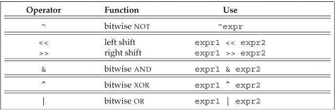

[toc]

## 前言 ##

2011新标准的目标：

- Make the language more uniform and easier to teach and to learn
- Make the standard libraries easier, safer, and more efficient to use
- Make it easier to write efficient abstractions and libraries

GNU compiler, version 4.7.0. There are only a few features used in this book that this compiler does not yet implement: inheriting constructors, reference qualifiers for member functions, and the regular-expression library.

## 1. 入门  ##

### 1.1. 编写一个简单的C++程序

```cpp
    int main()
    {
        return 0;
    }
```

On most systems, the value returned from main is a status indicator. 返回0表示成功。A nonzero return has a meaning that is defined by the system.

编译：

```
$ g++ -o prog1 prog1.cc
```

If the `-o prog1` is omitted, the compiler generates an executable named `a.out` on UNIX systems and `a.exe` on Windows. (Note: Depending on the release of the GNU compiler you are using, you may need to specify `-std=c++0x` to turn on C++ 11 support.) 

### 1.2. 输入输出初探

C++没有输入输出语句。使用标准库处理IO。这里使用`iostream`库。库中有两个类`istream`和`ostream`。

库定义了4个IO对象。

|  |  | 类型 |
|--|--|-----|
| cin | 标准输入 | istream |
| cout | 标准输出 | ostream |
| cerr | 标准错误 | ostream |
| clog | | ostream |

例子：

```cpp
    #include <iostream>
    int main()
    {
        std::cout << "Enter two numbers:" << std::endl;
        int v1 = 0, v2 = 0;
        std::cin >> v1 >> v2;
        std::cout << "The sum of " << v1 << " and " << v2
        <<" is " << v1 + v2 << std::endl;
        return 0;
    }
```

`#include <iostream>`中，`<>`之间的是头。

输出运算符：`<<`。

```cpp
std::cout << "Enter two numbers:" << std::endl;
```

左值必须是`ostream`对象。返回值是左值。

`endl`是manipulator。它的作用是结束当前行，刷出缓存。

> 命名空间。注意到使用了`std::cout`和`std::endl`，而非`cout`和`endl`。`std::`前缀表示`cout`和`endl`定义在命名空间`std`中。

读取：

```cpp
std::cin >> v1 >> v2;
```

`>>`是输入运算符。左值必须是`istream`。返回值是**左**值。

### 1.3 注释

`//`和`/* */`。

### 1.4 流控制

#### 1.4.1 while

```cpp
    while(val <= 10)  {
        sum += val;
        ++val;
    }
```

#### 1.4.2. for

```cpp
    for(int val = 1; val <= 10; ++val)
        sum += val;
```

#### 1.4.3. 读取数量不定的输入

```cpp
    #include <iostream>
    int main()
    {
        int sum = 0, value = 0;
        // 读取到文件结尾
        while(std::cin >> value)
        	sum += value;
        std::cout << "Sum is: " << sum << std::endl;
        return0;
    }
```

`>>`返回左值，这里是`std:cin`。即while测试的是`std:cin`。在条件中使用`istream`，效果是测试流的状态。如果流是有效的（未发生错误），测试通过。当遇到文件结尾，或遇到无效输入时（如读到的不是整数），流无效。`istream`处于错误状态时条件为false。

### 1.5 类

假设我们已经在头文件`Sales_item.h`中定义了一个类`Sales_item`。

头文件的后缀一般是`.h`，但也有人用`.H`, `.hpp`, or `.hxx`。标注库的头一般没有任何后缀。编译器不在于头文件名的格式。

#### 1.5.1. `Sales_item`类

定义一个类的变量：

```cpp
	Sales_item item;
    #include <iostream>
    #include"Sales_item.h"
    int main()
    {
        Sales_item book;
        std::cin >> book;
        std::cout << book << std::endl;
        return 0;
    }
```

来自标准库的头用尖括号包围。库之外的头又双引号包围。

```cpp
    #include <iostream>
    #include"Sales_item.h"
    int main()
    {
        Sales_item item1, item2;
        std::cin >> item1 >> item2;  // read a pair of transactions
        std::cout << item1 + item2 << std::endl; // print their sum
        return 0;
    }
```

#### 1.5.2 成员函数（方法）初探

```cpp
    #include <iostream>
    #include "Sales_item.h"
    int main()
    {
        Sales_item item1, item2;
        std::cin >> item1 >> item2;
        // 先检查item1和item2是同一本书
        if (item1.isbn() == item2.isbn()) {
            std::cout << item1 + item2 << std::endl;
            return 0;  // indicate success
        } else {
            std::cerr << "Data must refer to same ISBN" << std::endl;
            return -1;  // indicate failure
        }
    }
```

## I. ------- 基础 ------

## 3. 字符串、向量、数组

`string`是变长字符串。`vector`是变长集合。Associated with string and vector are companion types known as iterators, which are used to access the characters in a string or the elements in a vector.

### 3.1. 命名空间`using`声明

之前使用cin时显式列出了库名，如std::cin。using可以让使用cin时不加限定。18.2.2给出了使用命名空间中名字的另一种方式。

`using`声明的形式：
```cpp
	using namespace::name;
```

例子：
```cpp
    #include <iostream>
    using std::cin;
    int main()
    {
        int i;
        cin >> i;  // ok: cin is a synonym for std::cin
        cout << i;  // error: no using declaration; we must use the full name
        std::cout << i; // ok: explicitly use cout from namepsace std
        return 0;
    }
```

每个名字都需要一个`using`声明：

```cpp
    using std::cin;
    using std::cout;
    using std::endl;
```

头文件不要使用using声明！在头中使用using声明，任何包含头的程序都将得到相同的using声明。可能引起冲突。

### 3.2. 库string类型

string是变长字符序列。要使用string类型，必须包含string头。string定义在std命名空间。
```cpp
    #include <string>
    using std::string;
```

本节介绍基本的string操作。§ 9.5将介绍更多。

#### 3.2.1. 定义和初始化string

实例化string的常见方式：

```cpp
    string s1; // 默认初始化，s1是空串
    string s2(s1); // s2是s1的拷贝
    string s2 = s1; // 等价于s2(s1)
    string s3("value"); // s3是字符串字面量的拷贝，不包括null
    string s2 = "value"; // 等价于s3("value")
    string s4(n, 'c'); // 重复c字符n次
```

##### 直接初始化和拷贝初始化

使用`=`是拷贝初始化，by copying the initializer on the right-hand side into the object being created. 如果省略`=`，使用直接初始化。

```cpp
    string s5= "hiya";  // 拷贝初始化
    string s6("hiya");  // 直接初始化
    string s7(10, 'c');  // 直接初始化; s7 is cccccccccc
```

#### 3.2.2. string运算

Table 3.2(overleaf) lists the most common string operations.


##### 读写string

```cpp
    // Note: #include and using declarations mustbe added to compile this code
    int main()
    {
        string s;  // empty string
        cin >> s;  // read a whitespace-separated string into s
        cout << s << endl; // write s to the output
        return 0;
    }
```

The string input operator reads and discards any leading whitespace (e.g., spaces, newlines, tabs). It then reads characters until the next whitespace character is encountered.

Thus, we can chain together multiple reads or writes:

```cpp
    string s1,s2;
    cin >> s1 >> s2; // read first input into s1, second into s2
    cout << s1 << s2 << endl; // write both strings
```

##### 读取数量不定的string

```cpp
    int main()
    {
        string word;
        while(cin >> word)  // read until end-of-file
            cout << word << endl; // write each word followed by a new line
        return 0;
    }
```

##### 使用getline读入整行

Sometimes we do not want to ignore the whitespace in our input. In such cases, we can use the `getline` function instead of the `>>` operator. The `getline` function takes an input stream and a string. This function reads the given stream up to and including the first newline and stores what it read—not including the newline—in its string argument. After getline sees a newline, even if it is the first character in the input, it stops reading and returns. If the first character in the input is a newline, then the resulting stringis the empty string.

与输入运算符一样，`getline`返回`istream`。As a result, we can use `getline` as a condition just as we can use the input operator as a condition (§ 1.4.3, p. 14). For example, we can rewrite the previous program that wrote one word per line to write a line at a time instead:

```cpp
    int main()
    {
        string line;
        // read input a line at a time until end-of-file
        while(getline(cin, line))
            cout << line << endl;
        return 0;
    }
```

##### empty和size

`empty`是string的成员函数，返回bool。

```cpp
// readinput a line at a time and discard blank lines
while (getline(cin, line))
	if(! line.empty())
		cout << line << endl;
```

`size`成员函数返回string长度。
```cpp
string line;
// read input a line at a time and print lines that are longer than 80 characters
while (getline(cin, line))
	if( line.size() > 80)
		cout << line << endl;
```

##### `string::size_type`类型

`size` returns a `string::size_type` value.

string类（和其他库类）定义了一些companion类。这些companion类使得库可以独立于机器。

Although we don’t know the precise type of `string::size_type`, 但可以确定它是一个无符号整数，达到可以容纳任何字符串的长度。用以存储字符串长度的变量的类型应该是`string::size_type`。新标准下，可以用`auto`或`decltype`：
```cpp
auto len= line.size(); // len has type string::size_type
```

因为size返回无符号数，混合有符号和无符号数的表达式可能产生意外结果(§ 2.1.2)。For example, if n is an int that holds a negative value, then `s.size() < n` will almost surely evaluate as true. It yields true because the negative value in nwill convert to a large unsigned value.

##### 比较字符串

The equality operators (`==`and `!=`) test whether two strings are equal or unequal, respectively. Two strings are equal if they are the same length and contain the same characters. The relational operators `<`, `<=`, `>`, `>=` test whether one string is less than, less than or equal to, greater than, or greater than or equal to another.

##### Assignment for strings

To this end, most of the library types support **assignment**. In the case of strings, we can assign one string object to another:

```cpp
    string st1(10,'c'), st2; // st1 is cccccccccc; st2 is an empty string
    st1 = st2; // assignment: replace contents of st1 with a copy of st2
    // both st1 and st2 are now the empty string
```

##### 两个字符串加

连接两个字符串，产生新字符串：
```cpp
string s1 = "hello, ", s2 = "world\n";
string s3 = s1 + s2;  // s3 is hello, world\n
s1 += s2;  // equivalent to s1 = s1 + s2
```

##### 字符串和字面量加

```cpp
string s1= "hello", s2 = "world"; // no punctuation in s1 or s2
string s3 = s1 + ", " + s2 + '\n';
```

`+`的操作数至少有一个需要是string：

```cpp
string s4= s1 + ", ";  // ok: adding a string and a literal
string s5 = "hello" + ", ";  // error: no string operand
string s6 = s1 + ", " + "world"; // ok: each + has a string operand
string s7 = "hello" + ", " + s2; // error: can't add string literals
```

{{字符串字面量没有+运算符？}}

记住，字符串字面量与string不是一回事。

#### 3.2.3. 处理string中的字符

下列函数定义在`cctype`头：

Table 3.3. cctype Functions


> `C++`版本的C库头
 `C++` 库使用了C库。C库以`.h`结尾。`C++`版本的这些头没有`.h`，并增加了c前缀。c表示头是C库的一部分。
因此cctype与ctype.h的内容相同。c开头的头定义在std命名空间。但.h版没有。
一般来说，`C++`程序应该使用没有.h版本的头。

##### 用Range-Based for处理每一个字符

If we want to do something to every character in a string, by far the best approach is to use a statement introduced by the new standard: the **range for** statement. This statement iterates through the elements in a given sequence and performs some operation on each value in that sequence. The syntactic form is

```cpp
    for (declaration: expression)
        statement
```

例子：
```cpp
    string str("somestring");
    // print the characters in str one character to a line
    for (auto c : str)  // for every char in str
    	cout << c << endl;  // print the current character followed by a newline
```

##### Using a Range for to Change the Characters in a string

如果向改变string中的字符，需要将循环变量做成引用类型：

```cpp
    string s("HelloWorld!!!");
    // convert s to uppercase
    for (auto &c : s)
    	c= toupper(c);
    cout << s << endl;
```

##### 只处理部分字符

有两种方式访问string中的单个字符：可以使用下标或迭代器。We’ll have more to say about iterators in § 3.4 and in Chapter 9.

下标运算符（`[]`运算符）取`string::size_type`值。The operator returns a reference to the character at the given position. `s[0]` is the first character, and the last character is in `s[s.size() - 1]`.

The result of using an index outside this range is undefined. By implication, subscripting an empty string is undefined.

如果下标是一个**有符号类型**，值会先被转换为`string::size_type`表示的无符号类型。

So long as the string is not const, we can assign a new value to the character that the subscript operator returns. For example, we can capitalize the first letter as follows:
```cpp
    string s("somestring");
    if (!s.empty()) // make sure there's a character in s[0]
        s[0] = toupper(s[0]);
```

##### 使用下标迭代

```cpp
for (decltype(s.size()) index = 0; index != s.size() && !isspace(s[index]); ++index)
	s[index]= toupper(s[index]); // capitalize the current character
```

### 3.3 库vector类型

A vector is a collection of objects, all of which have the same type. Every object in the collection has an associated index, which gives access to that object.

需要包含vector头：

```cpp
    #include <vector>
    using std::vector;
```

vector是类模板。C++中有类模板和方法模板。

模板自身不是函数或类。可以将它们看做生成类或函数的编译器指令。编译器从模块创建类或函数的过程称为instantiation。When we use a template, we specify what kind of class or function we want the compiler to instantiate.

For a class template, we specify which class to instantiate by supplying additional information, the nature of which depends on the template. How we specify the information is always the same: We supply it inside a pair of angle brackets following the template’s name. In the case of vector, the additional information we supply is the type of the objects the vector will hold:

```cpp
    vector<int> ivec;  // ivec holds objects of type int
    vector<Sales_item> Sales_vec; // holds Sales_items
    vector<vector<string>> file;  // vector whose elements are vectors
```

上面的例子中，编译器会从vector模板产生三种类型：`vector<int>`, `vector<Sales_item>`和`vector<vector<string>>`。

We can define vectors to hold objects of most any type. 因为引用不是对象，因此不能有引用类型的向量。向量的元素可以也是向量。

> 注意早期C++，定义vector的vector有不同的语法。In the past, we had to supply a space between the closing angle bracket of the outer vectorand its element type—`vector<vector<int> >` rather than `vector<vector<int>>`.

#### 3.3.1. 定义和初始化vector

```cpp
	vector<T> v1; // 默认初始化，v1是空的
	vector<T> v2(v1); // v2是v1的拷贝。必须具有相同类型。
    vector<T> v3(n, val);
    vector<T> v4(n);
    vector<T> v5{a,b,c,...};
    vector<T> v5 = {a,b,c,...}; // 等价于v5{a,b,c,...}
```
We can default initialize a vector(§ 2.2.1, p. 44), 创建一个空向量：

可以在运行时向向量添加元素。

##### 列表初始化一个向量

新标准引入列表初始化：

```cpp
	vector<string> articles = {"a", "an", "the"};
```

使用拷贝初始化，只能提供一个值。When we supply an in-class initializer, we must either use copy initialization or use curly braces. 用列表值事只能用大括号不能用中括号。

```cpp
    vector<string> v1{"a","an", "the"};  // list initialization
    vector<string> v2("a", "an", "the");  // error
```

##### 创建特定数量的元素

初始化指定数量的元素：

```cpp
    vector<int> ivec(10,-1);  // ten int elements, each initialized to -1
    vector<string> svec(10, "hi!"); // ten strings; each element is "hi!"
```

##### Value Initialization

可以省略值，值提供大小。In this case the library creates a value-initialized element initializer for us. This library-generated value is used to initialize each element in the container. The value of the element initializer depends on the type of the elements stored in the vector.

如果元素是内建类型，如`int`，则元素初始化器是0。If the elements are of a class type, such as string, then the element initializer is itself default initialized:

```cpp
    vector<int> ivec(10);  // ten elements, each initialized to 0
    vector<string> svec(10); // ten elements, each an empty string
```

There are two restrictions on this form of initialization: 第一个限制是，一些类要求我们必须提供一个显式的初始化器。If our vector holds objects of a type that we cannot default initialize, then we must supply an initial element value; it is not possible to create vectors of such types by supplying only a size.

The second restriction is that when we supply an element count without also supplying an initial value, we must use the direct form of initialization:

```cpp
	vector<int> vi = 10;  // error: must use direct initialization to supply a size
```

##### List Initializer or Element Count?

In a few cases, what initialization means depends upon whether we use curly braces or parentheses to pass the initializer(s). For example, when we initialize a `vector<int>` from a single int value, that value might represent the vector’s size or it might be an element value. Similarly, if we supply exactly two int values, those values could be a size and an initial value, or they could be values for a two-element vector. We specify which meaning we intend by whether we use curly braces or parentheses:

```cpp
    vector<int> v1(10);  // v1 has ten elements with value 0
    vector<int> v2{10};  // v2 has one element with value 10
    vector<int> v3(10, 1); // v3 has ten elements with value 1
    vector<int> v4{10, 1}; // v4 has two elements with values 10 and 1
```

When we use parentheses, we are saying that the values we supply are to be used to construct the object. Thus, v1 and v3 use their initializers to determine the vector’s size, and its size and element values, respectively. 

When we use curly braces, {...}, we’re saying that, if possible, we want to list initialize the object. That is, if there is a way to use the values inside the curly braces as a list of element initializers, the class will do so. Only if it is not possible to list initialize the object will the other ways to initialize the object be considered. The values we supply when we initialize v2 and v4 can be used as element values. These objects are list initialized; the resulting vectors have one and two elements, respectively.

On the other hand, if we use braces and there is no way to use the initializers to list initialize the object, then those values will be used to construct the object. For example, to list initialize a vector of strings, we must supply values that can be used as strings. In this case, there is no confusion about whether to list initialize the elements or construct a vectorof the given size:

```cpp
    vector<string> v5{"hi"};// list initialization: v5 has one element
    vector<string> v6("hi"); // error: can't construct a vector from a string literal
    vector<string> v7{10};  // v7 has ten default-initialized elements
    vector<string> v8{10, "hi"}; // v8 has ten elements with value "hi"
```

Although we used braces on all but one of these definitions, only v5 is list initialized. In order to list initialize the vector, the values inside braces must match the element type. We cannot use an `int` to initialize a string, so the initializers for v7 and v8 can’t be element initializers. If list initialization isn’t possible, the compiler looks for other ways to initialize the object from the given values.

#### 3.3.2. 向向量添加元素

用vector成员方法`push_back`添加元素。

```cpp
    vector<int> v2;  // 空向量
    for (int i = 0; i != 100; ++i)
    	v2.push_back(i);  // append sequential integers to v2
```

因为向量的增长是高效的，一般不需要指定向量为特定大小，**指定了反而有性能问题**。

如果在循环中给向量添加内容，循环就不能用range for。

#### 3.3.3.向量其他操作


```cpp
    vector<int> v{1,2,3,4,5,6,7,8,9};
    for(auto &i : v)  // for each element in v (note: i is a reference)
    	i*= i;  // square the element value
    for (auto i : v)  // for each element in v
    	cout << i << " "; // print the element
    cout << endl;
```

size()返回值是`size_type`。

```cpp
    vector<int>::size_type // ok
    vector::size_type // error
```

下标的类型也是`size_type`。注意其无符号性。

下标不会增加元素。下面的写法是错误的：

```cpp
    vector<int> ivec;  // empty vector
    for (decltype(ivec.size()) ix = 0; ix != 10; ++ix)
    	ivec[ix]= ix;  // disaster: ivec has no elements
```

要用push_back：

```cpp
    for (decltype(ivec.size())ix = 0; ix != 10; ++ix)
        ivec.push_back(ix);  // ok: adds a new element with value ix
```

即，只能用下标访问存在的元素！

### 3.4 介绍Iterators

**不是所有容器元素都支持下标范围**，但基本都支持迭代器。

As with pointers, an iterator may be valid or invalid. A valid iterator either denotes an element or denotes a position one past the last element in a container. All other iterator values are invalid.

#### 3.4.1. 使用迭代器

```cpp
	// b表示第一个元素，e表示最后一个元素
	auto b = v.begin(), e = v.end(); // b and e have the same type
```

The iterator returned by end is often referred to as the off-the-end iterator or abbreviated as “the end iterator.” If the container is empty, begin returns the same iterator as the one returned by end.

可以使用`==`或`!=`比较迭代器。如果迭代器指向相同或**都指向end**则相等。

解引用无效指针的结果是不定的。

不能在range for过程中更改向量长度。改变向量长度也会使向量所有迭代器失效。更多分析见§ 9.3.6。

##### 移动迭代器

使用`++`移到下一个元素。

```cpp
    // 遍历s直到结尾或空白符
    for (auto it = s.begin(); it != s.end() && !isspace(*it); ++it)
    	*it= toupper(*it); // capitalize the current character
```

##### 迭代器类型

`iterator`和`const_iterator`表示迭代器的实际类型：

```cpp
    vector<int>::iterator it;
    string::iterator it2;
    vector<int>::const_iterator it3;
    string::const_iterator it4;
```

`const_iterator`类似于const指针，只能读元素，不能写元素。`iterator`类型的对象可以读写。如果向量或string是**常量**，可能值只能用`const_iteratort`。With a nonconst vectoror string, we can use either `iterator` or `const_iterator`.

##### begin和end运算符

begin和end的返回值取决于它们操纵的对象是否是const。If the object is const, then begin and end return a `const_iterator`; if the object is not const, they return `iterator`:

```cpp
    vector<int> v;
    const vector<int> cv;
    auto it1 = v.begin();  // it1的类型是vector<int>::iterator
    auto it2 = cv.begin(); // it2的类型是vector<int>::const_iterator
```

新标准引入两个新方法`cbegin`和`cend`，它们总是返回`const_iterator`：

```cpp
	auto it3= v.cbegin(); // it3的类型是vector<int>::const_iterator
```

##### 组合解引用和成员访问

解引用一个迭代器，得到迭代器指向的对象。接着我们可能会访问成员：

```cpp
	(*it).empty()
```

`*it`外的括号是必需的。

`->`可以简化上面的表达式。`it->mem`等价于`(* it).mem`。

```cpp
    // print each line in text up to the first blank line
    for (auto it = text.cbegin(); it!= text.cend() && !it->empty(); ++it)
        cout<< *it << endl;
```

#### 3.4.2. 迭代器算术

##### 迭代器的算术

string和向量的迭代器还支持`<`, `<=`, `>`, `>=`。

迭代器可以做减法。结果是有符号整数，其类型是`difference_type`。向量和string都定义了`difference_type`。有符号，因为减法可能产生负数。


##### 使用迭代器算术

例子：二分查找。

```cpp
    // text mustbe sorted
    // beg and end will denote the range we're searching
    auto beg = text.begin(), end = text.end();
    auto mid = text.begin() + (end - beg)/2; // original midpoint
    // while there are still elements to look at and we haven't yet found sought
    while (mid != end && *mid != sought) {
        if(sought < *mid)  // is the element we want in the first half?
        	end = mid;  // if so, adjust the range to ignore the second half
        else  // the element we want is in the second half
        	beg = mid + 1;  // start looking with the element just after mid
        mid= beg + (end - beg)/2;  // new midpoint
    }
```

### 3.5 数组

数组是固定大小的。

#### 3.5.1 定义和初始化内建数组

数组是复合类型。数组的说明符形如`a[d]`，其中a是变量名，d是维数。维数必须大于0。维数必须在编译期可知，即维数必须是**常量表达式**（§ 2.4.4）：

```cpp
    unsigned cnt = 42;  // not a constant expression
    constexpr unsigned sz = 42; // constant expression
    int arr[10];  // array of ten ints
    int *parr[sz];  // array of 42 pointers to int
    string bad[cnt];  // 错误: cnt is not a constant expression
    string strs[get_size()]; // ok if get_size is constexpr, error otherwise
```

默认，数组中的元素会被默认初始化

> 警告：As with variables of built-in type, a default-initialized array of built-in type that is defined inside a function will have undefined values.

数组存放对象。因此没有引用的数组。

##### 显式初始化数组元素

可以列表初始化数组。此时可以省略维数。如果指定了维数，初始化器的长度不能大于维数。如果维数大于初始化器长度，剩余的值将value initialized (§ 3.3.1)：

```cpp
    const unsigned sz = 3;
    int ia1[sz] = {0, 1, 2};  // array of three ints with values 0, 1, 2
    int a2[] = {0, 1, 2};  // an array of dimension 3
    int a3[5] = {0, 1, 2};  // equivalent to a3[] = {0, 1, 2, 0, 0}
    string a4[3] = {"hi", "bye"}; // same as a4[] = {"hi","bye", ""}
    int a5[2] = {0,1,2};  // error: too many initializers
```

##### 字符数组的特殊性

字符数组有一种额外的初始化方式：可以用字符串字面量初始化。注意字符串字面量尾部有一个空字符，该字符也会拷贝进数组：

```cpp
    char a1[]= {'C', '+', '+'};  // list initialization, no null
    char a2[] = {'C', '+', '+', '\0'}; // list initialization, explicit null
    char a3[] = "C++";    // nullterminator added automatically
    const char a4[6] = "Daniel";  // error: no space for the null!
```

##### 没有拷贝或赋值（Assignment）

不能将数组初始化为另一个数组的拷贝。也不能将一个数组赋给另一个数组。

```app
    int a[]= {0, 1, 2}; // array of three ints
    int a2[] = a;  // error: cannot initialize one array with another
    a2 = a;  // error: cannot assign one array to another
```

> 警告：Some compilers allow array assignment as a compiler extension. It is usually a good idea to avoid using nonstandard features. Programs that use such features, will not work with a different compiler.

##### 理解复杂的数组声明

指针的数组。数组的指针或引用。

```cpp
int *ptrs[10]; // ptrs是一个数组，元素是指向int的指针
int &refs[10] = /* ? */; // 错误！引用没有数组
int (*Parray)[10] = &arr; // Parray指向一个数组
int (&arrRef)[10] = arr; // arrRef指向一个数组
```

**type modifiers默认从右向左绑定**。但Parray，更容易的方式是从内向外读，再从右向左。We start by observing that the parentheses around `*Parray` mean that Parray is a pointer.

可以同时使用多个type modifiers：
```cpp
int *(&arry)[10] = ptrs; // arry是一个引用，指向一个函数是个指针的数组
```

Reading this declaration from the inside out, we see that arry is a reference. Looking right, we see that the object to which arry refers is an array of size 10. Looking left, we see that the element type is pointer to int. Thus, arry is a reference to an array of ten pointers.


#### 3.5.2. 访问数组中的元素

可以通过range for或下标访问数组元素。

下标类型是`size_t`。`size_t` is a machine-specific unsigned type that is guaranteed to be large enough to hold the size of any object in memory. `size_t`定义在`cstddef`头，它是`stddef.h`头的C++版。

```cpp
    // count the number of grades by clusters of ten: 0--9, 10--19, ... 90--99, 100
    unsigned scores[11] = {}; // 11 buckets, all value initialized to 0
    unsigned grade;
    while (cin >> grade) {
    	if(grade <= 100)
    		++scores[grade/10]; // increment the counter for the current cluster
    }

    for (auto i : scores)  // for each counter in scores
    	cout << i << " ";  // print the value of that counter
    cout << endl;
```

由编程者负责检查下标范围。

#### 3.5.3. 指针和数组

C++中指针和数组关系紧密。特别的，当我们使用数组时，**编译器一般会将数组转换为指针**。

数组有一个特殊的地方，当使用数组时，编译器自动将数组替换为指向第一个元素的指针：

```cpp
	string *p2 = nums;  // equivalent to p2 = &nums[0]
```

对数组的操作实际是在操作指针。例如，如果将数组作为一个变量的初始化器。推理出的类型是指针，不是数组：

```cpp
	int ia[] = {0,1,2,3,4,5,6,7,8,9}; // ia is an array of ten ints
	auto ia2(ia); // ia2 is an int* that points to the first element in ia
	ia2 = 42;  // error: ia2 is a pointer, and we can't assign an int to a pointer
```

编译器实际认为：

```cpp
	auto ia2(&ia[0]);  // now it's clear that ia2 has type int*
```

It is worth noting that this conversion does not happen when we use decltype. The type returned by `decltype(ia)` is array of ten ints:


```cpp
    // ia3 isan array of ten ints
    decltype(ia) ia3 = {0,1,2,3,4,5,6,7,8,9};
    ia3 = p;  // error: can't assign an int* to an array
    ia3[4] = i; // ok: assigns the value of i to an element in ia3
```

##### 指针是迭代器

指向数组的指针与向量的迭代器具有相同操作。

```cpp
    int arr[] = {0,1,2,3,4,5,6,7,8,9};
    int *p = arr; // p points to the first element in arr
    ++p;  // p points to arr[1]
```

获取off-the-end指针。如果数组有10个元素：
```cpp
	int *e= &arr[10]; // pointer just past the last element in arr
    for (int*b = arr; b != e; ++b)
		cout<< *b << endl; // print the elements in arr
```

##### begin和end库函数

新标准引入新的库函数：

```cpp
    int ia[]= {0,1,2,3,4,5,6,7,8,9}; // ia is an array of ten ints
    int *beg = begin(ia); // pointer to the first element in ia
    int *last = end(ia);  // pointer one past the last element in ia
```

这两个函数定义在`iterator`头。

##### 指针算术

数组的指针，像迭代器一样，支持增加、比较、加一个整数、两指针相减。

```cpp
    constexpr size_t sz = 5;
    int arr[sz] = {1,2,3,4,5};
    int *ip = arr; // equivalent to int *ip = &arr[0]
    int *ip2 = ip + 4; // ip2 points to arr[4], the last element in arr

    auto n = end(arr) - begin(arr); // n is 5, the number of elements in arr
```

两指针相减的结果是`ptrdiff_t`。Like `size_t`, the `ptrdiff_t` type is a machine-specific type and is defined in the `cstddef` header. 因为指针相减可能为负数，`ptrdiff_t`是有符号整数。

不能对两个不相关对象的指针使用关系运算符：

```cpp
    int i= 0, sz = 42;
    int *p = &i, *e = &sz;
    // undefined: p and e are unrelated; comparison is meaningless!
    while (p < e)
```

Although the utility may be obscure at this point, it is worth noting that pointer arithmetic is also valid for null pointers and for pointers that point to an object that is not an array. In the latter case, the pointers must point to the same object, or one past that object. If p is a null pointer, we can add or subtract an integral constant expression (§ 2.4.4, p. 65) whose value is 0 to p. We can also subtract two null pointers from one another, in which case the result is 0.

##### 指针和下标

之前说过，使用数组名时，实际用的是指向数组第一个元素的指针。

```cpp
int i= ia[2];  // ia is converted to a pointer to the first element in ia
// ia[2] fetches the element to which (ia +2) points
int *p = ia;  // p points to the first element in ia
i = *(p + 2);  // equivalent to i = ia[2]
```

可以对指针使用下标，只要它指向数组元素：

```cpp
    int *p= &ia[2];  // p points to the element indexed by 2
    int j = p[1];  // p[1] is equivalent to *(p + 1),
    // p[1] is the same element as ia[3]
    int k = p[-2];  // p[-2] is the same element as ia[0]
```

> Unlike subscripts for vector and string, the index of the built-in subscript operator is not an unsigned type.

#### 3.5.4. C风格的字符字符串

尽管支持，但不应该使用。C风格的字符串导致了很多问题。

Character string literals are an instance of a more general construct that C++ inherits from C: C-style character strings. C风格的字符串不是一种类型。它们只是字符字符串的一种便利表示。这种风格的字符串存放在字符数组中，以空串结尾。我们一般用指针操纵字符串。

C的字符串库定义在cstring头。传给这些方法的指针必须以null结尾。

##### 比较字符串

比较C风格的字符串与比较库string不同。比较string用普通关系运算符：

```cpp
    string s1= "A string example";
    string s2 = "A different string";
    if (s1 < s2)  // false: s2 is less than s1
```

但不能用于比较C风格字符串：

```cpp
    const char ca1[] = "A string example";
    const char ca2[] = "A different string";
    if (ca1 < ca2)  // undefined: compares two unrelated addresses
```

因此上面实际比较的是两个`const char*`值。由于这两个值是两个不同对象的地址，因此结果是不确定的。

比较C风格字符串用strcmp函数：

```cpp
	if (strcmp(ca1,ca2) < 0) // same effect as string comparison s1 < s2
```

##### 调用者负责最终字符串的大小

如果ca1和ca2是两个字符数组。`ca1 + ca2`是在让两个指针相加，是错误的。即，+不是C风格字符串的拼接运算符。

Instead we can use `strcat` and `strcpy`. However, to use these functions, we must pass an array to hold the resulting string. 传入的数组必须大到能容纳产生的字符串，包括结尾的null。

```cpp
// disastrous if we miscalculated the size of largeStr
strcpy(largeStr, ca1);  // copies ca1 into largeStr
strcat(largeStr, " ");  // adds a space at the end of largeStr
strcat(largeStr, ca2);  // concatenates ca2 onto largeStr
```

#### 3.5.5 与旧代码交互

C++ may have to interface to code that uses arrays and/or C-style character strings. The C++ library offers facilities to make the interface easier to manage.

##### 混用库string和C风格字符串

之前我们看到可以使用字符串字面量初始化一个string：
```cpp
	string s("HelloWorld");  // s holds Hello World
```

更普遍的，使用字符串字面量的地方，都可以使用null结尾的字符数组：

- 可以使用null结尾字符数组初始化或赋值一个string
- null结尾字符数组可以作为+运算的一个操作数，但不能两个都是字符数组。

反过来不行：在需要使用C风格字符串的地方，不能直接使用库string。例如，不能用string初始化一个字符指针。但可以使用string的成员函数`c_str`实现：

```cpp
    char *str = s; // error: can't initialize a char* from a string
    const char *str = s.c_str(); // ok
```

注意返回值是`const char*`，防止我们改变数组内容。

> 注意，如果后面改变了s的值，数组将失效。If a program needs continuing access to the contents of the array returned by `str()`, the program must copy the array returned by `c_str`.

##### 使用数组初始化向量

数组初始化向量，指定数组的begin和end：

```cpp
    int int_arr[] = {0, 1, 2, 3, 4, 5};
    // ivec has six elements; each is a copy of the corresponding element in int_arr
    vector<int> ivec(begin(int_arr), end(int_arr));
```

两个指针表明了使用数组的哪些部分初始化向量。于是，可以只指定数组的一部分：

```cpp
    // copies three elements: int_arr[1], int_arr[2], int_arr[3]
    vector<int> subVec(int_arr + 1, int_arr + 4);
```

### 3.6. 多维数组

C++没有多维数组，只有数组的数组。

```cpp
    int ia[3][4];// 数组有3个元素；每个元素是一个有4个元素的数组
    int arr[10][20][30] = {0}; // initialize all elements to 0
```

二维数组，第一维一般称为行，第二维一般称为列。

##### 初始化多维数组的元素

```cpp
    int ia[3][4] = { // three elements; each element is an array of size 4
        {0, 1, 2, 3},  // initializers for the row indexed by 0
        {4,5, 6, 7},  // initializers for the row indexed by 1
        {8,9, 10, 11}  // initializers for the row indexed by 2
    };
```

嵌套的括号是可选的。下面写法也行，只是可读性差：
```cpp
    // equivalent initialization without the optional nested braces for each row
    int ia[3][4] = {0,1,2,3,4,5,6,7,8,9,10,11};
```

可以只初始化部分：
```cpp
    // explicitlyinitialize only element 0 in each row
    int ia[3][4] = {{ 0 }, { 4 }, { 8 }};
```

The remaining elements are value initialized in the same way as ordinary, singledimension arrays (§ 3.5.1).

##### 下标

```cpp
    // assignsthe first element of arr to the last element in the last row of ia
    ia[2][3] = arr[0][0][0];
    int (&row)[4] = ia[1]; // binds row to the second four-element array in ia
```

记得数组下标类型是`size_t`。

##### range for

```cpp
	size_t cnt = 0;
	for (auto &row : ia) // for every element in the outer array
		for(auto &col : row) { // for every element in the inner array
			col= cnt;  // give this element the next value
			++cnt;  // increment cnt
		}

但下面的程序不会编译：
```cpp
    for (auto row : ia)
        for(auto col : row)
```

这里的`row`的类型是`int*`。此时内层for循环就无效了，`int*`是不能被遍历的。

> 使用范围for遍历多维数组时，除了最内层循环之外的循环的循环变量都必须是引用。

##### 指针与多维数组

与其他数组一样，当使用多维数组时，会被自动转换为指向数组第一个元素的指针。

```cpp
    int ia[3][4]; // array of size 3; each element is an array of ints of size 4
    int (*p)[4] = ia; // p指向一个有4个整数的数组
    p = &ia[2]; // p now points to the last element in ia
```

利用`auto`和`decltype`可以避免每次都要写指向数组的指针的类型：
```cpp
    // print the value of each element in ia, with each inner array on its own line
    // p points to an array of four ints
    for (auto p = ia; p != ia + 3; ++p) {
    	for(auto q = *p; q != *p + 4; ++q)
    		cout<< *q << ' ';
    	cout<< endl;
    }
```
利用库`begin`和`end`：

```cpp
    // p points to the first array in ia
    for(auto p = begin(ia); p != end(ia); ++p) {
        // q points to the first element in an inner array
        for(auto q = begin(*p); q != end(*p); ++q)
        cout<< *q << ' '; // printsthe int value to which q points
        cout<< endl;
    }
```

##### 类型别名简化到多维数组的指针

A type alias can make it easier to read, write, and understand pointers to multidimensional arrays. For example:

```cpp
    using int_array = int[4]; // new style type alias declaration;
    typedef int int_array[4]; // equivalent typedef declaration;
    // print the value of each element in ia, with each inner array on its own line
    for (int_array *p = ia; p != ia + 3; ++p) {
        for(int *q = *p; q != *p + 4; ++q)
        	cout<< *q << ' ';
        cout<< endl;
    }
```

## 4. 表达式

### 4.1 基础

#### 4.1.1. 基本概念

理解涉及多个运算符的表达式，需要理解运算符的优先级、结合性，及运算数的求值顺序。

##### 操作数转换

经常需要将操作数从一种类型转换为另一种。尽管转换规则复杂，但多数时候转换并不反直觉。小整数类型（如bool, char, short等）一般会被提升为大整数类型，一般是int。We’ll look in detail at conversions in § 4.11.

##### 运算符重载

The IO library `>>` and `<<` operators and the operators we used with strings, vectors, and iterators are all overloaded operators.

使用重载运算符时，运算符的语义，包括操作数类型及结果取决于运算符的定义。但，操作数数量、优先级、结合性是不能变的。


##### 左值和右值

C++的表达式要么是一个左值，要么是右值。这些概念继承自C。左值可以位于赋值（assignment）的左边，右值位于右边。

Moreover, some expressions yield objects but return them as rvalues, not lvalues. 粗略的讲，当使用右值时，我们用的是它的值（内容）。用作左值时，我们用的是对象的标识（内存中的位置）。

运算符的区别在于，它们需要左值还是右值，以及它们返回左值还是右值。在需要右值时可以使用左值（但有一个例外，见§ 13.6。当使用左值替代右值时，使用的是对象的内容（它的值）。We have already used several operators that involve lvalues.

- 赋值需要一个左值（非常量）作为左操作数，且将左操作数按左值返回（yield）。
- 取地址运算符需要一个左值，and returns a pointer to its operand as an rvalue.
- 内建的解引用和下标运算符，iterator dereference，string and vector subscript operators都产生（yield）左值。
- The built-in and iterator increment and decrement operators require lvalue operands and the prefix versions (which are the ones we have used so far) also yield lvalues.

As we present the operators, we will note whether an operand must be an lvalue and whether the operator returns an lvalue.

Lvalues and rvalues also differ when used with decltype. 当对一个表达式（而不是变量）施加decltype，如果表达式产生左值，结果是引用类型。例如，加入`p`是`int*`。则`decltype(*p)`是`int&`。On the other hand, because the address-of operator yields an rvalue, `decltype(&p)` is `int**`, that is, a pointer to a pointer to type int.

#### 4.1.2. 优先级和结合性

Associativity determines how to group operands with the same precedence.

#### 4.1.3. 求值顺序

Precedence specifies how the operands are grouped. 但它没规定操作数的求值顺序。多数情况下，顺序都是不定的。如：`int i= f1() * f2();`

注意，下面的输出也是不定的！

```cpp
    int i= 0;
    cout << i << " " << ++i << endl; // undefined
```

但有四个运算符的顺序是一定的。&&、||、三元?:、逗号,。

优先级、结合性与求值顺序无关。如`f() + g() * h() + j()`。函数的调用顺序不定。

### 4.2 算术运算符

下面的运算符都是左结合（从左向右）的：一元+，一元-，*，/，%，+，-。

这些运算符的操作数和结果都是右值。As described in § 4.11, operands of small integral types are promoted to a larger integral type, and all operands may be converted to a common type as part of evaluating these operators.

When applied to a pointer or arithmetic value, unary plus returns a (possibly promoted) copy of the value of its operand.

对于多数操作数，bool类型的操作数会被提升为int。

整数的除法返回一个整数。如果商包含小数，截断。
```cpp
    int ival1= 21/6;  // ival1 is 3; result is truncated; remainder is discarded
    int ival2 = 21/7;  // ival2 is 3; no remainder; result is an integral value
```

`%`的操作数必须是整数。

语言的早期版本许诺负数商被向上或向下取整。但新标准要求商向零取整（即截断）。

The modulus operator is defined so that if m and n are integers and n is nonzero, then `(m/n)*n + m%n` is equal to `m`. 隐式的，如果m%n非零，它与m的符号相同。Earlier versions of the language permitted `m%n` to have the same sign as `n` on implementations in which negative `m/n` was rounded away from zero, but such implementations are now prohibited. Moreover, except for the obscure case where `-m` overflows, `(-m)/n` and `m/(-n)` are always equal to `-(m/n)`, `m%(-n)` is equal to `m%n`, and `(-m)%n` is equal to `-(m%n)`. More concretely:

```cpp
21% 6;  /*  resultis 3  */  21/ 6;  /*  resultis 3  */
21% 7;  /*  resultis 0  */  21/ 7;  /*  resultis 3  */
-21 % -8;  /*  resultis -5*/  -21 / -8;  /*  resultis 2  */
21% -5;  /*  resultis 1  */  21/ -5;  /*  resultis -4  */
```

### 4.3 逻辑与关系运算符

关系运算符的操作数是算术或指针类型；逻辑运算符的操作数可以是任何能被够转换为bool类型的类型。这些运算符的返回值都是bool。Arithmetic and pointer operand(s) with a value of zero are false; all other values are true. 操作数和结果都是右值。


##### 相等性测试和bool字面量

`if (val == true) { /* ...  */} // 只有当val等于1时才为true！`

如果val不是bool，true会被转换为val的类型：`if (val== 1) { /* ... */ }`。

所以还是直接写成`if(val)`。

### 4.4. 赋值（Assignment）

赋值的结果是左边的运算符，是一个**左值**。结果是左边运算符的类型。右边运算符的类型转换为左边的。

新标准允许使用大括号初始化列表。

```cpp
	k = {3.14};  // error: narrowing conversion
	vector<int> vi;  // initially empty
	vi = {0,1,2,3,4,5,6,7,8,9};
```

If the left-hand operand is of a built-in type, the initializer list may contain at most one value, and that value must not require a narrowing conversion (§ 2.2.1).

For class types, what happens depends on the details of the class. In the case of vector, the vector template defines its own version of an assignment operator that can take an initializer list. This operator replaces the elements of the left-hand side with the elements in the list on the right-hand side.

#### 赋值是右结合的

```cpp
int ival, jval;
ival = jval = 0; // ok: each assigned 0
```

Because assignment is right associative, the right-most assignment, `jval = 0`, is the right-hand operand of the left-most assignment operator. Because assignment returns its left-hand operand, the result of the right-most assignment (i.e., jval) is assigned to ival.

Each object in a multiple assignment must have the same type as its right-hand neighbor or a type to which that neighbor can be converted (§ 4.11, p. 159).

#### 赋值的优先级低

```cpp
    int i;
    while ((i = get_value()) != 42) {
    	// do something ...
    }
```

#### 复合赋值运算符

```cpp
	+=  -=  *=  /=  %=  // arithmetic operators
	<<=  >>=  &=  ^=  |=  // bitwise operators; see § 4.8 (p. 152)
```

### 4.5 增加减少运算符

The increment (++) and decrement (--) operators provide a convenient notational shorthand for adding or subtracting 1 from an object.

`*pbeg++`等价于`*(pbeg++)`。

求值顺序不定

```cpp
// the behavior of the following loop is undefined!
    while (beg != s.end() && !isspace(*beg))
        *beg = toupper(*beg++);  // 错误：赋值不确定
```

The compiler might evaluate this expression as either
```cpp
    *beg = toupper(*beg); // 相当于左边先求值
    *(beg + 1) = toupper(*beg); // 右边先求值
```

### 4.6 成员访问运算符

`ptr->mem`是`(*ptr).mem`的缩写。省去了括号的烦扰。

### 4.7 条件运算符

```cpp
	cond ? expr1 : expr2;
```

条件运算符的优先级非常低。把它们嵌入复杂表达式，记得加括号。

### 4.8 二进制运算符

二进制运算符的操作数是整数（一些位）。这些运算符允许我们读取或设置特定的位。As we’ll see in § 17.2, we can also use these operators on a library type named bitset that represents a flexibly sized collection of bits.

如果操作数是小整数，会先被提升为大一些的整数（§ 4.11.1）。操作数可以是有符号的或无符号的。



如果操作数有有符号的且为负，则器符号位的处理方式取决于机器。如果左移修改了符号位，结果是未定的。

警告：因为符号位的处理是不定的，强烈建议二进制运算符只操作无符号数。

#### 移位运算符

The built-in meaning of these operators is that they perform a bitwise shift on their operands.

左移运算符在右边填0。右移的行为取决于操作数的类型：如果操作数是无符号的，则在左边插0。如果是有符号的，结果取决于实现：可能拷贝符号位，或插入0。

#### 位移（IO）运算符是左结合的

记得，重载运算符不改变运算符的结合性和优先级。

`cout <<"hi" << " there" << endl;`
等价于：
`((cout<< "hi") << " there" ) << endl;`

### 4.9 sizeof运算符

The sizeof operator returns the size, in bytes, of an expression or a type name. 运算符是右结合的。结果是常量表达式，类型是`size_t`。运算符有两种形式：`sizeof (type)`，`sizeof expr`。

The `sizeof` operator is unusual in that it does not evaluate its operand:

```cpp
    Sales_data data, *p;
    sizeof(Sales_data); // size required to hold an object of type Sales_data
    sizeof data; // size of data's type, i.e., sizeof(Sales_data)
    sizeof p;  // size of a pointer
    sizeof *p;  // size of the type to which p points, i.e., sizeof(Sales_data)
    sizeof data.revenue; // size of the type of Sales_data's revenue member
```

The most interesting of these examples is `sizeof *p`. First, because sizeof is right associative and has the same precedence as *, this expression groups right to left. That is, it is equivalent to `sizeof (*p)`. Second, because sizeof does not evaluate its operand, it doesn’t matter that p is an invalid (i.e., uninitialized) pointer (§ 2.3.2). Dereferencing an invalid pointer as the operand to `sizeof` is safe because the pointer is not actually used. `sizeof` doesn’t need dereference the pointer to know what type it will return.

新标准，we can use the scope operator to ask for the size of a **member** of a class type. Ordinarily we can only access the members of a class through an object of that type. We don’t need to supply an object, because `sizeof` does not need to fetch the member to know its size.

```cpp
	sizeof Sales_data::revenue; // alternative way to get the size of revenue
```

The result of applying `sizeof` depends in part on the type involved:

- sizeof char or an expression of type char is guaranteed to be 1.
- sizeof a reference type returns the size of an object of the referenced type.
- sizeof a pointer returns the size needed hold a pointer.
- sizeof a dereferenced pointer returns the size of an object of the type to which the pointer points; the pointer need not be valid.
- sizeof an array is the size of the entire array. It is equivalent to taking the sizeof the element type times the number of elements in the array. Note that sizeof does not convert the array to a pointer.
- sizeof a string or a vector returns only the size of the fixed part of these types; it does not return the size used by the object’s elements.

```cpp
    // sizeof(ia)/sizeof(*ia) returns the number of elements in ia
    constexpr size_t sz = sizeof(ia)/sizeof(*ia);
    int arr2[sz]; // ok sizeof returns a constant expression § 2.4.4 (p. 65)
```

`sizeof`返回一个常量表达式，we can use the result of a sizeof expression to specify the dimension of an array.

### 4.10. 逗号运算符

The comma operator takes two operands, which it evaluates from left to right. The comma operator guarantees the order in which its operands are evaluated.

The left-hand expression is evaluated and its result is discarded. The result of a comma expression is the value of its right-hand expression. The result is an lvalue if the right-hand operand is an lvalue.

One common use for the comma operator is in a for loop:

```cpp
    vector<int>::size_type cnt= ivec.size();
    // assign values from size... 1 to the elements in ivec
    for(vector<int>::size_type ix = 0; ix!= ivec.size(); ++ix, --cnt)
	    ivec[ix]= cnt;
```

### （未）4.11 类型转换

## 5. 语句

### 5.2. 语句作用域

Variables defined in the control structure are visible only within that statement and are out of scope after the statement ends:

```cpp
    while (int i = get_num()) // 每次循环都要创建和初始化i
        cout<< i << endl;
```

### 5.3 条件语句

```
    if (condition)
        statement

    if (condition)
        statement
    else
        statement2

    switch(ch) {
    case'a':
        ++aCnt;
        break;
    case'e':
        ++eCnt;
        break;
    case'i':
        ++iCnt;
        break;
    }
```

switch语句对表达式求值。That expression may be an initialized variable declaration (§ 5.2, p. 174). 表达式会被转换为整型。

If the expression matches the value of a case label, execution begins with the first statement following that label. Execution continues normally from that statement through the end of the switchor until a `break` statement.

`default`的用法：

```cpp
// if ch is a vowel, increment the appropriate counter
switch(ch) {
    case'a': case 'e': case 'i': case 'o': case 'u':
        ++vowelCnt;
        break;
    default:
        ++otherCnt;
        break;
}
```

### 5.4. 循环语句

```
	while (condition)
		statement

	for (init-statement condition; expression)
		statement

	// Range for。新标准引入。
	for (declaration: expression)
		statement
	do
		statement
	while(condition);
```

### 5.5. Jump语句

C++ offers four jumps: `break`, `continue`, and `goto`, which we cover in this chapter, and the `return` statement, which we’ll describe in § 6.3(p. 222).

A goto statement provides an unconditional jump from the goto to a another statement in the same function.

The syntactic form of a gotostatement is
goto label;

where label is an identifier that identifies a statement. A labeled statement is any statement that is preceded by an identifier followed by a colon:
end: return;  // labeled statement; may be the target of a goto

// . . .
goto end;
int ix = 10; // error: goto bypasses an initialized variable definition
end:
// error: code here could use ix but the goto bypassed its declaration
ix= 42;

### 5.6 try与异常处理

C++中的异常处理包括：

- `throw expressions`，抛出错误
- `try blocks`，处理异常。
- 一组异常类。

#### 5.6.1. throw

throw表达式一般以分号结尾，形成表达式语句。

```cpp
    // first check that the data are for the same item
    if (item1.isbn() != item2.isbn())
        throw runtime_error("Data must refer to same ISBN");
    // if we're still here, the ISBNs are the same
    cout << item1 + item2 << endl;
```

抛出`runtime_error`类型的异常。`runtime_error`是标准库类型，定义在`stdexcept`头。We’ll have more to say about these types in § 5.6.3(p. 197). 初始化`runtime_error`必须通过string或C风格字符串。


#### 5.6.2. try

```
    try {
    	program-statements
    } catch (exception-declaration) {
    	handler-statements
    } catch (exception-declaration) {
    	handler-statements
    } // . . .
```


catch包括三部分：关键字catch，the declaration of a (possibly unnamed) object within parentheses (referred to as an exception declaration), and a block.

```cpp
while (cin >> item1 >> item2) {
    try {
        // execute code that will add the two Sales_items
        // if the addition fails, the code throws a runtime_error exception
    } catch (runtime_error err) {
        cout<< err.what() << "\nTry Again?  Entery or n" << endl;
        char c;
        cin >> c;
        if(!cin || c == 'n')
        	break;  // break out of the while loop
        }
}
```

库异常类都定义了一个成员函数叫`what`。它的返回值是C风格字符串（`const char*`）。

若没有相应catch，异常被传给一个库函数`terminate`。`terminate`的实现依赖于平台，一般是终止程序执行。若异常抛出，但没有try块，异常也是被`terminate`捕获。

#### （未）5.6.3. 标准异常


