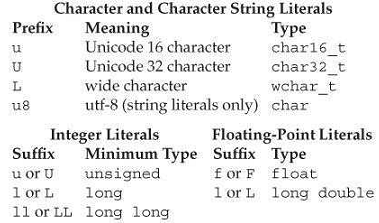
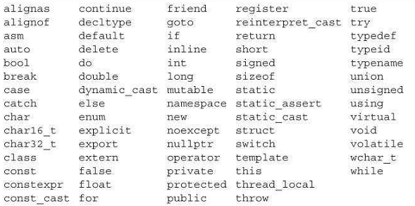
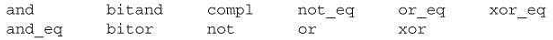

[toc]

## 2. 变量和基本类型

### 2.1 基本（Primitive）内建类型

基本类型包括算术（arithmetic）类型和`void`。算术类型包括字符、整数、布尔、浮点数。

#### 2.1.1 算术类型

分两类：整数（包括字符、布尔）和浮点。

在不同的机器上，算术类型的大小（多少比特）不同。标准规定了最小大小（下表）。允许编译器使用更大的大小。


字符类型有几种。多数用于国际化。最基本的是`char`。A char is guaranteed to be big enough to hold numeric values corresponding to the characters in the machine’s basic character set. That is, a char is the same size as a single machine **byte**.

剩下的字符类型（`wchar_t`, `char16_t`, `char32_t`）用于扩展字符集。`wchar_t`保证能容纳机器上最大的字符集。`char16_t`和`char32_t`用于Unicode字符。

The remaining integral types represent integer values of (potentially) different sizes. The language guarantees that an `int` will be at least as large as `short`, a `long` at least as large as an `int`, and `long long` at least as large as `long`. The type` long long` was introduced by the new standard.

##### 有符号与无符号类型

**除了bool和扩展字符集类型**，整数类型可以是有符号的或无符号的。

The standard does not define how signed types are represented, but does specify that the range should be evenly divided between positive and negative values.

与其他整数类型不同，基本字符类型有三种：`char`, `signed char`, `unsigned char`。注意`char`与`signed char`不是一种类型。尽管有三种类型，但只有两种表示：有符号和无符号。`char`类型（不加任何限定的char）使用其中一种，究竟是哪一种取决于编译器。｛｛即`char`可能是有符号的，也可能是无符号的。但与此不同，`int`一定是有符号的。｝｝

不要在算术表达式中使用普通`char`或`bool`。计算中涉及`char`将会带来问题——因为有些机器上`char`是有符号的但有些机器上是无符号的。如果需要一个小整数，显式指定是否有符号：`signed char`或`unsigned char`。

#### 2.1.2 类型转换

这里讨论一种变量向另一种变量赋值。4.11节还会继续讨论转换问题。

把非布尔型的算术类型赋给bool变量，值为0是结果为false，其他情况为true。把bool赋给其他算术类型，如果bool是true则结果是1，false则结果是0。

把浮点值赋给整数类型，值会被截断。整数赋给浮点，小数部分是0。Precision may be lost if the integer has more bits than the floating-point object can accommodate.

If we assign an out-of-range value to an object of unsigned type, the result is the remainder of the value modulo the number of values the target type can hold. For example, an 8-bit unsigned char can hold values from 0 through 255, inclusive. If we assign a value outside this range, the compiler assigns the remainder of that value modulo 256. Therefore, assigning –1 to an 8-bit unsigned char gives that object the value 255.

将超出范围的值赋给**有符号**类型结果是不确定的。The program might appear to work, it might crash, or it might produce garbage values.

在期望一种类型的地方使用另一种类型的值，编辑器将进行上述的类型转换。例如：

```cpp
    int i= 42;
    if (i) // condition will evaluate as true
        i = 0;
```

涉及无符号类型的表达式，例如表达式中有`unsigned`和`int`，int值被转换为无符号的。将`int`转换为`unsigned`就相当于我们将一个`int`赋值给`unsigned`。

从一个无符号数减去一个值（不管是否有符号），要确保结果不为负：

```cpp
unsigned u1 = 42, u2 = 10;
std::cout << u1 - u2 << std::endl; // ok: result is 32
std::cout << u2 - u1 << std::endl; // ok: but the result will wrap around
```

> 注意：不要混用有符号数和无符号数。当有符号数为负数时，混用有符号数和无符号数的表达式将产生意外结果。记住**有符号数会自动转换为无符号数**。

#### 2.1.3. 字面量

字面量有类型。

##### 整型和浮点字面量

0开头是八进制。`0x`或`0X`开头是十六进制。

The type of an integer literal depends on its value and notation. 默认十进制（decimal）字面量是有符号的，而八进制和十六进制可以是有符号或无符号的。A decimal literal has the smallest type of `int`, long, or long long (i.e., the first type in this list) in which the literal’s value fits. Octal and hexadecimal literals have the smallest type of `int`, unsigned int, long, unsigned long, long long, or unsigned long long in which the literal’s value fits. 如果响应的最大类型都无法容纳此字面量，报错。没有`short`类型的字面量。通过后缀可以覆盖这些默认特性。

Table 2.2. 指定字面量类型


技术上说，十进制字面量不会是负数。例如`-42`, 减号不是字面量的一部分。减号是负操作符。

浮点数字面量默认类型是`double`。

##### 字符和字符串

单引号包裹单个字符的字面量是char。双引号包括零个或多个字符是string字面量：

```cpp
    'a'  // character literal
    "Hello World!"  // string literal
```

string字面量的类型是常量char的数组。编译器会向每个string字面量最后追加null（‘\0’）字符。

两个相邻的string字面量，即使中间有空格、Tab、换行，也会被合并成单个字面量。

##### 转义

```
    newline    \n    horizontal tab    \t    alert (bell)    \a
    vertical tab    \v    backspace    \b    double quote  \"
    backslash    \\    question mark    \?   single quote    \'
    carriage return   \r    formfeed    \f
```

We can also write a generalized escape sequence, which is \x followed by one or more hexadecimal digits or a `\` followed by one, two, or three octal digits. The value represents the numerical value of the character.

Note that if a \ is followed by more than three octal digits, only the first three are associated with the \ . For example, "\1234" represents two characters: the character represented by the octal value 123 and the character 4. In contrast, \x uses up all the hex digits following it; "\x1234" represents a single, 16-bit character composed from the bits corresponding to these four hexadecimal digits. Because most machines have 8-bit chars, such values are unlikely to be useful. Ordinarily, hexadecimal characters with more than 8 bits are used with extended characters sets using one of the prefixes from Table 2.2.

##### 指定字面量的类型

可以利用前缀或后缀改变整数、浮点数、字符字面量的默认类型：

```cpp
    L'a' // wchar_t
    u8"hi!" // utf-8 string literal
    42ULL // unsigned integer literal, type is unsigned long long
    1E-3F // single-precision floating-point literal, type is float
    3.14159L // long double
```

##### 布尔和指针字面量

`true`和`false`是bool类型的字面量。

```cpp
    bool test= false;
```

`nullptr`是一个指针字面量。后面会细讲。

### 2.2 变量

#### 2.2.1 变量定义

简单的变量定义包含一个类型限定符，接着是一个或多个变量名（逗号分隔），最后是分号。Each name in the list has the type defined by the type specifier. 变量后可以跟初始值：

```cpp
    int sum = 0, value, units_sold = 0;
    Sales_item item; // item has type Sales_item(see § 1.5.1)
    std::string book("0-201-78345-X"); // book是变量，括号内是初始值
```

##### Initializers

在C++中，**初始化和赋值是两种不同的操作**。初始化指变量创建时被给于的值。而赋值，会消灭对象的当前值，用新值替代。

##### 列表初始化（List Initialization）

有几种不同的初始化方式。例如下面四种方式都是将`units_sold`初始化为0：

```cpp
    int units_sold = 0;
    int units_sold = {0};
    int units_sold{0};
    int units_sold(0);
```

`{}`用于通用的初始化，是新标准引入的。之前只能在特殊情况下使用。这种形式的初始化称为**列表初始化**。这种初始化现在可以用于所有需要初始化对象的时候，有时，也可以用于为对象赋新值（赋值）。

当变量是内建类型，若可能发生信息丢失，则编译器将不允许使用列表初始化这一初始化方式：

```cpp
    long double ld = 3.1415926536;
    int a{ld}, b = {ld}; // 错误：narrowing conversion required
    int c(ld), d = ld;  // 可以：值会被截断
```

`long double`类型的ld，即使去掉小数部分，整数部分也可能无法被`int`容纳。

As presented here, the distinction might seem trivial—after all, we’d be unlikely to directly initialize an int from a long double. However, as we’ll see in Chapter 16, such initializations might happen unintentionally. We’ll say more about these forms of initialization in § 3.2.1 and § 3.3.1.

##### 默认（Default）初始化

定义变量时若不指定初始化器，则变量将被默认初始化。默认值取决于变量类型和变量定义的位置。

内建类型的默认值取决于定义位置。函数之外定义初始化为0（一个例外见§ 6.1.1）。函数内定义的内建类型值是**未初始化的**。未初始化的值是不定的（§ 2.1.2）。It is an **error** to copy or otherwise try to access the value of a variable whose value is undefined.

类控制如何初始化类的实例。由类决定对象是否可以不被初始化。如果不被初始化，也是由类决定默认值是什么。

多数类允许不显式初始化。例如库类`string`，如果不初始化，则默认是空串：

```cpp
	std::string empty;  // 隐式初始化为空串
```

#### 2.2.2. 变量声明（Declarations）与定义（Definitions）

为允许程序可以被分解为多个逻辑部分，C++支持separate compilation。分离编译允许我们将程序分成几个文件，每个可以被独立编译。

当程序被分解成多个文件，我们需要能够在文件之间共享代码。例如，一段代码需要用到在另一个文件中定义的变量。例如`std::cout`和`std::cin`。

为支持分离编译，C++区分了声明（declarations）和定义（definitions）。声明让一个名字对程序可知。文件中若使用了定义在其他文件中的名字，需要在文件中声明此名字。定义创建相应的实体。

变量声明指定变量的类型和名称。变量定义也是声明。除了指定名字和类型，定义也会分配空间，还可能初始化值。

声明加`extern`关键字。不要带初始化。

```cpp
    extern int i;  // declares but does not define i
    int j;  // declares and defines j
```

任何包含显式初始化的声明都是定义。初始化可以跟`extern`一起存在，但初始化会覆盖`extern`，及此时声明变成了定义：

```cpp
	extern doublepi = 3.1416; // definition
```

如果在函数内，连用初始化跟`extern`是错误的。

变量只能被定义一次，但可以被声明多次。

如果在多个文件中使用一个变量，变量需要被定义一次，声明多次。

We’ll have more to say about how C++ supports separate compilation in § 2.6.3 and § 6.1.3.

#### 2.2.3. Identifiers

Identifiers in C++ can be composed of letters, digits, and the underscore character. 语言不限制名字长度。标识符必须以字母或下划线开头。

保留字


Table 2.4.C++ Alternative Operator Names


标准还保留了一些名字用于标准库。The identifiers we define in our own programs may not contain two consecutive underscores, nor can an identifier begin with an underscore followed immediately by an uppercase letter. In addition, identifiers defined outside a function may not begin with an underscore.

#### 2.2.4. 一个名字的作用域

Most names defined outside a function has global scope.

### 2.3. 复合（Compound）类型

复合类型是根据另一个类型定义的类型。C++中有多种复合类型，其中两种是 *引用* 与 *指针*。

声明是一个基础（base）类型，接着一组说明符（declarators）。**一个说明符命名一个变量**，同时给这个变量一个相对于基础类型的类型。

之前看到的声明，说明符只有变量名。这类变量的类型就是基础类型。

#### 2.3.1. 引用（reference）

> 新标准引入了一种新的引用：右值引用（§ 13.6.1）。These references are primarily intended for use inside classes. 技术上讲，当我们提到引用时，指的都是左值引用。

引用定义了对象的另一个名称。一个引用类型指向另一个类型。引用类型的说明符是`&d`，其中d是变量名：

```cpp
    int ival = 1024;
    int &refVal = ival;  // refVal指向ival，或者说是ival的另一个名字
    int &refVal2;  // 错误：引用必须被初始化
```

一旦初始化，引用一直绑定到初始化的对象。**无法将引用重新绑定到另一个对象**。因此引用必须初始化。

##### 引用即别名

对引用的操作实际是操作引用绑定的对象：

```cpp
    refVal = 2;  // 将2赋给refVal指向的对象，即ival
    int ii = refVal; // same as ii = ival

    int &refVal3 = refVal; // refVal3现在也指向ival了
    int i = refVal; // i现在具有与ival相同的值
```

因为引用不是对象，因此不能定义a reference to a reference。

##### 引用定义

在单个定义中可以定义多个引用。注意**每个**变量名前都要加`&`：

```cpp
    int i = 1024, i2 = 2048; // i and i2 are both ints
    int &r = i, r2 = i2; // r是引用类型，但r2是int
    int i3 = 1024, &ri = i3; // i3 is an int; ri is a reference bound to i3
    int &r3 = i3, &r4 = i2; // both r3 and r4 are references
```

**引用的类型与对象类型必须一致**（两个例外：§ 2.4.1、§ 15.2.3）。

```cpp
    double dval = 3.14;
    int &refVal5 = dval; // 错误
```

引用只能绑定到对象，不能绑定到字面量。原因在§ 2.4.1解释。

```cpp
	int &refVal4 = 10;  // 错误
```

#### 2.3.2. 指针

指针本身也是对象。可以改变指针指向的对象。不一定要在定义时初始化。在块级作用域上，未初始化的指针的值是未定义的。

指针类型的说明符是`*d`，d是变量名。

```cpp
    int *ip1, *ip2;  // both ip1 and ip2 are pointers to int
    double dp, *dp2; // dp2是指针，但dp是double
```

##### 取对象地址

指针持有对象的地址。使用`&`获取对象地址：

```cpp
    int ival = 42;
    int *p = &ival; // p保存ival的地址；p是指针
```

指针与对象必须类型一致（两个例外：2.4.2、15.2.3）。

##### 指针值

指针存放的值（即地址）可以有四种状态：

- 它可以指向一个对象
- 它可以指向对象位置之后的下一个位置
- 它可以是空指针，表示不绑定到任何对象
- 可能是无效值。上述三者之外都是无效值

访问无效指针的结果是不定的。尽管第2第3种指针是有效的，但使用受限。因为这些指针不指向任何对象，因此不用于访问指向的对象。如果访问了，结果是不定的。

##### 使用指针访问对象

若指针指向一个对象，可以用dereference operator (`*`)访问那个对象。

```cpp
    int ival= 42;
    int *p = &ival;
    cout << *p;  // * yields the object to which p points; prints 42
```

##### 空指针

空指针不指向任何对象。代码在使用指针前要检查是否为空。有几种方式获得一个空指针：

```cpp
    int *p1 = nullptr; // 等价于int *p1 = 0;
    int *p2 = 0;
    // must #include cstdlib
    int *p3 = NULL; // 等价于int *p3 = 0;
```

`nullptr`是新标准引入的。`nullptr`是一个字面量，有**特殊类型**，可以被转换为任何指针类型。

老的程序一般会用预处理器变量**NULL**，**cstdlib**头将其定义为0。**预处理器变量**不是命名空间的一部分。因此引用它们是不用加**std::**前缀。

现代C++程序尽量避免使用NULL，使用`nullptr`吧。

为指针赋一个整数**变量**是无效的，即便是0。｛｛初始化时的0是字面量，不是整型变量｝｝

```cpp
    int zero = 0;
    pi = zero; // 错误，不能将整数赋给指针
```

##### 赋值（Assignment）

赋值可以让指针指向不同的对象：

```cpp
    int i= 42;
    int *pi = 0;
    int *pi2 = &i; // pi2 initialized to hold the address of i
    int *pi3; // 如果pi3定义在块内，其值是未定义的
    pi3 = pi2; // pi3 and pi2 address the same object, e.g., i
    pi2 = 0; // pi2 now addresses no object
```

##### 其他指针运算

**只要指针的值有效**，可以参与条件。0值为false，其他为true。

**相同类型**的有效指针可以使用`==`和`!=`运算符。运算符的结果是`bool`。持有相同地址的指针相等。**两个null指针相等**。Note that it is possible for a pointer to an object and a pointer one past the end of a different object to hold the same address. Such pointers will compare equal.

比较无效的指针的结果是未定的。

§ 3.5.3 will cover additional pointer operations.

##### `void*`指针

`void*`是一个特殊的指针类型，可以持有任何对象的地址。对象的类型是不定的。

```cpp
    double obj = 3.14, *pd = &obj;
    void *pv = &obj; // obj can be an object of any type
    pv = pd; // pv can hold a pointer to any type
```

可以与其他指针比较｛｛相同类型的？｝｝。**但不能用于操作地址上的对象**——我们不知道对象的类型。

#### 2.3.3. 理解复合类型声明

每个说明符定义一个变量，其类型与基础类型的关系可以不同。因此，单个定义可以定义多种不同类型的变量：

```cpp
    // i is an int; p is a pointer to int; r is a reference to int
    int i = 1024, *p = &i, &r = i;
```

##### 定义多个变量

误解：type modifier(`*`, `&`)对语句中所有变量起作用。误解原因之一是，type modifier和变量名之间可以有空白符：

```cpp
	int* p; // legal but might be misleading
```

注意即使如此，基础类型仍是`int`，不是`int*`。`*`只作用于p。

```cpp
	int* p1, p2; // p1 is a pointer to int; p2 is an int
```

最好还是让type modifier靠近标识符：

```cpp
	int *p1, *p2; // both p1 and p2 are pointers to int
```

##### 指向指针的指针

一般来说，向说明符应用多少个type modifiers是没有限制的。

`**`是指向指针的指针。

```cpp
    int ival = 1024;
    int *pi = &ival;  // pi points to an int
    int **ppi = &pi;  // ppi points to a pointer to an int
```

要访问指向的对象，需要解指向两次：

```cpp
    cout << "The value of ival\n"
        << "direct value: " << ival << "\n"
        << "indirect value: " << *pi << "\n"
        << "doubly indirect value: " << **ppi
        << endl;
```

##### 指针的引用

```cpp
    int i= 42;
    int *p; // p is a pointer to int
    int *&r = p; // r是一个引用，指向指针p
    r = &i; // r指向一个指针（是一个指针的别名——就是一个指针）; 将i的地址给r
    *r = 0; // *r即i
```

为理解`r`，**从右向左读**。**最靠近r的符号决定变量类型**。这里`r`是一个引用。

### 2.4. const限定符

如想令变量不可改变，可以限定`const`：

```cpp
	const int bufSize = 512;  // input buffer size
```

因为const对象创建后不能改变，因此必须初始化。初始化器可以使用任意复杂的表达式：

```cpp
    const int i = get_size(); // 运行时初始化是可以的
    const int j = 42; // ok: initialized at compile time
    const int k;
```

##### const对象局限于单个文件

如果常量是被一个编译时常量初始化的，如：

```cpp
	const int bufSize = 512;
```

编译器一般会在编译时将变量的使用替换为变量的值。

要替换变量的值，编译器必须能看到变量的初始化器。当把程序分成多个文件时，每个使用此常量的文件都必须能访问它的初始化器。为了看到初始化器，变量必须在每个文件中的定义。为支持这种用法，同时避免多次的定义同一个变量，**const变量局限于文件**。When we define a const with the same name in multiple files, it is as if we had written definitions for separate variables in each file.

有时，想要在多个文件共享的const变量的初始化器不是一个常量表达式。此时，我们不想让编译器在每个文件中产生一个变量。我们想在一个文件中定义const，在其他文件中声明。要定义一个const变量的单个实例，我们需要在定义和声明时都加`extern`关键字。

```cpp
    // file_1.cc defines and initializes a const that is accessible to other files
    extern const int bufSize = fcn();
    // file_1.h
    extern const int bufSize; // same bufSize as defined in file_1.cc
```

#### 2.4.1. 到const的引用

可以绑定到const类型的引用。到常量的引用与常量本身一样，不能用于改变绑定的对象：

```cpp
    const int ci = 1024;
    const int &r1 = ci; // ok: ci和r1都是常量
    r1 = 42; // 错误：r1指向的是常量
    int &r2 = ci; // 错误：non const reference to a const object
```

> 术语：常量引用（const Reference）是一个到常量的引用。C++程序员一般称“reference to const”为“const reference”。这是个缩略语。技术上讲，并没有const references。引用不是对象，因此不能令引用本身是常量。但另一方面，因为不能让引用引用其他对象，引用就像一个常量。引用指向的是常量影响我们能对引用做什么。而不是是否能改变引用的绑定。

##### 初始化到const的引用

之前我们提到，引用的类型必须匹配被应用对象的类型。但有两个例外。第一是，到常量的引用，可以使用任意可以转换为匹配类型的表达式初始化。特别的，可以将到常量的引用绑定到**非常量**对象：

```cpp
    int i= 42;
    const int &r1 = i; // 可以将const int &绑定到非常量int
    const int &r2 = 42; // ok: r1 is a reference to const
    const int &r3 = r1 * 2; // ok: r3 is a reference to const
    int &r4 = r * 2;  // error: r4 is a plain, non const reference
```

例子：绑定不同类型：
```cpp
    double dval= 3.14;
    const int &ri = dval;
```

以上代码，编译器实际会出下面的变换：
```cpp
    const int temp = dval; // 从double创建一个临时const int
    const int &ri = temp; // 将ri绑定到一个临时变量
```

即`ri`绑定到了一个临时对象。

为什么不同类型的绑定，引用必须是常量的？如下面是错误的：
```cpp
    double dval= 3.14;
    int &ri = dval; // 不允许
```

因为如果不是常量，程序员可能向通过为引用赋值改变引用绑定的原对象。但引用此时绑定的实际是一个临时对象，不会影响原对象。于是在C++中，不同类型的绑定，引用必须是const的。

##### 到常量的引用可以引用一个不是常量的对象

到常量的引用只会限制我们可以对引用做什么，但限制不了对底层变量的直接操作。因为底层的对象不是常量，它可能通过其他方式改变：

```cpp
    int i= 42;
    int &r1 = i; // r1 bound to i
    const int &r2 = i; // r2 also bound to i; but cannot be used to change i
    r1 = 0; // r1 is not const; i is now 0
    r2 = 0; // error: r2 is a reference to const
```


#### 2.4.2. 指针与const

指针可以指向常量或非常量类型。*到常量的指针* 不能用于修改指向的对象。常量对象的地址只能放在到常量的指针里。

```cpp
    const double pi = 3.14;
    double *ptr = &pi; // 错误，ptr只是普通指针
    const double *cptr = &pi; // 正确
    *cptr = 42; // 错误，不能赋值给*cptr
```

指针与指向的对象类型必须匹配。但有两个例外。第一个是，到常量的指针可以指向非常量对象。
```cpp
    double dval = 3.14; // dval is a double; its value can be changed
    cptr = &dval; // 可以。但不同通过cptr改变dval
```

注意，如果底层对象不是常量，它可能被其他方式改变。

指向常量的指针，指针本身是变量，指针指向的是对象是常量。但下面的常量指针，指针本身是常量，指针指向的对象可能是常量或变量。

##### const指针

指针本身是对象，于是指针本身可以是常量。与其他常量对象一样，常量指针必须被初始化；一旦初始化，不能改变。要表示指针是常量，需要在`*`后加`const`。

```cpp
    int errNumb = 0;
    int *const curErr = &errNumb;  // curErr总是指向errNumb
    const double pi = 3.14159;
    const double *const pip = &pi; // pip是一个长阿兰指针指向一个常量对象
```

为方便理解，从右向左读。`curErr`标识符最近的是const，表示**curErr自己是常量**。

指针本身是常量，不影响是否可以利用指针改变底层对象。是否允许只取决于指针指向什么

```cpp
    *pip = 2.72; // 错误：pip指向的是常量
    // if the object to which curErr points (i.e., errNumb) is nonzero
    if (*curErr) {
    	errorHandler();
    	*curErr= 0; // 可以
    }
```

#### 2.4.3. 顶级（Top-Level）常量

指针本身是常量称为顶级（top-level）常量。如果指针指向常量对象，这种常量称为低级（low-level）常量。更一般的说，顶级常量表示对象自己是常量。任何类型都可以是顶级常量。底层常量表示复合类型的**基础类型**是常量。而指针，可以同时为顶级或底层常量：

```cpp
    int i= 0;
    int *const p1 = &i; // 顶级常量。不能改变p1的值
    const int ci = 42; // 顶级常量。不能改变ci
    const int *p2 = &ci; // 常量是低级常量。可以改变p2
    const int *const p3 = p2;
    const int &r = ci; // const in reference types is always low-level
```

顶级和低级常量的区别在**拷贝**对象时很重要。拷贝一个对象时，顶级常量会被忽略：

```cpp
    i = ci; // 可以：拷贝ci的值；ci中的顶级常量被忽略
    p2 = p3; // 可以：指向的类型是匹配的；p3的顶级常量被忽略
```

拷贝对象｛｛注意，不是赋值！！！｝｝不改变被拷贝对象。因此，拷贝或被拷贝对象是否是常量都不重要。

与此相反，低级常量永不会被忽略。When we copy an object, both objects must have the same low-level const qualification or there must be a conversion between the types of the two objects. 一般来说，可以将非常量转换为常量，但反之不行：

```cpp
    int *p = p3; // 错误：p3有低级常量但p没有
    p2 = p3; // 可以：p2 has the same low-level const qualification as p3
    p2 = &i; // ok: we can convert int* to const int*
    int &r = ci; // error: can't bind an ordinary int& to a const int object
    const int &r2 = i; // ok: can bind const int& to plain int
```

#### 2.4.4. `constexpr`和常量表达式

常量表达式是一个值不会改变的表达式。于是可以在编译期求值。字面量是常量表达式。A const object that is initialized from a constant expression is also a constant expression. 语言中有一些上下文需要常量表达式。

一个对象（或表达式）是否为常量表达式取决于类型和初始化器。例子：

```cpp
    const int max_files = 20;  // max_files is a constant expression
    const int limit = max_files + 1; // limit is a constant expression
    int staff_size = 27;  // staff_size is not a constant expression
    const int sz = get_size(); // sz不是一个常量表达式，因为get_size()在运行时才知道
```

##### `constexpr`变量

在大型系统中，有时很难知道一个初始化器是否是常量表达式。可能仅当把一个常量放在一个需要常量表达式的地方时才发现其实它不是。经常，对象的定义和使用它的上下文不在一起。

新标准下，我们可以令编译器验证一个变量是否是常量表达式：将变量声明为`constexpr`。`constexpr`变量是隐式的常量，因此必须初始化：

```cpp
constexpr int mf = 20;  // 20 is a constant expression
constexpr int limit = mf + 1; // mf + 1 is a constant expression
constexpr int sz = size();  // 仅当size是constexpr函数时
```

Although we cannot use an ordinary function as an initializer for a constexpr variable, we’ll see in § 6.5.2(p. 239) that the new standard lets us define certain functions as `constexpr`. Such functions must be simple enough that the compiler can evaluate them at compile time. We can use `constexpr` functions in the initializer of a constexpr variable.

Generally, it is a good idea to use `constexpr` for variables that you intend to use as constant expressions.

##### Literal Types

因为常量表达式在编译期求值，于是可以在`constexpr`声明中使用的类型受限。The types we can use in a constexprare known as “literal types” because they are simple enough to have literal values.

之前用的所有类型中，算术、引用和指针是字面类型。`Sales_item`、IO库、string等不是。因为不能定义这些类型的变量是constexprs。We’ll see other kinds of literal types in § 7.5.6(p. 299) and § 19.3(p. 832).

Although we can define both pointers and reference as constexprs, the objects we use to initialize them are strictly limited. We can initialize a constexpr pointer from the `nullptr` literal or the literal (i.e., constant expression) 0. We can also point to (or bind to) an object that remains at a fixed address.

For reasons we’ll cover in § 6.1.1(p. 204), variables defined inside a function ordinarily are not stored at a fixed address. Hence, we cannot use a constexpr pointer to point to such variables. On the other hand, the address of an object defined outside of any function is a constant expression, and so may be used to initialize a constexpr pointer. We’ll see in § 6.1.1(p. 205), that functions may define variables that exist across calls to that function. Like an object defined outside any function, these special local objects also have fixed addresses. Therefore, a constexpr reference may be bound to, and a constexprpointer may address, such variables.

##### 指针和constexpr

It is important to understand that when we define a pointer in a constexpr declaration, the constexpr specifier applies to the pointer, not the type to which the pointer points:

```cpp
    const int*p = nullptr;  // p is a pointer to a const int
    constexpr int *q = nullptr; // q is a const pointer to int
```

Despite appearances, the types of pand qare quite different; pis a pointer to const, whereas qis a constant pointer. The difference is a consequence of the fact that constexprimposes a top-level const(§ 2.4.3, p. 63) on the objects it defines.

Like any other constant pointer, a constexprpointer may point to a constor a nonconsttype:

```cpp
    constexpr int*np = nullptr; // np is a constant pointer to int that is null
    int j = 0;
    constexpr int i = 42;  // type of i is const int
    // i and j must be defined outside any function
    constexpr const int *p = &i; // p is a constant pointer to the const int i
    constexpr int *p1 = &j;  // p1 is a constant pointer to the int j
```

### 2.5. 处理类型

#### 2.5.1. 类型别名

两种方式定义类型别名。传统方式是`typedef`：

```cpp
	typedef double wages;  // wages是double的别名
	typedef wages base, *p; // base是double的别名；p是double*
```

`typedef`出现在声明的基础类型部分。与其他声明一样，说明符可以包含type modifiers。

新标准引入了alias声明：

```cpp
	using SI = Sales_item; // SI is a synonym for Sales_item
```

类型别名可以出现在任何需要出现类型的地方。

```cpp
    wages hourly, weekly; // same as double hourly, weekly;
    SI item;
```

##### 指针、const和类型别名

类型别名如果是复合类型和常量，使用这些类型别名可能会有问题。如：

```cpp
    typedef char *pstring;
    const pstring cstr = 0; // cstr is a constant pointer to char
    const pstring *ps;  // ps is a pointer to a constant pointer to char
```

基础类型部分的const修改给定类型，这里是pstring——pointer to char。因此`const pstring`是一个到char的常量指针｛｛指针是常量｝｝，不是到常量char的指针。

直接把别名替换为真实类型再翻译会导致错误解释：

```cpp
	const char *cstr = 0; // const pstring cstr的错误解释
```

`const pstring *ps`中，基础类型是指针。而`const char *cstr = 0`中基础类型是char。

#### 2.5.2. auto类型Specifier

auto让编译器根据初始化器推断变量类型。（于是，使用auto时必须使用初始化器。）

```cpp
    // item的类型由val1和val2的和的类型推断
    auto item = val1 + val2;
```

如果auto声明多个变量，初始化器产生的结果的类型要一致：

```cpp
    auto i = 0, *p = &i; // ok: i is int and p is a pointer to int
    auto sz = 0, pi = 3.14; // error: inconsistent types for sz and pi
```

##### 复合类型、常量和auto

编译器推断的auto不总是与初始化器的类型完全一致。Instead, the compiler adjusts the type to conform to normal initialization rules.

如果使用引用做初始化器，初始化器实际是对应对象。推断出的类型是对象的类型，不是一个引用：
```cpp
    int i = 0, &r = i;
    auto a = r; // a是一个int
```

auto一般会忽略顶级常量。但底层常量（如初始化器为到常量的指针）会保留：
```cpp
    const int ci = i, &cr = ci;
    auto b = ci; // b是int（忽略顶级常量）
    auto c = cr; // c是int
    auto d = &i; // d是int*
    auto e = &ci; // e is const int *
```

如果想要推断的类型带顶级常量，必须显式声明：

```cpp
	const auto f = ci; // f has type const int
```

若期望最终类型是引用，也需要显式指出：

```cpp
    auto &g= ci; // g is a const int& that is bound to ci
    auto &h = 42; // 错误：we can't bind a plain reference to a literal
    const auto &j = 42; // ok: we can bind a const reference to a literal
```

若引用的基础类型是推断出来的类型，则初始化器中的顶级常量将不会被忽略。As usual, consts are not top-level when we bind a reference to an initializer.

When we define several variables in the same statement, it is important to remember that a reference or pointer is part of a particular **declarator** and not part of the **base type** for the declaration. As usual, the initializers must provide consistent auto-deduced types:

```cpp
    auto k= ci, &l = i; // k is int; l is int&
    auto &m = ci, *p = &ci; // m is a const int&;p is a pointer to const int
    // error: type deduced from i is int; type deduced from &ci is const int
    auto &n = i, *p2 = &ci;
```

#### 2.5.3. decltype类型Specifier

我们向让编译器根据表达式推断一个类型，但不想用此表达式初始化变量。新标准引入了第二个type specifier：`decltype`。

```cpp
	decltype(f()) sum = x; // sum has whatever type f returns
```

编译器**不会调用f**，但会推断f的返回值类型。

decltype处理顶级常量与引用的方式与auto不同。当decltype括号内的表达式是一个变量时，decltype返回此变量的类型，包括顶级常量和引用：

```cpp
    const int ci = 0, &cj = ci;
    decltype(ci) x = 0; // x的类型是const int
    decltype(cj) y = x; // y has type const int& and is bound to x
    decltype(cj) z;  // error: z is a reference and must be initialized
```

It is worth noting that decltype is the only context in which a variable defined as a reference is not treated as a synonym for the object to which it refers.

##### decltype和引用

若decltype括号内的表达是不是一个变量，得到的是表达式结果的类型。有些表达式会让decltype推断出一个引用类型（§ 4.1.1）。Generally speaking, decltype returns a reference type for expressions that yield objects that can stand on the left-hand side of the assignment:

```cpp
    // decltype of an expression can be a reference type
    int i = 42, *p = &i, &r = i;
    decltype(r + 0) b; // ok: addition yields an int; b is an (uninitialized) int
    decltype(*p) c; // 错误：c是int&，是一个引用，因此必须被赋值
```

Here r is a reference, so decltype(r) is a reference type. If we want the type to which r refers, we can use r in an expression, such as `r + 0`, which is an expression that yields a value that has a nonreference type.

dereference运算符会导致decltype返回一个引用。Thus, the type deduced by decltype(*p) is int&, not plain int.

另一点，decltype推断出的结果取决于表达式的形式。比如，把变量放入一个括号会改变decltype推断的结果。When we apply decltype to a variable without any parentheses, we get the type of that variable. 当把变量外包裹括号时，编译器将其看做表达式。A variable is an expression that can be the left-hand side of an assignment. As a result, decltype on such an expression yields a reference:

```cpp
    // 变量放在括号里，推断出来的总是一个引用
    decltype((i)) d; // 错误：d is int& and must be initialized
    decltype(i) e; // ok: e is an (uninitialized) int
```

> **Warning** Remember that decltype((variable))(note, double parentheses) is always a reference type, but decltype(variable) is a reference type only if variable is a reference.

### 2.6 定义我们自己的数据结构

C++中通过**类**定义数据类型。库类型string、istream和ostream都是类。

#### 2.6.1. 定义`Sales_data`类

```cpp
    struct Sales_data{
        std::string bookNo;
        unsigned units_sold = 0;
        double revenue = 0.0;
    };
```

大括号后必须有一个分号。使用分号的原因是，可以在类后面跟随变量定义：

```cpp
    struct Sales_data{ /* ... */ } accum, trans, *salesptr;

    // equivalent, but better way to define these objects
    struct Sales_data { /* ... */ };
    Sales_data accum, trans, *salesptr;
```

##### 类数据成员

新标准允许我们为数据成员提供类内初始化（in-class initializer）。创建对象时，类内初始化将用于初始化数据成员。没有初始化器的成员会被默认初始化(§ 2.2.1)。Thus, when we define `Sales_data` objects, `units_sold` and `revenue` will be initialized to 0, and `bookNo` will be initialized to the empty string.

类内初始化的形式是受限的(§ 2.2.1)：或者包裹在大括号中，或者后面跟`=`。不能将类内初始化放入圆括号。

§7.2 将引入另一个关键字`class`。在此之前我们将使用`struct`。第七章会讲二者的区别。

#### 2.6.2. 使用`Sales_data`类

We’ll assume that our `Sales_data` class is defined inside `Sales_data.h`. We’ll see how to define this header in § 2.6.3.

程序结构：

```cpp
    #include <iostream>
    #include <string>
    #include "Sales_data.h"
    int main()
    {
        Sales_data data1, data2;
        // code to read into data1 and data2
        // code to check whether data1 and data2 have the same ISBN
        // and if so print the sum of data1 and data2
    }
```

```cpp
    double price = 0;
    // read the first transactions: ISBN, number of books sold, price per book
    std::cin >> data1.bookNo >> data1.units_sold >> price;
    // calculate total revenue from price and units_sold
    data1.revenue = data1.units_sold * price;

    if (data1.bookNo== data2.bookNo) {
    	unsigned totalCnt = data1.units_sold + data2.units_sold;
    	double totalRevenue = data1.revenue + data2.revenue;
    	// print: ISBN, total sold, total revenue, average price per book
    	std::cout << data1.bookNo << " " << totalCnt <<" " << totalRevenue << " ";
        if (totalCnt != 0)
        	std::cout << totalRevenue/totalCnt << std::endl;
        else
        	std::cout << "(no sales)" << std::endl;
        return 0; // indicate success
    } else {  // transactions weren't for the same ISBN
        std::cerr << "Data must refer to the same ISBN" <<std::endl;
        return -1; // indicate failure
    }
```

#### 2.6.3. 编写我们自己的头文件

为确保所有文件中类定义相同，**类一般定义在头文件中**。

头一般包含只能被定义一次的实体（类定义、常量、constexpr变量）。头一般也要用到其他头。如`Sales_data`类有一个string成员，于是`Sales_data.h`必须`#include string`头。使用`Sales_data`的程序也必须包含`string`头。于是使用`Sales_data`的程序将包含string头两次。**我们的头的写法需要在多次包含时仍保证安全**。

头更改时，依赖的源文件必须被重新编译。

##### 预处理器简要介绍

安全的包含头多次的技术依赖**预处理器**。`#include`是预处理器的设施。当预处理其遇到一个`#include`时，它将`#include`替换为指定的头。

C++ programs also use the preprocessor to define **header guards**. Header guards rely on **preprocessor variables** (§ 2.3.2). 预处理器变量有两种可能的状态：定义或未定义。`#define`指令将一个名字定义为一个预处理器变量。有两个指令测试给定的预处理变量是否被定义： `#ifdef`和`#ifndef`。只有在测试为true时，`#ifdef`或`#ifndef`内部的东西才会被处理。

```cpp
    #ifndef SALES_DATA_H
        #define SALES_DATA_H
        #include <string>
        struct Sales_data {
            std::string bookNo;
            unsigned units_sold = 0;
            double revenue = 0.0;
        };
    #endif
```

注意：Preprocessor variable names do not respect C++ scoping rules.

Preprocessor variables, including names of header guards, must be unique throughout the program. Typically we ensure uniqueness by basing the guard’s name on the name of a class in the header. To avoid name clashes with other entities in our programs, 预处理变量一般全大写。