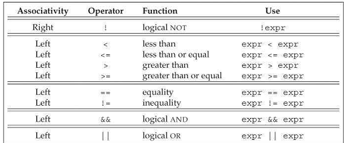
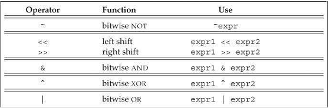

[toc]

## 4. 表达式

### 4.1 基础

#### 4.1.1. 基本概念

理解涉及多个运算符的表达式，需要理解运算符的优先级、结合性，及操作数的求值顺序。

##### 操作数转换

经常需要将操作数从一种类型转换为另一种。尽管转换规则复杂，但多数时候转换并不反直觉。小整数类型（如bool, char, short等）一般会被提升为大整数类型，一般是`int`。转换详见§ 4.11。

##### 运算符重载

使用重载运算符时，运算符的语义，包括操作数类型及结果取决于运算符的定义。但，**操作数数量、优先级、结合性是不能变的**。

##### 左值和右值

C++的表达式要么是一个左值，要么是右值。这些概念继承自C。左值可以位于赋值的左边，右值位于右边。

一些表达式的结果（yield）是右值，不是左值。粗略的讲，**当使用右值时，我们用的是它的值（内容）。用作左值时，我们用的是对象的标识（内存中的位置）。**

运算符的区别在于，它们需要左值还是右值，以及它们返回左值还是右值。在需要右值时可以使用左值（但有一个例外，见§ 13.6。当使用左值替代右值时，使用的是对象的内容（它的值）。我们已经使用了几个需要左值的运算符：

- 赋值需要一个左值（非常量）作为左操作数，且将左操作数按左值返回（yield）。
- 取地址运算符需要一个左值，将指向它的指针作为右值返回。
- 内建的解引用和下标运算符，迭代器解引用，string和vector下标运算符都产生（yield）左值。
- The built-in and iterator increment and decrement operators require lvalue operands and the prefix versions (which are the ones we have used so far) also yield lvalues.

使用`decltype`时左值与右值也有区别。对一个**表达式**（而不是变量）施加`decltype`，如果表达式产生左值，结果是引用类型。例如，加入`p`是`int*`。则`decltype(*p)`是`int&`。但由于取址运算符产生右值，`decltype(&p)`是`int**`。

#### 4.1.2. 优先级和结合性

Associativity determines how to group operands with the same precedence.

#### 4.1.3. 求值顺序

Precedence specifies how the operands are grouped. 但它没规定操作数的求值顺序。多数情况下，顺序都是不定的。如：`int i = f1() * f2();`
注意，下面的输出也是不定的！

```cpp
    int i= 0;
    cout << i << " " << ++i << endl; // undefined
```

但有四个运算符的顺序是一定的。`&&`、`||`、三元`?:`、逗号`,`。

优先级、结合性与求值顺序无关。如`f() + g() * h() + j()`。函数的调用顺序不定。

### 4.2 算术运算符

下面的运算符都是左结合（从左向右）的：一元+，一元-，*，/，%，+，-。

这些运算符的操作数和结果都是右值。As described in § 4.11, operands of small integral types are promoted to a larger integral type, and all operands may be converted to a common type as part of evaluating these operators.

一元加号施加到指针或算术值时，返回值的拷贝，可能被提升。

对于多数操作数，bool类型的操作数会被提升为int。

整数的除法返回一个整数。如果商包含小数，截断。

```cpp
    int ival1= 21/6;  // ival1 is 3;
    int ival2 = 21/7;  // ival2 is 3;
```

`%`的操作数必须是整数。

语言的早期版本许诺负数商被向上或向下取整。但新标准要求商**向零取整**（即截断）。

The modulus operator is defined so that if m and n are integers and n is nonzero, then `(m/n)*n + m%n` is equal to `m`. 隐式的，如果m%n非零，它与m的符号相同。Earlier versions of the language permitted `m%n` to have the same sign as `n` on implementations in which negative `m/n` was rounded away from zero, but such implementations are now prohibited. Moreover, except for the obscure case where `-m` overflows, `(-m)/n` and `m/(-n)` are always equal to `-(m/n)`, `m%(-n)` is equal to `m%n`, and `(-m)%n` is equal to `-(m%n)`. More concretely:

```cpp
21% 6;  /*  resultis 3  */  21/ 6;  /*  resultis 3  */
21% 7;  /*  resultis 0  */  21/ 7;  /*  resultis 3  */
-21 % -8;  /*  resultis -5*/  -21 / -8;  /*  resultis 2  */
21% -5;  /*  resultis 1  */  21/ -5;  /*  resultis -4  */
```

### 4.3 逻辑与关系运算符

关系运算符的操作数是算术或指针类型；逻辑运算符的操作数可以是任何能被够转换为bool类型的类型。这些运算符的返回值都是bool。值为0的算术和指针操作数是假；其他是真。操作数和结果都是右值。



##### 相等性测试和bool字面量

`if (val == true) { /* ...  */} // 只有当val等于1时才为true！`

如果val不是bool，**true会被转换为val的类型**：`if (val== 1) { /* ... */ }`。

所以还是直接写成`if(val)`。

### 4.4. 赋值（Assignment）

赋值的结果是左边的运算符，是一个**左值**。结果是左边运算符的类型。右边运算符的类型转换为左边的。

新标准允许使用大括号初始化列表。

```cpp
	k = {3.14}; // error: narrowing conversion
	vector<int> vi; // initially empty
	vi = {0,1,2,3,4,5,6,7,8,9};
```

如果左操作数是内建类型，则初始化列表中只能包含至多一个值。且这个值不需要被narrowing conversion (§ 2.2.1)。

For class types, what happens depends on the details of the class. In the case of vector, `vector`模板自定义了赋值运算符，可取一个初始化列表。This operator replaces the elements of the left-hand side with the elements in the list on the right-hand side.

#### 赋值是右结合的

```cpp
    int ival, jval;
    ival = jval = 0; // ok: each assigned 0
```

Because assignment is right associative, the right-most assignment, `jval = 0`, is the right-hand operand of the left-most assignment operator. Because assignment returns its left-hand operand, the result of the right-most assignment (i.e., jval) is assigned to ival.

Each object in a multiple assignment must have the same type as its right-hand neighbor or a type to which that neighbor can be converted (§ 4.11, p. 159).

#### 赋值的优先级低

```cpp
    int i;
    while ((i = get_value()) != 42) {
    	// do something ...
    }
```

#### 复合赋值运算符

```cpp
	+=  -=  *=  /=  %=  // arithmetic operators
	<<=  >>=  &=  ^=  |=  // bitwise operators; see § 4.8 (p. 152)
```

### 4.5 增加减少运算符

The increment (++) and decrement (--) operators provide a convenient notational shorthand for adding or subtracting 1 from an object.

`*pbeg++`等价于`*(pbeg++)`。

求值顺序不定

```cpp
// the behavior of the following loop is undefined!
    while (beg != s.end() && !isspace(*beg))
        *beg = toupper(*beg++);  // 错误：赋值不确定
```

The compiler might evaluate this expression as either

```cpp
    *beg = toupper(*beg); // 相当于左边先求值
    *(beg + 1) = toupper(*beg); // 右边先求值
```

### 4.6 成员访问运算符

`ptr->mem`是`(*ptr).mem`的缩写。省去了括号的烦扰。

### 4.7 条件运算符

```cpp
	cond ? expr1 : expr2;
```

条件运算符的优先级非常低。把它们嵌入复杂表达式，记得加括号。

### 4.8 二进制运算符

二进制运算符的操作数是整数（一些位）。这些运算符允许我们读取或设置特定的位。As we’ll see in § 17.2, we can also use these operators on a library type named bitset that represents a flexibly sized collection of bits.

如果操作数是小整数，会先被提升为大一些的整数（§ 4.11.1）。操作数可以是有符号的或无符号的。



如果操作数有有符号的且为负，则器符号位的处理方式取决于机器。如果左移修改了符号位，结果是未定的。

警告：因为符号位的处理是不定的，强烈建议二进制运算符只操作无符号数。

#### 移位运算符

The built-in meaning of these operators is that they perform a bitwise shift on their operands.

左移运算符在右边填0。右移的行为取决于操作数的类型：如果操作数是无符号的，则在左边插0。如果是有符号的，结果取决于实现：可能拷贝符号位，或插入0。

#### 位移（IO）运算符是左结合的

记得，重载运算符不改变运算符的结合性和优先级。

`cout <<"hi" << " there" << endl;`

等价于：

`((cout<< "hi") << " there" ) << endl;`

### 4.9 sizeof运算符

`sizeof`橼酸腐返回表达式或类型名的大小。运算符是右结合的。结果是常量表达式，类型是`size_t`。运算符有两种形式：`sizeof (type)`，`sizeof expr`。

`sizeof`并不会求值其操作数：

```cpp
    Sales_data data, *p;
    sizeof(Sales_data);
    sizeof data;
    sizeof p;
    sizeof *p;
    sizeof data.revenue;
```

The most interesting of these examples is `sizeof *p`. First, because sizeof is right associative and has the same precedence as *, this expression groups right to left. That is, it is equivalent to `sizeof (*p)`. Second, because sizeof does not evaluate its operand, it doesn’t matter that p is an invalid (i.e., uninitialized) pointer (§ 2.3.2). Dereferencing an invalid pointer as the operand to `sizeof` is safe because the pointer is not actually used. `sizeof` doesn’t need dereference the pointer to know what type it will return.

新标准，可以用作用域运算符查询类成员的大小。

```cpp
	sizeof Sales_data::revenue; // alternative way to get the size of revenue
```

The result of applying `sizeof` depends in part on the type involved:

- sizeof char or an expression of type char is guaranteed to be 1.
- sizeof a reference type returns the size of an object of the referenced type.
- sizeof a pointer returns the size needed hold a pointer.
- sizeof a dereferenced pointer returns the size of an object of the type to which the pointer points; the pointer need not be valid.
- sizeof an array is the size of the entire array. It is equivalent to taking the sizeof the element type times the number of elements in the array. Note that sizeof does not convert the array to a pointer.
- sizeof a string or a vector returns only the size of the fixed part of these types; it does not return the size used by the object’s elements.

```cpp
    // sizeof(ia)/sizeof(*ia) returns the number of elements in ia
    constexpr size_t sz = sizeof(ia)/sizeof(*ia);
    int arr2[sz]; // ok sizeof returns a constant expression § 2.4.4 (p. 65)
```

`sizeof`返回一个常量表达式，可以用于指定数组维度。

### 4.10. 逗号运算符

The comma operator takes two operands, which it evaluates from left to right. The comma operator guarantees the order in which its operands are evaluated.

The left-hand expression is evaluated and its result is discarded. The result of a comma expression is the value of its right-hand expression. The result is an lvalue if the right-hand operand is an lvalue.

One common use for the comma operator is in a for loop:

```cpp
    vector<int>::size_type cnt= ivec.size();
    // assign values from size... 1 to the elements in ivec
    for(vector<int>::size_type ix = 0; ix!= ivec.size(); ++ix, --cnt)
	    ivec[ix]= cnt;
```

### 4.11. 类型转换

当两个类型可以转换时，它们是相关的（related）。

As an example, consider the following expression, which initializes ival to 6:

```cpp
	int ival= 3.541 + 3; // 编译器可能警告说会丢失精度
```

数值类型的隐式转换要尽量保留精度。例如，如果表达式有整数和浮点数，则整数会被转换为浮点数。如3会被转换为double。接下来是初始化。double类型的结果会被转换为int。

##### 何时会发生隐式转换

- 多数表达式中，整型的、比int小的类型先被提升到大的整型
- 在条件中，非bool表达式被转换为bool
- 在初始化中，初始化器被转换为变量类型；赋值中，右操作数转换为左操作数。
- In arithmetic and relational expressions with operands of mixed types, the types are converted to a common type.
- 转换也发生在函数调用时（第6章）

#### 4.11.1. 算术转换

The arithmetic conversions, which we introduced in § 2.1.2, convert one arithmetic type to another. The rules define a hierarchy of type conversions in which operands to an operator are converted to the widest type. For example, if one operand is of type long double, then the other operand is converted to type long double regardless of what the second type is. More generally, in expressions that mix floating-point and integral values, the integral value is converted to an appropriate floating-point type.

##### 整型提升

The integral promotions convert the small integral types to a larger integral type.

The types `bool`, `char`, `signed char`, `unsigned char`, `short`, and `unsigned short` are promoted to `int` if all possible values of that type fit in an int.

Otherwise, the value is promoted to `unsigned int`. As we’ve seen many times, a bool that is false promotes to 0 and trueto 1.

The larger char types (`wchar_t`, `char16_t`, and `char32_t`) are promoted to the smallest type of int, unsigned int, long, unsigned long, long long, or unsigned long longin which all possible values of that character type fit.

##### 无符号操作数

If the operands of an operator have differing types, those operands are ordinarily converted to a common type. If any operand is an unsignedtype, the type to which the operands are converted depends on the relative sizes of the integral types on the machine.

As usual, integral promotions happen first. If the resulting type(s) match, no further conversion is needed. If both (possibly promoted) operands have the same signedness, then the operand with the smaller type is converted to the larger type.

When the signedness differs and the type of the unsigned operand is the same as or larger than that of the signed operand, the signed operand is converted to unsigned.

For example, given an unsigned int and an int, the int is converted to unsigned int. It is worth noting that if the int has a negative value, the result will be converted as described in § 2.1.2, with the same results.

The remaining case is when the signed operand has a larger type than the unsigned operand. In this case, the result is **machine dependent**. If all values in the unsigned type fit in the larger type, then the unsigned operand is converted to the signed type.

If the values don’t fit, then the signed operand is converted to the unsigned type. For example, if the operands are long and unsigned int, and int and long have the same size, the long will be converted to unsigned int. If the long type has more bits, then the unsigned int will be converted to long.

##### Understanding the Arithmetic Conversions

One way to understand the arithmetic conversions is to study lots of examples:

```cpp
    bool   flag;  char  cval;
    short  sval;  unsignedshort usval;
    int  ival;  unsignedint  uival;
    long  lval;  unsignedlong  ulval;
    float  fval;  double  dval;
    3.14159L + 'a'; //  'a'promoted to int, then that int converted to long double
    dval + ival;  //  ival convertedto double
    dval + fval;  //  fval convertedto double
    ival = dval;  //  dval converted(by truncation) to int
    flag = dval;  //  if dval is 0,then flag is false, otherwise true
    cval + fval;  //  cval promotedto int, then that int converted to float
    sval + cval;  //  sval and cval promotedto int
    cval + lval;  //  cval convertedto long
    ival + ulval;  //  ival convertedto unsigned long
    usval + ival;  //  promotiondepends on the size of unsigned short and int
    uival + lval;  //  conversiondepends on the size of unsigned int and long
```

In the first addition, the character constant lowercase 'a' has type char, which is a numeric value (§ 2.1.1). What that value is depends on the machine’s character set. On our machine, 'a'has the numeric value 97. When we add 'a'to a long double, the charvalue is promoted to int, and then that intvalue is converted to a long double. The converted value is added to the literal. The other interesting cases are the last two expressions involving unsigned values. The type of the result in these expressions is machine dependent.

#### 4.11.2. 其他隐式转换

In addition to the arithmetic conversions, there are several additional kinds of implicit conversions. These include:

**数组到指针转换**：多数情况下，数组会被转换为指向数组第一个元素的指针：

```cpp
	int ia[10];  // array of ten ints
	int* ip = ia; // convert ia to a pointer to the first element
```

以下情况不会转换：使用`decltype`，作为取址运算符的操作数，使用`sizeof`或`typeid`（§ 19.2.2）。初始化到数组的引用时也会不会转换。

**指针转换**：A constant integral value of 0 and the literal `nullptr` can be converted to any pointer type; a pointer to any nonconst type can be converted to `void*`, and a pointer to any type can be converted to a `const void*`. We’ll see in § 15.2.2 that there is an additional pointer conversion that applies to types related by inheritance.

**转换到bool**：There is an automatic conversion from arithmetic or pointer types to bool. If the pointer or arithmetic value is zero, the conversion yields false; any other value yields true:

```cpp
	char *cp = get_string();
	if (cp) /* ...*/  // true if the pointer cp is not zero
	while (*cp) /* ...  */// true if *cp is not the null character
```

**转换到常量**：We can convert a pointer to a nonconst type to a pointer to the corresponding const type, and similarly for references. That is, if T is a type, we can convert a pointer or a reference to T into a pointer or reference to const T, respectively (§ 2.4.1, and § 2.4.2,):

```cpp
    int i;
    const int &j = i; // convert a nonconst to a reference to const int
    const int *p = &i; // convert address of a nonconst to the address of a const
    int &r = j, *q = p; // error: conversion from const to nonconst not allowed
```

The reverse conversion—removing a low-level const—does not exist.

**由类定义的转换**：Class types can define conversions that the compiler will apply automatically. The compiler will apply only one class-type
conversion at a time. In § 7.5.4 we’ll see an example of when multiple
conversions might be required, and will be rejected.

Our programs have already used class-type conversions: We use a class-type conversion when we use a C-style character string where a library string is expected (§ 3.5.5) and when we read from an istream in a condition:

```cpp
    string s, t = "a value"; // 字符字符串字面量转换为string类型
    while (cin >> s)  // while condition converts cin to bool
```

The condition (`cin >> s`) reads cin and yields cinas its result. Conditions expect a value of type bool, but this condition tests a value of type istream. The IO library defines a conversion from istreamto bool. That conversion is used (automatically) to convert cinto bool. The resulting bool value depends on the state of the stream. If the last read succeeded, then the conversion yields true. If the last attempt failed, then the conversion to bool yields false.

#### 4.11.3 显式转换

例如，我们想要浮点除：

```cpp
	int i, j;
	double slope = i/j;
```

##### Named Casts

A named cast has the following form:

```cpp
	cast-name<type>(expression);
```

其中`type`是目标类型。如果`type`是引用，则结果是左值。`cast-name`决定进行何种转换，可以是`static_cast`, `dynamic_cast`, `const_cast`, `reinterpret_cast`。

We’ll cover `dynamic_cast`, which supports the run-time type identification, in § 19.2.

##### `static_cast`

Any well-defined type conversion, other than those involving low-level const, can be requested using a `static_cast`. For example, we can force our expression to use floating-point division by casting one of the operands to double:

```cpp
	// cast used to force floating-point division
	double slope = static_cast<double>(j) / i;
```

A `static_cast` is often useful when a larger arithmetic type is assigned to a smaller type. The cast informs both the reader of the program and the compiler that we are aware of and are not concerned about the potential loss of precision.

Compilers often generate a warning for assignments of a larger arithmetic type to a smaller type. When we do an explicit cast, the warning message is turned off.

A `static_cast` is also useful to perform a conversion that the compiler will not generate automatically. 例如，我们可以用`static_cast`查询存放在`void*`指针中的值(§ 2.3.2)：

```cpp
    void* p = &d; // ok: address of any nonconst object can be stored in a void*
    // ok: converts void* back to the original pointer type
    double *dp = static_cast<double*>(p);
```

When we store a pointer in a `void*` and then use a `static_cast` to cast the pointer back to its original type, we are guaranteed that the pointer value is preserved. That is, the result of the cast will be equal to the original address value.

However, we must be certain that the type to which we cast the pointer is the actual type of that pointer; if the types do not match, the result is undefined.

##### `const_cast`

A `const_cast` changes only a low-level (§ 2.4.3) const in its operand:

```cpp
    const char *pc;
    char *p = const_cast<char*>(pc); // ok: but writing through p is undefined
```

Conventionally wesay that a cast that converts a const object to a nonconst type “casts away the const.” Once we have cast away the const of an object, the compiler will no longer prevent us from writing to that object. 如果对象原来不是常量，则使用强转获得写访问是合法的。However, using a `const_cast` in order to write to a `const` object is undefined. Only a `const_cast` may be used to change the constness of an expression. Trying to change whether an expression is `const` with any of the other forms of named cast is a compile-time error. Similarly, we cannot use a `const_cast` to change the type of an expression:

```cpp
    const char* cp;
    // 错误：static_cast can't cast away const
    char *q = static_cast<char*>(cp);
    static_cast<string>(cp); // ok: converts string literal to string
    const_cast<string>(cp); // error: const_cast only changes constness
```

A `const_cast` is most useful in the context of overloaded functions, which we’ll describe in § 6.4.

##### `reinterpret_cast`

A `reinterpret_cast` generally performs a low-level reinterpretation of the bit pattern of its operands. As an example, given the following cast

    int *ip;
    char *pc = reinterpret_cast<char*>(ip);
we must never forget that the actual object addressed by pcis an int, not a
character. Any use of pcthat assumes it’s an ordinary character pointer is likely to fail
at run time. For example:
string str(pc);
is likely to result in bizarre run-time behavior.
The use of pcto initialize stris a good example of why reinterpret_castis
dangerous. The problem is that types are changed, yet there are no warnings or
errors from the compiler. When we initialized pcwith the address of an int, there is
no error or warning from the compiler because we explicitly said the conversion was
okay. Any subsequent use of pcwill assume that the value it holds is a char*. The
compiler has no way of knowing that it actually holds a pointer to an int. Thus, the
initialization of strwith pcis absolutely correct—albeit in this case meaningless or
worse! Tracking down the cause of this sort of problem can prove extremely difficult,
especially if the cast of ipto pcoccurs in a file separate from the one in which pcis
used to initialize a string.

Warning
A reinterpret_castisinherently machine dependent. Safely using
reinterpret_castrequires completely understanding the types involved
as well as the details of how the compiler implements the cast.

##### 传统风格的强转

In early versions of C++, an explicit cast took one of the following two forms:

```cpp
	type(expr); // function-style cast notation
	(type) expr; // C语言风格的强转
```

> 尽量避免强制类型转换。特别是`reinterpret_cast`。Such casts are always hazardous. A `const_cast` can be useful in the context of overloaded functions, which we’ll cover in § 6.4. Other uses of `const_cast` often indicate a design flaw. The other casts, `static_cast` and `dynamic_cast`, should be needed infrequently.

Depending on the types involved, an old-style cast has the same behavior as a const_cast, a static_cast, or a reinterpret_cast. When we use an old-style
cast where a static_castor a const_castwould be legal, the old-style cast does
the same conversion as the respective named cast. If neither cast is legal, then an
old-style cast performs a reinterpret_cast. For example:

```cpp
	char *pc= (char*) ip; // ip is a pointer to int
```

has the same effect as using a `reinterpret_cast`.

### （未）4.12. Operator Precedence Table