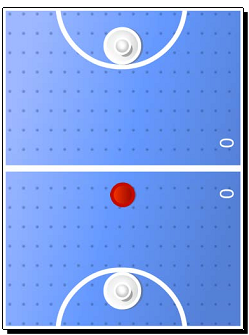
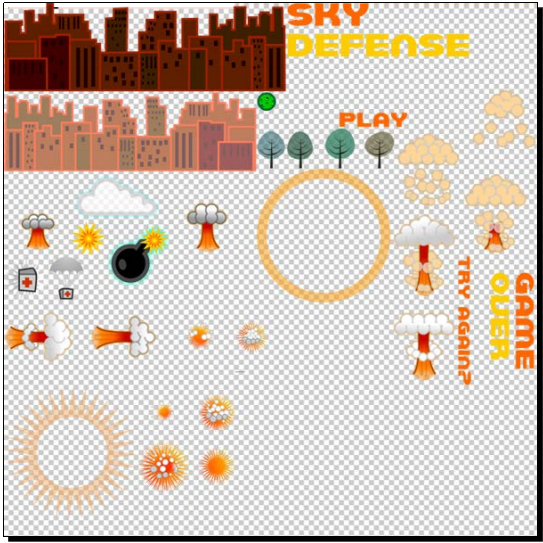
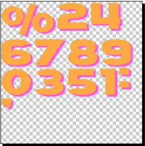
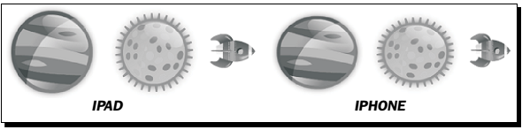

[toc]

## 3. Air Hockey

内容介绍：setting up the project's configuration, loading images, loading sounds, building a game for more than one screen resolution, and managing touch events.

这个游戏是双人游戏。

### 游戏配置

游戏特征：

- 支持多点触摸，因为是双人游戏
- 在大屏上玩
- 支持retina屏
- 屏幕水平

#### 行动：创建游戏工程

接下来将使用Xcode创建所有工程：

1. Open Xcode and create a new project with the Cocos2d-x basic template.
2. Call it Air Hockey, and set its **Device Family** to iPad.

#### 行动：应用规则

更新`AppController.mm`和`RootViewController.mm`：

Go to `AppController.mm` and inside the `(BOOL) application:(UIApplication *)application didFinishLaunchingWithOptions:(NSDictionary *)launchOptions` method below the section where the `EAGLView *__glView` object is instantiated, write this line: `[__glView setMultipleTouchEnabled:YES];`（支持多点）

Now go to `RootViewController.mm` and look for the `shouldAutorotateToInterfaceOrientation` method. Change the line inside the method to read:
`return UIInterfaceOrientationIsPortrait( interfaceOrientation );`

Finally, a few lines below in the `supportedInterfaceOrientations` method change the line inside the conditional to: `return UIInterfaceOrientationMaskPortrait;`

### 支持retina屏

#### 行动：添加图片

打开`7341_03_RESOURCES.zip`。里面有两个文件夹分别是`hd`和`sd`，分别用于retina屏和非retina屏。将这两个文件夹拖动你工程的`Resources`文件夹。

Go back to Xcode. Select the Resources folder in your project navigation panel. Then go to `File| Add Files` to Air Hockey.

In the File window navigate to the Resources folder and select both the sd and hd folders. This is very important: Make sure Create folder references for any added folders is selected. Also make sure you selected Air Hockey as the target. It wouldn't hurt to make sure **Copy items to destination...** is also selected. Click Add.

It is very important that references are added to the actual folders, only in this way will Xcode be able to have two files with the same name inside the project and still keep them apart; one in each folder.

#### 行动：添加Retina支持

修改`AppDelegate.cpp`类。向`applicationDidFinishLaunching`方法，`pDirector->setOpenGLView( pEGLView)`之下添加：

```cpp
    CCSize screenSize = pEGLView->getFrameSize();
    CCEGLView::sharedOpenGLView()->setDesignResolutionSize(768, 1024, kResolutionExactFit);
    if (screenSize.width > 768) {
        CCFileUtils::sharedFileUtils()->setResourceDirectory("hd");
        pDirector->setContentScaleFactor(2);
    } else {
        CCFileUtils::sharedFileUtils()->setResourceDirectory("sd");
        pDirector->setContentScaleFactor(1);
    }
```

`setDesignResolutionSize`表达了，我设计游戏时使用的分辨率是`768 x 1024`。即所有的定位与字体都相对于这个分辨率。

`CCFileUtils`会先在**rces| sd (or hd)**中寻找资源，如果找不到，再在Resources中找。即两个分辨率都一样的文件可以放在Resources中，不用重复两份。例如声音文件。

### 添加声效

将`.wav`拖动到你的工程的`Resources`文件夹。Then go to Xcode, select the Resources folder in the file navigation panel and select **File | Add Files** to Air Hockey. Make sure the Air Hockey target is selected. Add the **wav** files.

在`AppDelegate.cpp`顶部添加：`#include "SimpleAudioEngine.h"`。在`USING_NS_CC`下添加：`using namespace CocosDenshion;`。

在`applicationDidFinishLaunching`方法，上一节添加的内容之下添加：

```cpp
    SimpleAudioEngine::sharedEngine()->preloadEffect(
    	CCFileUtils::sharedFileUtils()->fullPathFromRelativePath("hit.wav") );
    SimpleAudioEngine::sharedEngine()->preloadEffect(
    	CCFileUtils::sharedFileUtils()->fullPathFromRelativePath("score.wav") );
```

加载声音很费时，因此尽早做。

### 扩展`CCSprite`

我们需要一些额外的信息，因此扩展`CCSprite`。

#### 行动：定义`GameSprite`

GameSprite.h：

```cpp
    #ifndef __GAMESPRITE_H__
    #define __GAMESPRITE_H__
    #include "cocos2d.h"
    using namespace cocos2d;
    class GameSprite : public CCSprite {
    public:
        CC_SYNTHESIZE(CCPoint, _nextPosition, NextPosition);
        CC_SYNTHESIZE(CCPoint, _vector, Vector);
        CC_SYNTHESIZE(CCTouch *, _touch, Touch);
        GameSprite(void);
        ~GameSprite(void);
        static GameSprite* gameSpriteWithFile(const char *pszFileName);
        virtual void setPosition(const CCPoint& pos);
        float radius();
    };
    #endif // __GAMESPRITE_H__
```

利用宏创建三个合成（synthesized）属性：利用宏创建getter和setter方法。You declare the type, the `protected` variable name, and the words that will be appended to the get and set methods.

`gameSpriteWithFile`用于实例化。

#### 行动：实现`GameSprite`

`GameSprite.cpp`：

```cpp
    #include "GameSprite.h"
    GameSprite::GameSprite(void) {
    	_vector = ccp(0,0);
    }
    GameSprite::~GameSprite(void) {
    }
    GameSprite* GameSprite::gameSpriteWithFile(const char *pszFileName) {
        GameSprite *sprite = new GameSprite();
        if (sprite && sprite->initWithFile(pszFileName)) {
        	sprite->autorelease();
        	return sprite;
        }
        CC_SAFE_DELETE(sprite);
        return NULL;
    }

    float GameSprite::radius() {
        return getTexture()->getContentSize().width * 0.5f;
    }
```

覆盖`CCNode`的`setPosition`方法。为的是，改变位置后，新值更新到`_nextPosition`：

```cpp
    void GameSprite::setPosition(const CCPoint& pos) {
        CCSprite::setPosition(pos);
        if (!_nextPosition.equals(pos)) {
        	_nextPosition = pos;
        }
    }
```

### game scene

Rename the `HelloWorldScene` files to `GameLayer`, and the class inside them from `HelloWorld` to `GameLayer`. References to the class must be changed in two lines of `AppDelegate.cpp`, and also the `include` statement at the top of `HelloWorldScene.cpp`. Of course, any scope resolution changes (the `HelloWorld::` funny bits) must be changed in `HelloWorldScene.cpp` as well.

#### 行动：`GameLayer`接口

修改`GameLayer.h`。替换为

```cpp
	#ifndef __GAMELAYER_H__
        #define __GAMELAYER_H__
        #define GOAL_WIDTH 400 // 球门宽度

        #include "cocos2d.h"
        #include "GameSprite.h"
        using namespace cocos2d;

        class GameLayer : public cocos2d::CCLayer
        {
            GameSprite * _player1;
            GameSprite * _player2;
            GameSprite * _ball;
            CCArray * _players;
            CCLabelTTF * _player1ScoreLabel;
            CCLabelTTF * _player2ScoreLabel;

            CCSize _screenSize; // 因为经常使用，存下来

            // 得分与更新得分的方法
            int _player1Score;
            int _player2Score;
            void playerScore (int player);

        public:
            ~GameLayer();
            virtual bool init();
            static CCScene* scene();
            CREATE_FUNC(GameLayer);
            virtual void ccTouchesBegan(CCSet* pTouches, CCEvent* event);
            virtual void ccTouchesMoved(CCSet* pTouches, CCEvent* event);
            virtual void ccTouchesEnded(CCSet* pTouches, CCEvent* event);
            void update (float dt); // 普通成员方法，不是父类中的
        };
    #endif // __GAMELAYER_H__
```

#### 行动：实现`init()`

在调用父类方法`CCLayer::init`之后，添加：

```cpp
    _player1Score = 0;
    _player2Score = 0;
    _screenSize = CCDirector::sharedDirector()->getWinSize();
```

屏幕大小将用于定位精灵。

加载第一个精灵：

```cpp
    CCSprite * court = CCSprite::create("court.png");
    court->setPosition(ccp(_screenSize.width * 0.5, _screenSize.height * 0.5));
    this->addChild(court);
```

宏`ccp`用于创建点。

创建`GameSprite`精灵：

```cpp
    _player1 = GameSprite::gameSpriteWithFile("mallet.png");
    _player1->setPosition(ccp(_screenSize.width * 0.5,
    	_player1->radius() * 2));
    this->addChild(_player1);

    _player2 = GameSprite::gameSpriteWithFile("mallet.png");
    _player2->setPosition(ccp(_screenSize.width * 0.5,
    	_screenSize.height - _player1->radius() * 2));
    this->addChild(_player2);

    _ball = GameSprite::gameSpriteWithFile("puck.png");
    // 球的位置偏下，不在中线上
    _ball->setPosition(ccp(_screenSize.width * 0.5,
    	_screenSize.height * 0.5 - 2 * _ball->radius()));
    this->addChild(_ball);
```

We create a `CCArray` method to store the player objects and we **retain** this array to keep a reference to it throughout the game:

```cpp
    _players = CCArray::create(_player1, _player2, NULL);
    _players->retain();
```

利用`CCLabelTTF`创建标签。once again the font size will be automatically scaled in the high definition version。

```cpp
    _player1ScoreLabel = CCLabelTTF::create("0", "Arial", 60);
    _player1ScoreLabel->setPosition(ccp(_screenSize.width - 60,
    	_screenSize.height * 0.5 - 80));
    _player1ScoreLabel->setRotation(90);
    this->addChild(_player1ScoreLabel);

    _player2ScoreLabel = CCLabelTTF::create("0", "Arial", 60);
    _player2ScoreLabel->setPosition(ccp(_screenSize.width - 60,
    	_screenSize.height * 0.5 + 80));
    _player2ScoreLabel->setRotation(90);
    this->addChild(_player2ScoreLabel);
```

Label objects (`CCLabelTTF`) can use any of the fonts supported by the target system; these change from system to system, however. But there is an option of loading your own TTF files.

最后，声明`CCLayer`允许监听触摸事件。并开始排期主循环：

```cpp
    // listen for touches
    this->setTouchEnabled(true);
    // create main loop
    this->schedule(schedule_selector(GameLayer::update));
    return true;
```

在析构器中释放之前retain的数组：

```cpp
    GameLayer::~GameLayer() {
    	CC_SAFE_RELEASE(_players);
    }
```



#### 行动：处理多点触摸

`ccTouchesBegan`方法：

```cpp
    void GameLayer::ccTouchesBegan(CCSet* pTouches, CCEvent* event) {
        CCSetIterator i;
        CCTouch* touch;
        CCPoint tap;
        GameSprite * player;
        for( i = pTouches->begin(); i != pTouches->end(); i++) {
            touch = (CCTouch*) (*i);
            if(touch) {
                tap = touch->getLocation();
                for (int p = 0; p < 2; p++) {
                    player = (GameSprite *) _players->objectAtIndex(p);
                    if (player->boundingBox().containsPoint(tap)) {
                        player->setTouch(touch);
                    }
                }
            }
        }
    }
```

每个`GameSprite`都有一个`_touch`属性。如果触摸了某个精灵，就将`touch`存到其`_touch`属性中去。

`ccTouchesMoved`方法（外层略）：

```cpp
    for (int p = 0; p < _players->count(); p++) {
        player = (GameSprite *) _players->objectAtIndex(p);
        if (player->getTouch() != NULL && player->getTouch() == touch) {
        CCPoint nextPosition = tap;
        // 不能移出屏幕
        if (nextPosition.x < player->radius())
        	nextPosition.x = player->radius();
        if (nextPosition.x > _screenSize.width - player->radius())
        	nextPosition.x = _screenSize.width - player->radius();
        if (nextPosition.y < player->radius())
        	nextPosition.y = player->radius();
        if (nextPosition.y > _screenSize.height - player->radius())
        	nextPosition.y = _screenSize.height - player->radius();
        // 不能移出自己的半场
        if (player->getPositionY() < _screenSize.height * 0.5f)
        {
	        if (nextPosition.y >  _screenSize.height * 0.5 - player->radius())
        	{
        		nextPosition.y = _screenSize.height * 0.5 - player->radius();
        	}
        } else {
        	if (nextPosition.y < _screenSize.height * 0.5 + player->radius())
	        {
    		    nextPosition.y = _screenSize.height * 0.5 + player->radius();
        	}
        }

        player->setNextPosition(nextPosition);
        player->setVector(ccp(tap.x - player->getPositionX(),
	        tap.y - player->getPositionY()));
        }
    }
```

精灵的`vector`会在碰撞检测时用到。

`ccTouchesEnded`方法（外层略）：

```cpp
    for (int p = 0; p < _players->count(); p++) {
    	player = (GameSprite *) _players->objectAtIndex(p);
    	if (player->getTouch() != NULL && player->getTouch() == touch) {
    		player->setTouch(NULL);
    		player->setVector(ccp(0,0));
    	}
    }
```

实现多点触摸的另一种方式是实现`CCTargetedTouchDelegate`协议。But this may result in the implementation of up to eight methods. You may go to the test code in `samples/TestCpp/Classes/TouchesTest` and review the code used in the Paddle.h and Paddle.cpp files for an example of `CCTargetedTouchDelegate` in action.

#### 行动：主循环

`update`方法。

对速度施加一点摩擦力（0.98f）。如果没有发生碰撞，将在最后存储新位置：

```cpp
    void GameLayer::update (float dt) {
        CCPoint ballNextPosition = _ball->getNextPosition();
        CCPoint ballVector = _ball->getVector();
        ballVector = ccpMult(ballVector, 0.98f);
        ballNextPosition.x += ballVector.x;
        ballNextPosition.y += ballVector.y;
```

接下来碰撞检测：

```cpp
        GameSprite * player;
        CCPoint playerNextPosition;
        CCPoint playerVector;

        float squared_radii = pow(_player1->radius() + _ball->radius(), 2);
        for (int p = 0; p < _players->count(); p++) {
            player = (GameSprite *) _players->objectAtIndex(p);
            playerNextPosition = player->getNextPosition();
            playerVector = player->getVector();
            float diffx = ballNextPosition.x - player->getPositionX();
            float diffy = ballNextPosition.y - player->getPositionY();
            float distance1 = pow(diffx, 2) + pow(diffy, 2);
            float distance2 = pow(_ball->getPositionX() - playerNextPosition.x, 2)
                + pow(_ball->getPositionY() - playerNextPosition.y, 2);
```

既检查角色的当前位置，也检查下一个位置，防止球“穿过”角色。

当发生碰撞时，更加球的速度向量和球员的速度向量，计算球的下一个位置。并播放声效：

```cpp
            float mag_ball = pow(ballVector.x, 2) + pow(ballVector.y, 2);
            float mag_player = pow(playerVector.x, 2) + pow(playerVector.y, 2);
            float force = sqrt(mag_ball + mag_player);
            float angle = atan2(diffy, diffx);
            ballVector.x = force * cos(angle);
            ballVector.y = (force * sin(angle));
            ballNextPosition.x = playerNextPosition.x +
                (player->radius() + _ball->radius() + force) * cos(angle);
            ballNextPosition.y = playerNextPosition.y +
                (player->radius() + _ball->radius() + force) * sin(angle);
            SimpleAudioEngine::sharedEngine()->playEffect("hit.wav");
        }
    }
```

下面检查球和屏幕边缘的碰撞。如果发生碰撞，将球反弹并播放音效：

```cpp
    if (ballNextPosition.x < _ball->radius()) {
        ballNextPosition.x = _ball->radius();
        ballVector.x *= -0.8f;
        SimpleAudioEngine::sharedEngine()->playEffect("hit.wav");
    }
    if (ballNextPosition.x > _screenSize.width - _ball->radius()) {
        ballNextPosition.x = _screenSize.width - _ball->radius();
        ballVector.x *= -0.8f;
        SimpleAudioEngine::sharedEngine()->playEffect("hit.wav");
    }
```

如果球到达球场上下边，检查球是否进入了球门：

```cpp
    if (ballNextPosition.y > _screenSize.height - _ball->radius()) {
        if (_ball->getPosition().x < _screenSize.width * 0.5f - GOAL_WIDTH * 0.5f
        	|| _ball->getPosition().x > _screenSize.width * 0.5f + GOAL_WIDTH * 0.5f) {
	        ballNextPosition.y = _screenSize.height - _ball->radius();
    	    ballVector.y *= -0.8f;
        	SimpleAudioEngine::sharedEngine()->playEffect("hit.wav");
        }
    }
    if (ballNextPosition.y < _ball->radius() ) {
        if (_ball->getPosition().x < _screenSize.width * 0.5f - GOAL_WIDTH * 0.5f
        	|| _ball->getPosition().x > _screenSize.width * 0.5f + GOAL_WIDTH * 0.5f) {
            ballNextPosition.y = _ball->radius();
            ballVector.y *= -0.8f;
            SimpleAudioEngine::sharedEngine()->playEffect("hit.wav");
        }
    }

    _ball->setVector(ballVector);
    _ball->setNextPosition(ballNextPosition);
    //check for goals!
    if (ballNextPosition.y < -_ball->radius() * 2) {
    	this->playerScore(2);
    }
    if (ballNextPosition.y > _screenSize.height + _ball->radius() * 2) {
    	this->playerScore(1);
    }
```

最后，更新所有对象的位置：

```cpp
    _player1->setPosition(_player1->getNextPosition());
    _player2->setPosition(_player2->getNextPosition());
    _ball->setPosition(_ball->getNextPosition());
```

如果向做精确的碰撞检测，逻辑必定是一样的：position now, position next, collision checks, and adjustments to position next, if any collision has occurred.

#### 行动：更新分数

播放音效并停止球的运动：

```cpp
    void GameLayer::playerScore (int player) {
        SimpleAudioEngine::sharedEngine()->playEffect("score.wav");
        _ball->setVector(ccp(0,0));
```

Then we update the score for the scoring player, updating the score label in the process. And the ball moves to the court of the player against whom a point was just scored:

```cpp
        char score_buffer[10];
        if (player == 1) {
            _player1Score++;
            sprintf(score_buffer, "%i", _player1Score);
            _player1ScoreLabel->setString(score_buffer);
            _ball->setNextPosition(ccp(_screenSize.width * 0.5,
            	_screenSize.height * 0.5 + 2 * _ball->radius()));
        } else {
            _player2Score++;
            sprintf(score_buffer, "%i", _player2Score);
            _player2ScoreLabel->setString(score_buffer);
            _ball->setNextPosition(ccp(_screenSize.width * 0.5,
            	_screenSize.height * 0.5 - 2 * _ball->radius()));
        }
```

The players are moved to their original position and their `_touch` properties are cleared:

```cpp
        _player1->setPosition(ccp(_screenSize.width * 0.5,
        	_player1->radius() * 2));
        _player2->setPosition(ccp(_screenSize.width * 0.5,
        	_screenSize.height - _player1->radius() * 2));
        _player1->setTouch(NULL);
        _player2->setTouch(NULL);
    }
```

也可以使用`CCString`：

```cpp
    CCString * score = CCString::createWithFormat("%i", _player1Score);
    _player1ScoreLabel->setString(score->getCString());
```


## 4. Sky Defense

介绍**actions**。如何只用action就能构建整个游戏：可以让角色移动、旋转、缩放等。如何利用多张图片和action让精灵动画。

本章内容：

* 利用sprite sheets优化游戏开发
* 在游戏中使用bitmap fonts
* How easy it is to implement and run CCActions
* How to scale, rotate, swing, move, and fade out a sprite
* 使用多个.png做精灵动画
* How to create a universal game with Cocos2d-x

### The game – Sky Defense

游戏剧情：Meet our stressed out city of... your name of choice here. It's a beautiful day, when suddenly the sky begins to fall. There are meteors rushing towards the city and it is your job to keep it safe.

The player in this game can tap the screen to start growing a bomb. When the bomb is big enough to be activated, the player taps the screen again to detonate it. Any nearby meteor will explode into a million pieces. The bigger the bomb, the bigger the detonation and the more meteors can be taken out by it. But the bigger the bomb, the longer it takes to grow it.

But it's not just bad news coming down. There are also health packs dropping from the sky and if you allow them to reach the ground, you'll recover some of your energy.

#### The game settings

This is a **universal** game. It is designed for the iPad retina screen and it will be scaled down to fit other screens. 游戏屏幕横屏。不支持多点触摸。

#### The start project

解压从`7341_04_START_PROJECT.zip`开始。Only this time, the **Device Family** is set to **Universal**. And in `RootViewController.mm`, the supported interface orientation is set to Landscape. 这次我们只需要一个类`GameLayer.cpp`, and you will find that the interface for this class already contains all of the information it needs.

#### Adding screen support for a universal app

上一个工程只支持iPad屏。现在要支持更小的屏。打开`AppDelegate.cpp`，在`applicationDidFinishLaunching`中：

```cpp
    CCSize screenSize = pEGLView->getFrameSize();
    CCSize designSize = CCSize(2048, 1536);
    CCEGLView::sharedOpenGLView()->setDesignResolutionSize(designSize.width,
    	designSize.height, kResolutionExactFit);
    if (screenSize.height > 768) {
    	CCFileUtils::sharedFileUtils()->setResourceDirectory("ipadhd");
    } else if (screenSize.height > 320) {
    	CCFileUtils::sharedFileUtils()->setResourceDirectory("ipad");
    } else {
    	CCFileUtils::sharedFileUtils()->setResourceDirectory("iphone");
    }
    pDirector->setContentScaleFactor(screenSize.height/designSize.height);
```

最后设置了缩放因数。

#### 添加背景音乐

`AppDelegate.cpp`：

```cpp
	SimpleAudioEngine::sharedEngine()->preloadBackgroundMusic(file);
    // lower playback volume for effects
    SimpleAudioEngine::sharedEngine()->setEffectsVolume(0.4f);
```

背景音乐的音量通过`setBackgroundMusicVolume`设置。

#### 初始化游戏

回到`GameLayer.cpp`，查看`init`发现游戏初始化涉及三个方法：`createGameScreen`, `createPools`, `createActions`。

使用对象池，为了不必在主循环中再初始化精灵。

There is a `CCArray` called `_fallingObjects` also created here, and we start playing the background music, with the loop flag set to true:

```cpp
    SimpleAudioEngine::sharedEngine()->playBackgroundMusic("background.mp3", true);
```

### 使用sprite sheets{{纹理贴图}}

精灵清单（sprite sheet）用于将多个图片组成成一张图片。当使用其中的一张图片给精灵贴图时，必须知道这张图片（矩形）在精灵清单的什么地方。精灵清单通常组织成两个文件：图片文件和数据文件。

I used TexturePacker to create these files for the game. You can find them inside the ipad, ipadhd, and iphone folders inside **Resources**. There is a **sprite_sheet.png** for the image and a **sprite_sheet.plist** that describes the individual frames inside the image.

下面是**sprite_sheet.png**：



精灵清单与一个特殊的`CCNode`类连用：`CCSpriteBatchNode`。当同一个节点内的多个精灵使用同一个图片文件时可以使用此类。With `CCSpriteBatchNode`, you can substantially reduce the number of calls during the rendering stage of your game, which will help when targeting less powerful systems, though **not noticeably** in the Apple device family.

`CCSpriteBatchNode`像其他任何节点一样可以充当容器。利用z-order可以将`CCSprites`在batch node内分层排布。

#### 行动：创建一个`CCSpriteBatchNode`

下面实现`GameLayer.cpp`的`createGameScreen`方法。Just below the lines that add the `bg` sprite, we instantiate our batch node:

```cpp
    void GameLayer::createGameScreen() {
        //add bg
        CCSprite * bg = CCSprite::create("bg.png");
        ...
        CCSpriteFrameCache::sharedSpriteFrameCache()->
        	addSpriteFramesWithFile("sprite_sheet.plist");
        _gameBatchNode = CCSpriteBatchNode::create("sprite_sheet.png");
        this->addChild(_gameBatchNode);
```

要利用精灵清单创建batch node，需要先加载帧信息：将`sprite_sheet.plist`加载到`CCSpriteFrameCache`。然后用`sprite_sheet.png`创建batch node。（背景图片不在贴图内，于是单独加载。）

创建`CCSprites`使用的帧名，在定义在`sprite_sheet.plist`。

接下来向`CCSpriteBatchNode`添加精灵。首先是city:
｛｛下面从清单中创建精灵时貌似只用到了帧，没有用到batch node。
难道通过帧创建的精灵只能添加到batch node？其此batch node必须通过清单的图片创建？｝｝

```cpp
    CCSprite * sprite;
    for (int i = 0; i < 2; i++) {
        sprite = CCSprite::createWithSpriteFrameName("city_dark.png");
        sprite->setPosition(ccp(_screenSize.width * (0.25f + i * 0.5f),
            sprite->boundingBox().size.height * 0.5f));
        _gameBatchNode->addChild(sprite, kForeground);

        sprite = CCSprite::createWithSpriteFrameName("city_light.png");
        sprite->setPosition(ccp(_screenSize.width * (0.25f + i * 0.5f),
            sprite->boundingBox().size.height * 0.9f));
        _gameBatchNode->addChild(sprite, kBackground);
    }
```

然后是树：

```cpp
    //add trees
    for (int i = 0; i < 3; i++) {
        sprite = CCSprite::createWithSpriteFrameName("trees.png");
        sprite->setPosition(ccp(
        	_screenSize.width * (0.2f + i * 0.3f),
        	sprite->boundingBox().size.height * 0.5f));
        _gameBatchNode->addChild(sprite, kForeground);
    }
```

The screen so far is made up of two instances of city_dark.png tiling at the bottom of the screen, and two instances of city_light.png that are also tiling. One needs to appear on top of the other, and for that we use the enumerated values declared in `GameLayer.h`:

```cpp
    enum {
        kBackground,
        kMiddleground,
        kForeground
    };
```

### Bitmap字体

`CCLabelBMFont`用bitmap图像显式字母，而`CCLabelTTF`用的是true type font文件。

The bitmap image we are using here was created with the program **GlyphDesigner**, and in essence it works just as a sprite sheet does. 其实`CCLabelBMFont`是`CCSpriteBatchNode`的子类, so it behaves just like a batch node. You have images for all of the individual characters that you'll need packed inside a PNG file (font.png), and then a data file (font.fnt) describing where each character is.



The difference between `CCLabelBMFont` and a regular `CCSpriteBatchNode` is that the data file also feeds the `CCLabelBMFont` object information on how to "write" with this font. In other words, how to space out the characters and lines correctly. 创建`CCLabelBMFont`是需要的参数依次是：初始字符串值、数据文件名，标签对象的宽度。

```cpp
    _scoreDisplay = CCLabelBMFont::create("0", "font.fnt", _screenSize.width * 0.3f);
```

可以通过`setString`改变标签内容：

```cpp
	_scoreDisplay->setString("My new Label");
```

#### 行动：创建`CCLabelBMFont`

仍然在`createGameScreen`方法中：

```cpp
    _scoreDisplay = CCLabelBMFont::create("0", "font.fnt",
    	_screenSize.width * 0.3f);
    _scoreDisplay->setAnchorPoint(ccp(1, 0.5));
    _scoreDisplay->setPosition(ccp(_screenSize.width * 0.8f,
		_screenSize.height * 0.94f));
    this->addChild(_scoreDisplay);

    // And then add a label to display the energy level:
    _energyDisplay = CCLabelBMFont::create("100%", "font.fnt",
    	_screenSize.width * 0.1f, kCCTextAlignmentRight);
    _energyDisplay->setPosition(ccp(_screenSize.width * 0.3f,
    	_screenSize.height * 0.94f));
    this->addChild(_energyDisplay);

    // _energyDisplaylabel后面的一个图标
    CCSprite * icon = CCSprite::createWithSpriteFrameName("health_icon.png");
    icon->setPosition(ccp(_screenSize.width * 0.15f,
    	_screenSize.height * 0.94f));
    _gameBatchNode->addChild(icon, kBackground);
```

#### 行动：添加最终的屏幕精灵

最后需要创建的精灵是云、炸弹和冲击波，及游戏的状态消息。

仍然在`createGameScreen`，添加云：

```cpp
    CCSprite * cloud;
    _clouds = CCArray::createWithCapacity(4); // 用数组，为了将来移动云
    _clouds->retain();
    float cloud_y;
    for (int i = 0; i < 4; i++) {
        cloud_y = i % 2 == 0 ? _screenSize.height * 0.4f : _screenSize.height * 0.5f;
        cloud = CCSprite::createWithSpriteFrameName("cloud.png");
        cloud->setPosition(ccp (_screenSize.width * 0.1f + i * _screenSize.width * 0.3f, cloud_y));
        _gameBatchNode->addChild(cloud, kBackground);
        _clouds->addObject(cloud);
    }
```

创建`_bomb`精灵。用户按住屏幕时会变大：

```cpp
    _bomb = CCSprite::createWithSpriteFrameName("bomb.png");
    _bomb->getTexture()->generateMipmap();
    _bomb->setVisible(false);
    CCSize size = _bomb->boundingBox().size;
    // add sparkle inside bomb sprite
    CCSprite * sparkle = CCSprite::createWithSpriteFrameName("sparkle.png");
    sparkle->setPosition(ccp(size.width * 0.72f, size.height * 0.72f));
	// sparkle作为_bomb的孩子！而不是_gameBatchNode
	_bomb->addChild(sparkle, kMiddleground, kSpriteSparkle);

    //add halo inside bomb sprite
    CCSprite * halo = CCSprite::createWithSpriteFrameName("halo.png");
    halo->setPosition(ccp(size.width * 0.4f, size.height * 0.4f));
    _bomb->addChild(halo, kMiddleground, kSpriteHalo);

    _gameBatchNode->addChild(_bomb, kForeground);
```

`_shockwave`精灵，在`_bomb`消失后出现：

```cpp
    _shockWave = CCSprite::createWithSpriteFrameName("shockwave.png");
    _shockWave->getTexture()->generateMipmap();
    _shockWave->setVisible(false);
    _gameBatchNode->addChild(_shockWave);
```

最后，添加两条消息，分别用于游戏开始和结束状态：

```cpp
    _introMessage = CCSprite::createWithSpriteFrameName("logo.png");
    _introMessage->setPosition(ccp(_screenSize.width * 0.5f,
        _screenSize.height * 0.6f));
    _introMessage->setVisible(true);
    this->addChild(_introMessage, kForeground);

    _gameOverMessage = CCSprite::createWithSpriteFrameName("gameover.png");
    _gameOverMessage->setPosition(ccp(_screenSize.width * 0.5f,
        _screenSize.height * 0.65f));
    _gameOverMessage->setVisible(false);
    this->addChild(_gameOverMessage, kForeground);
```


`_bomb->getTexture()->generateMipmap();` With this, we are telling the framework to create antialiased copies of this texture in diminishing sizes (mipmaps), since we are going to scale it down later. This is optional of course, as sprites can be resized without first generating mipmaps, but if you notice a loss of quality in the scaled sprites, you can fix it by creating mipmaps for their texture.

> OpenGL的纹理大小必须是POT (power of two: 2, 4, 8, 16, and so on)。若不是Cocos2d-x将做两件事情：在内存中调整纹理大小，添加透明像素直到达到POT。或者，可能在某个`Assert`处停止执行。With textures used for mipmaps the framework will stop execution for non-POT textures.

sparkle和halo是`_bomb`的孩子。当炸弹变大时，它的孩子也会跟着变大。

`addChild`的第三个参数是一个整数标签：
```cpp
	bomb->addChild(halo, kMiddleground, kSpriteHalo);
```

该标签来自`GameLayer.h`中的另一个枚举。利用此标签，可以从精灵中取到它的孩子：

```cpp
	CCSprite * halo = (CCSprite *) bomb->getChildByTag(kSpriteHalo);
```


#### 行动：创建对象池

池只是一个对象数组。在`createPools`方法：

```cpp
    void GameLayer::createPools() {
        CCSprite * sprite;
        int i;
        // 流星池
        _meteorPool = CCArray::createWithCapacity(50);
        _meteorPool->retain();
        _meteorPoolIndex = 0;
        for (i = 0; i < 50; i++) {
            sprite = CCSprite::createWithSpriteFrameName("meteor.png");
            sprite->setVisible(false);
            // 在节点关系上仍属于_gameBatchNode
            _gameBatchNode->addChild(sprite, kMiddleground, kSpriteMeteor);
            _meteorPool->addObject(sprite);
        }

        // 医疗包
        _healthPool = CCArray::createWithCapacity(20);
        _healthPool->retain();
        _healthPoolIndex = 0;
        for (i = 0; i < 20; i++) {
            sprite = CCSprite::createWithSpriteFrameName("health.png");
            sprite->setVisible(false);
            sprite->setAnchorPoint(ccp(0.5f, 0.8f));
            _gameBatchNode->addChild(sprite, kMiddleground, kSpriteHealth);
            _healthPool->addObject(sprite);
        }
    }
```

We'll use the corresponding pool index to retrieve objects from the arrays as the game progresses.

### CCActions

`CCNode`存储着节点的位置、缩放、旋转、可见性、透明度信息。可以通过`CCAction`类改变这些值，即产生动画。Actions一般通过静态方法create创建。第一个参数一般是action的时长。例如：

```cpp
	CCFadeOut *fadeout = CCFadeOut::create(1.0f);
```

`1.0f`表示1秒。令节点运行此Action：
```cpp
	mySprite->runAction(fadeout);
```

还可以创建action序列（`CCSequence`）；or you can apply easing effects (CCEaseIn, CCEaseOut, and so on) to your actions. 可以重复action数次（`CCRepeat`）甚至永远（`CCRepeatForever`）；可以指定一个回调函数，在Action完成后执行。

#### 行动：创建Actions

在`createActions`方法中，实例化在游戏中反复使用的actions。

```cpp
    void GameLayer::createActions() {
        // 医药包下落时的摆动效果
        CCFiniteTimeAction* easeSwing = CCSequence::create(
            CCEaseInOut::create(CCRotateTo::create(1.2f, -10), 2),
            CCEaseInOut::create(CCRotateTo::create(1.2f, 10), 2),
            NULL);
        _swingHealth = CCRepeatForever::create((CCActionInterval*) easeSwing);
        _swingHealth->retain();

        // 爆炸波淡出，完后调用函数
        _shockwaveSequence = CCSequence::create(
            CCFadeOut::create(1.0f),
            CCCallFunc::create(this, callfunc_selector(GameLayer::shockwaveDone)),
            NULL);
        _shockwaveSequence->retain();

		// 让炸弹增大
        _growBomb = CCScaleTo::create(6.0f, 1.0);
        _growBomb->retain();

        // action to rotate sprites
        CCActionInterval* rotate = CCRotateBy::create(0.5f , -90);
        _rotateSprite = CCRepeatForever::create( rotate );
        _rotateSprite->retain();
```

### 精灵动画

动画仅是另一种形式的`CCAction`——改变的是`CCSprite`使用的纹理。动画action(`CCAnimate`)使用`CCAnimation`对象。`CCAnimation`包含动画所需的所有纹理。纹理（帧）是`CCSpriteFrame`对象，从`CCSpriteFrameCache`获取，后者包含`sprite_sheet.plist`中的信息。

#### 创建动画

仍在`createActions`方法。首先是流星到达城市时的爆炸。首先将帧加载到`CCAnimation`对象：

```cpp
        CCAnimation* animation;
        CCSpriteFrame * frame;
        //create CCAnimation object
        animation = CCAnimation::create();
        CCString * name;
        for(int i = 1; i <= 10; i++) {
            name = CCString::createWithFormat("boom%i.png", i);
            frame = CCSpriteFrameCache::sharedSpriteFrameCache()
            	->spriteFrameByName(name->getCString());
            animation->addSpriteFrame(frame);
        }
```

利用`CCAnimation`创建`CCAnimate`：

```cpp
        animation->setDelayPerUnit(1 / 10.0f);
        animation->setRestoreOriginalFrame(true);
        _groundHit = CCSequence::create(
        	CCMoveBy::create(0, ccp(0, _screenSize.height * 0.12f)),
        	CCAnimate::create(animation),
        	CCCallFuncN::create(this, callfuncN_selector(GameLayer::animationDone)),
        	NULL);
        _groundHit->retain();
```

The same steps are repeated to create the other explosion animation, which is used when the player hits a meteor or a health pack.

```cpp
        animation = CCAnimation::create();
        for(int i = 1; i <= 7; i++) {
            name = CCString::createWithFormat("explosion_small%i.png", i);
            frame = CCSpriteFrameCache::sharedSpriteFrameCache()
            	->spriteFrameByName(name->getCString());
            animation->addSpriteFrame(frame);
        }
        animation->setDelayPerUnit(0.5 / 7.0f);
        animation->setRestoreOriginalFrame(true);
        _explosion = CCSequence::create(
        	CCAnimate::create(animation),
        	CCCallFuncN::create(this, callfuncN_selector
        	(GameLayer::animationDone)),
        	NULL);
        _explosion->retain();
```

如果`setRestoreOriginalFrame`设为`true`，则在动画完成后，精灵将回到初始状态。

下面是`animationDone`回调，它的作用是让精灵消失｛｛pSender为什么能指向期望的精灵｝｝：

```cpp
	void GameLayer::animationDone (CCNode* pSender) {
		pSender->setVisible(false);
	}
```

### 令游戏运转

We will use a system of countdowns to add new meteors and new health packs, as well as a countdown that will incrementally make the game harder to play.

触摸后玩家开始游戏。如果游戏未运行，也防止炸弹并让它们爆炸。爆炸产生冲击波。

在`update`中，检查`_shockwave`和下落对象的碰撞。Cocos2d-x will take care of all of the rest through our created actions and callbacks!

#### 行动：处理触摸

实现`ccTouchesBegan`方法，处理两个状态：进入和游戏结束。

```cpp
    void GameLayer::ccTouchesBegan(CCSet* pTouches, CCEvent* event){
        //if game not running, we are seeing either intro or gameover
        if (!_running) {
        	//if intro, hide intro message
        	if (_introMessage->isVisible()) {
        		_introMessage->setVisible(false);
            //if game over, hide game over message
        	} else if (_gameOverMessage->isVisible()) {
        		SimpleAudioEngine::sharedEngine()->stopAllEffects();
        		_gameOverMessage->setVisible(false);
        	}
            this->resetGame();
            return;
        }
```

接下来处理触摸。这里只需要处理单点，因此调用`->anyObject()`：

```cpp
    CCTouch *touch = (CCTouch *)pTouches->anyObject();
    if (touch) {
        //if bomb already growing...
        if (_bomb->isVisible()) {
            //stop all actions on bomb, halo and sparkle
            _bomb->stopAllActions();
            CCSprite *child;
            child = (CCSprite *) _bomb->getChildByTag(kSpriteHalo);
            child->stopAllActions();
            child = (CCSprite *) _bomb->getChildByTag(kSpriteSparkle);
            child->stopAllActions();
            // 如果炸弹足够大，则创建冲击波
            if (_bomb->getScale() > 0.3f) {
                _shockWave->setScale(0.1f);
                _shockWave->setPosition(_bomb->getPosition());
                _shockWave->setVisible(true);
                _shockWave->runAction(CCScaleTo::create(0.5f,
                    _bomb->getScale() * 2.0f));
                _shockWave->runAction((CCFiniteTimeAction*)_shockwaveSequence->copy()->autorelease());
                SimpleAudioEngine::sharedEngine()->playEffect("bombRelease.wav");
            } else {
            	// 炸弹不够大
                SimpleAudioEngine::sharedEngine()->playEffect("bombFail.wav");
            }
            _bomb->setVisible(false);
            // reset hits with shockwave, so we can count combo hits
            _shockwaveHits = 0;
        } else { //if no bomb currently on screen, create one
            CCPoint tap = touch->getLocation();
            _bomb->stopAllActions();
            _bomb->setScale(0.1f);
            _bomb->setPosition(tap);
            _bomb->setVisible(true);
            _bomb->setOpacity(50);
            _bomb->runAction((CCAction *) _growBomb->copy()->autorelease());
            CCSprite * child;
            child = (CCSprite *) _bomb->getChildByTag(kSpriteHalo);
            child->runAction((CCAction *) _rotateSprite->copy()->autorelease());
            child = (CCSprite *) _bomb->getChildByTag(kSpriteSparkle);
            child->runAction((CCAction *) _rotateSprite->copy()->autorelease());
         }
    }
```

#### 行动：开始和重启游戏

```cpp
    void GameLayer::resetGame(void) {
        _score = 0;
        _energy = 100;
        //reset timers and "speeds"
        _meteorInterval = 2.5;
        _meteorTimer = _meteorInterval * 0.99f;
        _meteorSpeed = 10;//in seconds to reach ground
        _healthInterval = 20;
        _healthTimer = 0;
        _healthSpeed = 15;//in seconds to reach ground
        _difficultyInterval = 60;
        _difficultyTimer = 0;
        _running = true;
        //reset labels
        CCString * value = CCString::createWithFormat("%i%s", _energy, "%");
    	_energyDisplay->setString(value->getCString());
    	value = CCString::createWithFormat("%i", _score);
    	_scoreDisplay->setString(value->getCString());
    }

    void GameLayer::stopGame() {
        _running = false;
        //stop all actions currently running
        int count = _fallingObjects->count();
        CCSprite * sprite;
        for (int i = count-1; i >= 0; i--) {
            sprite = (CCSprite *) _fallingObjects->objectAtIndex(i);
            sprite->stopAllActions();
            sprite->setVisible(false);
            _fallingObjects->removeObjectAtIndex(i);
        }
        if (_bomb->isVisible()) {
            _bomb->stopAllActions();
            _bomb->setVisible(false);
            CCSprite * child;
            child = (CCSprite *) _bomb->getChildByTag(kSpriteHalo);
            child->stopAllActions();
            child = (CCSprite *) _bomb->getChildByTag(kSpriteSparkle);
            child->stopAllActions();
        }
        if (_shockWave->isVisible()) {
            _shockWave->stopAllActions();
            _shockWave->setVisible(false);
        }
    }
```

类中已经实现了让游戏越来越难的方法。参见`increaseDifficulty`。

#### 行动：更新游戏

`GameLayer::update`手工维护了一些定时器，例如：

```cpp
    void GameLayer::update (float dt) {

        if (!_running) return;

        int count;
        int i;
        CCSprite * sprite;

        //update timers

        _meteorTimer += dt;
        if (_meteorTimer > _meteorInterval) {
            _meteorTimer = 0;
            this->resetMeteor();
        }
```

其中`_meteorTimer`是一个计时器，时间到了后，向屏幕添加新的流星。还有其他定时器，参见工程代码。

> 其实可以用Action替换这些定时器：`CCSequence`配合`CCDelay`再加上一个回调。But there are advantages to using these countdowns. It's easier to reset them and to change them, and we can take them right into our main loop.

下面添加主循环：

碰撞检测：

```cpp
    int count;
    CCSprite * sprite;

    // check collision with shockwave
    if (_shockWave->isVisible()) {
      count = _fallingObjects->count();

      for (int i = count-1; i >= 0; i--) {
        sprite = (CCSprite *) _fallingObjects->objectAtIndex(i);
        float diffx = _shockWave->getPositionX() - sprite->getPositionX();
        float diffy = _shockWave->getPositionY() - sprite->getPositionY();

        if (pow(diffx, 2) + pow(diffy, 2)
        	<= pow(_shockWave->boundingBox().size.width * 0.5f, 2)) {
          sprite->stopAllActions();
          sprite->runAction((CCAction *) _explosion->copy()->autorelease());
    	  SimpleAudioEngine::sharedEngine()->playEffect("boom.wav");
          if (sprite->getTag() == kSpriteMeteor) {
            _shockwaveHits++;
            _score += _shockwaveHits * 13 + _shockwaveHits * 2;
          }
          // play sound
          _fallingObjects->removeObjectAtIndex(i);
        }
      }
      CCString * value = CCString::createWithFormat("%i", _score);
      _scoreDisplay->setString(value->getCString());
    }
```

移动云。下面故意不用`CCMoveTo`实现，目的是展示Action可以省多少代码。

```cpp
    // move clouds
    count = _clouds->count();
    for (int i = 0; i < count; i++) {
      sprite = (CCSprite *) _clouds->objectAtIndex(i);
      sprite->setPositionX(sprite->getPositionX() + dt * 20);
      if (sprite->getPositionX()
      	> _screenSize.width + sprite->boundingBox().size.width * 0.5f) {
      	sprite->setPositionX(-sprite->boundingBox().size.width * 0.5f);
      }
    }
```

We give the player an extra visual cue as to when a bomb is ready to explode, by changing its opacity.

```cpp
    if (_bomb->isVisible()) {
      if (_bomb->getScale() > 0.3f) {
        if (_bomb->getOpacity() != 255)
        _bomb->setOpacity(255);
      }
    }
```

主循环中没有更新各个精灵，因为已经通过Action实现了。


#### 从池中获取对象

To retrieve meteor sprites, we'll use the `resetMeteor` method. `resetMeteor`方法会被`update`方法代替：

```cpp
    void GameLayer::resetMeteor(void) {
      // 如果屏幕中对象太多
      if (_fallingObjects->count() > 30) return;

      CCSprite * meteor = (CCSprite *) _meteorPool->objectAtIndex(_meteorPoolIndex);
      _meteorPoolIndex++;
      if (_meteorPoolIndex == _meteorPool->count())
      	_meteorPoolIndex = 0;

      // 为这个新流星选择开始和结束位置
      int meteor_x = rand() % (int) (_screenSize.width * 0.8f) + _screenSize.width * 0.1f;
      int meteor_target_x = rand() % (int) (_screenSize.width * 0.8f) + _screenSize.width * 0.1f;

      meteor->stopAllActions();
      meteor->setPosition(ccp(meteor_x,
      	_screenSize.height + meteor->boundingBox().size.height * 0.5));

      // create action for meteor
      CCActionInterval* rotate = CCRotateBy::create(0.5f ,  -90);
      CCAction* repeatRotate = CCRepeatForever::create ( rotate );
      CCFiniteTimeAction* sequence = CCSequence::create(
      	CCMoveTo::create(_meteorSpeed
        	ccp(meteor_target_x, _screenSize.height * 0.15f)),
        CCCallFuncN::create(this, callfuncN_selector(GameLayer::fallingObjectDone)),
        NULL);

      meteor->setVisible ( true );
      meteor->runAction(repeatRotate);
      meteor->runAction(sequence);
      _fallingObjects->addObject(meteor); // 加入到下落对象集合
    }
```

### 玩游戏！

记得释放资源：

```cpp
    GameLayer::~GameLayer () {

      //release all retained actions
      CC_SAFE_RELEASE(_growBomb);
      CC_SAFE_RELEASE(_rotateSprite);
      CC_SAFE_RELEASE(_shockwaveSequence);
      CC_SAFE_RELEASE(_swingHealth);
      CC_SAFE_RELEASE(_groundHit);
      CC_SAFE_RELEASE(_explosion);

      //release all retained arrays
      CC_SAFE_RELEASE(_clouds);
      CC_SAFE_RELEASE(_meteorPool);
      CC_SAFE_RELEASE(_healthPool);
      CC_SAFE_RELEASE(_fallingObjects);
    }
```

Once again, you may refer to `7341_04_FINAL_PROJECT.zip` if you find any problems running the code.

And as a bonus, I've added another version of the game with an extra type of enemy to deal with: a UFO hell bent on zapping the city! You can find this in `7341_04_BONUS_PROJECT.zip`.


## 5 Rock thought

本章内容：

- 粒子系统
- How to draw primitives (lines, circles, and more) on a CCNode
- How to use the vector math helper methods included in Cocos2d-x

### The game – Rocket Through

In this sci-fi version of the classic Snake game engine, you control a rocket ship that must move around seven planets collecting tiny supernovas. But here's the catch: you can only steer the rocket by rotating it around pivot points put in place through touch events. So the vector of movement we set for the rocket ship is at times linear and at times circular.

#### The game settings

This is a universal game designed for the regular iPad and then scaled up and down to match the screen resolution of other devices. It is set to play in portrait mode and it does not support multi-touches.

#### Play first, work later

Download the `7341_05_START_PROJECT.zip` and `7341_05_FINAL_PROJECT.zip` files from this book's support page. You will once again use the Start Project option to work on; this way you won't need to type logic or syntax already covered in previous chapters. The Start Project option contains all of the resource files, and all the classes declarations, as well as place-holders for all of the methods inside the classes' implementation files. We'll go over these in a moment.

You should Run the Final Project version to acquaint yourself with the game: By pressing and dragging your finger on the rocket ship you draw a line. Release the touch and you create a pivot point. The ship will rotate around this pivot point until you press again on the ship to release it. Your aim is to collect the bright supernovas and avoid the planets.


#### The start project

If you run the Start Project option you should see that the basic game screen is already in place. There is no need to repeat the steps we've taken in our previous tutorial for creating a batch node and positioning all the screen sprites. We once again have a `_gameBatchNode` object and a `createGameScreen` method.

By all means read through the code inside the `createGameScreen` method. Of key importance here is that each planet we create is stored inside `_planets` `CCArray`. We also create our `_rocket` object (class `Rocket`) and our `_lineContainer` object (`LineContainer` class) here. More on these soon.

#### 屏幕设置

Assuming that you have the Start Project option opened in Xcode, let's review the screen settings for this game in `AppDelegate.cpp`, where inside the `applicationDidFinishLaunching` method you should see this:

```cpp
    CCSize designSize = CCSize(768, 1024);
    CCEGLView::sharedOpenGLView()->setDesignResolutionSize(designSize.width,
    	designSize.height, kResolutionExactFit);
    float screenRatio = screenSize.height / screenSize.width;
    if (screenSize.width > 768) {
    	CCFileUtils::sharedFileUtils()->setResourceDirectory("ipadhd");
    	pDirector->setContentScaleFactor(screenSize.height/designSize.height);
    } else if (screenSize.width > 320) {
        if (screenRatio >= 1.5f) {
        	CCFileUtils::sharedFileUtils()->setResourceDirectory("iphonehd");
        } else {
        	CCFileUtils::sharedFileUtils()->setResourceDirectory("ipad");
        }
    	pDirector->setContentScaleFactor(screenSize.height/designSize.height);
    } else {
        CCFileUtils::sharedFileUtils()->setResourceDirectory("iphone");
        pDirector->setContentScaleFactor(screenSize.height/designSize.height);
    }
```
The iPad is the oddball in terms of screen size: it has a 1.33 screen ratio (longer side divided by shorter side). 多数Android设备在`1.6`和`1.77`之间，with a few sharing the iPhone screen ratio of 1.5.

Why should you care? In this game most sprites are circles and the difference in screen ratio would cause them to look squished when ported to different screens using the `kResolutionExactFit` parameter, which distorts your game screen to fit the screen of the device. 有多种解决方式。例如，可以以iPhone的比率为设计目标（因为它接近各种比率的平均值），然后使用`kResolutionShowAll`。这将产生黑边，但不会使精灵变形（第8章将使用该方法）。But here I used another method, I created sprite sheets that account for the squished look of the sprites in different screen ratios, counteracting the distortion. You, or your designer, could produce art for different screen ratios, such as 1.3, 1.5, 1.6, and 1.7, and pack different sets of images for different device families. For the Apple family, the solution shown here works very well and we can use the entire screen through `kResolutionExactFit`.

The following image shows two sets of images found in the sprite sheets. Notice the distortion in the iPhone ones. In the actual game this distortion will disappear as it will counteract the change from a 1.3 screen ratio to a 1.5:



### 什么是粒子

粒子通过 **ParticleDesigner** 创建。

#### 行动：创建粒子系统

需要一个XML文件描述例子系统的属性。ParticleDesigner 将粒子系统数据导出到plist文件。这个文件用于创建`CCParticleSystemQuad`对象。From Cocos2d-x you can modify any of these settings through setters inside `CCParticleSystem`.

`GameLayer.cpp`的`createParticle`方法：

```cpp
	// CCParticleSystem * _jet;
    _jet = CCParticleSystemQuad::create("jet.plist");
    _jet->setSourcePosition(ccp(-_rocket->getRadius() * 0.8f,0));
    _jet->setAngle(180);
    _jet->stopSystem();
    this->addChild(_jet, kBackground);

    _boom = CCParticleSystemQuad::create("boom.plist");
    _boom->stopSystem();
    this->addChild(_boom, kForeground);

	_comet = CCParticleSystemQuad::create("comet.plist");
    _comet->stopSystem();
    _comet->setPosition(ccp(0, _screenSize.height * 0.6f));
    _comet->setVisible(false);
    this->addChild(_comet, kForeground);

	_pickup = CCParticleSystemQuad::create("plink.plist");
    _pickup->stopSystem();
    this->addChild(_pickup, kMiddleground);

	_warp = CCParticleSystemQuad::create("warp.plist");
    _warp->setPosition(_rocket->getPosition());
    this->addChild(_warp, kBackground);

	_star = CCParticleSystemQuad::create("star.plist");
    _star->stopSystem();
    _star->setVisible(false);
    this->addChild(_star, kBackground, kSpriteStar);
```

所有的例子系统都被添加到`GameLayer`的孩子；不能添加到`CCSpriteBatchNode`。创建后要调用`stopSystem()`，否则被添加到一个节点时会立即执行。

> Cocos2d-x携带了一些常用例子系统，可以在此基础上修改。If you go to the test folder at: `samples/TestCpp/Classes/ParticleTest` you will see examples of these systems being used. The actual particles data files are found at: `samples/TestCpp/Resources/Particles`.

### 创建网格

This grid is created inside the `createStarGrid` method in `GameLayer.cpp`. What the method does is determine all of the possible **spots** on the screen where we can place the `_star` particle system.

用`_grid`存储所有可用的地点，as it will be easier to *shuffle* the list this way than to use CCArray:

```cpp
	std::vector<CCPoint> _grid;
```

该方法将屏幕分成多个网格。每个 32 x 32 像素，ignoring the areas too close to the screen borders (`gridFrame`). Then we check the distance between each cell and the planet sprites stored inside CCArray `_planets`. If the cell is far enough from the planets we store it inside the `_grid` vector as `CCPoint`.

In the following image you can get an idea of the result we're after. We do not want any of the white cells overlapping any of the planets.


We output a message to the console with `CCLog` stating how many cells we end up with:

```cpp
	CCLog("POSSIBLE STARS: %i", _grid.size());
```

This vector list will be shuffled at each new game, so we end up with a random sequence of possible positions for our star:

```cpp
	std::random_shuffle(_grid.begin(), _grid.end());
```

This way we never place a star on top of a planet or too close to it that the rocket could not reach it without colliding with the planet.

### 绘制基本图形

`LineContainer.cpp`是`CCNode`的一个子类，允许我们在屏幕上绘制线和圆。每个`CCNode`都有一个`draw`方法。This is where the OpenGL drawing of our sprites take place, and it gets called automatically by the framework during rendering (so up to 60 times a second). So in order to draw something yourself, you just need to override this method; and then in order to draw primitives, you use the helper methods from a Cocos2d-x class called `CCDrawingPrimitives.cpp`.

The methods we'll use are: `ccDrawLine` and `ccDrawCircle`.

#### 行动：绘制

在`LineContainer.cpp`中实现绘制。Basically `LineContainer` will be used to display the lines that the player draws on screen in order to manipulate `_rocket` sprite, as well as display an energy bar that acts as a sort of timer in our game:

改变`CCNode`的`draw`方法：

```cpp
    switch (_lineType) {
        case LINE_NONE:
            break;
        case LINE_TEMP:
            ccDrawColor4F(1.0, 1.0, 1.0, 1.0);
            ccDrawLine(_tip, _pivot);
            ccDrawCircle(_pivot, 10, CC_DEGREES_TO_RADIANS(360), 10, false);
            break;
        case LINE_DASHED:
            ccDrawColor4F(1.0, 1.0, 1.0, 1.0);
            ccDrawCircle(_pivot, 10, M_PI, 10, false);
            int segments = _lineLength / (_dash + _dashSpace);
            float t = 0.0f;
    		float x_;
            float y_;
            for (int i = 0; i < segments + 1; i++) {
                x_ = _pivot.x + t * (_tip.x - _pivot.x);
                y_ = _pivot.y + t * (_tip.y - _pivot.y);
                ccDrawCircle(ccp ( x_, y_ ), 4, M_PI, 6, false);
                t += (float) 1 / segments;
            }
            break;
    }

    // 下面是绘制能量条
    ccDrawColor4F(0.0, 0.0, 0.0, 1.0);
    ccDrawLine(ccp(_energyLineX, _screenSize.height * 0.1f),
        ccp(_energyLineX, _screenSize.height * 0.9f));
    ccDrawColor4F(1.0, 0.5, 0.0, 1.0);
    ccDrawLine(ccp(_energyLineX, _screenSize.height * 0.1f),
        ccp(_energyLineX, _screenSize.height * 0.1f + _energy * _energyHeight ));
```

If  _lineType is LINE_TEMP this means that the player is currently dragging a finger away 
from the  _rocket object and we want to show a white line from the _rocket current 
position to the player's current touch position. These points are called, respectively, tip  
and pivot. We also draw a circle directly on the pivot point.

If  _lineType is LINE_DASHED then this means that the player has removed his or her 
finger from the screen and set a new pivot point for the  _rocket to rotate around. We draw 
a white dotted line, using what is known as the bezier linear formula to draw a series of tiny 
circles from the  _rocket's current position and the pivot point.

在`LineContainer.cpp`构造器中，注意到设置了每个ccDraw使用的线宽：
```cpp
	glLineWidth(8.0 * CC_CONTENT_SCALE_FACTOR());
```

但注意框架不会负责缩放这个值。当遇到不会缩放的值时，你需要手写逻辑，乘以`CC_CONTENT_SCALE_FACTOR()`（在`AppDelegate.cpp`中设置的缩放）。

### 火箭精灵

在`Rocket.cpp`中，根据一个标志设置火箭的纹理：

```cpp
    if (flag) {
        this->setDisplayFrame(CCSpriteFrameCache::sharedSpriteFrameCache()
        	->spriteFrameByName("rocket_on.png"));
    } else {
        this->setDisplayFrame(CCSpriteFrameCache::sharedSpriteFrameCache()
        	->spriteFrameByName("rocket.png"));
    }
```

#### 行动：更新火箭

游戏主循环每次循环都会调用火箭的`update`方法：

```cpp
    CCPoint position = this->getPosition();
    if (_rotationOrientation == ROTATE_NONE) {
        position.x += _vector.x * dt;
        position.y += _vector.y * dt;
    } else {
        // 根据当前位置、轴点和旋转焦点确定下一个位置
        CCPoint rotatedPoint = ccpRotateByAngle(position, _pivot, _angularSpeed * dt);
        position.x = rotatedPoint.x;
        position.y = rotatedPoint.y;
        float rotatedAngle;
        CCPoint clockwise = ccpRPerp( ccpSub(position, _pivot) );
        if (_rotationOrientation == ROTATE_COUNTER) {
            rotatedAngle = atan2 (-1 * clockwise.y, -1 * clockwise.x);
        } else {
            rotatedAngle = atan2 (clockwise.y, clockwise.x);
        }
        //update rocket vector
        _vector.x = _speed * cos (rotatedAngle);
        _vector.y = _speed * sin (rotatedAngle);
        this->setRotationFromVector();
        if (this->getRotation() > 0) {
            this->setRotation( fmodf(this->getRotation(), 360.0f));
        } else {
            this->setRotation( fmodf(this->getRotation(), -360.0f));
        }
    }
```

> 使用`CCNode`的受保护字段还是使用其setter方法。调用setter一般会将`dirty`置位，将导致精灵被重绘。直接改变属性不会置位`dirty`，因此有可能看不到改变。

我们不能用`CCAction`实现旋转，因为旋转更新的太快了｛｛参数配置更新快，不是说旋转的快｝｝，而`CCAction`需要时间初始化和运行。

#### 行动：处理触摸

在`GameLayer.cpp`的`ccTouchesBegan`方法中：

```cpp
    if (!_running) return;
    CCTouch *touch = (CCTouch *)pTouches->anyObject();
    if (touch) {
        CCPoint tap = touch->getLocation();
        // track if tapping on ship
        float dx = _rocket->getPositionX() - tap.x;
        float dy = _rocket->getPositionY() - tap.y;
        if (dx * dx + dy * dy <= pow(_rocket->getRadius() * 1.2, 2)) {
           // clear lines
           _lineContainer->setLineType ( LINE_NONE );
           _rocket->setRotationOrientation ( ROTATE_NONE );
           _drawing = true;
        }
    }
```

判断是否点了暂停：

```cpp
    if (!_running) return;
    CCTouch *touch = (CCTouch *)pTouches->anyObject();
    if(touch) {
        CCPoint tap = touch->getLocation();
        if (_pauseBtn->boundingBox().containsPoint(tap)) {
            _paused->setVisible(true);
            _state = kGamePaused;
            _pauseBtn->setDisplayFrame(
                CCSpriteFrameCache::sharedSpriteFrameCache()
                    ->spriteFrameByName("btn_pause_on.png"));
            _running = false;
            return;
        }
    }
```

What follows next is even more math, using the amazingly helpful methods from Cocos2d-x that are related to vector math (ccpRPerp, ccpDot, ccpSub, to name a few) some of which we've seen already in the Rocket class:

```cpp
        CCPoint clockwise = ccpRPerp(ccpSub(_rocket->getPosition(), _rocket->getPivot()));
        float dot = ccpDot ( clockwise, _rocket->getVector() );
        if (dot > 0) {
            _rocket->setAngularSpeed (_rocket->getAngularSpeed() * -1 );
            _rocket->setRotationOrientation ( ROTATE_CLOCKWISE);
            _rocket->setTargetRotation (CC_RADIANS_TO_DEGREES(atan2(clockwise.y, clockwise.x) ) );
            } else {
            _rocket->setRotationOrientation ( ROTATE_COUNTER );
            _rocket->setTargetRotation (CC_RADIANS_TO_DEGREES(atan2(-1 * clockwise.y, -1 * clockwise.x) ) );
        }
        _lineContainer->setLineType ( LINE_DASHED );
    }
}
```

### 游戏循环

主循环负责碰撞检测，更新`_lineContainer`中的点，adjusting our `_jet` particle system to our `_rocket` sprite, and a few other things.

实现主`update`方法：

```cpp
    if (!_running) return;

    if (_lineContainer->getLineType() != LINE_NONE) {
        _lineContainer->setTip (_rocket->getPosition() );

    }
    // track collision with sides
    if (_rocket->collidedWithSides()) {
        _lineContainer->setLineType ( LINE_NONE );
    }
    _rocket->update(dt);
    // update jet particle so it follows rocket
    if (!_jet->isActive()) _jet->resetSystem();
    _jet->setRotation(_rocket->getRotation());
    _jet->setPosition(_rocket->getPosition());
```

### Kill and reset

## 6 快速原型开发：Rush Hour

- How to quickly create placeholder sprites
- How to code collision for a platform game
- How to create varied terrain for a side-scroller

### 游戏：Victorian Rush Hour

In this game you control a cyclist in Victorian London trying to avoid the traffic on his way 
home. For reasons no one can explain, he's riding his bike on top of the buildings. As the 
player, it is your job to ensure he makes it.

The controls are very simple: you tap the screen to make the cyclist jump. While he's in the 
air, if you tap the screen again the cyclist will open his trusty umbrella, either slowing his 
descent or adding a boost to his jump.

This game is of a type commonly known as a dash game, a genre that has become increasingly popular online and on various app stores.

这个游戏中，地形是敌人。

The game is an universal application, designed for the iPad's retina display but with support for other display sizes. It is played in landscape mode and it does not support multi-touch.

### 快速原型

用矩形作为精灵的快速原型，验证游戏创意。

#### 行动：创建占位符精灵

从`7341_06_START_PROJECT.zip`开始。

向`GameLayer.cpp`，`createGameScreen`最后添加三行：

```cpp
    CCSprite * quickSprite = CCSprite::create("blank.png");
    quickSprite->setTextureRect(CCRectMake(0, 0, 100, 100));
    quickSprite->setColor(ccc3(255,255,255));
    quickSprite->setPosition(ccp(_screenSize.width * 0.5,
    	_screenSize.height * 0.5));
    this->addChild(quickSprite);
```

`blank.png`是一个1像素的白色块。

删掉上述代码，改成：

```cpp
_gameBatchNode = CCSpriteBatchNode::create("blank.png", 200);
this->addChild(_gameBatchNode, kMiddleground);
```

于是整个游戏只需要一个图片。

继续：

```cpp
	_terrain = Terrain::create();
	_gameBatchNode->addChild(_terrain, kMiddleground);

	_player = Player::create();
	_gameBatchNode->addChild(_player, kBackground);
```

### Player对象

表示自行车。It will jump, float, and collide with the `_terrain` object. It's x speed is passed to the `_terrain` object causing it to move, side scrolling to the left of the screen.

`Player`派生自`GameSprite`。This one has getters and setters for next position, vector of movement, and the sprite's width and height.

The Player interface has inline helper methods to retrieve information about its rectangle boundaries related to its current position (left, right, top, bottom) and its next position (next_left, next_right, next_top, next_bottom). These will be used in collision detection with the `_terrain`  object.

### Block对象

`_terrain`对象由多个Block对象构成。可能是一个建筑物，或之间的缝隙。有四纵不同的建筑。Block对象可以有不同的宽度和高度。

`Block`也派生自`GameSprite`， and it also has inline helper methods to retrieve information about its boundaries, but only in relation to its current position, since Block don't technically move.

### Terrain对象

This object contains the individual Block objects that form the landscape. It contains just enough Block objects to **fill** the screen, and as the `_terrain` object scrolls to the left, the Block objects that leave the screen are moved to the far right side of the `_terrain` and **reused** as new Blocks, ensuring continuous scrolling.

The `_terrain` object also is responsible for collision checks with the `_player` object, since it has quick access to all information we'll need for collision detection; namely the list of blocks currently on the screen, their size, type, and position. Our main loop then will call on the `Terrain` object to test for player collision.

#### 行动：编写Player

打开`Player.cpp`。_player is created through a static method that uses our  blank.png file to texture the sprite. That method also makes a call to `initPlayer`, and this is what you should type for that method:

```cpp
    void Player::initPlayer () {
        this->setAnchorPoint(ccp(0.5f, 1.0f));
        this->setPosition(ccp(_screenSize.width * 0.2f,
        	_nextPosition.y));
        _height = 228;
        _width = 180;
        this->setTextureRect(CCRectMake(0, 0, _width, _height));
        this->setColor(ccc3(255,255,255));
    }
```

为了动画方便，`_player`对象的锚点放在顶部中间。

```cpp
    void Player::setFloating (bool value) {
        if (_floating == value) return;
        if (value && _hasFloated) return;
        _floating = value;
        if (value) {
            _hasFloated = true;
            _vector.y += PLAYER_JUMP * 0.5f;
        }
    }
```
The `_hasFloated` property  will ensure the player can only open the umbrella once while in the air. And when we set `_floating` to true we give the `_player` y vector a boost.

```cpp
	void Player::update (float dt) {
        if (_speed + ACCELERATION <= _maxSpeed) {
            _speed += ACCELERATION;
        } else {
            _speed = _maxSpeed;
        }

        _vector.x = _speed;
```

随着时间增加增加`_maxSpeed`，以增加游戏难度。

Next, we update  the  _player object based on its _state of movement:

```cpp
    switch (_state) {
        case kPlayerMoving:
            _vector.y -= GRAVITY;
            if (_hasFloated) _hasFloated = false;
            break;
       case kPlayerFalling:
          if (_floating) {
             _vector.y -= FLOATNG_GRAVITY;
             _vector.x *= FLOATING_FRICTION;
          } else {
             _vector.y -= GRAVITY;
             _vector.x *= AIR_FRICTION;
             _floatingTimer = 0;
          }
          break;
       case kPlayerDying:
          _vector.y -= GRAVITY;
          _vector.x = -_speed;
          this->setPositionX(this->getPositionX() + _vector.x);
          break;
    }
```

We have different values for gravity and friction depending on move state. We also have a time limit for how long the `_player` object can be floating, and we reset that timer when the `_player` object is not floating. If the `_player` object is dying (collided with a wall), we move the `_player` object backwards and downwards until it leaves the screen.

```cpp
        if (_jumping) {
            _state = kPlayerFalling;
            _vector.y += PLAYER_JUMP * 0.25f;
            if (_vector.y > PLAYER_JUMP ) _jumping = false;
        }

        if (_vector.y < -TERMINAL_VELOCITY)
        	_vector.y = -TERMINAL_VELOCITY;

        _nextPosition.y = this->getPositionY() + _vector.y;

        if (_floating) {
            _floatingTimer += dt;
            if (_floatingTimer > _floatingTimerMax) {
                _floatingTimer = 0;
                this->setFloating(false);
            }
        }
    }
```

When the player presses the screen for a jump we shouldn't make the sprite jump immediately. Changes in state should always happen **smoothly**. So we have a boolean property in `_player` called `_jumping`. It is set to true when the player presses the screen and we slowly add the jump force to `_vector.y`. So the longer the player presses the screen, the higher the jump will be and a quick tap will result in a shorter jump. This is a nice feature to add to any platform game.

We next limit the y speed with a terminal velocity, update the next position of the `_player` object, and update the floating timer if `_player` is floating.

#### 行动：初始化`Terrain`类

```cpp
    void Terrain::initTerrain () {
        _increaseGapInterval = 5000;
        _increaseGapTimer = 0;
        _gapSize = 2;
        _blockPool = CCArray::createWithCapacity(20);
        _blockPool->retain();
        // 初始化对象池
        Block * block;
        for (int i = 0; i < 20; i++) {
            block = Block::create();
            this->addChild(block);
            _blockPool->addObject(block);
        }
        _blocks = CCArray::createWithCapacity(20);
        _blocks->retain();

        _minTerrainWidth = _screenSize.width * 1.5f;
        random_shuffle(_blockPattern.begin(), _blockPattern.end());
        random_shuffle(_blockWidths.begin(), _blockWidths.end());
        random_shuffle(_blockHeights.begin(), _blockHeights.end());
        this->addBlocks(0);
    }
```

We have a timer to increase the width of gaps (we begin with gaps two tiles long).

创建一个block的对象池。于是在游戏过程中再实例化。20足够多了。`_terrain`对象的最小宽度是屏幕宽度的1.5倍。

```cpp
    void Terrain::addBlocks(int currentWidth) {
        Block * block;
        while (currentWidth < _minTerrainWidth) {
            block = (Block *) _blockPool->objectAtIndex(_blockPoolIndex);
            _blockPoolIndex++;
            if (_blockPoolIndex == _blockPool->count()) {
                _blockPoolIndex = 0;
          }
          this->initBlock(block);
          currentWidth += block->getWidth();
          _blocks->addObject(block);
       }
       this->distributeBlocks();
    }
```

反复增加block直到`_terrain`对象的宽度超过最小宽度。

放置块：

```cpp
    void Terrain::distributeBlocks() {
        int count = _blocks->count();

        Block * block;
        Block * prev_block;
        for (int i = 0; i < count; i++) {
            block = (Block *) _blocks->objectAtIndex(i);
            if (i != 0) {
                prev_block = (Block *) _blocks->objectAtIndex(i - 1);
                block->setPositionX( prev_block->getPositionX()
                    + prev_block->getWidth());
            } else {
                block->setPositionX ( 0 );
            }
        }
    }
```


