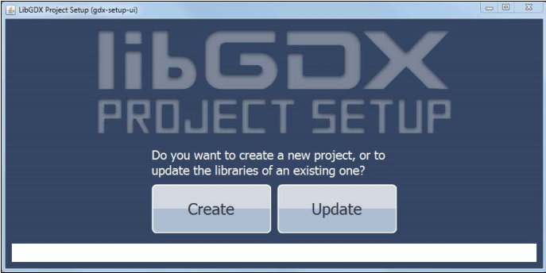
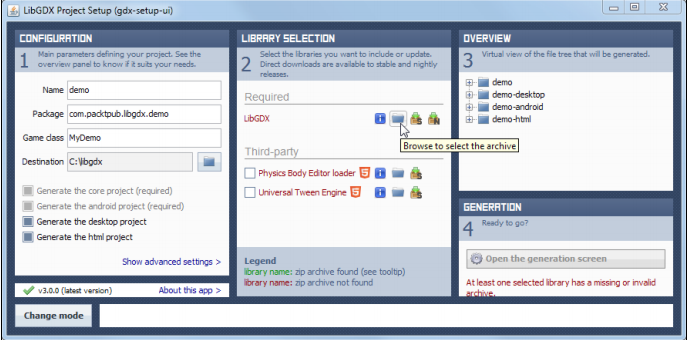
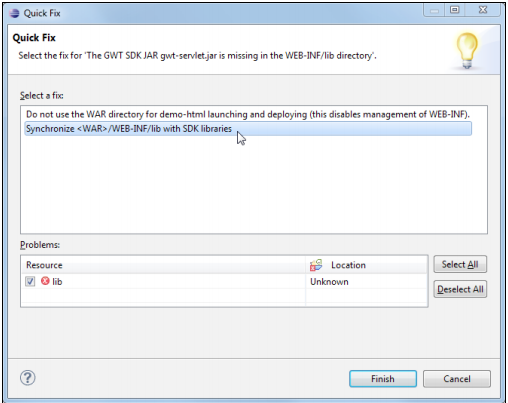
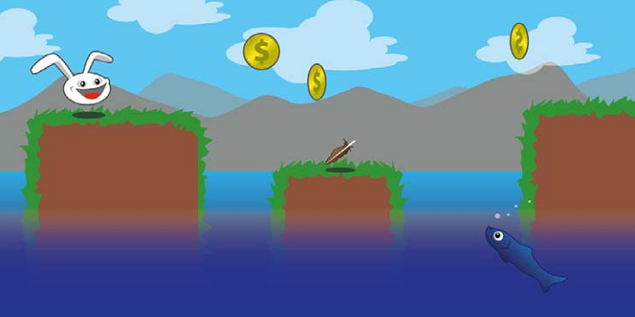

# 1. Libgdx介绍与工程搭建

例子可以运行在以下平台：
* Windows
* Linux
* Mac OS X
* Android (Version 1.5 and above)
* HTML5 (Using JavaScript and WebGL)

Libgdx是一游戏框架而不是一个游戏引擎。

## （未整理）1.2 Libgdx 0.97特性

## 1.3 社区

- 官方论坛：http://badlogicgames.com/forum/。
- Blog: http://www.badlogicgames.com/
- Wiki: http://code.google.com/p/libgdx/wiki/TableOfContents
- API overview: http://libgdx.badlogicgames.com/nightlies/docs/api/

## 1.5 创建新应用

常常需要在Eclipse中创建几个工程：一个用于公共代码，一个用于桌面启动，一个用于Android，一个用于HTML5/GWT等。

幸运的是，*Libgdx Project Setup*可以产生这些工程，你只需要导入Eclipse。

运行`gdx-setup-ui`。

工程名输入`demo`。包名`com.packtpub.libgdx.demo`。

在中间*LIBRARY SELECTION*，*LibGDX* 为红色表示需要指定该库位置。点击文件夹。选择文件。如 *libgdx-0.9.7.zip*。此时 *LibGDX* 应该变绿。

产生后，在Eclipse里，选择导入存在的工程。

The second issue requires you to click on the Problems tab in Eclipse. Open the Errors list and right-click on the reported problem, which should say The GWT SDK JAR *gwt-servlet.jar* is missing in the *WEB-INF/lib* directory. Choose Quick Fixfrom the context menu as shown in the following screenshot:

In the Quick Fix dialog, select Synchronize *[WAR]/WEB-INF/lib* with SDK librariesas the desired fix and click on the Finishbutton, as shown in the following screenshot:

## 1.6 Kicking your game to life

讨论一下游戏需要什么。总的来说，需要两方面：资源和逻辑。

## 1.8 Game project – Canyon Bunny

开发计划：
Name or Working Title: Canyon Bunny
Genre: 2D Side-Scrolling Jump and Run
List of actors:
•  Player character (can jump and move forward; controlled by player)
•  Rocks, serving as platforms for the player character and items
•  Canyons in the background (level decoration)
•  Clouds in the sky (level decoration)
•  Water at the bottom of the level (deadly for player character)
•  Collectible items for the player: gold coins, feather power-up

当角色向前时，视图向右水平滚动。背景显示远处的山和云。The bottom of the level is filled with water and will instantly kill the player character if both get into contact with each other.

The player characterwill move on and jump over to random rocks, sticking out of the water. The width and height will be different to make the game more challenging. The player is only in control of a jump button, which will keep the automatically forward-moving player character from falling down into the deadly water.

The level will be randomly populated with collectible items consisting of gold coins and feather power-ups. Collecting the gold coins will increase the player's high score. The feather power-up grants the player character the ability to fly for a limited time and can be used by repeatedly pressing the jump button. The player's goal is to beat the last high score.

The previous sketch has been created entirely by using vector graphics. Using vector graphics in favor of raster graphics for your sketches can be an advantage as they are infinitely scalable to any size without losing image quality. 但最终在游戏中使用的一般都是位图（rasterized），主要是由于矢量图实时渲染开销更大。So, the common approach is to create vector graphics and later on export them choosing an appropriate rasterized graphics file format, such as .png(Portable Network Graphics) for lossless compression with alpha channel support, or .jpg(JPEG) for lossy but high compression without alpha channel support.

创建矢量图的开源工具：[Inkscape](http://inkscape.org/)。

