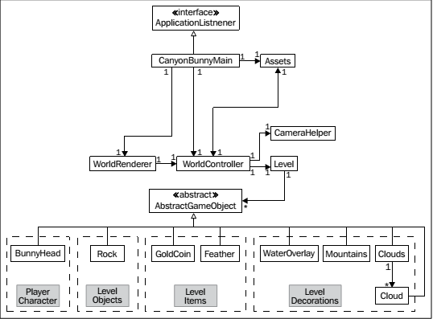

[toc]

## 2 跨平台开发：构建一次，四处部署

接下来将学习 Libgdx 框架的以下组件：
- Backends
- Modules
- Application Life-Cycle and Interface
- Starter Classes

### （未整理）2.1 demo 应用

解释了工程结构。

### 2.2 Backends

Libgdx makes use of several other libraries to interface the specifics of each platform in order to provide cross-platform support for your applications. Generally, a backend is what enables Libgdx to access the corresponding platform functionalities when one of the abstracted (platform-independent) Libgdx methods is called. For example, drawing an image to the upper-left corner of the screen, playing a sound file at a volume of 80 percent, or reading and writing from/to a file.

Libgdx 目前支持下面三种后端：
- LWJGL (Lightweight Java Game Library)
- Android
- JavaScript/WebGL

将来还会有一个 iOS backend。

#### LWJGL (Lightweight Java Game Library)

LWJGL(Lightweight Java Game Library) is an open source Java library. Libgdx用它支持桌面，包括Windows, Linux, and Mac OS X。

网站：http://www.lwjgl.org/。


#### WebGL

WebGL support is one of the latest additions to the Libgdx framework. This backend uses the GWT totranslate Java code into JavaScript and SoundManager2(SM2), among others, to add a combined support for HTML5, WebGL, and audio playback. Note that this backend requires a WebGL-capable web browser to run the application.

You might want to check out the official website of SM2:
http://www.schillmania.com/projects/soundmanager2/.

You might want to check out the official website of WebGL:
http://www.khronos.org/webgl/.

There is also a list of unresolved issues you might want to check out at
 https://github.com/libgdx/libgdx/blob/master/backends/gdx-backendsgwt/issues.txt.

### 2.3 模块

Libgdx提供6个模块。通过`Gdx`类的静态域访问这几个模块。

Libgdx允许你为不同平台设置不同的代码路径（code paths）。例如可以在PC上增加the level of detail，因为PC的计算能力更强。

#### 2.3.1 Application 模块

通过`Gdx.app`访问此模块。It gives you access to the logging facility, a method to shutdown gracefully, persist data, query the Android API version, query the platform type, and query the memory usage.

##### 2.3.1.1 日志


Libgdx 有自己的日志工具。可以设置级别。默认呢是`LOG_INFO`。可以通过配置文件设置，或在运行时动态设置：
```java
Gdx.app.setLogLevel(Application.LOG_DEBUG);
```

可以级别：
* LOG_NONE: This prints nologs. The logging is completely disabled.
* LOG_ERROR: Thisprints error logs only.
* LOG_INFO: This prints error and info logs.
* LOG_DEBUG: This prints error, info, and debug logs.

写日志：
```java
Gdx.app.log("MyDemoTag", "This is an info log.");
Gdx.app.debug("MyDemoTag", "This is a debug log.");
Gdx.app.error("MyDemoTag", "This is an error log.");
```

##### 2.3.1.2 优雅关闭

令应用关闭：
```
Gdx.app.exit();
```

The framework will then stop the execution in the correct order as soon as possible and completely de-allocate any memory that is still in use, freeing both Java and the native heap.

一定要关闭。

##### 2.3.1.3 持久化数据

利用`Preferences`类，存储键值对到文件。

```java
Preferences prefs = Gdx.app.getPreferences("settings.prefs");
```

写入值：
```java
prefs.putInteger("sound_volume", 100); // volume @ 100%
prefs.flush();
```

记得要调用`flush()`。

> 写入文件需要很多时间。尽可能一次性设置完所有值，最终调用一次`flush()`。

读取：

```java
int soundVolume = prefs.getInteger("sound_volume", 50);
```

##### 2.3.1.4 查询 Android API Level

```java
Gdx.app.getVersion();
```

##### 2.3.1.5 查询平台类型

```java
switch (Gdx.app.getType()) {
case Desktop:
	// Code for Desktop application
	break;
case Android:
	// Code for Android application
	break;
case WebGL:
	// Code for WebGL application
	break;
default:
	// Unhandled (new?) platform application
	break;
}
```

##### 2.3.1.6 查询内存使用

```java
long memUsageJavaHeap = Gdx.app.getJavaHeap();
long memUsageNativeHeap = Gdx.app.getNativeHeap();
```

#### 2.3.2 图形模块

通过`Gdx.getGraphics()`或`Gdx.graphics`获取模块。

##### 查询 delta time

当前时间与上一帧的时间差：`Gdx.graphics.getDeltaTime()`。单位秒。

##### 查询屏幕尺寸

`Gdx.graphics.getWidth()`和`Gdx.graphics.getHeight()`。单位像素。

##### 查询 FPS 计数器

Query a built-in frame counter provided by Libgdx to find the average number of frames per second by calling `Gdx.graphics.getFramesPerSecond()`.

#### 2.3.3 Audio 模块

`Gdx.getAudio()`或`Gdx.audio`。

##### 播放声音

加载声音：`Gdx.audio.newSound()`。支持格式：WAV, MP3, and OGG。

解码后的音频数据大小上限是1 MB。

##### 音乐流

To stream music for playback, call `Gdx.audio.newMusic(`).

支持格式：WAV, MP3, and OGG。

#### 2.3.4 输入模块

The input module can be accessed either through `Gdx.getInput()` or by using the shortcut variable `Gdx.input`.

In order to receive andhandle input properly, you should always implement the `InputProcessor` interface and set it as the global handler for input in Libgdx by calling `Gdx.input.setInputProcessor()`.

##### 键盘、触摸、鼠标

Query the system for the last x or y coordinate in the screen coordinates where the screen origin is at the top-left corner by calling either `Gdx.input.getX()`or `Gdx.input.getY()`.
* 判断屏幕是否被触摸或鼠标点击：`Gdx.input.isTouched()`。
* 判断鼠标按钮是否按下：`Gdx.input.isButtonPressed()`。
* 判断键盘是否按下：`Gdx.input.isKeyPressed()`。

##### 加速度计

Query theaccelerometer for its value on the x axis by calling `Gdx.input.getAccelerometerX()`. Replace the Xin the method's name with Yor Zto query the other two axes. Be aware that there will be no accelerometer present on a desktop, so Libgdx always returns 0.

##### 启动和取消震动

让Android设备震动：`Gdx.input.vibrate()`。

运行中的震动可被取消：`Gdx.input.cancelVibrate()`。


##### Catching Android soft keys

You might want to catch Android's soft keys to add an extra handling code for them. 若想捕获后退按钮：`Gdx.input.setCatchBackKey(true)`。若想捕获菜单按钮：`Gdx.input.setCatchMenuKey(true)`。

On a desktop where you have a mouse pointer, you can tell Libgdx to catch it so that you get a permanent mouse input without having the mouse ever leave the application window. To catch the mouse cursor, call `Gdx.input.setCursorCatched(true)`.

#### 2.3.5 文件模块

The filesmodule can be accessed either through `Gdx.getFiles()` or by using the shortcut variable `Gdx.files`.

##### 引用内部文件

You can get a filehandle for an internal file by calling `Gdx.files.internal()`. An internal file is relative to the `assets` folder on the Android and WebGL platforms. On a desktop, it is relative to the `root` folder of the application.

##### 引用外部文件

You can geta file handle for an external file by calling `Gdx.files.external()`. An external file is relative to the *SD card* on the Android platform. On a desktop, it is relative to the *user's home* folder. Note that this is **not available** for WebGL applications.

#### 2.3.6 网络模块

The network module can be accessed either through `Gdx.getNet()` r byusing the shortcut variable `Gdx.net`.

##### HTTP GET and HTTP POST

You can make HTTP GET and POST requests by calling either `Gdx.net.httpGet()` or `Gdx.net.httpPost()`.

##### Client/server sockets

You can create client/server sockets by calling either `Gdx.net.newClientSocket()` or `Gdx.net.newServerSocket()`.

##### Opening a URI in a web browser

To open a Uniform Resource Identifier(URI) in the default web browser, call `Gdx.net.openURI(URI)`.

### 2.4 Libgdx 应用的生命周期和接口

系统状态：create, resize, render, pause, resume, and dispose.


`ApplicationListener`接口有6个方法，对应每种系统状态。
```java
public interface ApplicationListener {
	public void create ();
	public void resize (int width, int height);
	public void render ();
	public void pause ();
	public void resume ();
	public void dispose ();
}
```


在`create()`中初始化。如加载资源，初始化游戏状态。接下来是`resize()`. This is the first opportunity for an application to adjust itself to the available display size (width and height) given in pixels.

Next, Libgdx will handle system events. If no event has occurred in the meanwhile, it is assumed that the application is (still) running. The next state would be render(). This is where a game application will mainly do two things:
- 更新游戏模型
- 将更新后的模型绘制在屏幕上

Afterwards, a decision is made upon which the platform type is detected by Libgdx. On a desktop or in a web browser, the displaying application window can be resized virtually at any time. Libgdx compares the last and current sizes on every cycle so that resize() is only called if the display size has changed. This makes sure that the running application is able to accommodate a changed display size.

Another system event that can occur during runtime is the exitevent. When it occurs, Libgdx will first change to the `pause()` state, which is a very good place to save any data that would be lost otherwise after the application has terminated. Subsequently, Libgdx changes to the dispose() state where an application should do its final clean-up to free all the resources that it is still using.

This is also almost true for *Android*, except that pause() is an intermediate state that is not directly followed by a dispose() state at first. Be aware that this event may occur anytime during application runtime while the user has pressed the Home button or if there is an incoming phone call in the meanwhile. In fact, as long as the Android operating system does not need the occupied memory of the paused application, its state will not be changed to dispose(). Moreover, it is possible that a paused application might receive a resumesystem event, which in this case would change its state to resume(), and it would eventually arrive at the system event handler again.

### 2.5 Starter 类

Starter 类是应用入口。需要为不同平台专门编写，为特定平台指定启动序列。一般该类非常只有几句代码构成，初始化平台特定的配置。启动完成后，Libgdx 框架从 Starter 类接管控制，进入跨平台共享代码，即`ApplicationListener`的实现（如`MyDemo`）。`MyDemo`是共享代码开始的地方。

#### 在桌面运行

The Starter Class forthe desktop application is called `Main.java`.

The following listing is `Main.java` from demo-desktop:

```java
package com.packtpub.libgdx.demo;
import com.badlogic.gdx.backends.lwjgl.LwjglApplication;
import com.badlogic.gdx.backends.lwjgl.LwjglApplicationConfiguration;
public class Main {
	public static void main(String[] args) {
		LwjglApplicationConfiguration cfg =
			new LwjglApplicationConfiguration();
		cfg.title = "demo";
		cfg.useGL20 = false;
		cfg.width = 480;
		cfg.height = 320;
		new LwjglApplication(new MyDemo(), cfg);
	}
}
```

This is all youn eed to write and configure a Starter Class for a desktop.

#### 在Android上运行

The Starter Class for the Android applicationis called `MainActivity.java`.

The following listing is `MainActivity.java` from demo-android:

```java
	package com.packtpub.libgdx.demo;
	import android.os.Bundle;
	import com.badlogic.gdx.backends.android.AndroidApplication;
	import com.badlogic.gdx.backends.android.AndroidApplicationConfiguration;
	public class MainActivity extends AndroidApplication {
		@Override
		public void onCreate(Bundle savedInstanceState) {
			super.onCreate(savedInstanceState);
			AndroidApplicationConfiguration cfg =
				new AndroidApplicationConfiguration();
			cfg.useGL20 = false;
			initialize(new MyDemo(), cfg);
		}
	}
```

Activity继承自`AndroidApplication`。

So when should GLES2 be used on Android? A better question to ask would be whether you plan to use shaders in your application. If this is the case, opt for GLES2. In any other case, there will be no real benefit except being able to use non-power-of-two textures (also known as NPOT textures); arbitrarily-sized textures that do not equal to widths or heightsrepresentable by the formula `2^n`, such as 32 x 32, 512 x 512, and 128 x 1024.

> NPOT textures are not guaranteed to work on all devices. For example, the Nexus One ignores NPOT textures. Also, they may cause performance penalties on some hardware, so it is best to avoid using this feature at all. In Chapter 4, Gathering Resources, you will learn about a technique called *Texture Atlas*. This will allow you to use arbitrarily-sized textures even when not using GLES2.

The following listing is `AndroidManifest.xml` from demo-android:


```xml
<?xml version="1.0" encoding="utf-8"?>
<manifest xmlns:android="http://schemas.android.com/apk/res/android"
	package="com.packtpub.libgdx.demo"
	android:versionCode="1"
	android:versionName="1.0" >
	<uses-sdk android:minSdkVersion="5"
		android:targetSdkVersion="17" />
	<application
		android:icon="@drawable/ic_launcher"
		android:label="@string/app_name" >
		<activity
			android:name=".MainActivity"
			android:label="@string/app_name"
			android:screenOrientation="landscape"
			android:configChanges="keyboard|keyboardHidden|orientation|screenSize">
			<intent-filter>
				<action android:name="android.intent.action.MAIN" />
				<category android:name="android.intent.category.LAUNCHER" />
			</intent-filter>
		</activity>
	</application>
</manifest>
```

#### （未）在带有 WebGL 的浏览器上运行

### 2.6 demo 应用代码

分析`MyDemo.java`：

```java
public class MyDemo implements ApplicationListener {
	private OrthographicCamera camera;
	private SpriteBatch batch;
	private Texture texture;
	private Sprite sprite;
}
```

We will use the orthographic camera for displaying our 2D scenes. The camera is the player's view of the actual scene in the game which is defined by a certain width and height (also called *viewport*).

For more information about projections, check out the great article *Orthographic vs. Perspective* by Jeff Lamarche at http://iphonedevelopment.blogspot.de/2009/04/opengl-es-from-ground-up-part-3.html.

The `batch` variable is of the class type `SpriteBatch`. This is where you send all your drawing commands to Libgdx. Beyond the ability of this class to draw images, it is also capable of optimizing the drawing performance under certain circumstances.

The `texture` variable is of the class type `Texture`. It holds a reference to the actual image; the texture data that is stored in memory at runtime.

The `sprite` variable is of the class type `Sprite`. It is a complex data type that contains lots of attributes to represent a graphical object that has a position in 2D space, width, and height. It can also be rotated and scaled. Internally, it holds a reference to a `TextureRegion` class that in turn is a means to cut out a certain portion of a texture.

Now that we have a basic knowledge of the involved data types, we can advance to the implementation details of the `ApplicationListener` interface.

In the MyDemo class, the only methods containing code are `create()`, `render()`, and `dispose()`. The remaining three methods are left empty, which is just fine.

#### create() 方法

```java
	@Override
	public void create() {
		float w = Gdx.graphics.getWidth();
		float h = Gdx.graphics.getHeight();
		camera = new OrthographicCamera(1, h / w);
		batch = new SpriteBatch();
		texture = new Texture(Gdx.files.internal("data/libgdx.png"));
		texture.setFilter(TextureFilter.Linear, TextureFilter.Linear);
		TextureRegion region = new TextureRegion(texture, 0, 0, 512, 275);
		sprite = new Sprite(region);
		sprite.setSize(0.9f, 0.9f * sprite.getHeight() / sprite.getWidth());
		sprite.setOrigin(sprite.getWidth() / 2, sprite.getHeight() / 2);
		sprite.setPosition(-sprite.getWidth() / 2, -sprite.getHeight() / 2);
	}
```

Then a new instance of `SpriteBatch` is created so that images can be drawn and made visible with the camera.

In order to be able to use the filled part of this image only, a new instance of `TextureRegion` is created. It references the previously loaded texture that contains the full image and has the additional information to cut out all the pixels starting from (0, 0) to (512, 275). These two points describe a rectangle starting at the top-left corner of the image with a width and height of 512 by 275 pixels. Finally, a sprite is created using the information of the previously created texture region. The sprite's size is set to 90 percent of its original size. 精灵的原点设在屏幕中央。然后设置相对位置，反向平移半个精灵大小，这样精灵就能完全居中了。

> Libgdx 的坐标原点位于屏幕左下角。This means that the positive x axis points right while the positive y axis points up.

#### render() 方法

```java
@Override
public void render() {
	Gdx.gl.glClearColor(1, 1, 1, 1);
	Gdx.gl.glClear(GL10.GL_COLOR_BUFFER_BIT);
	batch.setProjectionMatrix(camera.combined);
	batch.begin();
	sprite.draw(batch);
	batch.end();
}
```

The first two lines call low-level OpenGL methods to set the clear color to a solid white and then execute the clear screen command.

Next, the projection matrix of the sprite batch is set to the camera's combined projection and view matrix. You do not have to understand what this means in detail at the moment. It basically just means that every following drawing command will behave to the rules of an orthographic projection, or simply spoken drawing will be done in 2D space using the position and bounds of the given camera.

`begin()` 和 `end()` 总应该成对出现，且不能有嵌套，否则会出错。The actual drawing of the sprite is accomplished by calling the `draw()` method of the sprite to draw and pass the instance of the sprite batch.

#### dispose() 方法

This is the place where you should clean up and free all resources that are still in use by an application:

```java
@Override
public void dispose() {
	batch.dispose();
	texture.dispose();
}
```

每个需要分配资源（及内存）的 Libgdx 类都会实现 `Disposable` 接口。可以通过 `dispose()` 方法解除分配。

完整代码
```java
package com.packtpub.libgdx.demo;

import com.badlogic.gdx.ApplicationListener;
import com.badlogic.gdx.Gdx;
import com.badlogic.gdx.graphics.GL10;
import com.badlogic.gdx.graphics.OrthographicCamera;
import com.badlogic.gdx.graphics.Texture;
import com.badlogic.gdx.graphics.Texture.TextureFilter;
import com.badlogic.gdx.graphics.g2d.Sprite;
import com.badlogic.gdx.graphics.g2d.SpriteBatch;
import com.badlogic.gdx.graphics.g2d.TextureRegion;
public class MyDemo implements ApplicationListener {
	private OrthographicCamera camera;
	private SpriteBatch batch;
	private Texture texture;
	private Sprite sprite;
	@Override
	public void create() {
	float w = Gdx.graphics.getWidth();
	float h = Gdx.graphics.getHeight();
	camera = new OrthographicCamera(1, h / w);
	batch = new SpriteBatch();
	texture = new Texture(Gdx.files.internal("data/libgdx.png"));
	texture.setFilter(TextureFilter.Linear, TextureFilter.Linear);
	TextureRegion region = new TextureRegion(texture, 0, 0, 512, 275);
	sprite = new Sprite(region);
	sprite.setSize(0.9f, 0.9f * sprite.getHeight() / sprite.getWidth());
	sprite.setOrigin(sprite.getWidth() / 2, sprite.getHeight() / 2);
	sprite.setPosition(-sprite.getWidth() / 2, -sprite.getHeight() / 2);
	}
	@Override
	public void dispose() {
		batch.dispose();
		texture.dispose();
	}
	@Override
	public void render() {
		Gdx.gl.glClearColor(1, 1, 1, 1);
		Gdx.gl.glClear(GL10.GL_COLOR_BUFFER_BIT);
		batch.setProjectionMatrix(camera.combined);
		batch.begin();
		sprite.draw(batch);
		batch.end();
	}
	@Override
	public void resize(int width, int height) {
	}
	@Override
	public void pause() {
	}
	@Override
	public void resume() {
	}
}
```

#### 旋转

持续旋转：
```java
private float rot;
@Override
public void render() {
	Gdx.gl.glClearColor(1, 1, 1, 1);
	Gdx.gl.glClear(GL10.GL_COLOR_BUFFER_BIT);
	batch.setProjectionMatrix(camera.combined);
	batch.begin();
	final float degressPerSecond = 10.0f;
	rot = (rot + Gdx.graphics.getDeltaTime() * degressPerSecond) % 360;
	sprite.setRotation(rot);
	sprite.draw(batch);
	batch.end();
}
```

变量`rot`跟踪当前角度。

Since the Sine (or Cosine) function has an oscillating behavior, we can make perfect use of it to make the image shake by a certain amount to the left and right. The amount (amplitude) can be increased and decreased by multiplying it with the answer of the Sine function.

```java
@Override
public void render() {
	Gdx.gl.glClearColor(1, 1, 1, 1);
	Gdx.gl.glClear(GL10.GL_COLOR_BUFFER_BIT);
	batch.setProjectionMatrix(camera.combined);
	batch.begin();
	float degressPerSecond = 10.0f;
	rot = (rot + Gdx.graphics.getDeltaTime() * degressPerSecond) % 360;
	final float shakeAmplitudeInDegrees = 5.0f;
	float shake = MathUtils.sin(rot) * shakeAmplitudeInDegrees;
	sprite.setRotation(shake);
	sprite.draw(batch);
	batch.end();
}
```

## 3 配置游戏

本章开始构建游戏 **Canyon Bunny**。

### 3.1 建立 Canyon Bunny 工程

Run the **gdx-setup-ui** tool from Libgdx and use the followingsettings:
* Name: CanyonBunny
* Package: com.packtpub.libgdx.canyonbunny
* Game class: CanyonBunnyMain
* Destination: C:\libgdx
* Generate the desktop project: select the checkbox
* Generate the html project: select the checkbox

产生四个工程：CanyonBunny, CanyonBunny-desktop, CanyonBunny-android, and CanyonBunny-html.

打开`CanyonBunny-android/res/strings.xml`，修改应用名：
```xml
<string name="app_name">Canyon Bunny</string>
```

移除以下目录和文件：
* CanyonBunny/src/com/packtpub/libgdx/canyonbunny/CanyonBunnyMain.java
* CanyonBunny-android/assets/data/libgdx.png
* CanyonBunny-android/assets/data/

Then, open `CanyonBunny-desktop/com/packtpub/libgdx/canyonbunny/Main.java` and change the resolution parameters for width and height to 800 x 480 pixels like this:
```java
cfg.width = 800;
cfg.height = 480;
```

### UML



The `Assets` class that will be used to organize and simplify the way to access the game's assets.

The `WorldController` class contains all the game logic to initialize and modify the game world. It also needs access to `CameraHelper`, a helper class for the camera that, for example, enables it to target and follow any game object; `Level` that holds the level data; and a list of `AbstractGameObject` instances representing any game object that exists in the game world.

The rendering takes place in `WorldRenderer` that apparently also requires it to have access to the list of `AbstractGameObject` instances. Since the game objects need to be created before the process of modification and rendering, `Level` needs access to the list of `AbstractGameObject` instances as well when a level is loaded from a level file at the beginning of the game.

最下面一行都是`AbstractGameObject`的子类，它们都可以被渲染到游戏中。这些类按照它们的目的被分组：
- 玩家角色
  - BunnyHead：表示玩家控制的角色
- Level Objects
  - Rock: 表示一个平台，有左右边界，中间部分可以设置为任意长度。It is the ground in a level where the player will move on.
- Level Items
  - GoldCoin: 拾起后增加玩家分数。
  - Feather：拾起后可以让玩家飞行。
- Level Decorations
  - WaterOverlay: It represents an image that is attached to the camera's horizontal position，因此不管摄像头在x轴如何移动，它总是可见的。
  - Mountains: 两个山的图像，以不同的速度移动，以模拟视差幻觉（parallax optical illusion）
  - Cloud: 云，向左边慢慢移动。

### Laying foundations
