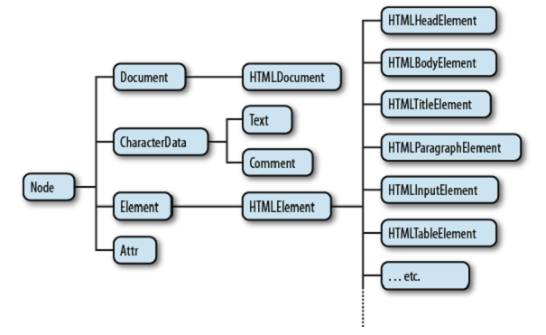

[toc]

## （未）15 用脚本处理文档

Every Window object has a `document` property that refers to a Document object. The Document object represents the content of the window.

### 15.1 DOM 概述


Figure 15-2. A partial class hierarchy of document nodes

### （未）15.2 选择文档元素

利用全局对象`document`引用 Document 对象。

#### 15.2.1 getElementById

```javascript
var section1 = document.getElementById("section1");
```

In versions of Internet Explorer prior to IE8, `getElementById()` does a case-insensitive match on element IDs and also returns elements that have a matching `name` attribute.

#### 15.2.2 getElementsByName

多个元素可以有相同的`name`特性。`name`特性只能用于部分HTML元素：包括表单、表单元素、`<iframe>`和``。

```javascript
var radiobuttons = document.getElementsByName("favorite_color");
```

`getElementsByName()`是 HTMLDocument 定义的，不是 Document 定义的。不能在XML文档中使用。它返回一个 NodeList 对象。In IE, `getElementsByName()` will also return elements that have an `id` attribute with the specified value.

在 §14.7 讲到，设置某些HTML元素的 `name` 特性，会自动为 Window 对象创建一个同步的属性。A similar thing is true for the Document object. Setting the `name` attribute of a `<form>`, ``, `<iframe>`, `<applet>`, `<embed>`, or `<object>` element (but only `<object>` elements that do not have fallback objects within them) creates a property of the **Document** object whose name is the value of the attribute (assuming, of course, that the document does not already have a property with that name).

If there is only a single element with a given name, the value of the automatically created document property is the element itself. If there is more than one element, then the value of the property is a NodeList object that acts as an array of elements. As we saw in  §14.7, the document properties created for named `<iframe>` elements are special: instead of referring to the Element object, they refer to the frame’s Window object.

What this means is that some elements can be selected by name simply by using the name as a Document property:
```javascript
	// Get the Element object for the <form name="shipping_address"> element
	var form = document.shipping_address;
```

#### 15.2.3 getElementsByTagName

### 15.8 文档和元素的几何与滚动

The properties and methods described in this section have been implemented in browsers for a long time (though some were, until recently, IE-specific and some were not implemented by IE until IE9). At the time of this writing, they are going through the W3C standardization process as the CSSOM-View Module (see http://www.w3.org/TR/cssom-view/).

#### 15.8.1 文档坐标与视口坐标

X轴向右，Y轴向下。坐标系统原点可以有两个：可以相对于文档的左上角，或文档所在的视口的左上角。For documents displayed in frames, the viewport is the `<iframe>` element that defines the frame. (Note that viewport coordinates are sometimes called window coordinates.)

We use document coordinates when we specify an element position using CSS (see Chapter 16). But the simplest way of querying the position of an element (see §15.8.2) returns the position in viewport coordinates. 在鼠标事件中，鼠标指针的坐标是视口坐标。

为了在两个坐标系统之间转换，需要先知道滚动条的位置。Window对象的`pageXOffset`和`pageYOffset`属性提供这些值。但IE 8及之前不支持。IE（和所有现代浏览器）中可以通过`scrollLeft`和`scrollTop`属性获得滚动条位置。 The confusing thing is that you normally query these properties on the root element of the document (`document.documentElement`), but in quirks mode (see §13.4.4) you must query them on the `<body>` element (`document.body`) of the document instead. 下面给出跨浏览器的解决办法：
```javascript
// Return the current scrollbar offsets as the x and y properties of an object
function getScrollOffsets(w) {
	// Use the specified window or the current window if no argument
	w = w || window;
	// 除了IE8
	if (w.pageXOffset != null) return {x: w.pageXOffset, y:w.pageYOffset};
	// For IE (or any browser) in Standards mode
	var d = w.document;
	if (document.compatMode == "CSS1Compat")
		return {x:d.documentElement.scrollLeft, y:d.documentElement.scrollTop};
	// For browsers in Quirks mode
	return { x: d.body.scrollLeft, y: d.body.scrollTop };
}
```

如何确定视口大小。As with the scroll offsets, the easy way to query viewport size does not work in IE8 and before and the technique that works in IE depends on whether the browser is in quirks mode or standards mode. Example 15-9 shows how to portably query the viewport size.
```javascript
// Return the viewport size as w and h properties of an object
function getViewportSize(w) {
	// Use the specified window or the current window if no argument
	w = w || window;
	// This works for all browsers except IE8 and before
	if (w.innerWidth != null) return {w: w.innerWidth, h:w.innerHeight};
	// For IE (or any browser) in Standards mode
	var d = w.document;
	if (document.compatMode == "CSS1Compat")
		return { w: d.documentElement.clientWidth,
			h: d.documentElement.clientHeight };
	// For browsers in Quirks mode
	return { w: d.body.clientWidth, h: d.body.clientWidth };
}
```

#### 15.8.2 元素的几何

查询元素大小和位置最简单的方法是`getBoundingClientRect()`。This method was introduced in IE5 and is now implemented by all current browsers. It expects no arguments and returns an object with
properties left, right, top, and bottom.

该方法返回的位置坐标是视口坐标。To convert to document coordinates that remain valid even if the user scrolls the browser window, add the scroll offsets:
```javascript
var box = e.getBoundingClientRect(); // Get position in viewport coordinates
var offsets = getScrollOffsets(); // Utility function defined above
var x = box.left + offsets.x; // Convert to document coordinates
var y = box.top + offsets.y;
```

In many browsers (and in the W3C standard), the object returned by `getBoundingClientRect()` also has `width` and `height` properties, but the original IE implementation does not do this. For portability, you can compute the element width and height like this:
```javascript
var box = e.getBoundingClientRect();
var w = box.width || (box.right - box.left);
var h = box.height || (box.bottom - box.top);
```

`getBoundingClientRect()`返回的坐标包含了border和padding，但不包含margin。

Inline elements, such as `<span>`, `<code>`, and `<b>` elements, however, may span multiple lines and may therefore consist of multiple rectangles. Imagine, for example, some italicized text (marked up with `<i>` and `</i>` tags) that is broken across two lines. Its rectangles consist of the right-hand portion of
the first line and the left-hand portion of the second line (assuming left-to-right text). 调用内联元素的`getBoundingClientRect()`，it returns the “bounding rectangle” of the individual rectangles. 例如，对于换行的内联元素，bounding矩形包含两个行的全部宽度。

If you want to query the individual rectangles of inline elements, call the `getClientRects()` method to obtain a read-only array-like object whose elements are rectangle objects like those returned by` getBoundingClientRect()`.


#### 15.8.3 某个位置上是那个元素

确定视口上某个位置上是哪个元素。You can determine this with the `elementFromPoint()` method of the Document object. 传入一个视口坐标（不是文档坐标！），该方法返回一个Element对象。At the time of this writing, the algorithm for selecting the element is not specified, but the intent of this method is that it returns the innermost and uppermost (see the CSS `z-index` attribute in §16.2.1.1) element at that point. If you specify a point that is outside of the viewport, `elementFromPoint()` will return `null` even if that point would be perfectly valid when converted to document coordinates.

`elementFromPoint()` seems like a very useful method, and the obvious use case is passing the coordinates of the mouse pointer to determine which element the mouse is over. As we’ll learn in Chapter 17, however, mouse event objects already include this information in their `target` property. `elementFromPoint()`很少在实际中使用。

#### 15.8.4 滚动

通过设置`scrollLeft`和`scrollTop`属性可以令浏览器滚动。但更简单的方法（很早就支持了）是，`scrollTo()`（或`scroll()`）。传入一个文档坐标，令这个点滚到视口的左上角。如果位置太接近底边或右边，则尽可能滚的远。

例子，滚到文档底部：
```javascript
// Get the height of the document and viewport. offsetHeight is explained below.
var documentHeight = document.documentElement.offsetHeight;
var viewportHeight = window.innerHeight; // Or use getViewportSize() above
// And scroll so the last "page" shows in the viewport
window.scrollTo(0, documentHeight - viewportHeight);
```

`scrollBy()`则是增量的。例子：
```javascript
// 每200毫秒滚10像素
javascript:void setInterval(function() {scrollBy(0,10)}, 200);
```

有时只是向让某个元素可见，此时最简单的方法，在此元素上调用`scrollIntoView()`。默认尝试令元素上边接近视口上边。如果传入一个false。则尝试令元素下边接近视口下边。The browser will also scroll the viewport horizontally as needed to make the element visible.

The behavior of `scrollIntoView()` is similar to what the browser does when you set `window.location.hash` to the name of a named anchor (an `<a name="">` element).

#### 元素大小、位置、浮动：更多信息

`getBoundingClientRect()`不能在老的浏览器使用。对于位置，查看只读属性`offsetWidth`和`offsetHeight`。单位像素。包含元素的 border 和 padding，不包含 margin。

所有HTML元素都有`offsetLeft`和`offsetTop`属性，返回元素的X、Y坐标。有时这些坐标是文档坐标，但对于定位元素的后代和一些元素（如单元格），组表是相对于祖先的坐标。`offsetParent`属性指出元素相对于谁定位。如果`offsetParent`为null，坐标是文档坐标。因此，计算元素位置需要循环：
```javascript
function getElementPosition(e) {
	var x = 0, y = 0;
	while(e != null) {
		x += e.offsetLeft;
		y += e.offsetTop;
		e = e.offsetParent;
	}
	return {x:x, y:y};
}
```

This is not the final word on element positioning, however—this `getElementPosition()` function does not always compute the correct values, and we’ll see how to fix it below.

除了`offset`属性组，文档元素还可以了两个属性组，一个以`client`为前缀，一个以`scroll`为前缀。That is, every HTML element has all of the following properties:
offsetWidth clientWidth scrollWidth
offsetHeight clientHeight scrollHeight
offsetLeft clientLeft scrollLeft
offsetTop clientTop scrollTop
offsetParent

In order to understand these client and scroll properties, you need to know that the content of an HTML element may be larger than the content box allocated to hold that content, and that therefore individual elements may have scrollbars (see the CSS `overflow` attribute in §16.2.6). The content area is a viewport, like the browser window is, and when the content is larger than the viewport, we need to take an element’s scrollbar position into account.

`clientWidth` and `clientHeight` are like `offsetWidth` and `offsetHeight` except that they do not include the border size, only the content area and its padding. Also, if the browser
has added scrollbars between the padding and the border, `clientWidth` and `clientHeight` do not include the scrollbar in their returned value. Note that `clientWidth` and `clientHeight` always return 0 for inline elements like.

`clientWidth` and `clientHeight` were used in the `getViewportSize()` method of Example 15-9. As a special case, when these properties are queried on the root element of a document (or the body element in quirks mode), they return the same values as the `innerWidth` and `innerHeight` properties of the window.

The `clientLeft` and `clientTop` properties are not very useful: they return the horizontal and vertical distance between the outside of an element’s padding and the outside of its border. Usually these values are just the width of the left and top borders. If an element has scrollbars, however, and if the browser places those scrollbars on the left or top (which would be unusual), `clientLeft` and `clientTop` also include the scrollbar
width. For inline elements, `clientLeft` and `clientTop` are always 0.

`scrollWidth` and `scrollHeight` are the size of an element’s content area plus its padding plus any **overflowing** content. When the content fits within the content area without overflow, these properties are the same as `clientWidth` and `clientHeight`. But when there is overflow, they include the overflowing content and return values larger than `clientWidth` and `clientHeight`.

Finally, `scrollLeft` and `scrollTop` give the scrollbar positions of an element. We queried them on the root element of the document in the `getScrollOffsets()` method (Example 15-8), but they are also defined on any element. Note that scrollLeft and scrollTop are writable properties and you can set them to scroll the content within an element. (HTML elements do not have a scrollTo() method like the Window object does.)

When a document contains scrollable elements with overflowing content, the `getElementPosition()` method defined above does not work correctly because it does not take **scrollbar** position into account. Here is a modified version that subtracts scrollbar positions from the accumulated offsets and, in so doing, converts the returned position from document coordinates to viewport coordinates:

```javascript
function getElementPos(elt) {
	var x = 0, y = 0;
	// Loop to add up offsets
	for(var e = elt; e != null; e = e.offsetParent) {
		x += e.offsetLeft;
		y += e.offsetTop;
	}
	// Loop again, through all ancestor elements to subtract scroll offsets.
	// This subtracts the main scrollbars, too, and converts to viewport coords.
	for(var e=elt.parentNode; e != null && e.nodeType == 1; e=e.parentNode) {
		x -= e.scrollLeft;
		y -= e.scrollTop;
	}
	return {x:x, y:y};
}
```

In modern browsers, this `getElementPos()` method returns the same position values as `getBoundingClientRect()` does (but is much less efficient). Theoretically, a function such as `getElementPos()` could be used in browsers that do not support `getBoundingClientRect()`. In practice, however, browsers that do not  support `getBoundingClientRect()` have a lot of element positioning incompatibilities and a function as simple as this one will not work reliably. Practical client-side libraries like **jQuery** include functions for computing element position that augment this basic position computation algorithm with a number of browser-specific bug fixes. If you need to compute element position and need your code to work in browsers that do not
support `getBoundingClientRect()`, you should probably use a library like jQuery.


```javascript
```


