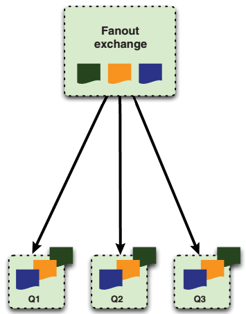
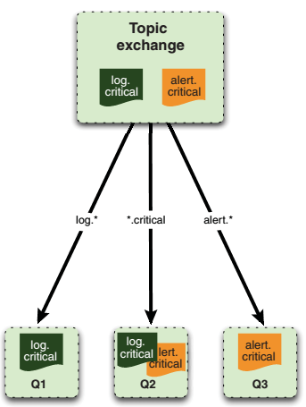

[toc]

RabbitMQ更像是联邦快递，它是一个递送服务。


## 2 理解消息

### 2.1 消费者和生产者

消息有两部分：负载和标签。标签描述负载，包括一个exchange名和一个可选的主题标签。RabbitMQ根据标签确定收信人。

消费者只会收到消息的负载，不会得到标签——甚至不知道生产者是谁。生产者可以选择将自己的标识放入负载。

收发消息前先要建立**信道**（Channel）。信道是一个真实TCP连接中的虚拟连接。每个信道有自己的唯一ID（AMQP库会帮你记住）。**一个TCP连接上可以有多个信道**，数量不限制。此举可以降低建立和销毁TCP的开销，以及，在一个TCP连接上创建新信道比创建一个新的TCP连接速度快得多。

### 2.2 队列

AMQP消息路由需要三部分：exchange、队列和绑定（bindings）。The exchanges are where producers publish their messages；队列是消息最终的归宿，消息在这里等待被消费；绑定决定消息如何从exchange路由到队列。

消费者接收消息有两种方式：

- 通过AMQP命令`basic.consume`订阅。该命令将信道置为接收模式（直到解除订阅）。在订阅过程中，在消费完一个消息后，你将自动从队列中收到下一条消息。You should use `basic.consume` if your consumer is processing many messages out of a queue and/or needs to automatically receive messages from a queue as soon as they arrive.
- 有时，只需要从队列中接收一个消息（后解除订阅）。此时，使用`basic.get`命令。不要在一个循环中使用`basic.get`。需要收取多个消息时，要用`basic.consume`。

消息进入队列时，若无消费者连接，则消息等在队列中，待消费者连接后发出。

但如果同时有多个消费者连接到队列。则一个消息只会发给队列中的一个消费者。

消费者收到的所有消息都需要被ACK：消费者需要显式发送AMQP命令`basic.ack`，或者在订阅队列时设置`auto_ack`参数为true。When `auto_ack` is specified, RabbitMQ will automatically consider the message acknowledged by the consumer as soon as **the consumer has** received it. 注意，消费者ACK消息，只是向RabbitMQ确认，于是消息可以从RabbitMQ队列中移除。与生产者无关，并不会通知生产者消息被消费。

如果消费者在收到消息后，没有ACK，就断开连接（或解除订阅）。RabbitMQ会认为该消息没有被递送成功，会递送给下一个订阅者。

如果你的APP有Bug，忘记ACK，Rabbit不会再递送消息给你。因为只有你ACK之后，Rabbit才会觉得你已准备好接收下一条。当处理大的消息时，你可以延迟ACK直到处理完。在这段时间，RabbitMQ不会递送消息，于是你的应用不会过载。

有时在收到后，你需要拒绝，而不是ACK消息。比如当你觉得自己不无法处理该消息。拒绝消息有两种方式（需要在ACK之前）：

* 断开与RabbitMQ服务器的连接。RabbitMQ会自动将消息再递送给其他消费者。任何版本的RabbitMQ都支持该方法。只是有额外开销。
* RabbitMQ 2.0.0 之后支持 AMQP 命令`basic.reject`。如果调用时，`requeue`参数为true，则RabbitMQ将重新递送给其他消费者。设置`requeue`为false，则RabbitMQ只是从队列中移除消息，不再递送。


> 为什么`basic.reject`并设置`requeue`参数为false，而不是直接ACK消息。因为 RabbitMQ 将来会支持一种特殊的 “dead letter” 队列，用于防止被拒绝且不被递送的消息。A dead letter queue lets you inspect rejected/undeliverable messages for issues. If you want your app to automatically take advantage of the dead letter queue feature when it’s added to Rabbit, use the rejectcommand with requeueset to false.

如何创建队列？消费者和生产者都可以通过`queue.declare`创建队列。But consumers can’t declare a queue while subscribed to another one on the same channel. They must first unsubscribe in order to place the channel in a “`transmit`” mode. 创建队列时，一般要指定伊特名字。否则，Rabbit会分配一个随机名，并作为`queue.declare`的返回值。(this is useful when using temporary “anonymous” queues for RPC-over-AMQPapplications, as you’ll see in chapter 4).

创建队列时的选项：

- `exclusive`：若设为true，则队列变成私有，只有你的App可以消费。
- `auto-delete`：在最后一个消费者解除订阅后自动删除队列。

当你想要声明的队列已存在时，只要声明的参数与存在的队列匹配，Rabbit什么也不会做，直接返回成功。如果参数不匹配，会返回失败。如果你只是想检查队列是否存在，可以调用`queue.declare`时，`passive`选项设为true。此时，如果队列存在，`queue.declare`会返回成功。但如果队列不存在，返回错误。


既然消费者和生产者都能创建队列，那么该由谁负责创建？不一定。首先，消费者要订阅，必须现有队列存在。另一方面，由于如果发布到到exchange的消息没有下一站的队列，则消息会被丢弃。如果丢弃消息不可接受，则应由生产者创建队列。

### 2.3 exchanges 和 bindings

消息送往队列前，需要先发到exchange。然后根据特定规则，RabbitMQ决定递送到哪个队列。规则称为routing keys。A queue is said to be bound to an exchange by a routing key. 向broker发送的消息都带一个routing key（即使为空），将与bindings的routing keys绑定。如果没有匹配的绑定，消息送入黑洞。

协议提供四种exchanges：direct, fanout, topic, and headers，实现不同的路由算法。

**headers exchange**，匹配AMQP消息中的一个头，而不是routing key。其他方面与direct exchange一致，但性能差很多。因此实际很少被使用。

**direct exchange**，如果路由键匹配，则消息会被递送到响应队列。broker必须实现direct exchange，并提供一个默认exchange，其名字为空。When a queue is declared, it’ll be automatically bound to that exchange using the queue name as routing key.
```php
$channel->basic_publish($msg, '','queue-name');
```

第一个参数是要发送的消息，第二个参数，空串，表示默认exchange，第三个参数是路由键，这里是队列名。

When the default direct exchange isn’t enough for your application’s needs, you can declare your own exchanges. You can issue the `exchange.declare` command with appropriate parameters to accomplish that.



**fanout exchange**, 将消息多播到多个绑定的队列。The messaging pattern is simple: when you send a message to a fanout exchange, it’ll be delivered to all the queues attached to this exchange. This allows you to react in different ways based on only one message. For example, a web application may require that when a user uploads a new picture, the user’s own image gallery cache must be  cleared and also they should be rewarded with some points. You can have two queues bound to the upload-pictures exchange, one with consumers clearing the cache and the other one for increasing user points. Also from this scenario, you can see the advantage of using exchanges, bindings, and queues over publishing messages directly to queues. Let’s say that the first requirement of the application was that after a picture was uploaded to the website, the user gallery cache was cleared. You can easily implement that by using just one queue, but what happens when the product owner comes to you with the new feature of giving awards to users for their actions? If you’re sending messages directly to queues, then you have to modify the publisher’s code to send message to the new points queue. If you’ve been using fanout exchanges, the only thing that you have to do is to write the code for your new consumer and then declare and bind a new queue to the fanout exchange. As we said earlier, the publisher’s code is completely decoupled from the consumer’s code, allowing you to increase your application functionality with ease.



**topic exchange**. 来自不同数据源的消息可以进入同一个队列。一个应用例子，日志系统，多种日志级别。同时应用划分为多个模块，如user-profile, image-gallery, msg-inbox等。若想报告发送消息失败（*msg-inbox*模块的错误），可以：
```php
$channel->basic_publish($msg, 'logs-exchange', 'error.msg-inbox');
```

另，绑定到`msg-inbox-errors`队列接收消息：
```php
$channel->queue_bind('msg-inbox-errors', 'logs-exchange',
	'error.msg-inbox');
```

一个相同的字符串，`error.msg-inbox`，被用于队列绑定操作和消息发布的路由键。于是消息才能送到`msg-inbox-errors`队列。

若又想让一个队列监听*msg-inbox*模块的所有消息，可以利用已存在的exchange，但绑定一个新队列：
```php
$channel->queue_bind('msg-inbox-logs', 'logs-exchange', '*.msg-inbox');
```

`msg-inbox-logs`队列将收到*msg-inbox*模块的所有日志消息。在绑定队列到exchange时可以使用通配符。一个点`.`将路由键分成几个部分，`*`匹配一部分的任意字符。而`#`匹配所有：
```php
$channel->queue_bind('all-logs', 'logs-exchange', '#');
```

`all-logs`队列将收到所有消息。Unlike the `*` operator, which considers `.` in the routing key as a part delimiter, the `#` operator has no concept of parts and considers any `.` characters as part of the key to match.


### 2.4 虚拟机

Within every RabbitMQ server is the ability to create virtual  message brokers called virtual hosts (vhosts). Each one is essentially a mini-RabbitMQ server with its own queues, exchanges, and bindings … and, more important, its own permissions. 于是多个应用可以安全的使用同一个 RabbitMQ 服务器，不必担心一个应用破坏另一个应用的队列。还能避免队列和Exchange命令的冲突。

连接时需要指定连哪个虚拟机。RabbitMQ自带一个默认的虚拟机，称为`/`。默认通过用户名*guest*和密码*guest*访问（改密码见第3章）。AMQP未规定权限粒度是虚拟机i还是服务器。对于RabbitMQ，是每个虚拟机一个权限设置。


在Rabbit创建用户后，为它至少分配一个虚拟机，则它只能访问此虚拟机的队列、exchanges、绑定。Also, 虚拟机之前的分离是绝对的。你不能把一个虚拟机上的exchange跟另一台虚拟机上的队列绑定。Hence, we highly recommend identifying the common functionality groups in your infrastructure (such as
web logging) and giving each one its own vhost. Also, keep in mind that when you create a vhost on a RabbitMQ cluster, it’s created across the entire cluster.

虚拟机和权限是AMQP的primitives，不能通过像队列一样 AMQP 协议创建。RabbitMQ中，创建需要使用`./sbin/rabbitmqctl`工具。创建虚拟机需要运行`rabbitmqctl add_vhost [vhost_name]`。删除虚拟机：`rabbitmqctl delete_vhost [vhost_name]`。列出服务器上的虚拟机：`rabbitmqctl list_vhosts`。
```
$ ./sbin/rabbitmqctl list_vhosts
Listing vhosts ...
/
oak
sycamore
...done.
```

> Typically you’ll run `rabbitmqctl` directly on the server with the RabbitMQ node you want to manage. But you can also pass  the `-n rabbit@[server_name]` option before any command to manage a remote RabbitMQ node. The node identifier (rabbit@[server_name]) is split into two parts at the `@`: the left half is the Erlang application name and will almost always be rabbit, and the right half is the server hostname or IPaddress. You need to make sure the server running the Rabbit node and the workstation you’re running `rabbitmqctl` on have the same Erlang cookie installed. For more info on Erlang cookies, check out section 3.4.1.

### 2.5 Durability、持久化、事务、发送确认

要保证消息挺过重启或服务器崩溃，需要两方面：

首先，队列和exchanges默认在重启后丢失（包括里面的消息）。该特性由队列和exchange的属性`durable`控制。默认为false。它控制RabbitMQ是否在崩溃或重启后重新创建队列或exchange。

能挺过AMQP broker崩溃的消息称为持久化消息。持久化消息需要将其delivery mode设为2。这类消息必须与durable的exchange和队列搭配。

RabbitMQ 实现持久化消息的方式是，将它们写到磁盘。When you publish a persistent message to a durable exchange, Rabbit won’t send the response until the message is committed to the log file. Keep in mind, though, that if it gets routed to a nondurable queue after that, it’s automatically removed from the persistency log and won’t survive a restart. When you use persistent messages it’s crucial that you make sure all three elements required for a message to persist are in place (we can’t stress this enough). Once you consume a persistent message from a durable queue (and acknowledge it), RabbitMQ flags it in the persistency log for garbage collection. If Rabbit restarts anytime before you consume a persistent message, it’ll automatically re-create the exchanges and queues (and bindings) and replay any messages in the persistency log into the appropriate queues or exchanges (depending on where in the routing process the messages were when Rabbit died).

将所有消息都做成持久的，缺点是性能损失。将显著降低RabbitMQ服务器的吞吐量（一个数量级）。 There’s also the issue that persistent messages don’t play well with RabbitMQ’s built-in clustering. Though RabbitMQ clustering allows you to talk to any queue present in the cluster from any node, those queues are actually evenly distributed among the nodes without redundancy(there’s no backup copy of any queue on a second node in the cluster). If the cluster  node hosting your seed_bin queue crashes, the queue disappears from the cluster until the node is restored … if the queue was durable. More important, while the node is down its queues aren’t available and the durable ones can’t be re-created. This can lead to black-holing of messages. We’ll cover the behavior in more detail and show alternate clustering approaches to get around this in chapter 5.

如果必须达到某个吞吐量，则考虑保证可靠性的其他方式。For example, your producer could listen to a reply queue on a separate channel. Every time it publishes a message, it includes the name of the reply queue so that the consumer can send a reply back to confirm receipt. If a message isn’t replied to within a reasonable amount of time, the producer can republish the message. 需要持久化的消息的数量相对于不需要持久化的消息一般少。因此可以有选择的使用。For example, we run two types of Rabbit clusters: traditional RabbitMQ clustering for nonpersistent messaging, and pairs of active/hot-standby nonclustered Rabbit servers for persistent messaging (using load balancers). This ensures the processing load for persistent messaging doesn’t slow down nonpersistent messages. It also means Rabbit’s built-in clustering won’t black-hole persistent messages when a node dies. 记住，尽管Rabbit能帮助保证递送，但它不能绝对保证。Hard drive corruption, buggy behavior by a consumer, or other extreme events can trash/black-hole persistent messages. 最终还是得由你保证。

与durability相关的概念是 AMQP 事务。So far we’ve talked about marking messages, queues, and exchanges as durable. That’s all well and good for keeping a message safe once RabbitMQ has it in its custody, but since a publish operation returns no response to the producer, how do you know if the broker has persisted the durable message to disk? Should the broker die before it can write the message to disk, the message would be lost and you wouldn’t know. That’s where transactions come in. When you absolutely need to be sure the broker has the message in custody (and has routed the message to all matching subscribed queues) before you move on to another task, you need to wrap it in a transaction. If you come from a database background, it’s important not to confuse AMQP transactions with what “transaction” means in most databases. In AMQP, after you place a channel into transaction mode, you send it the publish you want to confirm, followed by zero or more other AMQP commands that should be executed or ignored depending on whether the initial publish succeeded. Once you’ve sent all of the commands, you commit the transaction. If the transaction’s initial publish succeeds, then the channel will complete the other AMQP commands in the transaction. If the publish fails, none of the other AMQP commands will be executed. Transactions close the “last mile” gap between producers publishing messages and RabbitMQ committing them to disk, but there’s a better way to close that gap.

事务是 AMQP 规范的一部分。事务严重影响 Rabbit 的性能。Not only can using transactions drop your message throughput by a factor of 2–10x, but they also make your producer app synchronous, which is one of the things you’re trying to get rid of with messaging. 基于此，RabbitMQ 决定提供一个汇总更好的保证消息递送的方式（RabbitMQ对AMQP 的扩展）：**publisher confirms**。将信道设为 `confirm` 模式，and you can’t turn it off without re-creating the channel. 发布到此信道的所有消息将被分配一个唯一的ID（从1开始）。Once the message has been delivered to all queues that have bindings matching the message’s routing key, the channel will issue a publisher confirm to the producer app (containing the message’s unique ID). This lets the producer know the message has been safely queued at all of its destinations. If the message and the queues are durable, the confirm is issued only after the queues have written the message to disk. **publisher confirms**的主要优点是异步。Once a message has been published, the producer app can go on to the next message while waiting for the confirm. When the confirm for that message is finally received, a callback function in the producer app will be fired so it can wake up and handle the confirmation. If an internal error occurs inside Rabbit that causes a message to be lost, Rabbit will send a message nack(not acknowledged) that’s like a publisher confirm (it has the message’s unique ID) but indicates the message was lost. Also, since there’s no concept of message rollback (as with transactions), publisher confirms are much lighter weight and have an almost negligible performance hit on the Rabbit broker.

### 2.6 Putting it all together: a day in the life of a message

用Python写一个Hello World。

* **easy_install** — This handy program is part of the setuptoolsPython package and will help you install the extra packages you need for your framework.
* **Pika 0.9.6 or higher** — Besides being a cute member of the rabbit family, Pikais also the official Python AMQPlibrary produced by the guys at Rabbit.

创建一个生产者：

- Connect to RabbitMQ
- Obtain a channel
- Declare an exchange
- Create a message
- Publish the message
- Close the channel
- Close the connection

｛｛发布消息时，只关心exchange，不关心/创建队列｝｝

```py
import pika, sys
credentials = pika.PlainCredentials("guest","guest")
conn_params = pika.ConnectionParameters("localhost",
	credentials = credentials)
conn_broker = pika.BlockingConnection(conn_params)
channel = conn_broker.channel()
channel.exchange_declare(exchange="hello-exchange",
	type="direct", passive=False, durable=True, auto_delete=False)
msg = sys.argv[1]
msg_props = pika.BasicProperties()
msg_props.content_type = "text/plain"
channel.basic_publish(body=msg, exchange="hello-exchange",
	properties=msg_props, routing_key="hola")
```

By not specifying the virtual host, you’re using the default one at `/`. You’ll connect to a RabbitMQ server running on port 5672 on your local machine. You’ll use the default `guest` user and password.

创建一个消费者：

- Connect to RabbitMQ
- Obtain a channel
- Declare an exchange
- Declare a queue
- Bind the queue with the exchange
- Consume the messages
- Close the channel
- Close the connection

```py
import pika
credentials = pika.PlainCredentials("guest","guest")
conn_params = pika.ConnectionParameters("localhost", credentials = credentials)
conn_broker = pika.BlockingConnection(conn_params)
channel = conn_broker.channel()
channel.exchange_declare(exchange="hello-exchange",
	type="direct", passive=False, durable=True, auto_delete=False)
channel.queue_declare(queue="hello-queue")

channel.queue_bind(queue="hello-queue", exchange="hello-exchange", routing_key="hola")

def msg_consumer(channel, method, header, body):
	channel.basic_ack(delivery_tag = method.delivery_tag)
	if body == "quit":
		channel.basic_cancel(consumer_tag="hello-consumer")
		channel.stop_consuming()
	else:
		print body
	return
channel.basic_consume(msg_consumer, queue="hello-queue", consumer_tag="hello-consumer")
channel.start_consuming()
```

### （未）2.7 Using publisher confirms to verify delivery

## 3. 运行和管理RabbitMQ

- Erlang运行的基础知识，包括神奇的Erlang cookies
- 通过 RabbitMQ 的权限系统控制用户访问
- 使用命令行工具查看虚拟机、队列、exchanges和绑定的状态
- What to do when you see scary Erlang error messages like "badrpc,nodedown"
- 分析RabbitMQ的日志

### 3.1 管理服务器

如何启动、停止 RabbitMQ 节点，如何使用 RabbitMQ 的配置文件。

#### 3.1.1 启动节点

一个RabbitMQ服务器实例常称为一个节点。In reality, what a node really describes is an Erlang node running an Erlang application. Erlang has a virtual machine and 每个实例称为一个节点。Unlike the JVM,  multiple Erlang applications can run inside the same node, and more important, nodes can talk natively to each other (whether they’re on the same server or not). 若一个应用因故崩溃，Erlang节点将自动尝试重启应用（只要Erlang自身没有崩溃）。

通过一条命令可以在同时启动Erlang节点和Rabbit应用：`./rabbitmq-server`。 若想将Rabbit节点作为后台守护，添加`-detached`选项：`./rabbitmq -server -detached`。

#### 3.1.2 停止节点

When it comes to stopping RabbitMQ, there are two ways of doing it: the clean way and dirty way. If you run RabbitMQ attached to the console, you might be confused when you punch CTRL-Cand see something like this:

	BREAK:(a)bort (c)ontinue (p)rocinfo (i)nfo (l)oaded
	(v)ersion (k)ill (D)b-tables(d)istribution

What you’re looking at is the Erlang node asking you if you want to kill the application, the whole node, or if it’s all a mistake and you want to keep running. Generally speaking, you want to kill the whole node, so abortis what you want. But there’s a much better way to stop RabbitMQ—a way that will tell RabbitMQ to cleanly shut down and protect all those persistent queues.


`rabbitmqctl` is the one-stop shop for almost all of your RabbitMQ management needs. It can also help you stop RabbitMQ. When you run `./sbin/rabbitmqctl stop`, rabbitmqctl will communicate with the local node and instruct it to cleanly shut down. You can also specify a different node to shut down, including remote nodes, by passing the `-n rabbit@[hostname]` option. If you  watch the RabbitMQ log you’ll see something like this:

	=INFO REPORT====
		application: rabbit
		exited: stopped
		type: permanent
	=INFO REPORT====
		application: mnesia
		exited: stopped
		type: permanent
	=INFO REPORT====
		application: os_mon
		exited: stopped
		type: permanent

When you see that *rabbit*, *mnesia*, and *os_mon* are stopped, the Rabbit node is completely shut down.


#### （未）3.1.3 Stopping and restarting the application: what’s the difference?

#### 3.1.4 Rabbit配置文件

Typically, this file is located at `/etc/rabbitmq/rabbitmq.config`, but its location can be changed via the `CONFIG_FILE` environment variable set in the rabbitmq-server script. Within rabbitmq.config you’ll find a scary-looking file format:

	[ {mnesia, [{dump_log_write_threshold,1000}]},
	{rabbit, [{vm_memory_high_watermark,0.4}]} ].

What you’re looking at is essentially a raw Erlang data structure. `mnesia` specifies configuration options for the **Mnesia database** (Mnesia is what RabbitMQ uses for storing exchange and queue metadata). `rabbit` specifies RabbitMQ-specific configuration options.

> The metadata for every queue, exchange, and binding in  RabbitMQ (**but not message content**) is written to Mnesia, which is a non-SQL database built right into Erlang. Mnesia ensures RabbitMQ metadata integrity through crashes by writing first to an append-only log file. It then regularly dumps the contents of the log into the actual Mnesia database files. If you're familiar with the way a logging database like MySQL’s InnoDB or a logging filesystem like XFS works,  it's  the  same  concept.  The  Mnesia `dump_log_write_threshold` option controls how often the dumping occurs. A setting of 1000 tells Mnesia to dump the log contents into the database files every 1000 entries.

选项列表略，见书。

### 3.2 权限

The nice thing about the RabbitMQ permission system is that a  single user can be granted permissions across multiple vhosts.

#### 3.2.1 管理用户

通过`rabbitmqctl`管理用户。
添加用户，用户名为`cashing-tier`，密码为`cashMe1`：
```sh
$ ./rabbitmqctl add_user cashing-tier cashMe1
Creating user "cashing-tier" ...
...done.
```

删除用户`cashing-tier`
```sh
$ ./rabbitmqctl delete_user cashing-tier
Deleting user "cashing-tier" ...
...done.
```

列出用户：
```sh
$ ./rabbitmqctl list_users
Listing users ...
cashing-tier
guest
...done.
```

改密码：
```sh
$ ./rabbitmqctl change_passwordcashing-tier compl3xPassword
Changing password for user "cashing-tier"...
...done.
```

#### 3.2.2 Rabbit的权限系统

三个权限：

- Read：Any operation related to consuming messages, including “purging” an entire queue (also required for binding operations to succeed)
- Write：Publishing messages (also required for binding operations to succeed)
- Configure：创建或删除队列和Exchange

Table 3.3 AMQP operations-to-RabbitMQ permissions map

|AMQP命令         |配置     |写      |读      |
|----------------|--------|--------|--------|
|exchange.declare|exchange|        |        |
|exchange.delete |exchange|        |        |
|queue.declare   |queue   |        |        |
|queue.delete    |queue   |        |        |
|queue.bind      |        |queue   |exchange|
|basic.publish   |        |exchange|        |
|basic.get       |        |        |queue   |
|basic.consume   |        |        |queue   |
|queue.purge     |        |        |queue   |

访问控制项包含四部分：
- The user being granted access.
- The vhost on which the permissions apply.
- The combination of read/write/configure permissions to grant.
- The permission scope—whether the permissions apply only to client-named queues/exchanges, server-named queues/exchanges, or both. Client-named means your app set the name of the exchange/queue; server-named means your app didn’t supply a name and let the server assign a random one for you.

例如，向用户cashing-tier授予访问虚拟机sycamore的全部权限。To do this you want `rabbitmqctl`’s `set_permissions` command:

```sh
$ ./rabbitmqctl set_permissions -p sycamore \
cashing-tier ".*" ".*" ".*"
Setting permissions for user "cashing-tier"in vhost "sycamore" ...
...done.
```

Let’s take the `set_permissions` command apart, piece by piece:

- `-p sycamore` — This tells `set_permissions` which vhost the entry should apply to.
- `cashing-tier` — The user being granted the permissions.
- `".*" ".*" ".*"` — These are the granted permissions. The values map to configure, write, and read respectively.

三个权限制都是正则表达式（Perl的语法）。".*"表示匹配所有队列和exchange名。

例子，授予用户*cashing-tier*访问虚拟机*oak*。允许用户执行任何读取。限制写只能对以`checks-`开头的队列或Exchange。禁止所有配置。执行：`set_permissions`：

```sh
$ ./rabbitmqctl set_permissions -p oak \
-s all cashing-tier "" "checks-.*"".*"
Setting permissions for user "cashing-tier"in vhost "oak" ...
...done.
```

例如`list_permissions`命令查看权限：

```sh
$ ./rabbitmqctl list_permissions -p oak
Listing permissions in vhost "oak"...
cashing-tier checks-.* .* all
...done.
```

利用`clear_permissions`移除用户在特定虚拟机上的权限：

```sh
$ ./rabbitmqctl clear_permissions -p oak cashing-tier
Clearing permissions for user "cashing-tier"in vhost "oak" ...
...done.
```

利用`list_user_permissions`更新权限：

```sh
$ ./rabbitmqctl list_user_permissions cashing-tier
Listing permissions for user "cashing-tier"...
oak checks-.* .* all
sycamore .* .* .* all
...done.
```

### （未）3.3 Checking up

### （未）3.4 Fixing a bad Rabbit: troubleshooting

## 4 Solving problems with Rabbit: coding and patterns

### （粗读）4.1 A decoupling story: what pushes us to messaging

### （未）4.2 Fire-and-forget models

### （未）4.3 Remember me: RPC over RabbitMQ and waiting for answers


