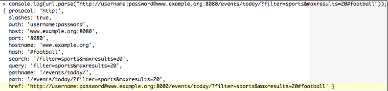

# Mastering Node.js

[TOC]

## 1 理解Node环境

### 1.1 扩展Javascript

：
- 一个Node程序/进程运行在单线程，ordering execution through an event loop
- Web applications are I/O intensive, so the focus should be on making I/O fast
- 通过异步回调推进程序流
- 昂贵的CPU操作应该分解为多个独立的并行的进程（processes），得到结果后发出事件
- 复杂的程序由简单的程序组装而成

基本原则是，操作永远不要阻塞。特别是等待I/O。

#### 1.1.1 事件

Node对Javascript的多数扩展都会发出事件。这些事件是`events.EventEmitter`的实例。对象可以扩展`EventEmitter`。

```javascript
var EventEmitter = require('events').EventEmitter;
var Counter = function(init) {
    this.increment = function() {
    	init++;
        this.emit('incremented', init);
    }
}
Counter.prototype = new EventEmitter();
var counter = new Counter(10);
var callback = function(count) {
	console.log(count);
}
counter.addListener('incremented', callback);
counter.increment(); // 11
counter.increment(); // 12
```

要移除监听器，调用`counter.removeListener('incremented', callback)`。`counter.on`等价于`counter.addListener`。

创建一个`Readable`流，将所有推入流的数据pipe进`process.stdout`。Every 500 milliseconds we increment a counter and push that number (adding a newline) onto the stream, resulting in an incrementing series of numbers being written to the terminal. When our series has reached its limit (10), we push null onto the stream, causing it to terminate.

```javascript
var Readable = require('stream').Readable;
var readable = new Readable;
var count = 0;
readable._read = function() {
	if(++count > 10) {
		return readable.push(null);
	}
    setTimeout(function() {
        readable.push(count + "\n");
    }, 500);
};
readable.pipe(process.stdout);
```
Don't worry if you don't fully understand how Readable is implemented here—streams will be fully explained in the following chapters. Simply note how the act of pushing data onto a stream causes a corresponding event to fire, how the developer can assign a custom callback to handle this event, and how newly added data can be redirected to other streams. Node is designed such that I/O operations are consistently implemented as asynchronous, evented data streams.

It is also important to note the importance of this style of I/O. Because Node's event loop need only commit resources to handling callbacks, many other instructions can be processed in the down time between each interval.

As an exercise, re-implement the previous code snippet such that the emitted data is piped to a file. You'll need to use `fs.createWriteStream`:
var fs = require('fs');
var writeStream = fs.createWriteStream("./counter", {
    flags : 'w',
    mode: 0666
});

#### 1.1.2 模块化

Node引入了**package**的概念，遵从CommonJS specification。A package is a collection of program files bundled with a manifest file describing the collection. Dependencies, authorship, purpose, structure, and other important meta-data are exposed in a standard way.

Node的包有Node's package management system, **npm** 管理。

More extensive information on creating and managing Node packages can be found in *Appendix A, Organizing Your Work*. The key point is this: build programs out of packages where possible, and share those packages when possible. The shape of your applications will be clearer and easier to maintain. Importantly, the efforts of thousands of other developers can be linked into applications via npm, directly by inclusion, and indirectly as shared packages are tested, improved, refactored, and repurposed by members of the Node community.

#### 1.1.3 网络

除了HTTP，Node还支持几种标准的网络协议，如 **TLS/SSL** 和 **UDP**。


一个简单的例子，两个UDP服务器通讯：
```javascript
var dgram = require('dgram');
var client = dgram.createSocket("udp4");
var server = dgram.createSocket("udp4");
var message = process.argv[2] || "message";
message = new Buffer(message);
server.on("message", function (msg) {
    process.stdout.write("Got message: " + msg + "\n");
    process.exit();
}).bind(41234);
client.send(message, 0, message.length, 41234, "localhost");
```
假设文件名是`udp.js`，执行
```shell
node udp.js "my message"
```
结果：
```shell
Got message: my message
```

UDP要求消息是`Buffer`对象。一个UDP服务器是`EventEmitter`的一个实例，当收到消息时，它会发出一个`message`事件。

## 1.2 V8

尽管Node自己能有效管理I/O操作，它的`process`对象指的是 V8 运行时。因此，例如如何配置 V8 环境很重要，特别是当应用变大时。

输入`node -h`，得到：

```shell
Usage: node [options] [ -e script | script.js ] [arguments]
       node debug script.js [arguments]

Options:
  -v, --version        print node's version
  -e, --eval script    evaluate script
  -p, --print          evaluate script and print result
  -i, --interactive    always enter the REPL even if stdin
                       does not appear to be a terminal
  --no-deprecation     silence deprecation warnings
  --trace-deprecation  show stack traces on deprecations
  --v8-options         print v8 command line options
  --max-stack-size=val set max v8 stack size (bytes)
```

通过`–-v8-options`列出 V8 的选项。相关选项很多，这里值结合骚与系统限制和内存有关的。及配置JavaScript的命令集，包含 **ES6(EcmaScript6)**（也称**Harmony**）的一些新特性。

列出Node使用的 V8 版本：

```shell
node -e "console.log(process.versions.v8)"
```
### 1.2.1 内存和其他限制

一个重要选项`--max-stack-size`已作为Node自己的选项。

写一个能挂掉  V8 的程序：
```javascript
var count = 0;
(function curse() {
	console.log(++count);
	curse();
})()
```

这个无限递归最终会导致运行时报`RangeError: Maximum call stack size exceeded.`。

`--max-stack-size`等价的 V8 选项是`–-stack_size`，单位是 KB。

在32位和64位系统下，V8 默认的内存分别是700 MB 和 1400 MB。在新版本的 V8，64位系统上的内存限制不再由 V8限制，理论上是无限。但 V8 运行的操作系统可能限制它的内存。因此最终的限制不确定。

V8 makes available the `--max_old_space_size` option, which allows control over the amount of memory available to a process, accepting a value in MB. Should you need to increase memory allocation, simply pass this option the desired value when spawning a Node process.

It is often an excellent strategy to reduce the available memory allocation for a given Node instance, especially when running many instances. As with stack limits, 考虑大量的内存需求是否应该代理给一个存储层，如内存数据库。

> An informative discussion with the V8 team regarding their views on how memory should be allocated can be found here:
http://code.google.com/p/v8/issues/detail?id=847

控制GC的主要选项是`–-nouse_idle_notification`和`–-expose_gc`。

Passing the `–-nouse_idle_notification` flag will tell V8 to ignore idle notification calls from Node, which are requests to V8 asking it to run GC immediately, as the Node process is currently idle. Because Node is aggressive with these calls (efficiency breeds clean slates), an excess of GC may slow down your application. Note that using this flag does not disable GC; GC simply runs less often. In the right circumstances this technique can increase performance.

`--expose_gc` introduces a new global method to the Node process, `gc()`, which allows JavaScript code to manually start the GC process. In conjunction with `–-nouse_idle_notification` the developer can now control to some degree how often GC runs. At any point in my JavaScript code I can simply call `gc()` and start the collector.

### （未）1.2.2 Harmony

> More information on ES6 Harmonycan be found at:
http://wiki.ecmascript.org/doku.php?id=harmony:harmony.

## 1.3 process 对象

We are now going to discuss, in detail, how instructions that you write (a JavaScript program) are compiled by V8 into a list of instructions whose execution context is accessible via the native Node `process` object.

构成Node事件循环核心的单线程是V8的事件循环。When I/O operations are initiated within this loop they are delegated to *libuv*, which manages the request using its own (multi-threaded, asynchronous) environment. *libuv* 在I/O操作完成后通知回调，回调在 V8 主线程上执行：


Node的`process`对象提供当前运行的进程的信息，还能控制当前进程的运行。它也是一个`EventEmitter`。可以在任何地方访问`process对象。
```javascript
var size = process.argv[2];
var totl = process.argv[3] || 100;
var buff = [];
for(var i=0; i < totl; i++) {
	buff.push(new Buffer(size));
	process.stdout.write(process.memoryUsage().heapTotal + "\n");
}
```
执行（加入文件叫`process.js`）：
```shell
> node process.js 1000000 100
```

实际上，在Node中`console.log`的实现仅是包裹了`process.stdout.write`：
```javascript
console.log = function (d) {
	process.stdout.write(d + '\n');
};
```

A Node process begins by constructing a single execution stack, with the global context forming the base of the stack. Functions on this stack execute within their own, local, context (sometimes referred to as scope), which remains enclosed within the global context (which you'll hear referred to as closure). Because Node is evented, any given execution context can commit the running thread to handling an eventual execution context. This is the purpose of callback functions.

Consider the following schematic of a simple interface for accessing the filesystem:


If we were to instantiate `Filesystem` and call `readDir` a nested execution context structure would be created: `(global (fileSystem (readDir (anonymous function) ) ) )`. The concomitant execution stack is introduced to Node's single process thread. This stack remains in memory until *libuv* reports that `fs.readdir` has completed, at which point the registered anonymous callback fires, resolving the sole pending execution context. As no further events are pending, and the maintenance of closures no longer necessary, the entire structure can be safely torn down (in reverse, beginning with anonymous), and the process can exit, freeing any allocated memory. This method of building up and tearing down a single stack is what Node's event loop is ultimately doing.

## （未）1.4 REPL和执行Node程序

# 2 理解异步事件驱动编程

## 2.1 广播事件

I/O是昂贵的。In the following chart (taken from Ryan Dahl's original presentation on Node) we can see how many clock cycles typical system tasks consume.

| 存储| 消耗CPU周期 |
|--------|--------|
| L1 cache | 3 cycles  |
| L2 cache | 14 cycles |
| RAM      | 250 cycles |
| Disk     | 41,000,000 cycles |
| Network  | 240,000,000 cycles |

## 2.2 监听事件

Node中暴露事件接口的多数对象，如文件、网络流，都将`EventEmitter`作为其原型（prototype）。

但本节的目的是讨论一些更少人知晓的事件源：signals, child process communication, filesystem change events, and deferred execution.

## （未）2.2.1 Signals

## 2.2.2 Forks

Node设计的一个基础是，当需要并行执行时，创建或fork进程，而不是创建线程。We will be using child processes in various ways throughout this book, and learn how to create and use them. 这里主要关注子进程之间如何通讯。

要创建一个子进程，调用`child_process`模块的`fork`方法，传入新进程要执行的文件名：
```javascript
var cp = require('child_process');
var child = cp.fork(__dirname + '/lovechild.js');
```

在多核机器上，forked进程一般会被OS分配到不同的核上。Spreading node processes across cores (even other machines) and managing IPC is (one) way to scale a Node application in a stable, understandable, and predictable way.

父进程可以向子进程发送消息，或监听子进程的消息。
```javascript
child.on('message', function(msg) {
	console.log('Child said: ', msg);
});
child.send("I love you");
```

通用，子进程（程序定义在`lovechild.js`）也可以发送、监听消息：
```javascript
// lovechild.js
process.on('message', function(msg) {
	console.log('Parent said: ', msg);
	process.send("I love you too");
});
```

Another very powerful idea is to pass a network server an object to a child. This technique allows multiple processes, including the parent, to share the responsibility for servicing connection requests, spreading load across cores.

例如，下面程序启动一个服务器，fork一个子进程，然后把服务器传给子进程：
```javascript
var child = require('child_process').fork('./child.js');
var server = require('net').createServer();
server.on('connection', function(socket) {
	socket.end('Parent handled connection');
});
server.listen(8080, function() {
	child.send("The parent message", server);
});
```

In addition to passing a message to a child process as the first argument to send, the preceding code also sends the server handle to itself as a second argument. Our child server can now help out with the family's service business:
```javascript
// child.js
process.on('message', function(msg, server) {
    console.log(msg);
    server.on('connection', function(socket) {
        socket.end('Child handled connection');
    });
});
```

连续请求，将被子进程或父进程处理：两个进程在负载平衡。It should be clear that this technique, when combined with the simple inter-process messaging protocol discussed previously, demonstrates how Ryan Dahl's creation succeeds in providing an easy way to build scalable network programs.

> 我们会讨论Node的新模块`cluster`，它扩展和简化了上面讨论的技术。If you are interested in how server handles are shared, visit the cluster documentation at the following link:
http://nodejs.org/api/cluster.html
For those who are truly curious, examine the clustercode itself at:
https://github.com/joyent/node/blob/c668185adde3a474585a11f172b8387e270ec23b/lib/cluster.js#L523-558

### 2.2.3 文件事件

通过`fs.watch`方法可以监听文件系统通知。The `watch` method will broadcast changed events on both files and directories.

`watch`接受三个参数，依次是：
1. 监控的文件或目录的路径。如果文件不存在，将抛出**ENOENT(no entity)**错误。可以先使用`fs.exists`检查。
2. 一个可选的选项对象：
  - persistent (Boolean): Node keeps processes alive as long as there is "something to do". An active file watcher will by default function as a persistence flag to Node. Setting this option to false flags not keeping the general process alive if the watcher is the only activity keeping it running.
3. 监听器函数。接受两个参数：
  - 事件名（`rename`或`change`）。
  - 发生改变的文件名(important when watching directories). Some operating systems will notreturn this argument.

This example will set up a watcher on itself, change its own filename, and exit:
```javascript
var fs = require('fs');
fs.watch(__filename, { persistent: false }, function(event, filename) {
    console.log(event);
    console.log(filename);
})
setImmediate(function() {
	fs.rename(__filename, __filename + '.new', function() {});
});
```

可以在任何时候关闭监控：
```javascript
var w = fs.watch('file', function(){})
w.close();
```

It should be noted that `fs.watch` depends a great deal on how the host OS handles file events, and according to the Node documentation:

    "The fs.watch API is not 100% consistent across platforms, and is unavailable in some situations."

### 2.2.4 Deferred execution

经常需要推迟一个函数的执行。Javascript传统上使用定时器：`setTimeout`和`setInterval`。Node introduces another perspective on defers, primarily as means of controlling the order in which a callback executes in relation to I/O events, as well as timer events properly.

We'll learn more about this ordering in the event loop discussion that follows. For now we will examine two types of deferred event sources that give a developer the ability to schedule callback executions to occur either before, or after, the processing of queued I/O events.

#### process.nextTick

Node本地模块`process`的`process.nextTick`方法类似于`setTimeout`，延迟执行回调方法。`nextTick`的回调方法会被放置在事件对象头部，在I/O或定时器事件之前，但在当前脚本之后执行（JavaScript代码在 V8 线程上同步执行）。

在函数中，`nextTick`的主要用途是，postpone the broadcast of result events to listeners on the current execution stack until the caller has had an opportunity to register event listeners—to give the currently executing program a chance to bind callbacks to `EventEmitter.emit` events. It may be thought of as a pattern used wherever asynchronous behavior should be emulated. For instance, imagine a lookup system that may either fetch from a cache or pull fresh data from a data store. The cache is fast and doesn't need callbacks, while the data I/O call would need them. The need for callbacks in the second case argues for emulation of the callback behavior with `nextTick` in the first case. This allows a consistent API, improving clarity of implementation without burdening the developer with the responsibility of determining whether or not to use a callback.

The following code seems to set up a simple transaction; when an instance of `EventEmitter` emits a `start` event, log "Started" to the console:

```javascript
var events = require('events');
function getEmitter() {
	var emitter = new events.EventEmitter();
	emitter.emit('start');
	return emitter;
}
var myEmitter = getEmitter();
myEmitter.on("start", function() {
	console.log("Started");
});
```

However, the expected result will not occur. The event emitter instantiated within getEmitter emits "start" previous to being returned, wrong-footing the subsequent assignment of a listener, which arrives a step late, missing the event notification.

使用`process.nextTick`解决该问题：

```javascript
var events = require('events');
function getEmitter() {
	var emitter = new events.EventEmitter();
	process.nextTick(function() {
		emitter.emit('start');
	});
	return emitter;
}
var myEmitter = getEmitter();
myEmitter.on('start', function() {
	console.log('Started');
})
```

Because it is possible to recursively call `nextTick`, which might lead to an infinite loop of recursive `nextTick` calls (starving the event loop, preventing I/O), there exists a *failsafe* mechanism in Node which limits the number of recursive `nextTick` calls evaluated prior to yielding the I/O: `process.maxTickDepth`. Set this value (which defaults to 1000) if such a construct becomes necessary—although what you probably want to use in such a case is `setImmediate`.

##### setImmediate

`setImmediate`类似于`process.nextTick`，但区别在于：`nextTick`的回调在I/O和定时器事件之前调用，但`setImmediate`的回调在I/O事件之后调用。

> The naming of these two methods is confusing: `nextTick` occurs before `setImmediate`.

This method does reflect the standard behavior of timers in that its invocation will return an object which can be passed to `cancelImmediate`, cancelling `setImmediate` in the same way `cancelTimeout` cancels timers set with `setTimeout`.

## 2.3 定时器

JavaScript提供两种异步定时器：`setInterval()`和`setTimeout()`。

执行回调前实际的延迟时间可能比设置的时间略长。执行的次序也是不可保证的。Node的定时器是不可中断的。Timers simply promise to execute as close as possible to the specified time (though never before), beholden, as with every other event source, to event loop scheduling.

> At least one thing you may not know about timers...
We are all familiar with the standard arguments to setTimeout: a callback function and timeout interval. Did you know that many additional arguments are passed to the callback function?
```javascript
setTimeout(callback, time, [passArg1, passArg2…])
```

### 2.3.1 setTimeout

延迟一些毫秒后执行：

```javascript
setTimeout(a, 1000);
setTimeout(b, 1001);
```

`a`不一定先于`b`执行。

另一种情况：
```javascript
setTimeout(a, 1000);
setTimeout(b, 1000);
```

执行顺序是确定的。Node essentially maintains an object map grouping callbacks with identical timeout lengths. *Isaac Schlueter*, the current leader of the Node project, puts it this way:

    [N]ode uses a single low level timer object for each timeout value. If you attach multiple callbacks for a single timeout value, they'll occur in order, because they're sitting in a queue. However, if they're on different timeout values, then they'll be using timers in different threads, and are thus subject to the vagaries of the [CPU] scheduler.

The ordering of timer callbacks registered within an identical execution scope does not predictably determine the eventual execution order in all cases.

Additionally, there exists a minimum wait time of one millisecond for a timeout. Passing a value of zero, -1, or a non-number will be translated into this minimum value.

### 2.3.2 setInterval

周期性执行一个功能。例如，每100毫秒执行一次：
```javascript
var intervalId = setInterval(function() { ... }, 100);
```

通过`clearInterval(intervalId)`取消。

与`setTimeout`一样不可靠。Importantly, if a system delay (such as some badly written blocking whileloop) occupies the event loop for some period of time, intervals set prior and completing within that interim will have their results queued on the stack. 当事件循环不再阻塞，所有的回调将被立即调用（串行）。

幸运的是，Node中的intervals比浏览器中可靠很多。

### 2.3.3 unref 和 ref

A Node program does not stay aliv ewithout a reason to do so. 如果有回调尚未被处理，进程将继续运行。完成后，进程没什么可做，于是退出。例如，下面的代码会让Node进程一直运行：
```javascript
Var intervalId = setInterval(function() {}, 1000);
```

There are cases of using a timer to do something interesting with external I/O, or some data structure, or a network interface where once those external event sources stop occurring or disappear, the timer itself stops being necessary. Normally one would trap that irrelevantstate of a timer somewhere else in the program and cancel the timer from there. This can become difficult or even clumsy, as an unnecessary tangling of concerns is now necessary, an added level of complexity.

The `unref` method allows the developer to assert the following instructions: when this timer is the only event source remaining for the event loop to process, go ahead and terminate the process.

例如，下面的代码会让进程结束，不再一直运行：
```javascript
var intervalId = setInterval(function() {}, 1000);
intervalId.unref();
```

`unref`方法是创建定时器时返回的对象。

现在加入一个外部事件源（一个定时器）。当外部事件源结束后，进程终止。
```javascript
setTimeout(function() {
	console.log("now stop");
}, 100);
var intervalId = setInterval(function() {
	console.log("running")
}, 1);
intervalId.unref();
```

利用`ref`方法可以让定时器回到常规的状态，它的作用是取消`unref`方法：
```javascript
var intervalId = setInterval(function() {}, 1000);
intervalId.unref();
intervalId.ref();
```

此时，进程又将一直运行下去。

## 2.4 理解事件循环

Node使用单个线程处理Javascript指令。在你的Javascript中，两句代码不可能同时执行。

这并不意味着Node进程所在的机器只使用一个线程。回调并不产生并发。Recall Chapter 1, Understanding the Node Environment, and our discussion about the `process` object—Node's "single thread" simplicity is in fact an abstraction created for the benefit of developers. 但一定要记得，有大量线程在背后管理I/O（和其他东西），and these threads unpredictably insert instructions, originally packaged as callbacks, into the single JavaScript thread for processing.

Node executes instructions one by one until there are no further instructions to execute, no more input or output to stream, and no further callbacks waiting to be handled.

Even deferred events (such as timeouts) require an eventual interrupt in the event loop to fulfill their promise.

下面的代码，本期望1秒后改变`stop`的值。但实际while循环将无限执行下去。While循环反复执行，一直占据着事件循环。事件循环无法给定时器回调机会执行。
```javascript
var stop = false;
setTimeout(function() {
	stop = true;
}, 1000);
while(stop === false) {};
```

写Node就是写事件循环。We've previously discussed the event sources that are queued and otherwise arranged and ordered on this event loop — I/O events, timer events, and so on.

When writing non-deterministic code it is imperative that no assumptions about eventual callback orders are made. The abstraction that is Node masks the complexity of the thread pool on which the straightforward main JavaScript thread floats, leading to some surprising results.

We will now refine this general understanding with more information about how, precisely, the callback execution order for each of these types is determined within Node's event loop.

### Four sources of truth

我们已经学习了四组主要的事件源（deferred event sources），下面总结它们在栈中的位置和优先级：
- 执行代码块（Execution blocks）：Javascript代码，包括表达式、循环、函数。This includes `EventEmitter` events emitted within the current execution context.
- 定时器：Callbacks deferred to sometime in the future specified in milliseconds, such as `setTimeout` and `setInterval`.
- I/O：Prepared callbacks returned to the main thread after being delegated to Node's managed thread pool, such as filesystem calls and network listeners.
- Deferred execution blocks: Mainly the functions slotted on the stack according to the rules of `setImmediate` and `nextTick`.

We have learned how the deferred execution method `setImmediate` slots its callbacks after I/O callbacks in the event queue, and `nextTick` slots its callbacks before I/O and timer callbacks.

> A challenge for the reader
After running the following code, what is the expected order of logged messages?

```javascript
var fs = require('fs');
var EventEmitter = require('events').EventEmitter;
var pos = 0;
var messenger = new EventEmitter();
// Listener for EventEmitter
messenger.on("message", function(msg) {
	console.log(++pos + " MESSAGE: " + msg);
});
// (A) FIRST
console.log(++pos + " FIRST");
// (B) NEXT
process.nextTick(function() {
	console.log(++pos + " NEXT")
})
// (C) QUICK TIMER
setTimeout(function() {
	console.log(++pos + " QUICK TIMER")
}, 0)
// (D) LONG TIMER
setTimeout(function() {
	console.log(++pos + " LONG TIMER")
}, 10)
// (E) IMMEDIATE
setImmediate(function() {
	console.log(++pos + " IMMEDIATE")
})
// (F) MESSAGE HELLO!
messenger.emit("message", "Hello!");
// (G) FIRST STAT
fs.stat(__filename, function() {
	console.log(++pos + " FIRST STAT");
});
// (H) LAST STAT
fs.stat(__filename, function() {
	console.log(++pos + " LAST STAT");
});
// (I) LAST
console.log(++pos + " LAST");
```

The output of is program is:
1.  FIRST (A).
2.  MESSAGE: Hello! (F).
3.  LAST (I).
4.  NEXT (B).
5.  QUICK TIMER (C).
6.  FIRST STAT (G).
7.  LAST STAT (H).
8.  IMMEDIATE (E).
9.  LONG TIMER (D).

Let's break the preceding code down:
A, F, and I execute in the main program flow and as such they will have the first priority in the main thread (this is obvious; your JavaScript executes its instructions in the order they are written, including the synchronous execution of the `emit` callback).

With the main call stack exhausted, the event loop is now almost reading to process I/O operations. This is the moment when nextTick requests are honored slotting in at the head of the event queue. This is when B is displayed.
The rest of the order should be clear. Timers and I/O operations will be processed next, (C, G, H) followed by the results of the `setImmediate` callback (E), always arriving after any I/O and timer responses are executed.

Finally, the long timeout (D) arrives, being a relatively far-future event.
Notice that re-ordering the expressions in this program will notchange the output order (outside of possible re-ordering of the STAT results, which only implies that they have been returned from the thread pool in different order, remaining as a group in the correct order as relates to the event queue).

## 2.5 回调和错误

### 2.5.1 约定

遵循：
- 回调函数的第一个参数是错误消息，最好是一个错误对象。如果没有错误，应该传`null`。
- 向函数传入一个回调，回调应该是函数的最后一个参数。APIs should be consistently designed this way.
- 错误参数和回调参数之间可以有任意数量的参数。

创建错误对象：
```javascript
new Error("Argument must be a String!")
```

### 2.5.2 了解你的错误

It is excellent that the Node community has automatically adopted a convention that compels developers to be diligent and report errors. However, what does one do with errors once they are received?

It is generally a very good idea to centralize error handling in a program. Often, a custom error handling system will be designed, which may send messages to clients, add to a log, and so on. Sometimes it is best to `throw` errors, halting the process.

Node为错误处理提供了更高级的工具。In particular, Node's `domain` system helps with a problem that evented systems have: how can a stack trace be generated if the full route of a call has been obliterated as it jumped from callback to callback?

The goal of `domain` is simple: fence and label an execution context such that all events that occur within it are identified as such, allowing more informative stack traces. By creating several different domains for each significant segment of your program, a chain of errors can be properly understood.

Additionally, this provides a way to catch errors and handle them, rather than allowing your entire Node process to collapse.

In the following example we're going to create two domains: `appDomain` and `fsDomain`. 目标是追踪应用的哪部分目前正处于错误状态：
```javascript
var domain = require("domain");
var fs = require("fs");
var fsDomain = domain.create();
fsDomain.on("error", function(err) {
	console.error("FS error", err);
});
var appDomain = domain.create();
appDomain.on('error', function(err) {
	console.log("APP error", err);
});
```

现在将主程序包裹进`appDomain`，将文件系统调用包裹进`fsDomain`。We then create an error in `fsDomain` by trying to open a non-existent file:
```javascript
appDomain.run(function() {
    process.nextTick(function() {
    	fsDomain.run(function() {
    		fs.open('no_file_here', 'r', function(err, fd) {
    			if(err) {
    				throw err;
    			}
    			appDomain.dispose();
    		});
    	});
    });
});
```

When thepreceding code executes, something resembling this should be echoed to the terminal:
```shell
FS error { [Error: ENOENT, open 'non-existent file']
    errno: 34,
    code: 'ENOENT',
    path: 'non-existent file',
    domain: 
        { domain: null,
          _events: { error: [Function] },
          _maxListeners: 10,
          members: [] },
    domainThrown: true }
```

Now let's create an error in `appDomain` by adding this code, which will produce a reference error (as no `b` is defined):
```javascript
appDomain.run(function() {
	a = b;
	process.nextTick(function() {
...
```

An error similar to that in the precious code should be generated and reported by appDomain.

Notice the command `appDomain.dispose`. As maintaining these error contexts will consume some memory, it is best to dispose of them when no longer needed—after the code they contain has successfully executed, for example. We'll learn more advanced uses of this tool as we progress into more complex territories.

As an application grows in complexity it will become more and more useful to be able to trap errors and handle them properly, perhaps restarting only one part of an application when it fails rather than the entire system.

### 2.5.3 建造金字塔

Simplifying controlflows has been a concern of the Node community since the very beginning of the project. Indeed, this potential criticism was one of the very first anticipated by Ryan Dahl, who discussed it at length during the talk in which he introduced Node to the JavaScript developer community.

Node代码经常回调嵌套回调，Node代码常常像一个侧放的金字塔。

Accordingly, there are several Node packages available which take the problem on, employing strategies as varied as futures, fibers, even C++ modules exposing system threads directly.
- Async https://github.com/caolan/async
- Tame https://github.com/maxtaco/tamejs
- Fibers https://github.com/laverdet/nodefibers
- Promises https://github.com/kriskowal/q

> Mikeal Rogers, in discussing why Promises were removed from the Node core, makes a strong argument in the following link for why leaving feature development to the community leads to a stronger core product:
http://www.futurealoof.com/posts/broken-promises.html

### （未）2.5.4 思考

## 2.6 监听对文件的改变

实践之前学到的知识。创建一个服务，客户端可以接收Twitter的更新。We will first create a process to query Twitter for any messages with the *hashtag#nodejs*, and writes any found messages to a *tweets.txt* file in 140-byte chunks. We will then create a network server that broadcasts these messages to a single client. Those broadcasts will be triggered by write events on the *tweets.txt* file. Whenever a write occurs, 140-byte chunks are asynchronously read from the last known client read pointer. This will happen until we reach the end of the file, broadcasting as we go. Finally, we will create a simple *client.html* page, which asks for, receives, and displays these messages.

本例展示了：
- 监听文件系统事件
- 使用数据流事件读写文件
- 响应网络事件
- Using timeouts for polling state
- 将Node服务器作为网络事件的广播者

处理服务器广播，使用Server Sent Events(SSE)协议，该协议是HTML5的一部分。

先创建一个Node服务器，监听文件改变，广播内容到客户端。创建`server.js`文件：
```javascript
var fs = require("fs");
var http = require('http');
var theUser = null;
var userPos = 0;
var tweetFile = "tweets.txt";
```

我们只接受单个用户连接，whose pointer will be `theUser`. The `userPos` will store the last position this client read from in `tweetFile`:
```javascript
http.createServer(function(request, response) {
    response.writeHead(200, {
        'Content-Type': 'text/event-stream',
        'Cache-Control': 'no-cache',
        'Access-Control-Allow-Origin': '*'
    });
    theUser = response;
    response.write(':' + Array(2049).join(' ') + '\n');
	response.write('retry: 2000\n');
	response.socket.on('close', function() {
		theUser = null;
	});
}).listen(8080);
```

参数`response`实现了writeable stream接口，允许我们向客户端写数据：
```javascript
var sendNext = function(fd) {
    var buffer = new Buffer(140);
    fs.read(fd, buffer, 0, 140, userPos * 140, function(err, num) {
    	if(!err && num > 0 && theUser) {
    		++userPos;
    		theUser.write('data: ' + buffer.toString('utf-8', 0, num) + '\n\n');
    		return process.nextTick(function() {
                sendNext(fd);
            });
        }
    });
};
```

We create a function to send the client messages. We will be pulling buffers of 140 bytes out of the readable stream bound to our *tweets.txt* file, 每读取一次位置计数器加一。We write this buffer to the writeable stream binding our server to the client. When done, we queue up a repeat call of the same function using `nextTick`, repeating until we get an error, receive no data, or the client disconnects:
```javascript
function start() {
    fs.open(tweetFile, 'r', function(err, fd) {
        if(err) {
        	return setTimeout(start, 1000);
        }
        fs.watch(tweetFile, function(event, filename) {
            if(event === "change") {
                sendNext(fd);
            }
        });
    });
};
start();
```

Finally, we start the process by opening the *tweets.txt* file and watch for any changes, calling `sendNext` whenever new tweets are written. 启动服务器时，文件可能还不存在，因此使用`setTimeout`轮询知道文件出现。

下面产生文件。We first install the *TWiT* Twitter package for Node, via npm.

We then create aprocess whose sole job is to write new data to a file:
```javascript
var fs = require("fs");
var Twit = require('twit');
var twit = new Twit({
    consumer_key: 'your key',
    consumer_secret: 'your secret',
    access_token: 'your token',
    access_token_secret: 'your secret token'
})
var tweetFile = "tweets.txt";
var writeStream = fs.createWriteStream(tweetFile, {
	flags : "a"
});

var cleanBuffer = function(len) {
    var buf = new Buffer(len);
    buf.fill('\0');
    return buf;
}
```

因为Twitter消息不超过140字节，我们可以简化读写操作，总是写140字节的块，即便可能不到140字节。Once we receive updates we will create a buffer that is number of messagesx 140 bytes wide, and write those 140-byte chunks to this buffer:

```javascript
var check = function() {
	twit.get('search/tweets', {
		q: '#nodejs since:2013-01-01'
	}, function(err, reply) {
        var buffer = cleanBuffer(reply.statuses.length * 140);
        reply.statuses.forEach(function(obj, idx) {
        	buffer.write(obj.text, idx*140, 140);
        });
        writeStream.write(buffer);
    })
    setTimeout(check, 10000);
};
check();
```

每10秒检查一次消息。Twitter returns an array of message objects. The one object property we are interested in is the `#text` of the message. Calculate the number of bytes necessary to represent these new messages (140乘以消息数量), fetch a clean buffer, and fill it with 140-byte chunks until all messages are written. Finally, this data is written to our *tweets.txt* file, causing a change event to occur that our server is notified of.

最后是前端页面。使用 *SSE* 监听本地8080端口。
```html
<!DOCTYPE html>
<html>
<head>
<title></title>
</head>
<script>
window.onload = function() {
    var list = document.getElementById("list");
    var evtSource = new EventSource("http://localhost:8080/events");
    evtSource.onmessage = function(e) {
    	var newElement = document.createElement("li");
        newElement.innerHTML = e.data;
    	list.appendChild(newElement);
    }
}
</script>
<body>
<ul id="list"></ul>
</body>
</html>
```

> 更多关于 SSE 的知识，参见第六章，Creating Real-time Application。或：
https://developer.mozilla.org/en-US/docs/Server-sent_events/Using_server-sent_events

# 3 Node与客户端之间的数据流

Managing I/O in Node involves managing data events bound to data streams. `Stream`对象是`EventEmitter`的实例。

# 3.1 探索流

Node's `Stream` moduleis the preferred way to manage asynchronous data streams.

Node中，一个流只是一个字节序列。任意时点，流包含字节缓冲，这个缓存长度可能为0。

Because each character in a stream is well defined, 流中任意部分都可以被重定向，或"piped"到其他流，流中的不同块可以发送给不同的处理器。In this way stream input and output interfaces are both flexible and predictable and can be easily coupled.

通过抽象的`Stream`接口暴露五个不同的基类：`Readable`, `Writable`, `Duplex`, `Transform`, and `PassThrough`. 这五个类都继承`EventEmitter`。

强调，`Stream`接口是抽象接口。描述每个流实例共有的特性。例如，其实现`Readable` stream implementation is required to implement a public read method which delegates to the interface's internal `_read` method.

所有流的实现都要遵循：
- 只要有数据要发送，反复调用`write`写入流，直到返回`false`，接着需要等待`drain`事件（表示buffered stream data has emptied）。
- 反复调用`read`直到返回`null`。如何等待`readable`事件再读。
- 几个Node I/O模块都实现成了流。Network sockets, file readers and writers, `stdin` and `stdout`, `zlib`, and so on. Similarly, when implementing a readable data source, or data reader, one should implement that interface as a `Stream` interface.

> 从Node 0.10.0开始，`Stream`接口changed in some fundamental ways. The Node team has done its best to implement backwards-compatible interfaces, such that (most) older programs will continue to function without modification. 本章只讲最新的设计，不讲老的接口。The reader is encouraged to consult Node's online documentation for information on migrating older programs.

# 3.1.1 实现readable流

Streams producing data that another process may have an interest in are normally implemented using a `Readable` stream. A `Readable` stream saves the implementer all the work of managing the read queue, handling the emitting of data events, and so on.

创建一个`Readable`流：
```javascript
var stream = require('stream');
var readable = new stream.Readable({
    encoding : "utf8",
    highWaterMark : 16000,
    objectMode: true
});
```

`Readable`是一个基类，可以通过下面三个选项实例化：
- encoding: Decode buffers into the specified encoding, 默认UTF-8。
- highWaterMark: Number of bytes to keep in the internal buffer before ceasing to read from the data source. 默认16 KB。
- objectMode: Tell the stream to behave as a stream of objects instead of a stream of bytes, 例如，一个JSON对象的流，而不是文件中的字节。默认`false`。

下面创建一个模拟的`Feed`对象，该对象将继承`Readable`接口｛｛对象继承，不是类继承｝｝。我们只需要实现抽象的`Readable._read`方法。该实现中将不断向消费者推送数据，直到没有数据，最后推出一个`null`，让`Readable`发送一个`end`事件。

```javascript
var Feed = function(channel) {
    var readable = new stream.Readable({
    	encoding : "utf8"
    });
    var news = [
        "Big Win!",
        "Stocks Down!",
        "Actor Sad!"
    ];
    readable._read = function() {
    	if(news.length) {
    		return readable.push(news.shift() + "\n");
    	}
    	readable.push(null);
    };
    return readable;
}
```

Now that we have an implementation, a consumer might want to **instantiate** the stream and listen for stream events. 两个关键事件：`readable`和`end`。

只要数据被推向流就会发出`readable`事件。它告诉消费者，有新数据。可以通过`Readable.read`读取新数据。

> Note again how the Readableimplementation must provide a private `_read` method, which services the public `read` method exposed to the consumer API.

当我们的`Readable`实现，调用`push(null)`会发出`end`事件。

Here we see a consumer using these methods to display new stream data, providing a notification when the stream has stopped sending data:
```javascript
var feed = new Feed();
feed.on("readable", function() {
	var data = feed.read();
	data && process.stdout.write(data);
});
feed.on("end", function() {
	console.log("No more news");
});
```

通过`objectMode`选项可以实现对象流：
```javascript
    var readable = new stream.Readable({
        objectMode : true
    });
    var prices = [
        { price : 1 },
        { price : 2 }
    ];
...
readable.push(prices.shift());
// > { prices : 1 }
// > { prices : 2 }
```

可以向`Readable.read`传入一个数字，表示一次从流的内部缓冲中读取多少字节。For example, if it was desired that a file should be read one byte at a time, one might implement a consumer using a routine similar to:
```javascript
readable.push("Sequence of bytes");
...
feed.on("readable", function() {
	var character;
    while(character = feed.read(1)) {
    	console.log(character);
    };
});
// > S
// > e
// > q
// > ...
```
Here it should be clear that the `Readable` stream's buffer was filled with a number of bytes all at once, but was read from discretely.

#### Pushing and pulling

We have seen how a `Readable` implementation will use `push` to populate the stream buffer for reading. When designingthese implementations it is important to consider how volume is managed, at either end of the stream. Pushing more data into a stream than can be read can lead to complications around exceeding available space (memory). At the consumer end it is important to maintain awareness of termination events, and how to deal with pauses in the data stream.

流的实现要注意，如果`push`返回false，表示实现要暂停从数据源读取（也暂停`push`），因为流的缓冲已满。暂停，直到下一次`_read`（消费者读取了缓冲，缓冲有了空位）。

In conjunction with the above, if there is no more data to push but more is expected in the future the implementation should pushan empty string (""), which adds no data to the queue but does ensure a future `readable` event.

While the most common treatment of a stream buffer is to `push` to it (queuing data in a line), there are occasions where one might want to place data on the front of the buffer (jumping the line). Node provides an `unshift` operation for these cases, which behavior is identical to `push`, outside of the aforementioned difference in buffer placement.

### 3.1.2 Writable流

A Writable stream is responsible for accepting some value (a stream of bytes, a string) and writing that data to a destination. 常见的目的地是文件。

创建一个`Writablestream`：
```javascript
var stream = require('stream');
var readable = new stream.Writable({
    highWaterMark : 16000,
    decodeStrings: true
});
```
选项：
- `highWaterMark`：The maximum number of bytes the stream's buffer will accept prior to returning false on **writes**. Default is 16 KB。
- `decodeStrings`：Whether to convert strings into buffers before writing. Default is true.

`Writable`流的实现需要实现`_write`方法，which will be passed the arguments sent to the `write` method of instances.

One should think of a `Writable` stream as a data target, such as for a file you are uploading. Conceptually this is not unlike the implementation of push in a `Readable` stream, where one pushes data until the data source is exhausted, passing `null` to terminate reading. For example, here we write 100 bytes to `stdout`:
```javascript
var stream = require('stream');
var writable = new stream.Writable({
	decodeStrings: false
});
writable._write = function(chunk, encoding, callback) {
	console.log(chunk);
	callback();
}
var w = writable.write(new Buffer(100));
writable.end();
console.log(w); // Will be `true`
```

两点注意的问题：

First, our `_write` implementation fires the callback function immediately after writing, a callback that is always present, regardless of whether the instance `write` method is passed a callback directly. This call is important for indicating the status of the write attempt, whether a failure (error) or a success.

Second, the call to `write` returned true. This indicates that the internal buffer of the `Writable` implementation has been emptied after executing the requested write. What if we sent a very large amount of data, enough to exceed the default size of the internal buffer? Modifying the above example, the following would return `false`:
```javascript
var w = writable.write(new Buffer(16384));
console.log(w); // Will be 'false'
````

返回false的原因是超过饿了`highWaterMark`。默认16 KB。

What to do when `write` returns false? One should certainly not continue to send data! Node's Stream implementation will emit a `drain` event whenever it is safe to write again. 当`write`返回false，监听`drain`事件再继续写。

Putting together what we have learned, let's create a Writablestream with a highWaterMark value of 10 bytes. We will send a buffer containing more than 10 bytes (composed of Acharacters) to this stream, triggering a `drain` event, at which point we write a single Z character. It should be clear from this example that Node's Stream implementation is managing the buffer overflow of our original payload{{Node会管理溢出的缓存，不会丢失？}}, warning the original write method of this overflow, performing a controlled depletion of the internal buffer, and notifying us when it is safe to write again:

```javascript
var stream = require('stream');
var writable = new stream.Writable({
	highWaterMark: 10
});
writable._write = function(chunk, encoding, callback) {
	process.stdout.write(chunk);
	callback();
}
writable.on("drain", function() {
	writable.write("Z\n");
});
var buf = new Buffer(20, "utf8");
buf.fill("A");
console.log(writable.write(buf.toString())); // false
```

The result should be a string of 20 A characters, followed by false, then followed by the character Z.

----
`Readable`流中的数据可以被重定向到一个`Writable`流。例如，西面的例子将`stdin`（一个`Readable`流）重定向到`stdout`（`Writable`流）：
```javascript
process.stdin.pipe(process.stdout);
```
当一个`Writable`流传入`Readable`的`pipe`方法，触发`pipe`事件。当`Writable`被移除后，触发`unpipe`事件：
```javascript
unpipe(destination stream)
```
----

### 3.1.3 Duplex流

duplex流既可读又可写。例如TCP socket就是：
```javascript
var stream = require("stream");
var net = require("net");
net.createServer(function(socket) {
	socket.write("Go ahead and type something!");
	socket.on("readable", function() {
		process.stdout.write(this.read())
	});
})
.listen(8080);
```

When executed, this code will create a TCP server that can be connected to via Telnet:
```shell
telnet 127.0.0.1 8080
```

The options sent when constructing a `Duplex` instance merge those sent to `Readable` and `Writable` streams, with no additional parameters. Indeed, this stream type simply assumes both roles, and the rules for interacting with it follow the rules for the interactive mode being used.

As a Duplex stream assumes both read and write roles, 因此实现要实现`_write`和`_read`方法。

### 3.1.4 Transform流

On occasion stream data needs to be processed, often in cases where one is writing some sort of binary protocol or other "on the fly" data transformation. A `Transform` stream is designed for this purpose, functioning as a `Duplex` stream，位于一个`Readable`流和一个`Writable`流之间。

A `Transform` stream is initialized using the same options used to initialize a typical `Duplex` stream. 但`Transform`要求实现值实现`_transform`方法，不要实现`_write`和`_read`方法。`_transform`方法接受三个参数：发送缓冲、编码（可选）、回调（转换完成后调用）：

```javascript
_transform = function(buffer, encoding, cb) {
	var transformation = "...";
	this.push(transformation)
	cb();
}
```

例子，将ASCII码转换为ASCII字符。
```javascript
var stream = require('stream');
var converter = new stream.Transform();
converter._transform = function(num, encoding, cb) {
	this.push(String.fromCharCode(new Number(num)) + "\n")
	cb();
}
process.stdin.pipe(converter).pipe(process.stdout);
```

### 3.1.5 PassThrough流

This sort of stream is a trivial implementation of a `Transform` stream, which simply passes received input bytes through to an output stream. This is useful if one doesn't require any transformation of the input data, and simply wants to easily pipe a `Readable` stream to a `Writable` stream.

`PassThrough` streams have benefits similar to JavaScript's anonymous functions, making it easy to assert minimal functionality without too much fuss. For example, it is not necessary to implement an abstract base class, as one does with for the `_read` method of a `Readable` stream. Consider the following use of a `PassThrough` stream as an event spy:
```javascript
var fs = require('fs');
var stream = new require('stream').PassThrough();
spy.on('end', function() {
	console.log("All data has been sent");
});
fs.createReadStream("./passthrough.js").pipe(spy).pipe(process.stdout);
```

## 3.2 HTTP服务器

利用http模块的`createServer`方法创建一个Node服务器：
```javascript
var http = require('http');
var server = http.createServer(function(request, response) {
	console.log("Got Request Headers:");
	console.log(request.headers);
	response.writeHead(200, {
		'Content-Type': 'text/plain'
	});
	response.write("PONG");
	response.end();
});
server.listen(8080);
```

`http.createServer`返回值是`http.Server`的一个实例，它也是一个`EventEmitter`。However, it is worth pointing out that directly instantiating the http.Server class is sometimes a useful way to distinguish distinct server/client interactions. We will use that format for the following examples.

例如，下面的服务器在有新连接时报告：
```javascript
var http = require('http');
var server = new http.Server();
server.on("connection", function(socket) {
	console.log("Client arrived: " + new Date());
	socket.on("end", function() {
		console.log("Client left: " + new Date());
	});
})
server.listen(8080);
```

连接事件可以用来做一些用户认证工作，including setting or reading of cookies and other session variables, or the broadcasting of a client arrival event to other clients working together in a concurrent real-time application.

By adding a listener for requests we arrive at the more common request/response pattern, handled as a `Readable` stream. When a client POSTs some data, we can catch that data like the following:
```javascript
server.on("request", function(request, response) {
	request.setEncoding("utf8");
	request.on("readable", function() {
		console.log(request.read())
	});
});
```

可以对连接设置定时器。Here we terminate client connections that fail to send new data within a roughly two second window:
```javascript
server.setTimeout(2000, function(socket) {
	socket.write("Too Slow!", "utf8");
	socket.end();
});
```

> If one simply wants to set the number of milliseconds of inactivity before a socket is presumed to have timed out, simply use `server.timeout = (Integer)num_milliseconds`. To disable socket timeouts, pass a value of 0(zero).


### 3.2.1 发送HTTP请求

例如，下面代码请求*google.com*：
```javascript
var http = require('http');
http.request({
	host: 'www.google.com',
	method: 'GET',
	path: "/"
}, function(response) {
	response.setEncoding("utf8");
	response.on("readable", function() {
		console.log(response.read())
	});
}).end();
```

> A popular Node module for managing HTTP requests is Mikeal Rogers' request:
https://github.com/mikeal/request

HTTP GET请求可以直接使用`get`方法：
```javascript
http.get("http://www.google.com/", function(response) {
	console.log("Status: " + response.statusCode);
}).on('error', function(err) {
	console.log("Error: " + err.message);
});
```
### 3.2.2 代理和隧道

有时服务器需要充当代理或broker。如用于负载平衡到其他服务器。或让用户间接连接到一台受保护的服务器。

Because Node has a consistent streams interface throughout its network interfaces, 几句代码就可以构建一个HTTP代理。
```javascript
var http = require('http');
var server = new http.Server();
server.on("request", function(request, socket) {
	http.request({
		host: 'www.google.com',
		method: 'GET',
		path: "/",
		port: 80
	}, function(response) {
		response.pipe(socket);
	}).end();
});
server.listen(8080);
```

同样，我们可以创建一个隧道服务，利用Node原生的`CONNECT`支持。Tunneling involves using a proxy server as an intermediary to communicate with a remote server on behalf of a client. Once our proxy server connects to a remote server, it is able to pass messages back and forth between that server and a client. This is advantageous when a direct connection between a client and a remote server is not possible, or not desired.

First, we'll set up a proxy server responding to `HTTP CONNECT` requests, then make a CONNECT request to that server. The proxy receives our client's `Request` object, the client's socket itself, and the `head`(the first packet) of the tunneling stream. We then open the requested remote network socket. All that is left to do is creating the tunnel, which we do by piping remote data to the client, and client data to the remote connection:

```javascript
var http = require('http');
var net = require('net');
var url = require('url');
var proxy = new http.Server();
proxy.on('connect', function(request, clientSocket, head) {
	var reqData = url.parse('http://' + request.url);
	var remoteSocket = net.connect(reqData.port, reqData.hostname,
		function() {
			clientSocket.write('HTTP/1.1 200 \r\n\r\n');
			remoteSocket.write(head);
			remoteSocket.pipe(clientSocket);
			clientSocket.pipe(remoteSocket);
		});
}).listen(8080);

var request = http.request({
	port: 8080,
	hostname: 'localhost',
	method: 'CONNECT',
	path: 'www.google.com:80'
});

request.end();
request.on('connect', function(res, socket, head) {
	socket.setEncoding("utf8");
	socket.write('GET / HTTP/1.1\r\nHost: www.google.com:80\r\nConnection: close\r\n\r\n');
	socket.on('readable', function() {
		console.log(socket.read());
	});
	socket.on('end', function() {
		proxy.close();
	});
});
```

## （未）3.3 HTTPS, TLS (SSL), and securing your server

## 3.4 请求对象

HTTP请求和响应消息结构类似：
- 状态行。例如请求：`GET/index.html HTTP/1.1`，响应：`HTTP/1.1 200 OK`。
- 零到多个头。
- 消息体

### 3.4.1 URL模块

请求对象有一个`url`属性：`request.url`。可以利用URL模块将URL分解开。



利用`url.parse`方法分解字符串。注意到`query`字段仍是一个字符串。如果想让它变成一个键值对，向`url.parse`的第二个参数传true。此时`query`字段会变成对象：
```javascript
query: { filter: 'sports', maxresults: '20' }
```

There is one final argument for url.parse that relates to the difference between these two URLs:
- http://www.example.org
- //www.example.org

The second URL here is an example of a (relatively unknown) design feature of the HTTP protocol: the protocol-relative URL (technically, a **network-path reference**), as opposed to the more common *absolute* URL.

> To learn more about how network-path references are used to smooth resource protocol resolution visit the following link:
http://tools.ietf.org/html/rfc3986#section-4.2

The issue under discussion is this: `url.parse` will treat a string beginning with slashes as indicating a path, not a host. For example, url.parse("//www.example.org") will set the following values in the hostand pathfields:

    host: null,
    path: '//www.example.org'

What we actually want is the reverse:

    host: 'www.example.org',
    path: null

To resolve this issue, pass trueas the third argument to url.parse, which indicates to the method that slashes denote a host, not a path:
```javascript
url.parse("//www.example.org", null, true)
```

It is also the case that a developer will want to create a URL, such as when making requests via http.request. The segments of said URL may be spread across various data structures and variables, and will need to be assembled. One accomplishes this by passing an object like the one returned from `url.parse` to the method `url.format`.

The following code will create the URL string *http://www.example.org*:
```javascript
url.format({
	protocol: 'http:',
	host: 'www.example.org'
})
```

Similarly, one may also use the `url.resolve` method to generate URL strings in the common scenario of requiring the concatenating a base URL and a path:
```javascript
url.resolve("http://example.org/a/b", "c/d")
// 'http://example.org/a/c/d'
url.resolve("http://example.org/a/b", "/c/d")
// 'http://example.org/c/d'
url.resolve("http://example.org", "http://google.com")
// 'http://google.com/'
```

### 3.4.2 Querystring模块

`query`字符串常需要被解析为键值对。`Querystring`可以将字符串分解为键值对，或把键值对组合为查询字符串。例如`querystring.parse("foo=bar&bingo=bango")`将返回：`{ foo: 'bar', bingo: 'bango' }`。

If our query strings are not formatted using the normal "&" separator and "=" assignment character, the `Querystring` module offers customizable parsing. The second argument to `Querystring` can be a custom *separator* string, and the third a custom *assignment* string. For example, the following will return the same mapping as given previously on a query string with custom formatting:
```javascript
var qs = require("querystring");
console.log(qs.parse("foo:bar^bingo:bango", "^", ":"))
// { foo: 'bar', bingo: 'bango' }
```

One can compose a query string using the `Querystring.stringify` method:
```javascript
console.log(qs.stringify({ foo: 'bar', bingo: 'bango' }))
// foo=bar&bingo=bango
```

As with parse, `stringify` also accepts custom separator and assignment arguments:
```javascript
console.log(qs.stringify({ foo: 'bar', bingo: 'bango' }, "^", ":"))
// foo:bar^bingo:bango
```

## 3.5 头

利用`request.header`对象读请求头。例如要获取"accept"头，利用：`request.headers.accept`。

> The number of incoming headers can be limited by setting the `maxHeadersCount` property of your HTTP server.

If it is preferredthat headers are read programmatically, Node provides the `response.getHeader` method, accepting the header key as its first argument.

写响应头：
```javascript
response.writeHead(200, {
	'Content-Length': 4096,
	'Content-Type': 'text/plain' 
});
```

还可以利用`response.setHeader`设置头。To set multiple headers with the same name, one may pass an array to `response.setHeader`:
```javascript
response.setHeader("Set-Cookie", ["session:12345", "language=en"]);
```

Occasionally it may be necessary to remove a response header after that header has been "queued". This is accomplished by using `response.removeHeader`, passing the header name to be removed as an argument.

头必须在写响应前设置。否则是错误。

### （未）3.5.1 使用Cookie

Cookies是不安全的。Cookie information flows between a server and a client in plain text. There is any number of tamper points in between. Browsers allow easy access to them, for example. This is a good idea, as nobody wants information on their browser or local machine to be hidden from them, beyond their control.

Nevertheless, cookies are also used rather extensively to maintain state information, or pointers to state information, particularly in the case of user sessions or other authentication scenarios.

## 4 使用Node访问文件系统

创建的文件系统。如 UNIX 的 UFS(Unix File System)，Windows 的 NTFS(New Technology File System)。

Plan 9 操作系统将所有的控制接口实现为文件，所有操作建模为文件操作。将文件作为一等公民也是 Unix 系统的哲学——把命名管道、socket都看做文件。

系统暴露的文件接口必须简单易用、一致、快速。Node的`file`模块就是这样的接口。

两方面处理：文件的流入流出（读写）和文件属性的修改（如文件权限）。

> For those with knowledge of C++ and a healthy curiosity, the filesystem 
implementation in Node can be browsed here: https://github.com/joyent/node/blob/master/src/node_file.cc.

### 4.1 目录；遍历文件和文件夹

While not all constructive, is a good read if one is interested in how filesystems are accessed by Node and other systems: http://vertxproject.wordpress.com/2012/05/09/vert-x-vs-node-js-simple-http-benchmarks/.

#### 4.1.1 文件类型

UNIX 系统中常见的6种文件：
- 普通文件：These contain a one-dimensional array of bytes, 不能包含其他文件。 
- 目录：它们也是文件，implemented in a special way such that they can describe collections of other files.
- Sockets: 用于跨进程通信，允许进程间交换数据
- 具名pipe：A command such as `ps aux | grep node` creates a pipe, which is destroyed once the operation terminates. Named pipes are persistent and addressable, and can be used variously by multiple processes for IPC indefinitely.
- 设备文件：These are representations of I/O devices, processes that accept streams of data. `/dev/null` is commonly an example of a character device file (accepts serial streams of I/O), and `/dev/sda` is an example of a block device file (allowing random access I/O for blocks of data) representing a data drive.
- Links: 指向其他文件，有 hard links 和 symbolic links两种。Hard links directly point to another file, and are indistinguishable from the target file. Symbolic links are indirect pointers, and are distinguishable from normal files.

Studying named pipes will reward the reader interested in understanding how Node was designed to work with streams and pipes. Try this from a terminal:

```shell
mkfifo namedpipe
```

Following `ls –l` a listing similar to this will be shown:
```shell
prw-r--r-- 1 system staff 0 May 01 07:52 namedpipe
```

Note the `p` flag in the file mode. You've created a named pipe. Now enter this into the same terminal, pushing some bytes into the named pipe:

```shell
echo "hello" > namedpipe
```

It will seem like the process has hung. It hasn't—pipes, like water pipes, must be open on both ends to complete their job of flushing contents. We've pumped some bytes in… now what?

Open another terminal, navigate to the same directory, and enter:
```shell
cat namedpipe
```

`hello` will appear as the contents of namedpipeare flushed. Note as well that the first terminal is no longer hung.

#### 4.1.2 文件路径

操作文件路径可以用上`path`。

如果路径字符串的来源的是可信的、不可靠的，利用`path.normalize`规范化：

```javascript
var path = require('path');
path.normalize("../one////two/./three.html");
// -> ../one/two/three.html
```

利用`path.join`拼接路径：

```javascript
path.join("../","one","two","three.html");
// -> ../one/two/three.html
```

用 `path.dirname` 抽出路径中目录部分：

```javascript
path.dirname("../one/two/three.html");
// ../one/two
```

用 `path.basename` 取路径中最后一段：

```javascript
path.basename("../one/two/three.html");
// -> three.html
// Remove file extension from the basename
path.basename("../one/two/three.html", ".html");
// -> three
```

利用`path.extname`读扩展名：最后一个(.)之后的部分：

```javascript
var pstring = "../one/two/three.html";
path.extname(pstring);
// -> .html
//
// Which is identical to:
// pstring.slice(pstring.lastIndexOf("."));
```

利用`path.relative`，生成第二个路径相对于第一个路径的相对路径：

```javascript
path.relative('/one/two/three/four', '/one/two/thumb/war');
// -> ../../thumb/war
```

利用`path.resolve`，沿多个路径找到最终的（绝对）路径：

```javascript
path.resolve('/one/two', '/three/four');
// -> /three/four
path.resolve('/one/two/three', '../', 'four', '../../five')
// -> /one/five
```

传入`path.resolve`的参数可以看做一系列的`cd`命令：

```shell
cd /one/two/three
cd ../
cd four
cd ../../five
pwd
// -> /one/five
```

如果`path.resolve`的参数列表无法推导出一个绝对路径，会利用当前目录。例如，如果当前在`/users/home/john/`：

```javascript
path.resolve('one','two/three','four');
// -> /users/home/john/one/two/three/four
```

#### 4.1.3 文件属性

利用`fs.stat`读取文件属性：

```javascript
fs.stat("file.txt", function(err, stats) {
	console.log(stats);
});
```

回调方法的第二个参数是`fs.Stats`对象。

    dev: 2051, // id of device containing this file
    mode: 33188, // bitmask, status of the file
    nlink: 1, // number of hard links
    uid: 0, // user id of file owner
    gid: 0, // group id of file owner
    rdev: 0, // device id (if device file)
    blksize: 4096, // I/O block size
    ino: 27396003, // a unique file inode number
    size: 2000736, // size in bytes
    blocks: 3920, // number of blocks allocated
    atime: Fri May 3 2013 15:39:57 GMT-0500 (CDT), // last access
    mtime: Fri May 3 2013 17:22:46 GMT-0500 (CDT), // last modified
    ctime: Fri May 3 2013 17:22:46 GMT-0500 (CDT) // last status change

`fs.Stats`对象有几个方法可以使用：
- `stats.isFile`
- `stats.isDirectory`
- `stats.isBlockDevice` to check for block type device files
- `stats.isCharacterDevice` to check for character type device files
- `stats.isSymbolicLink` after an `fs.lstat` to find symbolic links
- `stats.isFIFO` to identify named pipes
- `stats.isSocket`

还有两个stat方法：
- `fs.fstat(fd, callback)`: 与`fs.stat`类似，只是传入的是文件描述符`fd`，而非一个路径。
- `fs.lstat(path, callback)`：An `fs.stat` on a symbolic link will return an `fs.Stats` object for the target file, while `fs.lstat` will return an `fs.Stats` object for the link file itself

两个方法，可以简化对文件时间戳的操纵：
- `fs.utimes(path, atime, mtime, callback)`：Change the access and modify timestamps on a file at `path`. The access and modify times of a file are stored as instances of the JavaScript `Date` object. `Date.getTime` will, for example, return the number of milliseconds elapsed since midnight (UTC) on January 1, 1970.
- `fs.futimes(fd, atime, mtime, callback)`：Changes the access and modify timestamps on a file descriptor `fd`. Similar to `fs.utimes`.

> More information about manipulating dates and times with JavaScript can be found here: https://developer.mozilla.org/en-US/docs/JavaScript/Reference/Global_Objects/Date.

#### 4.1.4 打开和关闭文件

管理Node工程的一个非官方规则是，避免不必要的对OS实现细节的封装。例如，对POSIX(Portable Operating System Interface)来说，文件描述符仅是一个（非负）整数，唯一的引用一个文件。Since Node modeled its filesystem methods on POSIX, 因此Node中文件描述符是一个整数。

因为设备等在OS中也表示成文件，因此标准 I/O 流（stdin, stdout, stderr）也有文件描述符。
```javascript
console.log(process.stdin.fd); // 0
console.log(process.stdout.fd); // 1
console.log(process.stderr.fd); // 2
fs.fstat(1, function(err, stat) {
	console.log(stat); // an fs.Stats object
});
```

##### 4.1.4.1 `fs.open(path, flags, [mode], callback)`

打开特定路径下的文件。回调方法的第一个参数用于接收异常，第二个参数是文件描述符。
例子：打开文件用于读取
```javascript
fs.open("path.js", "r", function(err, fileDescriptor) {
	console.log(fileDescriptor); // An integer, like `7` or `23`
});
```
`flags`是字符串，表示对文件操作的类型。
- `r`：打开文件用于读取。如果文件不存在，抛出异常。
- `r+`：打开文件，可以读写。如果文件不存在，抛出异常。
- `w`：打开文件，写。如果文件不存在，先创建一个。如果文件存在，将文件裁成0字节。
- `wx`：写。但排他模式，及如果文件已存在，操作将失败。
- `w+`：打开文件，读写。如果文件不存在，先创建一个。如果文件存在，将文件裁成0字节。
- `wx+`：类似于`wx`，只是还可以读。
- `a`：打开文件，用于追加。如果文件不存在，先创建一个。
- `ax`：类似于`a`，但用排他模式打开。如果文件已存在，操作将失败。
- `a+`：追加和读。如果文件不存在，先创建一个。
- `ax+`：类似于`ax`，只是还可以读。

如果操作可能创建一个文件，可选指定`mode`，设置文件权限。值是八进制，默认为`0666`（参见`fs.chmod`）：
```javascript
fs.open("index.html","w", 755, function(err, fd) {
	fs.read(fd, …);
});
```

##### 4.1.4.2 `fs.close(fd, callback)`

关闭一个文件描述符。回调方法只有一个参数，接收异常。It's a good habit to close all file descriptors that have been opened.

#### 4.1.5 文件操作

##### `fs.rename(oldName, newName, callback)`

重命名。回调方法只有一个参数，接收异常。

##### `fs.truncate(path, len, callback)`

改变指定路径上的文件长度为`len`字节。如果`len`比当前文件长度端，文件被截断。如果`len`更长，文件补null字节（\\x00）。回调方法只有一个参数，接收异常。

##### `fs.ftruncate(fd, len, callback)`

类似于`fs.truncate`，只是使用文件描述符而非路径。

##### `fs.chown(path, uid, gid, callback)`

The fs.chown(path, uid, gid, callback) method changes the ownership of the file at path. Use this to set whether user uid or group gid has access to a file. 回调方法只有一个参数，接收异常。

##### `fs.fchown(fd, uid, gid, callback)`

The fs.fchown(fd, uid, gid, callback) method is like `fs.chown`, except that instead of specifying a file path, a file descriptor is passed as fd.

##### `fs.lchown(path, uid, gid, callback)`

The fs.lchown(path, uid, gid, callback) method is like fs.chown, except that in the case of symbolic links ownership of the link file itself is changed, but not the referenced link.

##### `fs.chmod(path, mode, callback)`

The fs.chmod(path, mode, callback)methodchanges the mode (permissions) on a file at path. You are setting the read(4), write(2), and execute(1) bits for this file, which can be sent in octal digits:

| | [r]ead | [w]rite | E[x]ecute | Total |
|-| --- | --- | --- | --- |
| Owner | 4 | 2 | 1 | 7 |
| Group | 4 | 0 | 1 | 5 |
| Other | 4 | 0 | 1 | 5 |
|       |   |   |   | chmod(755) |

You may also use symbolic representations, such as `g+rw` for group read and write, similar to the arguments we saw for `file.open` earlier. For more information on setting file modes, consult: http://en.wikipedia.org/wiki/Chmod.

回调方法只有一个参数，接收异常。

##### `fs.fchmod(fd, mode, callback)`

The fs.fchmod(fd, mode, callback) method is like fs.chmod, except that instead of specifying a file path, a file descriptor is passed as fd.

##### `fs.lchmod(path, mode, callback)`

The fs.lchmod(path, mode, callback) method is like fs.chmod, except that in the case of symbolic links permissions on the link file itself is changed, but not those of the referenced link.

##### `fs.link(srcPath, dstPath, callback)`

The fs.link(srcPath, dstPath, callback) creates a *hard* link between srcPath
and dstPath. This is a way of creating many different paths to exactly the same file. For example, the following directory contains a file target.txt and two hard links—a.txt and b.txt—which each point to this file:

If the content of the target file is changed, the length of the link files will also be changed.

回调方法只有一个参数，接收异常。

##### `fs.symlink(srcPath, dstPath, [type], callback)`

The fs.symlink(srcPath, dstPath, [type], callback) method creates a symbolic link between srcPath and dstPath. Unlike hard links created with fs.link, symbolic links are simply pointers to other files, and do not themselves respond to changes in the target file. The default link `type` is file. Other options are directory and *junction*, the last being a Windows-specific type that is ignored on other systems. The callback receives one argument, any exception thrown in the call.

Unlike hard links, symbolic links do not change in length when their target file (in this case target.txt) changes length.

##### `fs.readlink(path, callback)`

The given symbolic link at path, returns the filename of the targeted file:
```javascript
fs.readlink('a.txt', function(err, targetFName) {
	console.log(targetFName); // target.txt
});
```

##### `fs.realpath(path, [cache], callback)`

The fs.realpath(path, [cache], callback) method attempts to find the real path to file at path. This is a useful way to find the absolute path to a file, resolve symbolic links, and even clean up extraneous slashes and other malformed paths. For example:
```javascript
fs.realpath('file.txt', function(err, resolvedPath) {
	console.log(resolvedPath); // `/real/path/to/file.txt`
});
```
Or, even:
```javascript
fs.realpath('.////./file.txt', function(err, resolvedPath) {
	// still `/real/path/to/file.txt`
});
```

If some of the path segments to be resolved are already known, one can pass a cache of mapped paths:
```javascript
var cache = {'/etc':'/private/etc'};
fs.realpath('/etc/passwd', cache, function(err, resolvedPath) {
	console.log(resolvedPath); // `/private/etc/passwd`
});
```

##### `fs.unlink(path, callback)`

移除特定路径上的文件，等价于删除文件。回调方法只有一个参数，接收异常。

##### `fs.rmdir(path, callback)`

移除指定文件夹。等价于删除目录。如果目录非空会抛出异常。回调方法只有一个参数，接收异常。

##### `fs.mkdir(path, [mode], callback)`

创建目录。To set the mode of the new directory, use the permission bit map described in `fs.chmod`.

如果目录已存在，抛出异常。回调方法只有一个参数，接收异常。

##### `fs.exists(path, callback)`

检查文件是否存在。回调方法接收一个布尔参数。

##### `fs.fsync(fd, callback)`

Between the instant a request for some data to be written to a file is made and that data fully exists on a storage device, the candidate data exists within core system buffers. This latency isn't normally relevant but, in some extreme cases, such as system crashes, it is necessary to insist that the file reflect a known state on a stable storage device.

fs.fsync copies all in-core data of a file referenced by file descriptor `fd` to disk (or other storage device). 回调方法只有一个参数，接收异常。

#### 4.1.6 同步

`file`模块为每个异步方法提供一个对应的同步方法，以`Sync`为后缀。例如`fs.mkdir`的同步版本是`fs.mkdirSync`。同步方法直接方法结果，不需要回调。

```javascript
key: fs.readFileSync('server-key.pem'),
cert: fs.readFileSync('server-cert.pem')
```

一个常见的同步操作是`require`指令，如`require('fs')`。

#### 4.1.7 Moving through directories

编写一个遍历目录的功能，展示目录的层次结构。

```javascript
var walk = function(dir, done) {
    var results = {};
    fs.readdir(dir, function(err, list) {
        var pending = list.length;
        if(err || !pending) {
        	return done(err, results);
        }
        list.forEach(function(file) {
            var dfile = dir + "/" + file;
            fs.stat(dfile, function(err, stat) {
                if(stat.isDirectory()) {
                	return walk(dfile, function(err, res) {
                		results[file] = res;
                		!--pending && done(null, results);
                	});
                }
                results[file] = stat;
                !--pending && done(null, results);
            });
        });
    });
};
walk(".", function(err, res) {
	console.log(require('util').inspect(res, {depth: null}));
});
```

Now let's publish events whenever a directory or file is encountered, giving any future implementation flexibility to construct its own representation of the filesystem. To do this we will use the friendly `EventEmitter` object:

```javascript
var walk = function(dir, done, emitter) {
    ...
    emitter = emitter || new (require('events').EventEmitter);
    ...
    if(stat.isDirectory()) {
        emitter.emit('directory', dfile, stat);
        return walk(dfile, function(err, res) {
        	results[file] = res;
        	!--pending && done(null, results);
        }, emitter);
    }
    emitter.emit('file', dfile, stat);
    results[file] = stat;
    ...
    return emitter;
}
walk("/usr/local", function(err, res) {
    ...
}).on("directory", function(path, stat) {
    console.log("Directory: " + path + " - " + stat.size);
}).on("file", function(path, stat) {
    console.log("File: " + path + " - " + stat.size);
});
// File: index.html – 1024
// File: readme.txt – 2048
// Directory: images - 106
// File images/logo.png - 4096
// ...
```

### 4.2 读取文件

#### 4.2.1 逐字节读取：`fs.read`

`fs.read`方法是读取文件的最底层方法：
`fs.read(fd, buffer, offset, length, position, callback)`


获取到文件描述符`fd`后，从文件位置`position`开始，读取`length`字节数据，插入到`buffer`（`Buffer`类）。`offset`指定在`buffer`中的插入位置。. 例如，从文件第309个字节，读取8366个字节，到`buffer`，从`buffer`的第100字节开始写入：
`fs.read(fd, buffer, 100, 8366, 309, callback)`。

The following code demonstrates how to open and read a file in 512 byte chunks:
```javascript
fs.open('path.js', 'r', function(err, fd) {
    fs.fstat(fd, function(err, stats) {
        var totalBytes = stats.size;
        var buffer = new Buffer(totalBytes);
        var bytesRead  = 0;
        // Each call to read should ensure that chunk size is
        // within proper size ranges (not too small; not too large).
        var read = function(chunkSize) {
            fs.read(fd, buffer, bytesRead, chunkSize, bytesRead,
            	function(err, numBytes, bufRef) {
                    if((bytesRead += numBytes) < totalBytes) {
                        return read(Math.min(512, totalBytes - bytesRead));
                    }
                    fs.close(fd);
                    console.log("File read complete. Total bytes read: " + totalBytes);
                    // Note that the callback receives a reference to the
                    // accumulating buffer
                    console.log(bufRef.toString());
                });
		}
    	read(Math.min(512, totalBytes));
    });
});
```

产生的buffer可以被重定向到任何地方（包括服务器响应对象）。还可以调用`Buffer`对象的方法如`buffer.toString("utf8")`。

#### 4.2.2 一次获取整个文件

`fs.readFile(path, [options], callback)`

```javascript
fs.readFile('/etc/passwd', function(err, fileData) {
	if(err) throw err;
	console.log(fileData);
	// <Buffer 48 65 6C 6C 6F … >
});
```

回调方法收到一个buffer。我们可以指定返回数据的编码和读取模式。利用`options`对象的两个特性：
* `encoding`：字符串，如`utf8`。默认为`null`，不编码
* `flag`：文件模式。默认为`r`。

例子：
```javascript
fs.readFile('/etc/passwd', function(err, { encoding : "utf8" }, fileData) {
    ...
    console.log(fileData);
    // "Hello ..."
});
```

#### 4.2.3 创建可读流

`fs.readFile`需要将整个文件读入内存，然后才回调。例如`fs.createReadStream`则可以以流的放入读取。可以对返回的流进行流操作，如`pipe()`。

`fs.createReadStream(path, [options])`

可用选项：
- `flags`：文件模式。默认为`r`。
- `encoding`：取值`utf8`, `ascii`, `base64`。默认不编码。
- `fd`：如果`path`为`null`，这里可以传文件标识符。
- `mode`：八进制表示的文件模式。默认为`0666`。
- `bufferSize`：内部读取流的chunk大小，单位字节。默认为*64 * 1024*字节。可以设置任何值，but memory allocation is strictly controlled by the host OS, which may ignore a request. See: https://groups.google.com/forum/?fromgroups#!topic/nodejs/p5FuU1oxbeY.
- `autoClose`：是否自动关闭文件描述符（`fs.close`）。默认为true。You may want to set this to false and close manually if you are sharing a file descriptor across many streams.
- `start`：开始读取位置。默认为0。
- `end`：停止读取位置。默认为文件长度。


