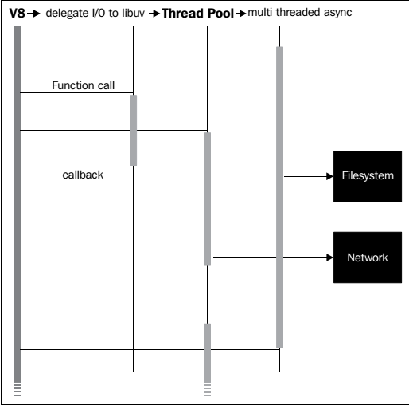
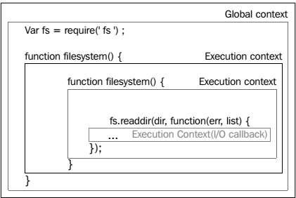

# 1 理解Node环境

## 1.1 扩展Javascript

- 一个Node程序/进程运行在单线程，ordering execution through an event loop
- Web applications are I/O intensive, so the focus should be on making I/O fast
- 通过异步回调推进程序流
- 昂贵的CPU操作应该分解为多个独立的并行的进程（processes），得到结果后发出事件
- 复杂的程序由简单的程序组装而成

基本原则是，操作永远不要阻塞。特别是等待I/O。

### 1.1.1 事件

Node对Javascript的多数扩展都会发事件。这些事件是`events.EventEmitter`的实例。对象可以扩展`EventEmitter`。

```javascript
var EventEmitter = require('events').EventEmitter;
var Counter = function(init) {
    this.increment = function() {
    	init++;
        this.emit('incremented', init);
    }
}
Counter.prototype = new EventEmitter();
var counter = new Counter(10);
var callback = function(count) {
	console.log(count);
}
counter.addListener('incremented', callback);
counter.increment(); // 11
counter.increment(); // 12
```

要移除监听器，调用`counter.removeListener('incremented', callback)`。`counter.on`等价于`counter.addListener`。

创建一个`Readable`流，将所有推入流的数据管道进`process.stdout`。Every 500 milliseconds we increment a counter and push that number (adding a newline) onto the stream, resulting in an incrementing series of numbers being written to the terminal. When our series has reached its limit (10), we push null onto the stream, causing it to terminate.

```javascript
var Readable = require('stream').Readable;
var readable = new Readable;
var count = 0;
readable._read = function() {
	if(++count > 10) {
		return readable.push(null);
	}
    setTimeout(function() {
        readable.push(count + "\n");
    }, 500);
};
readable.pipe(process.stdout);
```
Don't worry if you don't fully understand how Readable is implemented here—streams will be fully explained in the following chapters. Simply note how the act of pushing data onto a stream causes a corresponding event to fire, how the developer can assign a custom callback to handle this event, and how newly added data can be redirected to other streams. Node is designed such that I/O operations are consistently implemented as asynchronous, evented data streams.

It is also important to note the importance of this style of I/O. Because Node's event loop need only commit resources to handling callbacks, many other instructions can be processed in the down time between each interval.

As an exercise, re-implement the previous code snippet such that the emitted data is piped to a file. You'll need to use `fs.createWriteStream`:
var fs = require('fs');
var writeStream = fs.createWriteStream("./counter", {
    flags : 'w',
    mode: 0666
});

### 1.1.2 模块化

Node引入了**package**的概念，遵从CommonJS specification。A package is a collection of program files bundled with a manifest file describing the collection. Dependencies, authorship, purpose, structure, and other important meta-data are exposed in a standard way.

Node的包有Node's package management system, **npm** 管理。

More extensive information on creating and managing Node packages can be found in *Appendix A, Organizing Your Work*. The key point is this: build programs out of packages where possible, and share those packages when possible. The shape of your applications will be clearer and easier to maintain. Importantly, the efforts of thousands of other developers can be linked into applications via npm, directly by inclusion, and indirectly as shared packages are tested, improved, refactored, and repurposed by members of the Node community.

### 1.1.3 网络

除了HTTP，Node还支持几种标准的网络协议，如 **TLS/SSL** 和 **UDP**。


一个简单的例子，两个UDP服务器通讯：
```javascript
var dgram = require('dgram');
var client = dgram.createSocket("udp4");
var server = dgram.createSocket("udp4");
var message = process.argv[2] || "message";
message = new Buffer(message);
server.on("message", function (msg) {
    process.stdout.write("Got message: " + msg + "\n");
    process.exit();
}).bind(41234);
client.send(message, 0, message.length, 41234, "localhost");
```
假设文件名是`udp.js`，执行
```shell
node udp.js "my message"
```
结果：
```shell
Got message: my message
```

UDP要求消息是`Buffer`对象。一个UDP服务器是`EventEmitter`的一个实例，当收到消息时，它会发出一个`message`事件。

## 1.2 V8

尽管Node自己能有效管理I/O操作，它的`process`对象指的是 V8 运行时。因此，例如如何配置 V8 环境很重要，特别是当应用变大时。

输入`node -h`，得到：

```shell
Usage: node [options] [ -e script | script.js ] [arguments]
       node debug script.js [arguments]

Options:
  -v, --version        print node's version
  -e, --eval script    evaluate script
  -p, --print          evaluate script and print result
  -i, --interactive    always enter the REPL even if stdin
                       does not appear to be a terminal
  --no-deprecation     silence deprecation warnings
  --trace-deprecation  show stack traces on deprecations
  --v8-options         print v8 command line options
  --max-stack-size=val set max v8 stack size (bytes)
```

通过`–-v8-options`列出 V8 的选项。相关选项很多，这里值结合骚与系统限制和内存有关的。及配置JavaScript的命令集，包含 **ES6(EcmaScript6)**（也称**Harmony**）的一些新特性。

列出Node使用的 V8 版本：

```shell
node -e "console.log(process.versions.v8)"
```
### 1.2.1 内存和其他限制

一个重要选项`--max-stack-size`已作为Node自己的选项。

写一个能挂掉  V8 的程序：
```javascript
var count = 0;
(function curse() {
	console.log(++count);
	curse();
})()
```

这个无限递归最终会导致运行时报`RangeError: Maximum call stack size exceeded.`。

`--max-stack-size`等价的 V8 选项是`–-stack_size`，单位是 KB。

在32位和64位系统下，V8 默认的内存分别是700 MB 和 1400 MB。在新版本的 V8，64位系统上的内存限制不再由 V8限制，理论上是无限。但 V8 运行的操作系统可能限制它的内存。因此最终的限制不确定。

V8 makes available the `--max_old_space_size` option, which allows control over the amount of memory available to a process, accepting a value in MB. Should you need to increase memory allocation, simply pass this option the desired value when spawning a Node process.

It is often an excellent strategy to reduce the available memory allocation for a given Node instance, especially when running many instances. As with stack limits, 考虑大量的内存需求是否应该代理给一个存储层，如内存数据库。

> An informative discussion with the V8 team regarding their views on how memory should be allocated can be found here:
http://code.google.com/p/v8/issues/detail?id=847

控制GC的主要选项是`–-nouse_idle_notification`和`–-expose_gc`。

Passing the `–-nouse_idle_notification` flag will tell V8 to ignore idle notification calls from Node, which are requests to V8 asking it to run GC immediately, as the Node process is currently idle. Because Node is aggressive with these calls (efficiency breeds clean slates), an excess of GC may slow down your application. Note that using this flag does not disable GC; GC simply runs less often. In the right circumstances this technique can increase performance.

`--expose_gc` introduces a new global method to the Node process, `gc()`, which allows JavaScript code to manually start the GC process. In conjunction with `–-nouse_idle_notification` the developer can now control to some degree how often GC runs. At any point in my JavaScript code I can simply call `gc()` and start the collector.

### （未）1.2.2 Harmony

> More information on ES6 Harmonycan be found at:
http://wiki.ecmascript.org/doku.php?id=harmony:harmony.

## 1.3 process 对象

We are now going to discuss, in detail, how instructions that you write (a JavaScript program) are compiled by V8 into a list of instructions whose execution context is accessible via the native Node `process` object.

构成Node事件循环核心的单线程是V8的事件循环。When I/O operations are initiated within this loop they are delegated to *libuv*, which manages the request using its own (multi-threaded, asynchronous) environment. *libuv* 在I/O操作完成后通知回调，回调在 V8 主线程上执行：



Node的`process`对象提供当前运行的进程的信息，还能控制当前进程的运行。它也是一个`EventEmitter`。可以在任何地方访问`process对象。
```javascript
var size = process.argv[2];
var totl = process.argv[3] || 100;
var buff = [];
for(var i=0; i < totl; i++) {
	buff.push(new Buffer(size));
	process.stdout.write(process.memoryUsage().heapTotal + "\n");
}
```
执行（加入文件叫`process.js`）：
```shell
> node process.js 1000000 100
```

实际上，在Node中`console.log`的实现仅是包裹了`process.stdout.write`：
```javascript
console.log = function (d) {
	process.stdout.write(d + '\n');
};
```

A Node process begins by constructing a single execution stack, with the global context forming the base of the stack. Functions on this stack execute within their own, local, context (sometimes referred to as scope), which remains enclosed within the global context (which you'll hear referred to as closure). Because Node is evented, any given execution context can commit the running thread to handling an eventual execution context. This is the purpose of callback functions.

Consider the following schematic of a simple interface for accessing the filesystem:


If we were to instantiate `Filesystem` and call `readDir` a nested execution context structure would be created: `(global (fileSystem (readDir (anonymous function) ) ) )`. The concomitant execution stack is introduced to Node's single process thread. This stack remains in memory until *libuv* reports that `fs.readdir` has completed, at which point the registered anonymous callback fires, resolving the sole pending execution context. As no further events are pending, and the maintenance of closures no longer necessary, the entire structure can be safely torn down (in reverse, beginning with anonymous), and the process can exit, freeing any allocated memory. This method of building up and tearing down a single stack is what Node's event loop is ultimately doing.

## （未）1.4 REPL和执行Node程序

# 2. 理解异步事件驱动编程


## 2.1 广播事件

I/O是昂贵的。In the following chart (taken from Ryan Dahl's original presentation on Node) we can see how many clock cycles typical system tasks consume.

| 存储| 消耗CPU周期 |
|--------|--------|
| L1 cache | 3 cycles  |
| L2 cache | 14 cycles |
| RAM      | 250 cycles |
| Disk     | 41,000,000 cycles |
| Network  | 240,000,000 cycles |

## 2.2 监听事件

Node中暴露事件接口的多数对象，如文件、网络流，都将`EventEmitter`作为其原型（prototype）。

但本节的目的是讨论一些更少人知晓的事件源：signals, child process communication, filesystem change events, and deferred execution.

## （未）2.2.1 Signals

## 2.2.2 Forks

Node设计的一个基础是，当需要并行执行时，创建或fork进程，而不是创建线程。We will be using child processes in various ways throughout this book, and learn how to create and use them. 这里主要关注子进程之间如何通讯。

要创建一个子进程，调用`child_process`模块的`fork`方法，传入新进程要执行的文件名：
```javascript
var cp = require('child_process');
var child = cp.fork(__dirname + '/lovechild.js');
```

在多核机器上，forked进程一般会被OS分配到不同的核上。Spreading node processes across cores (even other machines) and managing IPC is (one) way to scale a Node application in a stable, understandable, and predictable way.

父进程可以向子进程发送消息，或监听子进程的消息。
```javascript
child.on('message', function(msg) {
	console.log('Child said: ', msg);
});
child.send("I love you");
```

通用，子进程（程序定义在`lovechild.js`）也可以发送、监听消息：
```javascript
// lovechild.js
process.on('message', function(msg) {
	console.log('Parent said: ', msg);
	process.send("I love you too");
});
```

Another very powerful idea is to pass a network server an object to a child. This technique allows multiple processes, including the parent, to share the responsibility for servicing connection requests, spreading load across cores.

例如，下面程序启动一个服务器，fork一个子进程，然后把服务器传给子进程：
```javascript
var child = require('child_process').fork('./child.js');
var server = require('net').createServer();
server.on('connection', function(socket) {
	socket.end('Parent handled connection');
});
server.listen(8080, function() {
	child.send("The parent message", server);
});
```

In addition to passing a message to a child process as the first argument to send, the preceding code also sends the server handle to itself as a second argument. Our child server can now help out with the family's service business:
```javascript
// child.js
process.on('message', function(msg, server) {
    console.log(msg);
    server.on('connection', function(socket) {
        socket.end('Child handled connection');
    });
});
```

连续请求，将被子进程或父进程处理：两个进程在负载平衡。It should be clear that this technique, when combined with the simple inter-process messaging protocol discussed previously, demonstrates how Ryan Dahl's creation succeeds in providing an easy way to build scalable network programs.

> 我们会讨论Node的新模块`cluster`，它扩展和简化了上面讨论的技术。If you are interested in how server handles are shared, visit the cluster documentation at the following link:
http://nodejs.org/api/cluster.html
For those who are truly curious, examine the clustercode itself at:
https://github.com/joyent/node/blob/c668185adde3a474585a11f172b8387e270ec23b/lib/cluster.js#L523-558

### 2.2.3 文件事件

通过`fs.watch`方法可以监听文件系统通知。The `watch` method will broadcast changed events on both files and directories.

`watch`接受三个参数，依次是：
1. 监控的文件或目录的路径。如果文件不存在，将抛出**ENOENT(no entity)**错误。可以先使用`fs.exists`检查。
2. 一个可选的选项对象：
  - persistent (Boolean): Node keeps processes alive as long as there is "something to do". An active file watcher will by default function as a persistence flag to Node. Setting this option to false flags not keeping the general process alive if the watcher is the only activity keeping it running.
3. 监听器函数。接受两个参数：
  - 事件名（`rename`或`change`）。
  - 发生改变的文件名(important when watching directories). Some operating systems will notreturn this argument.

This example will set up a watcher on itself, change its own filename, and exit:
```javascript
var fs = require('fs');
fs.watch(__filename, { persistent: false }, function(event, filename) {
    console.log(event);
    console.log(filename);
})
setImmediate(function() {
	fs.rename(__filename, __filename + '.new', function() {});
});
```

可以在任何时候关闭监控：
```javascript
var w = fs.watch('file', function(){})
w.close();
```

It should be noted that `fs.watch` depends a great deal on how the host OS handles file events, and according to the Node documentation:

    "The fs.watch API is not 100% consistent across platforms, and is unavailable in some situations."

### 2.2.4 Deferred execution

经常需要推迟一个函数的执行。Javascript传统上使用定时器：`setTimeout`和`setInterval`。Node introduces another perspective on defers, primarily as means of controlling the order in which a callback executes in relation to I/O events, as well as timer events properly.

We'll learn more about this ordering in the event loop discussion that follows. For now we will examine two types of deferred event sources that give a developer the ability to schedule callback executions to occur either before, or after, the processing of queued I/O events.

#### process.nextTick

Node本地模块`process`的`process.nextTick`方法类似于`setTimeout`，延迟执行回调方法。`nextTick`的回调方法会被放置在事件对象头部，在I/O或定时器事件之前，但在当前脚本之后执行（JavaScript代码在 V8 线程上同步执行）。

在函数中，`nextTick`的主要用途是，postpone the broadcast of result events to listeners on the current execution stack until the caller has had an opportunity to register event listeners—to give the currently executing program a chance to bind callbacks to `EventEmitter.emit` events. It may be thought of as a pattern used wherever asynchronous behavior should be emulated. For instance, imagine a lookup system that may either fetch from a cache or pull fresh data from a data store. The cache is fast and doesn't need callbacks, while the data I/O call would need them. The need for callbacks in the second case argues for emulation of the callback behavior with `nextTick` in the first case. This allows a consistent API, improving clarity of implementation without burdening the developer with the responsibility of determining whether or not to use a callback.

The following code seems to set up a simple transaction; when an instance of `EventEmitter` emits a `start` event, log "Started" to the console:

```javascript
var events = require('events');
function getEmitter() {
	var emitter = new events.EventEmitter();
	emitter.emit('start');
	return emitter;
}
var myEmitter = getEmitter();
myEmitter.on("start", function() {
	console.log("Started");
});
```

However, the expected result will not occur. The event emitter instantiated within getEmitter emits "start" previous to being returned, wrong-footing the subsequent assignment of a listener, which arrives a step late, missing the event notification.

使用`process.nextTick`解决该问题：

```javascript
var events = require('events');
function getEmitter() {
	var emitter = new events.EventEmitter();
	process.nextTick(function() {
		emitter.emit('start');
	});
	return emitter;
}
var myEmitter = getEmitter();
myEmitter.on('start', function() {
	console.log('Started');
})
```

Because it is possible to recursively call `nextTick`, which might lead to an infinite loop of recursive `nextTick` calls (starving the event loop, preventing I/O), there exists a *failsafe* mechanism in Node which limits the number of recursive `nextTick` calls evaluated prior to yielding the I/O: `process.maxTickDepth`. Set this value (which defaults to 1000) if such a construct becomes necessary—although what you probably want to use in such a case is `setImmediate`.

##### setImmediate

`setImmediate`类似于`process.nextTick`，但区别在于：`nextTick`的回调在I/O和定时器事件之前调用，但`setImmediate`的回调在I/O事件之后调用。

> The naming of these two methods is confusing: `nextTick` occurs before `setImmediate`.

This method does reflect the standard behavior of timers in that its invocation will return an object which can be passed to `cancelImmediate`, cancelling `setImmediate` in the same way `cancelTimeout` cancels timers set with `setTimeout`.

## 2.3 定时器

JavaScript提供两种异步定时器：`setInterval()`和`setTimeout()`。

执行回调前实际的延迟时间可能比设置的时间略长。执行的次序也是不可保证的。Node的定时器是不可中断的。Timers simply promise to execute as close as possible to the specified time (though never before), beholden, as with every other event source, to event loop scheduling.

> At least one thing you may not know about timers...
We are all familiar with the standard arguments to setTimeout: a callback function and timeout interval. Did you know that many additional arguments are passed to the callback function?
```javascript
setTimeout(callback, time, [passArg1, passArg2…])
```

### 2.3.1 setTimeout

延迟一些毫秒后执行：

```javascript
setTimeout(a, 1000);
setTimeout(b, 1001);
```

`a`不一定先于`b`执行。

另一种情况：
```javascript
setTimeout(a, 1000);
setTimeout(b, 1000);
```

执行顺序是确定的。Node essentially maintains an object map grouping callbacks with identical timeout lengths. *Isaac Schlueter*, the current leader of the Node project, puts it this way:

    [N]ode uses a single low level timer object for each timeout value. If you attach multiple callbacks for a single timeout value, they'll occur in order, because they're sitting in a queue. However, if they're on different timeout values, then they'll be using timers in different threads, and are thus subject to the vagaries of the [CPU] scheduler.

The ordering of timer callbacks registered within an identical execution scope does not predictably determine the eventual execution order in all cases.

Additionally, there exists a minimum wait time of one millisecond for a timeout. Passing a value of zero, -1, or a non-number will be translated into this minimum value.

### 2.3.2 setInterval

周期性执行一个功能。例如，每100毫秒执行一次：
```javascript
var intervalId = setInterval(function() { ... }, 100);
```

通过`clearInterval(intervalId)`取消。

与`setTimeout`一样不可靠。Importantly, if a system delay (such as some badly written blocking whileloop) occupies the event loop for some period of time, intervals set prior and completing within that interim will have their results queued on the stack. 当事件循环不再阻塞，所有的回调将被立即调用（串行）。

幸运的是，Node中的intervals比浏览器中可靠很多。

### 2.3.3 unref 和 ref

A Node program does not stay aliv ewithout a reason to do so. 如果有回调尚未被处理，进程将继续运行。完成后，进程没什么可做，于是退出。例如，下面的代码会让Node进程一直运行：
```javascript
Var intervalId = setInterval(function() {}, 1000);
```

There are cases of using a timer to do something interesting with external I/O, or some data structure, or a network interface where once those external event sources stop occurring or disappear, the timer itself stops being necessary. Normally one would trap that irrelevantstate of a timer somewhere else in the program and cancel the timer from there. This can become difficult or even clumsy, as an unnecessary tangling of concerns is now necessary, an added level of complexity.

The `unref` method allows the developer to assert the following instructions: when this timer is the only event source remaining for the event loop to process, go ahead and terminate the process.

例如，下面的代码会让进程结束，不再一直运行：
```javascript
var intervalId = setInterval(function() {}, 1000);
intervalId.unref();
```

`unref`方法是创建定时器时返回的对象。

现在加入一个外部事件源（一个定时器）。当外部事件源结束后，进程终止。
```javascript
setTimeout(function() {
	console.log("now stop");
}, 100);
var intervalId = setInterval(function() {
	console.log("running")
}, 1);
intervalId.unref();
```

利用`ref`方法可以让定时器回到常规的状态，它的作用是取消`unref`方法：
```javascript
var intervalId = setInterval(function() {}, 1000);
intervalId.unref();
intervalId.ref();
```

此时，进程又将一直运行下去。

## 2.4 理解事件循环

Node使用单个线程处理Javascript指令。在你的Javascript中，两句代码不可能同时执行。

这并不意味着Node进程所在的机器只使用一个线程。回调并不产生并发。Recall Chapter 1, Understanding the Node Environment, and our discussion about the `process` object—Node's "single thread" simplicity is in fact an abstraction created for the benefit of developers. 但一定要记得，有大量线程在背后管理I/O（和其他东西），and these threads unpredictably insert instructions, originally packaged as callbacks, into the single JavaScript thread for processing.

Node executes instructions one by one until there are no further instructions to execute, no more input or output to stream, and no further callbacks waiting to be handled.

Even deferred events (such as timeouts) require an eventual interrupt in the event loop to fulfill their promise.

下面的代码，本期望1秒后改变`stop`的值。但实际while循环将无限执行下去。While循环反复执行，一直占据着事件循环。事件循环无法给定时器回调机会执行。
```javascript
var stop = false;
setTimeout(function() {
	stop = true;
}, 1000);
while(stop === false) {};
```

写Node就是写事件循环。We've previously discussed the event sources that are queued and otherwise arranged and ordered on this event loop — I/O events, timer events, and so on.

When writing non-deterministic code it is imperative that no assumptions about eventual callback orders are made. The abstraction that is Node masks the complexity of the thread pool on which the straightforward main JavaScript thread floats, leading to some surprising results.

We will now refine this general understanding with more information about how, precisely, the callback execution order for each of these types is determined within Node's event loop.

### Four sources of truth

我们已经学习了四组主要的事件源（deferred event sources），下面总结它们在栈中的位置和优先级：
- 执行代码块（Execution blocks）：Javascript代码，包括表达式、循环、函数。This includes `EventEmitter` events emitted within the current execution context.
- 定时器：Callbacks deferred to sometime in the future specified in milliseconds, such as `setTimeout` and `setInterval`.
- I/O：Prepared callbacks returned to the main thread after being delegated to Node's managed thread pool, such as filesystem calls and network listeners.
- Deferred execution blocks: Mainly the functions slotted on the stack according to the rules of `setImmediate` and `nextTick`.

We have learned how the deferred execution method `setImmediate` slots its callbacks after I/O callbacks in the event queue, and `nextTick` slots its callbacks before I/O and timer callbacks.

> A challenge for the reader
After running the following code, what is the expected order of logged messages?

```javascript
var fs = require('fs');
var EventEmitter = require('events').EventEmitter;
var pos = 0;
var messenger = new EventEmitter();
// Listener for EventEmitter
messenger.on("message", function(msg) {
	console.log(++pos + " MESSAGE: " + msg);
});
// (A) FIRST
console.log(++pos + " FIRST");
// (B) NEXT
process.nextTick(function() {
	console.log(++pos + " NEXT")
})
// (C) QUICK TIMER
setTimeout(function() {
	console.log(++pos + " QUICK TIMER")
}, 0)
// (D) LONG TIMER
setTimeout(function() {
	console.log(++pos + " LONG TIMER")
}, 10)
// (E) IMMEDIATE
setImmediate(function() {
	console.log(++pos + " IMMEDIATE")
})
// (F) MESSAGE HELLO!
messenger.emit("message", "Hello!");
// (G) FIRST STAT
fs.stat(__filename, function() {
	console.log(++pos + " FIRST STAT");
});
// (H) LAST STAT
fs.stat(__filename, function() {
	console.log(++pos + " LAST STAT");
});
// (I) LAST
console.log(++pos + " LAST");
```

The output of is program is:
1.  FIRST (A).
2.  MESSAGE: Hello! (F).
3.  LAST (I).
4.  NEXT (B).
5.  QUICK TIMER (C).
6.  FIRST STAT (G).
7.  LAST STAT (H).
8.  IMMEDIATE (E).
9.  LONG TIMER (D).

Let's break the preceding code down:
A, F, and I execute in the main program flow and as such they will have the first priority in the main thread (this is obvious; your JavaScript executes its instructions in the order they are written, including the synchronous execution of the `emit` callback).

With the main call stack exhausted, the event loop is now almost reading to process I/O operations. This is the moment when nextTick requests are honored slotting in at the head of the event queue. This is when B is displayed.
The rest of the order should be clear. Timers and I/O operations will be processed next, (C, G, H) followed by the results of the `setImmediate` callback (E), always arriving after any I/O and timer responses are executed.

Finally, the long timeout (D) arrives, being a relatively far-future event.
Notice that re-ordering the expressions in this program will notchange the output order (outside of possible re-ordering of the STAT results, which only implies that they have been returned from the thread pool in different order, remaining as a group in the correct order as relates to the event queue).

## 2.5 回调和错误

### 2.5.1 约定

遵循：
- 回调函数的第一个参数是错误消息，最好是一个错误对象。如果没有错误，应该传`null`。
- 向函数传入一个回调，回调应该是函数的最后一个参数。APIs should be consistently designed this way.
- 错误参数和回调参数之间可以有任意数量的参数。

创建错误对象：
```javascript
new Error("Argument must be a String!")
```

### 2.5.2 了解你的错误

It is excellent that the Node community has automatically adopted a convention that compels developers to be diligent and report errors. However, what does one do with errors once they are received?

It is generally a very good idea to centralize error handling in a program. Often, a custom error handling system will be designed, which may send messages to clients, add to a log, and so on. Sometimes it is best to `throw` errors, halting the process.

Node为错误处理提供了更高级的工具。In particular, Node's `domain` system helps with a problem that evented systems have: how can a stack trace be generated if the full route of a call has been obliterated as it jumped from callback to callback?

The goal of `domain` is simple: fence and label an execution context such that all events that occur within it are identified as such, allowing more informative stack traces. By creating several different domains for each significant segment of your program, a chain of errors can be properly understood.

Additionally, this provides a way to catch errors and handle them, rather than allowing your entire Node process to collapse.

In the following example we're going to create two domains: `appDomain` and `fsDomain`. 目标是追踪应用的哪部分目前正处于错误状态：
```javascript
var domain = require("domain");
var fs = require("fs");
var fsDomain = domain.create();
fsDomain.on("error", function(err) {
	console.error("FS error", err);
});
var appDomain = domain.create();
appDomain.on('error', function(err) {
	console.log("APP error", err);
});
```

现在将主程序包裹进`appDomain`，将文件系统调用包裹进`fsDomain`。We then create an error in `fsDomain` by trying to open a non-existent file:
```javascript
appDomain.run(function() {
    process.nextTick(function() {
    	fsDomain.run(function() {
    		fs.open('no_file_here', 'r', function(err, fd) {
    			if(err) {
    				throw err;
    			}
    			appDomain.dispose();
    		});
    	});
    });
});
```

When thepreceding code executes, something resembling this should be echoed to the terminal:
```shell
FS error { [Error: ENOENT, open 'non-existent file']
    errno: 34,
    code: 'ENOENT',
    path: 'non-existent file',
    domain: 
        { domain: null,
          _events: { error: [Function] },
          _maxListeners: 10,
          members: [] },
    domainThrown: true }
```

Now let's create an error in `appDomain` by adding this code, which will produce a reference error (as no `b` is defined):
```javascript
appDomain.run(function() {
	a = b;
	process.nextTick(function() {
...
```

An error similar to that in the precious code should be generated and reported by appDomain.

Notice the command `appDomain.dispose`. As maintaining these error contexts will consume some memory, it is best to dispose of them when no longer needed—after the code they contain has successfully executed, for example. We'll learn more advanced uses of this tool as we progress into more complex territories.

As an application grows in complexity it will become more and more useful to be able to trap errors and handle them properly, perhaps restarting only one part of an application when it fails rather than the entire system.

### 2.5.3 建造金字塔

Simplifying controlflows has been a concern of the Node community since the very beginning of the project. Indeed, this potential criticism was one of the very first anticipated by Ryan Dahl, who discussed it at length during the talk in which he introduced Node to the JavaScript developer community.

Node代码经常回调嵌套回调，Node代码常常像一个侧放的金字塔。

Accordingly, there are several Node packages available which take the problem on, employing strategies as varied as futures, fibers, even C++ modules exposing system threads directly.
- Async https://github.com/caolan/async
- Tame https://github.com/maxtaco/tamejs
- Fibers https://github.com/laverdet/nodefibers
- Promises https://github.com/kriskowal/q

> Mikeal Rogers, in discussing why Promises were removed from the Node core, makes a strong argument in the following link for why leaving feature development to the community leads to a stronger core product:
http://www.futurealoof.com/posts/broken-promises.html

### （未）2.5.4 思考

## 2.6 监听对文件的改变

实践之前学到的知识。The goal is to create a server that a client can connect to and receive updates from Twitter. We will first create a process to query Twitter for any messages with the *hashtag#nodejs*, and writes any found messages to a *tweets.txt* file in 140-byte chunks. We will then create a network server that broadcasts these messages to a single client. Those broadcasts will be triggered by write events on the tweets.txt file. Whenever a write occurs, 140-byte chunks are asynchronously read from the last known client read pointer. This will happen until we reach the end of the file, broadcasting as we go. Finally, wewill create a simple client.htmlpage, which asks for, receives, and displays these messages.


