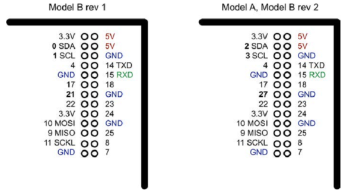
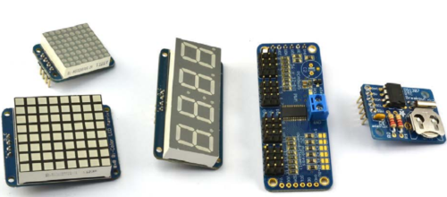
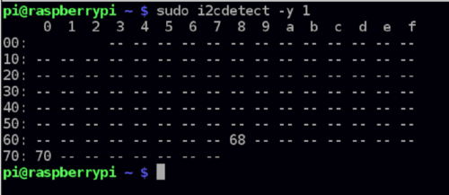
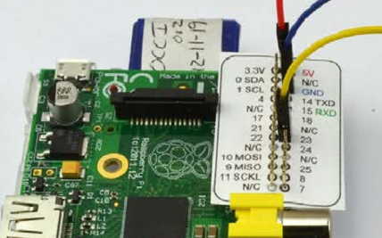
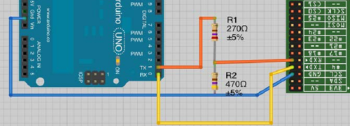
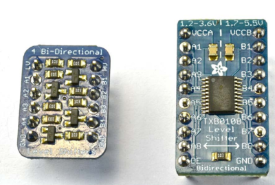
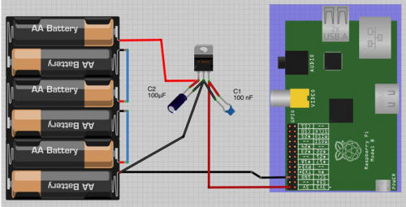
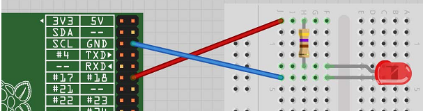
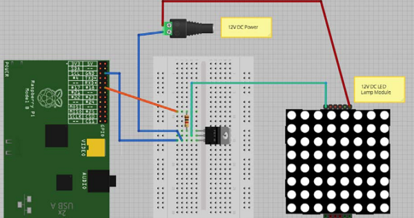
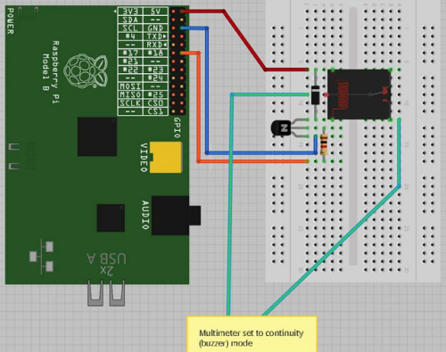

[toc]

## 8. GPIO 基础

### 8.1. Finding Your Way Around the GPIO Connector

Be sure to check out the accompanying video for this recipe at http://razzpisampler.oreilly.com.

Figure 8-1 shows the GPIO pinout for both revisions 1 and 2 of the Raspberry Pi Model B. The quick way to tell the boards apart is that if you have an older revision 1 board, it has a black audio socket. The revision 2 boards have a blue audio socket.

There were three changes to the GPIO connector between revision 1 and revision 2. These are highlighted in bold in Figure 8-1. First, the I2C port was swapped. The two pins SDA and SCL are still SDA and SCL but use a different internal I2C interface. This means that if you’re using the pins as GPIO rather than I2C, then you will refer to them as 2 and 3 on a revision 2 board. Also, GPIO 21 was replaced by GPIO 27 on revision 2.

顶部是 3.3V 和 5V 的供电。GPIO的输入输出都是 3.3V。所有旁边有数字的脚可以作为 GPIO 脚。其他有特殊名字的脚有特殊用途，so 14 TXD and 15 RXD are the transmit and receive pins of the serial interface. SDA and SCL form the I2C interface, and MOSI, MISO, and SCKL from the SPI interface.

GPIO 脚可以被用于数字输入或输出。二者都是 3.3V。Raspberry Pi不支持模拟输入。要使用模拟输入，需要使用外部的魔术转换（ADC），或使用接口板（如Gertboard），或使用 Arduino，或 aLaMode 板，参见第14章。

使用ADC参见12.4节。

### 8.2. 安全使用GPIO

使用GPIO的安全规则：

- 对任何GPIO脚，不要加超过 3.3V 的电压。
- 每个输出不要获取超过 3mA 电流。获取更多电流会减少Pi的寿命。3mA 足以点亮 470Ω 的**红**LED。
- 给Pi供电不要超过5V
- 从 3.3V **供电脚**上获取的**总**电流不要超过 50mA。
- 从 5V **供电脚**上获取的**总**电流不要超过 250mA。

### 8.3 安装 RPi.GPIO

使用Python读写 GPIO 脚。下载安装Python库 RPi.GPIO。此库是Python包裹的C代码。

    $ sudo apt-get install python-dev
    $ sudo apt-get install python-rpi.gpio

RPi.GPIO 的替代是 WiringPi。You can find out more about the library at Gordons Projects.

### 8.4. 准备 I2C

You have an I2C device that you want to use with your Raspberry Pi.

If you are using Adafruit Occidentalis 0.2 or later, then there is nothing to do. The distribution is preconfigured with I2C support. Newer versions of the distributions may make these steps unneccessary. But in any case, this will ensure that you get the latest version.

若使用 Raspbian，需要改变一些配置。编辑`/etc/modules`文件，在尾部添加：

    i2c-bcm2708
    i2c-dev

还需要编辑`/etc/modprobe.d/raspi-blacklist.conf`，将下面注释掉：

	blacklist i2c-bcm2708
即
	#blacklist i2c-bcm2708

安装 Python I2C 库：

	$ sudo apt-get install python-smbus

Reboot your Pi and it will be ready for I2C.

利用I2C模块是与Pi交互的好方法。只需要四根连线。有很多可用的I2C模块。

注意计算I2C模块使用的总电流，不要超过8.2节的规范。

下面是Adafruit提供的I2C模块：LED矩阵、四角七段LED、16通道PWM/伺服控制器、实时时钟模块。

Other I2C modules available include FM radio transmitters, ultrasonic rangefinders, OLED displays, and various types of sensors.

See some of the I2C recipes in this book: Recipes 10.2, 13.1, 13.2, and 13.4.

### 8.5. 使用 I2C 工具

想要检查I2C设备是否已连接到Pi，想获取它的 I2C 地址。安装**i2c-tools**。

    $ sudo apt-get install i2c-tools

检查设备：

	$ sudo i2cdetect -y 1

Note that if you are using an older revision 1 board, you need to change 1 to 0 in the preceding code line.

If I2C is available, you will see some output like that shown in Figure 8-3. This shows that two I2C addresses are in use—0x40 and 0x70.

### 8.6. 准备 SPI

You have an SPI (serial peripheral interface) bus that you want to use with your Raspberry Pi.

If you are using Adafruit Occidentalis 0.2 or later, there is nothing to do. The distribution is preconfigured with SPI support. If you are using Raspbian, there are a couple of configuration changes you need to make.

Edit the file `/etc/modules` and add the following line to the end of it:

	spidev

You may also need to edit the file `/etc/modprobe.d/raspi-blacklist.conf` and comment out the line:

    blacklist spi-bcm2708

安装Python库：

    $ cd ~
    $ sudo apt-get install python-dev
    $ git clone git://github.com/doceme/py-spidev
    $ cd py-spidev/
    $ sudo python setup.py install

Reboot your Pi and it will be ready for SPI.

SPI allows serial transfer of data between the Raspberry Pi and peripheral devices, such as analog-to-digital converter (ADC) and 端口扩展芯片等。You may come across some examples of interfacing to SPI that do not use the SPI interface but instead use an approach called *bit banging*, where the RPi.GPIO library is used to interface with the four GPIO pins used by the SPI interface.

12.3节介绍一个 SPI ADC 芯片。

### 8.7. 解放串口

You want to use the serial port (Rx and Tx pins) on the Raspberry Pi for your own projects, but it is in use by Linux as a console connection.

By default, the serial port acts as a console, through which you can connect to the Raspberry Pi using a special serial lead (see Recipe 2.6).

To disable this so that you can use the serial port to connect to peripherals such as GPS (Recipe 11.10), comment out a line in `/etc/inittab`:

	$ sudo nano /etc/inittab

注释掉下面这行

	T0:23:respawn:/sbin/getty -L ttyAMA0 115200 vt100

需要重启`reboot`。

You will need to use this technique in recipes that connect hardware to the serial port, such as Recipe 11.10 and many of the recipes in Chapter 14 that communicate with an Arduino using the serial port.

### 8.8. 安装 PySerial 访问串口

You want to use the serial port (Rx and Tx pins) on the Raspberry Pi using Python.

安装 PySerial 库：

	$ sudo apt-get install python-serial

Before you can use the library for your own Python serial projects, you need to disable the Raspberry Pi’s serial console by following Recipe 8.7.

库很好用。创建新连接：

	ser = serial.Serial(DEVICE, BAUD)

`DEVICE`是串口设备`/dev/ttyAMA0`，`BAUD`的波特率。如：

	ser = serial.Serial('/dev/ttyAMA0', 9600)

连接建立后，可以发送数据：

	ser.write('some text')

Listening for a response normally involves a loop that reads and prints, as illustrated in this example:

    while True:
		print(ser.read())

### （未）8.9. Installing Minicom to Test the Serial Port

### 8.10. Using a Breadboard with Jumper Leads

### 8.11. Using a Breadboard with a Pi Cobbler

### 8.12. 将5V的信号变为3.3V

将5V的信号连接到3.3V的GPIO脚。利用两个电阻分压。一个270欧，一个470欧。

电阻要消耗6mA。考虑到Pi使用相对较大的500mA的电流，这点损失不是很明显。如果想减少电阻消耗的电流，可以等比例扩大电阻，如27kΩ和47kΩ，只消耗60µA。

Pi的TXD是3.3V输出。但可以直接连接到Arduino的5V输入。因为Arduino将大于2.5V的都认作高电平。

If you have multiple signals to convert between 3.3V and 5V, then it’s probably best to use a multichannel level converter module—see Recipe 8.13.

### 8.13. 利用电平转换模块转换5V到3.3V

需要将多个5V数字脚连接到GPIO脚。Use a bidirectional level converter module, such as one shown in Figure 8-8. 这种模块非常易用。One side has the power supply at one voltage and a number of channels that can be either inputs or outputs at that voltage. The pins on the other side of the module have a power pin at the second voltage and all the inputs and outputs on that side are automatically converted to the voltage level for that side.

### 8.14. 电池供电

严格需要5V。大于小于都不行。可行的方法是利用高电压电池，如9V，如6个AA充电电池。加稳压器。如下图，注意连接到是GPIO 5V引脚。

7805稳压器会变得很热。如果过热它的热保护会开启，电压会下降，可能导致Pi重启。可以加散热器。7805要求输入电压至少有7V。You can also buy low dropout (LDO) regulators such as the LM2940. The LM2940 has the same pinout as
the 7805, but only requires the input to be 0.5V above the 5V output. 注意1.5V AA电池很快就会降到1.2V。因此4块不够，得用6块。If you want to fit your Raspberry Pi into an automobile or RV, this recipe will work. You will also need to use a small monitor that can be powered from DC (direct current). Such devices are fairly easily found, as they are commonly used with closed-circuit camera systems.

### （未）8.15. LiPo电池供电

You want to attach your Raspberry Pi to a robot and power it from a 3.7V LiPo battery.

Use a boost regulator module (Figure 8-10).

### （未）8.16. PiFace Digital Interface Board

### （未）8.17. Gertboard

### （未）8.18. RaspiRobot Board

https://github.com/simonmonk/raspirobotboard2

### （未）8.19. Using a Humble Pi Prototyping Board

### （未）8.20. Using a Pi Plate Prototyping Board

### （未）8.21. Using a Paddle Terminal Breakout Board

## 9. 控制硬件

### 9.1. 连接 LED

Be sure to check out the accompanying video for this recipe at http://razzpisampler.oreilly.com.

用 470Ω 或 1kΩ 电阻限制电流。

    $ sudo python
    >>> import RPi.GPIO as GPIO
    >>> GPIO.setmode(GPIO.BCM)
    >>> GPIO.setup(18, GPIO.OUT)
    >>> GPIO.output(18, True)
    >>> GPIO.output(18, False)

把LED连接到大于1.7V的电压源，将产生非常大的电流。会损毁LED和板子。

GPIO脚大约能提供3mA电流。LED点亮需要大于1 mA。但更大的电流会让它更亮。Use Table 9-1 as a guide to selecting a series resistor based on the type of LED; the table also indicates the approximate current that will be drawn from the GPIO pin.

Table 9-1. Selecting series resistors for LEDs and a 3.3V GPIO pin

|LED type|Resistor|Current (mA)|
|--------|--------|------------|
|Red|470Ω| 3.5|
|Red| 1kΩ| 1.5|
|Orange, yellow, green| 470Ω| 2|
|Orange, yellow, green| 1kΩ| 1|
|Blue, white| 100Ω| 3|
|Blue, white| 270Ω| 1|

As you can see, in all cases, it is safe to use a 470Ω resistor. If you are using a blue or white LED, you can reduce the value of the series resistor considerably. If you want to play it safe, use 1kΩ.

让LED闪烁：

    import RPi.GPIO as GPIO
    import time
    GPIO.setmode(GPIO.BCM)
    GPIO.setup(18, GPIO.OUT)
    while (True):
        GPIO.output(18, True)
        time.sleep(0.5)
        GPIO.output(18, False)
        time.sleep(0.5)

运行需要sudo！

### 9.2. 控制LED亮度

RPi.GPIO库支持PWM。

    import RPi.GPIO as GPIO
    led_pin = 18
    GPIO.setmode(GPIO.BCM)
    GPIO.setup(led_pin, GPIO.OUT)
    pwm_led = GPIO.PWM(led_pin, 500)
    pwm_led.start(100)
    while True:
        duty_s = raw_input("Enter Brightness (0 to 100):")
        duty = int(duty_s)
        pwm_led.ChangeDutyCycle(duty)

If you are using Python 3 rather than Python 2, change the command `raw_input` to just `input`.

Run the Python program, and you will be able to change the brightness by entering a number between 0 and 100:

    pi@raspberrypi ~ $ sudo python led_brightness.py
    Enter Brightness (0 to 100):0
    Enter Brightness (0 to 100):20
    Enter Brightness (0 to 100):10
    Enter Brightness (0 to 100):5
    Enter Brightness (0 to 100):1
    Enter Brightness (0 to 100):90

You can exit the program by pressing Ctrl-C.

PWM可以变换脉冲长度。但频率须是恒定的。

At high frequencies, the measured PWM frequency varies somewhat from the frequency supplied as an argument. This may be something that changes in later versions of the PWM feature of RPi.GPIO.

可以修改PWM的频率：

	pwm_led = GPIO.PWM(led_pin, 500)

单位是Hz。这里是500 Hz。Table 9-2 compares frequencies specified in the second parameter to GPIO.PWM to the actual frequency on the pin measured with an oscilloscope.

Table 9-2. Requested frequency against actual frequency

|Requested frequency|Measured frequency|
|-------------------|------------------|
|50 Hz| 50 Hz|
|100 Hz| 98.7 Hz|
|200 Hz| 195 Hz|
|500 Hz| 470 Hz|
|1 kHz| 890 Hz|
|10 kHz| 4.4 kHz|

随着频率增加，稳定性下降。This means that this PWM feature is no good for audio, but plenty fast enough for controlling the brightness of LEDs or the speed of motors.

### （未）9.3. Make a Buzzing Sound

### 9.4. 利用晶体管开关高功率DC设备

需要控制高功率低电压DC设备（如12V LED）的供电。

这些高功率的LED使用的电流比GPIO脚的大很多。而且它需要12V而不是3.3V。需要一个高高功率三极管：MOSFET。能承受20A电流。The MOSFET used is a FQP30N06 (see “Transistors and Diodes” on page 381).

其中电阻是1kΩ。

You can also use PWM with the MOSFET to control the brightness of the LED module (see Recipe 9.2).

需要12V直流适配器提供LED的电流。Pick a power adapter that has sufficient power handling. So, if the LED module is 5W, then you need at least a 12V 5W power supply (6W would be better).

电阻是必需的。确保在MOSFET开关状态切换时，电流不会过载GPIO脚。MOSFET开关LED的负极，因此正电源与LED的正极直接相连。LED的负极用于MOSFET的漏极（drain）相连。MOSFET的源极（source）接地，MOSFET的门极（gatep）控制漏极到源极的电流。如果门极电压超过2V，MOSFET将开通，电流进入LED。此电路可以控制其他低压DC设备；除了电机和继电器（relay），它们需要特殊处理（见10.3）。

### 9.5. 利用继电器开关高功率设备

You want to turn devices on and off that may not be suitable for switching with a MOSFET. 使用继电器和晶体管。

器件：1kΩ电阻，晶体管2N3904，二极管1N4001，5V继电器，万用表。

You can use the same LED blink program that you used in Recipe 9.1. If all is well, you’ll hear a click from the relay each time the contacts are closed. 由于继电器是慢速机械设备，不要使用PWM。否则会损坏继电器。

If the relay contacts are asked to exceed their specifications, then the relay’s life will be
shortened. There will be arcing, 触点可能最终融化在一起。There is also the possibility of the relay becoming dangerously hot. When in doubt, overspecify the relay contacts.

The downside of relays is that they are slow to operate and will eventually wear out after many hundreds of thousands of operations. This means they are only suitable for slow on/off control, not for fast switching like PWM.

继电器中的线圈需要大约 50 mA 才能闭合连接。由于GPIO引脚只能提供大约 3 mA，需要一个小的晶体管做开关。不需要上节使用的高功率 MOSFET。基极连接到GPIO脚，中间有一个1kΩ电阻，用于限制电流。发射极接地，集电极连接到集电极一端。继电器的另一边连接到GPIO的5V脚。二极管用于平抑高电压脉冲，当三极管occur when the transistor rapidly switches the power to the relay’s coil.